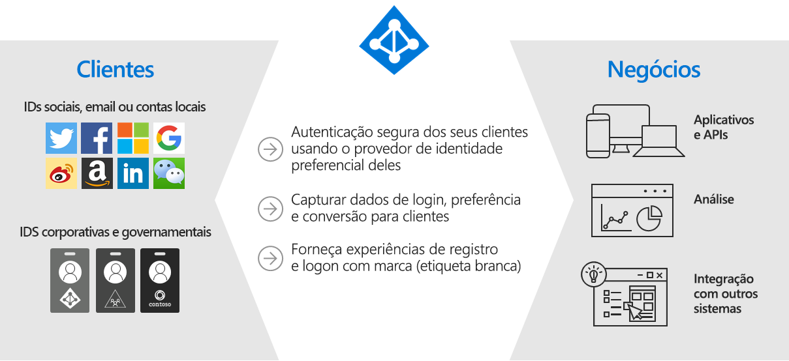
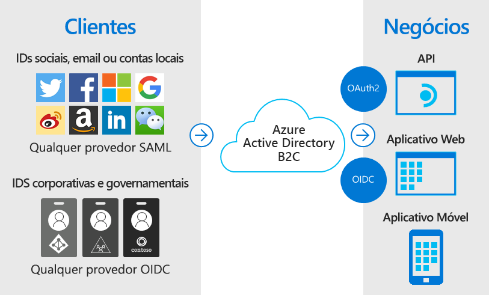
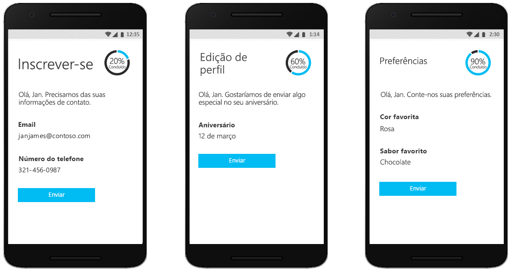
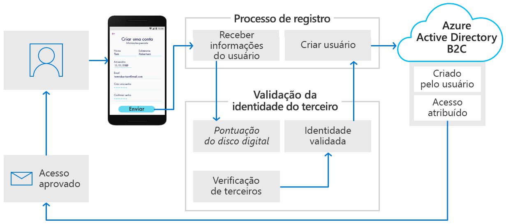
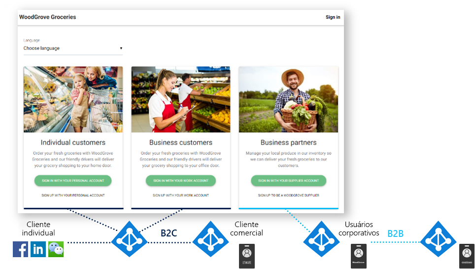

# O que é o Azure Active Directory B2C?

O Azure Active Directory B2C fornece a identidade de empresa para cliente como um serviço. Seus clientes usam suas identidades de conta social, empresarial ou local preferenciais para obter acesso de logon único a seus aplicativos e APIs.

O Azure AD B2C (Azure Active Directory B2C) é uma solução de CIAM (gerenciamento de acesso de identidade do cliente) capaz de dar suporte a milhões de usuários e bilhões de autenticações por dia. Ele cuida do dimensionamento e da segurança da plataforma de autenticação, do monitoramento e do tratamento automático de ameaças, como negação de serviço, irrigação de senha ou ataques de força bruta.

## Solução de identidade com marca personalizada

O Azure AD B2C é uma solução de autenticação de rótulo branco. Você pode personalizar toda a experiência do usuário com sua marca para que ela se misture diretamente com seus aplicativos Web e móveis.

Personalize cada página exibida pelo Azure AD B2C quando os usuários se inscrevem, entram e modificam suas informações de perfil. Personalize o HTML, CSS e JavaScript nos percursos do usuário para que a experiência com o Azure AD B2C pareça e seja uma parte nativa do seu aplicativo.

## Acesso de logon único com uma identidade fornecida pelo usuário

O Azure AD B2C usa protocolos de autenticação baseados em padrões, incluindo OpenID Connect, OAuth 2.0 e SAML. Ele se integra aos aplicativos mais modernos e softwares commercial off-the-shelf.

Ao servir como a autoridade de autenticação central para seus aplicativos Web, aplicativos móveis e APIs, o Azure AD B2C permite que você crie uma solução de SSO (logon único) para todos eles. Centralize a coleta de perfil do usuário e informações de preferência e capture análises detalhadas sobre o comportamento de entrada e a conversão de inscrição.

## Integrar a repositórios de usuários externos

O Azure AD B2C fornece um diretório que pode conter 100 atributos personalizados por usuário. No entanto, você também pode integrar a sistemas externos. Por exemplo, use o Azure AD B2C para autenticação, mas delegue a um CRM (gerenciamento de relacionamento com o cliente) externo ou a um banco de dados de fidelidade do cliente como a fonte de verdade dos dados do cliente.

Outro cenário de repositório de usuário externo é ter o Azure AD B2C para manipular a autenticação para seu aplicativo, mas integrá-lo a um sistema externo que armazena o perfil do usuário ou os dados pessoais. Por exemplo, para satisfazer os requisitos de residência de dados como políticas regionais ou locais de armazenamento de dados.

O Azure AD B2C pode facilitar a coleta de informações do usuário durante a edição do registro ou do perfil e, em seguida, entregar esses dados para o sistema externo. Em seguida, durante as autenticações futuras, o Azure AD B2C pode recuperar os dados do sistema externo e, se necessário, incluí-los como parte da resposta do token de autenticação que ele envia para seu aplicativo.

## Criação de perfil progressiva

Outra opção de percurso do usuário inclui a criação de perfil progressiva. A criação de perfil progressiva permite que seus clientes concluam rapidamente sua primeira transação coletando uma quantidade mínima de informações. Em seguida, colete gradualmente mais dados de perfil do cliente em logons futuros.

## Verificação de identidade de terceiros e revisão

Use o Azure AD B2C para facilitar a verificação de identidade e a revisão coletando dados do usuário, passando-os para um sistema de terceiros para executar validação, pontuação de confiança e aprovação para a criação da conta de usuário.

Essas são apenas algumas das ações que você pode realizar com o Azure AD B2C como sua plataforma de identidade de empresa para clientes. As seções a seguir desta visão geral orientam você por um aplicativo de demonstração que usa o Azure AD B2C. Você também é convidado a passar diretamente para uma [visão geral técnicas mais detalhada do Azure AD B2C](technical-overview.md).

## Exemplo: WoodGrove Groceries

O [WoodGrove Groceries][woodgrove] é um aplicativo Web online criado pela Microsoft para demonstrar vários recursos do Azure AD B2C. As próximas seções examinam algumas das opções de autenticação fornecidas pelo Azure AD B2C para o site do WoodGrove.

### Visão geral dos negócios

O WoodGrove é um repositório online de mercados que vende mantimentos para consumidores individuais e clientes empresariais. Seus clientes empresariais compram mantimentos em nome de sua empresa ou empresas que eles gerenciam.

### Opções de entrada

O WoodGrove Groceries oferece diversas opções de entrada com base na relação que seus clientes têm com a loja:

* Clientes **individuais** podem se inscrever ou entrar com contas individuais, como com um provedor de identidade social ou um endereço de email e senha.
* Clientes de **negócios** podem se inscrever ou entrar com suas credenciais empresariais.
* **Parceiros** e fornecedores são indivíduos que fornecem ao supermercado produtos para venda. A identidade do parceiro é fornecida pelo [Azure Active Directory B2B](../active-directory/b2b/what-is-b2b.md).

### Autenticar clientes individuais

Quando um cliente seleciona **Entrar com sua conta pessoal**, ele é redirecionado para uma página de entrada personalizada hospedada pelo Azure AD B2C. Você pode ver na imagem a seguir que personalizamos a IU (interface do usuário) para que ela seja parecida com o site do WoodGrove Groceries. Os clientes do WoodGrove não devem estar cientes de que a experiência de autenticação é hospedada e protegida pelo Azure AD B2C.

O WoodGrove permite que seus clientes se inscrevam e entrem usando suas contas do Google, Facebook ou Microsoft como provedor de identidade. Ou, eles podem se inscrever usando o endereço de email e uma senha para criar o que é chamado de *conta local*.

Quando um cliente seleciona **Entrar com sua conta pessoal** e, em seguida, **Inscrever-se agora**, é apresentada uma página de inscrição personalizada.

Depois que você inserir um endereço de email e selecionar **Enviar código de verificação**, o Azure AD B2C envia o código. Depois de inserir o código, selecione **Verificar código** e insira as outras informações no formulário. Também é necessário concordar com os termos de serviço.

Clicar no botão **Criar** faz com que o Azure AD B2C redirecione o usuário de volta para o site do WoodGrove Groceries. Ao redirecionar, o Azure AD B2C passa um token de autenticação do OpenID Connect para o aplicativo Web do WoodGrove. O usuário agora está conectado e pronto para começar. O nome de exibição é mostrado no canto superior direito para indicar que ele está conectado.

### Autenticar clientes empresariais

Quando um cliente seleciona uma das opções em **Clientes empresariais**, o site do WoodGrove Groceries invoca uma política do Azure AD B2C diferente da que usa para clientes individuais.

Essa política apresenta ao usuário uma opção para usar suas credenciais corporativas para inscrição e entrada. No exemplo do WoodGrove, os usuários deverão entrar com qualquer conta do Office 365 ou do Azure AD. Essa política usa um [aplicativo multilocatário do Azure AD](../active-directory/develop/howto-convert-app-to-be-multi-tenant.md) e o ponto de extremidade do Azure AD `/common` para federar o Azure AD B2C com qualquer cliente do Office 365 no mundo.

### Autenticar parceiros

O link **Entrar com sua conta de fornecedor** usa a funcionalidade de colaboração do Azure Active Directory B2B. O Azure AD B2B é uma família de recursos no Azure Active Directory para gerenciar identidades de parceiros. Essas identidades podem ser federadas no Azure Active Directory para acesso a aplicativos protegidos pelo Azure AD B2C.

Saiba mais sobre o Azure AD B2B em [O que é acesso de usuário convidado no Azure Active Directory B2B?](../active-directory/b2b/what-is-b2b.md).

<!-- UNCOMMENT WHEN REPO IS UPDATED WITH LATEST DEMO CODE
### Sample code

If you'd like to jump right into the code to see how the WoodGrove Groceries application is built, you can find the repository on GitHub:

[Azure-Samples/active-directory-external-identities-woodgrove-demo][woodgrove-repo] (GitHub)
-->

## Próximas etapas

Agora que você tem uma ideia do que é o Azure AD B2C e de alguns dos cenários com os quais ele pode ajudar, aprofunde-se em seus recursos e aspectos técnicos.

> [!div class="nextstepaction"]
> [Visão geral técnica do Azure AD B2C >](technical-overview.md)

<!-- LINKS - External -->
[woodgrove]: https://aka.ms/ciamdemo
[woodgrove-repo]: https://github.com/Azure-Samples/active-directory-external-identities-woodgrove-demo
