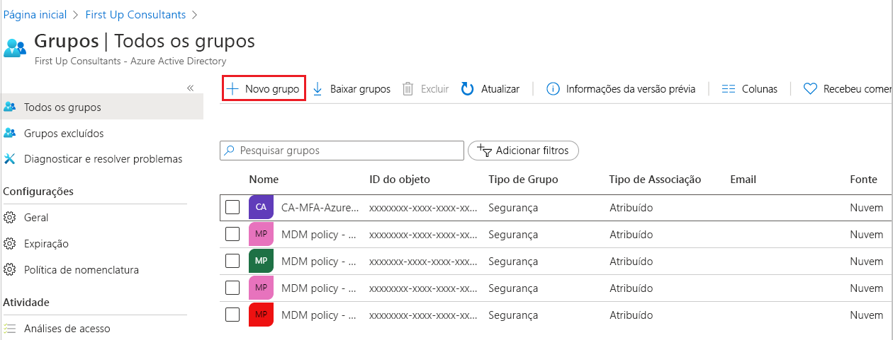
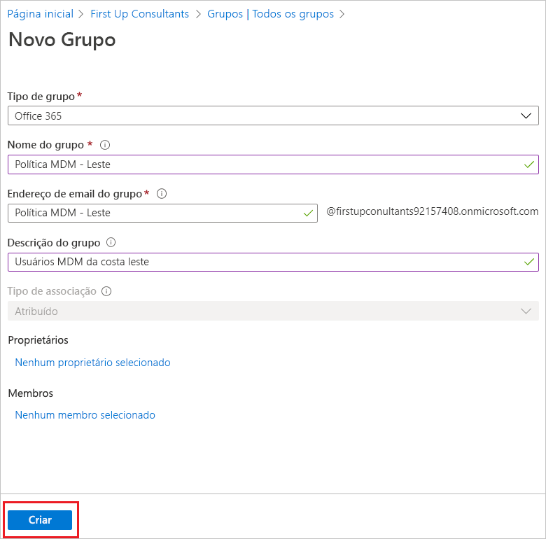
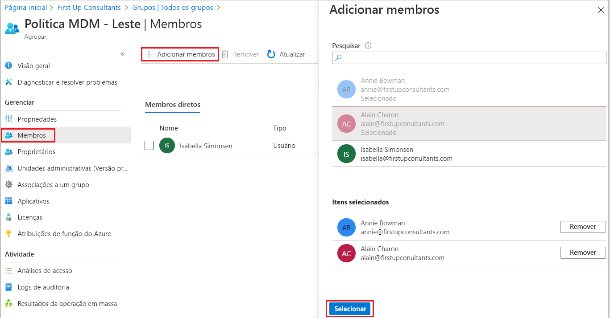

# Criar um grupo básico e adicionar membros usando o Azure Active Directory
Você pode criar um grupo básico usando o portal do Azure AD (Azure Active Directory). Para os fins deste artigo, um grupo básico é adicionado a um único recurso pelo proprietário do recurso (administrador) e inclui membros específicos (funcionários) que precisam acessar o recurso. Para cenários mais complexos, incluindo associações dinâmicas e criação de regra, confira a [documentação de gerenciamento de usuário do Azure Active Directory](../users-groups-roles/index.yml).

## Tipos de grupo e associação
Há vários tipos de grupo e associação. As informações a seguir explicam cada tipo de grupo e associação e por que eles são usados, para ajudar você a decidir quais opções usar ao criar um grupo.

### Tipos de grupo:
- **Segurança**. Usado para gerenciar o acesso de membros e computadores a recursos compartilhados para um grupo de usuários. Por exemplo, você pode criar um grupo de segurança para uma política de segurança específica. Com isso, você pode dar um conjunto de permissões a todos os membros ao mesmo tempo, em vez de precisar adicionar permissões a cada membro individualmente. Um grupo de segurança pode ter usuários, dispositivos, grupos e entidades de serviço como seus membros e pode ter usuários e entidades de serviço como seus proprietários. Para obter mais informações sobre como gerenciar o acesso aos recursos, confira [Gerenciar o acesso a recursos com grupos do Azure Active Directory](active-directory-manage-groups.md).
- **Office 365**. Fornece oportunidades de colaboração, oferecendo acesso de membros a uma caixa de correio compartilhada, calendário, arquivos, site do SharePoint e muito mais. Essa opção também permite dar acesso ao grupo a pessoas fora da sua organização. Um grupo do Office 365 pode ter somente usuários como seus membros. Tanto usuários quanto entidades de serviço podem ser proprietários de um grupo do Office 365. Para obter mais informações sobre grupos do Office 365, confira [Saiba mais sobre grupos do Office 365](https://support.office.com/article/learn-about-office-365-groups-b565caa1-5c40-40ef-9915-60fdb2d97fa2).

### Tipos de associação:
- **Atribuído.** Permite adicionar usuários específicos para que sejam membros desse grupo e tenham permissões exclusivas. Para os fins deste artigo, estamos usando essa opção.
- **Usuário dinâmico.** Permite usar regras de associação dinâmica para adicionar e remover membros automaticamente. Se os atributos de um membro mudarem, o sistema examinará suas regras de grupo dinâmico para que o diretório verifique se o membro atende aos requisitos da regra (é adicionado) ou não mais atende aos requisitos de regras (é removido).
- **Dispositivo dinâmico.** Permite o uso de regras de grupo dinâmico para adicionar e remover dispositivos automaticamente. Se os atributos de um dispositivo mudarem, o sistema examinará suas regras de grupo dinâmico para que o diretório verifique se o dispositivo atende aos requisitos da regra (é adicionado) ou não mais atende aos requisitos de regras (é removido).

    > [!IMPORTANT]
    > Você pode criar um grupo dinâmico para dispositivos ou usuários, mas não para ambos. Você também não pode criar um grupo de dispositivos com base em atributos dos proprietários do dispositivo. Regras de associação de dispositivo só podem fazer referência a atributos do dispositivo. Para obter mais informações sobre como criar um grupo dinâmico para usuários e dispositivos, confira [Criar um grupo dinâmico e verificar o status](../users-groups-roles/groups-create-rule.md)

## Criar um grupo básico e adicionar membros
Você pode criar um grupo básico e adicionar seus membros ao mesmo tempo. Para criar um grupo básico e adicionar membros, use o seguinte procedimento:

1. Entre no [portal do Azure](https://portal.azure.com) usando uma conta de administrador Global para o diretório.

1. Pesquise **Azure Active Directory** e selecione-o.

1. Na página **Active Directory**, selecione **Grupos** e selecione **Novo grupo**.

    

1. O painel **Novo Grupo** será exibido e você deverá preencher as informações necessárias.

    

1. Selecione um **Tipo de grupo** predefinido. Para obter mais informações sobre tipos de grupo, confira [Tipos de grupo e associação](#group-types).

1. Crie e adicione um **Nome de grupo.** Escolha um nome que você lembrará e que faça sentido para o grupo. Uma verificação será executada para determinar se o nome já está em uso por outro grupo. Se o nome já estiver em uso, para evitar nomes duplicados, você deverá modificar o nome do grupo.

1. Adicione um **Endereço de email de grupo** para o grupo ou mantenha o endereço de email que é preenchido automaticamente.

1. **Descrição do grupo.** Adicione uma descrição opcional para seu grupo.

1. Selecione um **Tipo de associação (obrigatório)** predefinido. Para obter mais informações sobre tipos de associação, confira [Tipos de grupo e associação](#membership-types).

1. Selecione **Criar**. O grupo é criado e está pronto para que você adicione membros.

1. Selecione a área **Membros** da página **Grupo** e, em seguida, comece a procurar os membros a serem adicionados ao seu grupo da página **Selecionar membros**.

    

1. Quando você terminar de adicionar membros, escolha **Selecionar**.

    A página **Visão geral do grupo** é atualizada para mostrar o número de membros que agora são adicionados ao grupo.

    

## Ativar ou desativar o email de boas-vindas do grupo

Quando um novo grupo do Office 365 é criado, seja com associação dinâmica ou estática, uma notificação de boas-vindas é enviada a todos os usuários adicionados ao grupo. Quando um atributo de um usuário ou dispositivo é alterado, todas as regras de grupos dinâmicos na organização são processadas para possíveis alterações de associação. Os usuários que são adicionados também recebem a notificação de boas-vindas. É possível desativar esse comportamento no [PowerShell do Exchange](https://docs.microsoft.com/powershell/module/exchange/users-and-groups/Set-UnifiedGroup?view=exchange-ps). 

## Próximas etapas

- [Gerenciar acesso a aplicativos SaaS usando grupos](../users-groups-roles/groups-saasapps.md)
- [Gerenciar grupos usando comandos do PowerShell](../users-groups-roles/groups-settings-v2-cmdlets.md)

