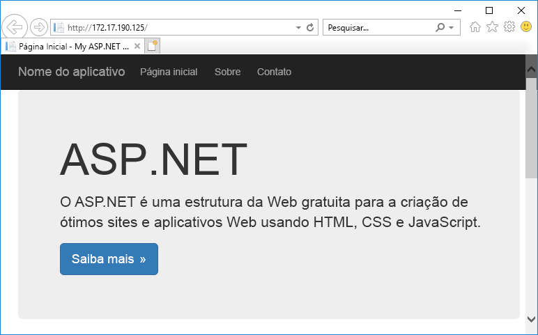
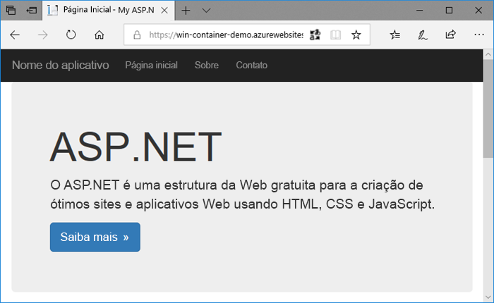
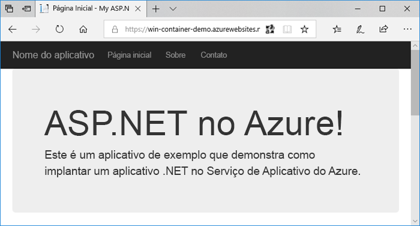

# <a name="run-a-custom-windows-container-in-azure-preview"></a>Executar um contêiner personalizado do Windows no Azure (Versão prévia)

[O Serviço de Aplicativo do Azure](overview.md) fornece pilhas de aplicativos predefinidos em Windows, como ASP.NET ou Node.js, em execução no IIS. O ambiente do Windows pré-configurado impede o sistema operacional de executar, entre outras funções, o acesso administrativo, instalações de software e alterações do cache de assembly global. Para saber mais, confira [Funcionalidade do sistema operacional no Serviço de Aplicativo do Azure](operating-system-functionality.md). Se o aplicativo exigir mais acesso que o permitido pelo ambiente pré-configurado, você pode implantar um contêiner personalizado do Windows como alternativa.

Este início rápido mostra como implantar um aplicativo ASP.NET em uma imagem do Windows para o [Docker Hub](https://hub.docker.com/) do Visual Studio. O aplicativo é executado em um contêiner personalizado no Serviço de Aplicativo do Azure.

## <a name="prerequisites"></a>Pré-requisitos

Para concluir este tutorial:

- <a href="https://hub.docker.com/" target="_blank">Inscrever-se em uma conta do Hub do Docker</a>
- <a href="https://docs.docker.com/docker-for-windows/install/" target="_blank">Instalar o Docker for Windows</a>.
- <a href="https://docs.microsoft.com/virtualization/windowscontainers/quick-start/quick-start-windows-10" target="_blank">Mudar o Docker para executar contêineres do Windows</a>.
- <a href="https://www.visualstudio.com/downloads/" target="_blank">Instale o Visual Studio 2019</a> com as cargas de trabalho de **desenvolvimento do ASP.NET e para a Web** e **desenvolvimento do Azure**. Se você já instalou o Visual Studio 2019:

    - Instale as atualizações mais recentes no Visual Studio selecionando **Ajuda** > **Verificar Atualizações**.
    - Adicione as cargas de trabalho no Visual Studio selecionando **Ferramentas** > **Obter Ferramentas e Recursos**.

## <a name="create-an-aspnet-web-app"></a>Criar um aplicativo Web ASP .NET

Crie um aplicativo Web ASP.NET seguindo estas etapas:

1. Abra o Visual Studio e selecione **Criar novo projeto**.

1. Em **Criar novo projeto**, localize e escolha **Aplicativo Web ASP.NET (.NET Framework)** para C# e, em seguida, selecione **Avançar**.

1. Em **Configurar seu novo projeto**, dê ao aplicativo o nome _myfirstazurewebapp_ e, em seguida, selecione, **Criar**.

   

1. Você pode implantar qualquer tipo de aplicativo Web ASP.NET no Azure. Para este início rápido, escolha o modelo **MVC**.

1. Selecione **Suporte para Docker** e verifique se a autenticação está definida como **Sem Autenticação**. Selecione **Criar**.

   

1. Se o arquivo _Dockerfile_ não for aberto automaticamente, abra-o no **Gerenciador de Soluções**.

1. Você precisa de uma [imagem pai com suporte](#use-a-different-parent-image). Altere a imagem pai, substituindo a linha `FROM` pelo código a seguir e salve o arquivo:

   ```Dockerfile
   FROM mcr.microsoft.com/dotnet/framework/aspnet:4.7.2-windowsservercore-ltsc2019
   ```

1. No menu do Visual Studio, selecione **Depurar** > **Iniciar sem Depuração** para executar o aplicativo Web localmente.

   

## <a name="publish-to-docker-hub"></a>Publicar no Docker Hub

1. No **Gerenciador de Soluções**, clique com o botão direito do mouse no projeto **myfirstazurewebapp** e selecione **Publicar**.

1. Escolha **Serviço de Aplicativo** e selecione **Publicar**.

1. Em **Escolher um destino de publicação**, selecione **Registro de Contêiner** e **Docker Hub** e clique em **Publicar**.

   

1. Forneça suas credenciais da conta do Docker Hub e selecione **Salvar**.

   Aguarde até que a implantação seja concluída. A página **Publicar** agora mostra o nome do repositório que você usará mais tarde.

   

1. Copie esse nome de repositório para uso posterior.

## <a name="create-a-windows-container-app"></a>Criar um aplicativo de contêiner do Windows

1. Entre no [portal do Azure]( https://portal.azure.com).

1. Escolha **Criar um recurso** no canto superior esquerdo do portal do Azure.

1. Na caixa de pesquisa acima da lista de recursos do Azure Marketplace, pesquise **Aplicativo Web para Contêineres** e selecione **Criar**.

1. Em **Criação de Aplicativo Web**, escolha sua assinatura e um **Grupo de Recursos**. Você pode criar um novo grupo de recursos, se necessário.

1. Forneça um nome de aplicativo, como *win-container-demo*, e escolha **Windows** como o **Sistema Operacional**. Selecione **Avançar: Docker** para continuar.

   

1. Para **Origem da Imagem**, escolha **Docker Hub** e, para **Imagem e tag**, insira o nome do repositório que você copiou em [Publicar no Docker Hub](#publish-to-docker-hub).

   

    Se você tiver uma imagem personalizada em outro lugar para seu aplicativo Web, como no [Registro de Contêiner do Azure](/azure/container-registry/) ou em outro repositório privado, configure-a aqui.

1. Selecione **Examinar e Criar** e, em seguida, **Criar** e espere o Azure criar os recursos necessários.

## <a name="browse-to-the-container-app"></a>Navegar até o aplicativo de contêiner

Quando a operação do Azure for concluída, uma caixa de notificação será exibida.


1. Clique em **Ir para o recurso**.

1. Na visão geral desse recurso, siga o link ao lado de **URL**.

Uma nova página do navegador é aberta na seguinte página:


Aguarde alguns minutos e tente novamente, até chegar à home page padrão do ASP.NET:



**Parabéns!** Você está executando seu primeiro contêiner personalizado do Windows no Serviço de Aplicativo do Azure.

## <a name="see-container-start-up-logs"></a>Conferir logs de inicialização do contêiner

Pode levar algum tempo para o contêiner do Windows ser carregado. Para ver o progresso, navegue até a URL a seguir, substituindo *\<app_name>* pelo nome do aplicativo.
```
https://<app_name>.scm.azurewebsites.net/api/logstream
```

Os logs transmitidos têm esta aparência:

```
2018-07-27T12:03:11  Welcome, you are now connected to log-streaming service.
27/07/2018 12:04:10.978 INFO - Site: win-container-demo - Start container succeeded. Container: facbf6cb214de86e58557a6d073396f640bbe2fdec88f8368695c8d1331fc94b
27/07/2018 12:04:16.767 INFO - Site: win-container-demo - Container start complete
27/07/2018 12:05:05.017 INFO - Site: win-container-demo - Container start complete
27/07/2018 12:05:05.020 INFO - Site: win-container-demo - Container started successfully
```

## <a name="update-locally-and-redeploy"></a>Atualizar localmente e reimplantar

1. No Visual Studio, em **Gerenciador de Soluções**, abra **Exibições** > **Início** > **Index.cshtml**.

1. Encontre o rótulo HTML `<div class="jumbotron">` próximo à parte superior e substitua o elemento inteiro pelo seguinte código:

   ```HTML
   <div class="jumbotron">
       <h1>ASP.NET in Azure!</h1>
       <p class="lead">This is a simple app that we've built that demonstrates how to deploy a .NET app to Azure App Service.</p>
   </div>
   ```

1. Para implantar novamente no Azure, clique com o botão direito do mouse no projeto **myfirstazurewebapp** no **Gerenciador de Soluções** e escolha **Publicar**.

1. Na página de publicação, selecione **Publicar** e aguarde até que a publicação seja concluída.

1. Para informar ao Serviço de Aplicativo que ele deve obter a nova imagem do Docker Hub, reinicie o aplicativo. Na página do aplicativo no portal, clique em **Reiniciar** > **Sim**.

   

[Navegue até o aplicativo de contêiner](#browse-to-the-container-app) novamente. Conforme você atualiza a página da Web, o aplicativo é revertido para a página "Iniciando" no início e, em seguida, exibe a página da Web atualizada novamente após alguns minutos.



## <a name="use-a-different-parent-image"></a>Usar uma imagem pai diferente

Você pode usar uma imagem personalizada do Docker diferente para executar seu aplicativo. No entanto, você deverá escolher a melhor [imagem pai (imagem de base)](https://docs.docker.com/develop/develop-images/baseimages/) para a estrutura desejada:

- Para implantar aplicativos do .NET Framework, use uma imagem pai com base na versão do [LTSC (Canal de Manutenção em Longo Prazo)](https://docs.microsoft.com/windows-server/get-started-19/servicing-channels-19#long-term-servicing-channel-ltsc) do Windows Server Core 2019. 
- Para implantar aplicativos .NET Core, use uma imagem pai baseada na versão do [SAC (Canal de Manutenção em Longo Prazo)](https://docs.microsoft.com/windows-server/get-started-19/servicing-channels-19#semi-annual-channel) do Windows Server Nano 1809. 

Leva algum tempo para baixar uma imagem pai durante a inicialização do aplicativo. No entanto, você pode reduzir o tempo de inicialização usando uma das seguintes imagens pai já armazenadas em cache no Serviço de Aplicativo do Azure:

- [mcr.microsoft.com/dotnet/framework/aspnet](https://hub.docker.com/_/microsoft-dotnet-framework-aspnet/):4.7.2-windowsservercore-ltsc2019
- [mcr.microsoft.com/windows/nanoserver](https://hub.docker.com/_/microsoft-windows-nanoserver/):1809 – esta imagem é o contêiner base usado em todas as imagens do Nano Server do Microsoft Windows e do Microsoft [ASP.NET Core](https://hub.docker.com/_/microsoft-dotnet-core-aspnet/).

## <a name="next-steps"></a>Próximas etapas

> [!div class="nextstepaction"]
> [Migrar para o contêiner do Windows no Azure](app-service-web-tutorial-windows-containers-custom-fonts.md)
