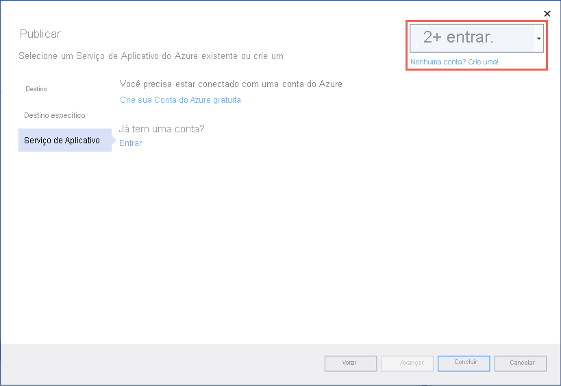
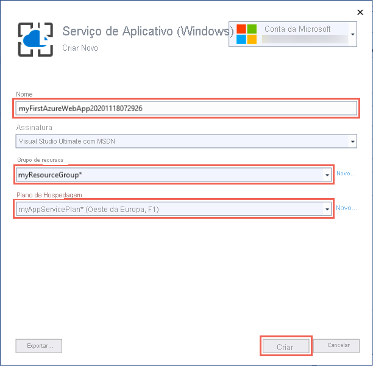
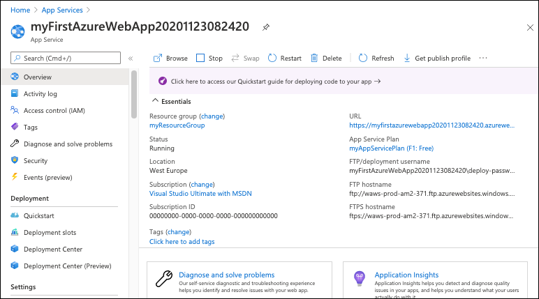

# <a name="quickstart-create-an-aspnet-core-web-app-in-azure"></a>Início Rápido: Criar um aplicativo Web ASP.NET Core no Azure

::: zone pivot="platform-windows"  

Neste guia de início rápido, você aprenderá a criar e implantar seu primeiro aplicativo Web ASP.NET Core no [Serviço de Aplicativo do Azure](overview.md). O Serviço de Aplicativo dá suporte a aplicativos .NET 5.0.

Quando terminar, você terá um grupo de recursos do Azure que consistirá em um plano de hospedagem do Serviço de Aplicativo e um Serviço de Aplicativo com um aplicativo Web implantado.

## <a name="prerequisites"></a>Pré-requisitos

- Uma conta do Azure com uma assinatura ativa. [Crie uma conta gratuitamente](https://azure.microsoft.com/free/dotnet/).
- Instale o <a href="https://www.visualstudio.com/downloads/" target="_blank">Visual Studio 2019</a> com a carga de trabalho de **desenvolvimento Web e do ASP.NET**.

  Se você já instalou o Visual Studio 2019:

  - Instale as atualizações mais recentes no Visual Studio selecionando **Ajuda** > **Verificar Atualizações**. As atualizações mais recentes contêm o SDK do .NET 5.0.
  - Adicione a carga de trabalho selecionando **Ferramentas** > **Obter Ferramentas e Recursos**.


## <a name="create-an-aspnet-core-web-app"></a>Criar um aplicativo Web ASP.NET Core

Crie um aplicativo Web ASP.NET Core no Visual Studio seguindo estas etapas:

# <a name="net-core-31"></a>[.NET Core 3.1](#tab/netcore31)

1. Abra o Visual Studio e selecione **Criar um projeto**.

1. Em **Criar um projeto**, selecione **Aplicativo Web ASP.NET Core** e confirme se **C#** está listado nas linguagens para essa escolha e, em seguida, selecione **Avançar**.

1. Em **Configurar seu novo projeto**, dê ao projeto de aplicativo Web o nome *myFirstAzureWebApp* e selecione **Criar**.

   

1. Você pode implantar qualquer tipo de aplicativo Web ASP.NET Core no Azure, mas para este guia de início rápido, escolha o modelo **Aplicativo Web**. Defina **Autenticação** como **Sem Autenticação** e não deixe nenhuma outra opção selecionada. Em seguida, selecione **Criar**.

    
   
1. No menu do Visual Studio, selecione **Depurar** > **Iniciar Sem Depuração** para executar o aplicativo Web localmente.

   

# <a name="net-50"></a>[.NET 5.0](#tab/net50)

1. Abra o Visual Studio e selecione **Criar um projeto**.

1. Em **Criar um projeto**, selecione **Aplicativo Web ASP.NET Core** e confirme se **C#** está listado nas linguagens para essa escolha e, em seguida, selecione **Avançar**.

1. Em **Configurar seu novo projeto**, dê ao projeto de aplicativo Web o nome *myFirstAzureWebApp* e selecione **Criar**.

   

1. Para um aplicativo .NET 5.0, selecione **ASP.NET Core 5.0** na lista suspensa.

1. Você pode implantar qualquer tipo de aplicativo Web ASP.NET Core no Azure, mas para este guia de início rápido, escolha o modelo **Aplicativo Web ASP.NET Core**. Defina **Autenticação** como **Sem Autenticação** e não deixe nenhuma outra opção selecionada. Em seguida, selecione **Criar**.

    
   
1. No menu do Visual Studio, selecione **Depurar** > **Iniciar Sem Depuração** para executar o aplicativo Web localmente.

   

---

## <a name="publish-your-web-app"></a>Publicar seu aplicativo Web

Para publicar o aplicativo Web, você deve primeiro criar e configurar um novo Serviço de Aplicativo no qual você possa publicá-lo. 

Como parte da configuração do Serviço de Aplicativo, você criará:

- Um novo [grupo de recursos](../azure-resource-manager/management/overview.md#terminology) para conter todos os recursos do Azure para o serviço.
- Um novo [Plano de Hospedagem](./overview-hosting-plans.md) que especifica o local, o tamanho e os recursos do farm de servidores Web que hospeda o aplicativo.

Siga estas etapas para criar seu Serviço de Aplicativo e publicar o aplicativo Web:

1. No **Gerenciador de Soluções**, clique com o botão direito do mouse no projeto **myFirstAzureWebApp** e selecione **Publicar**. 

1. Em **Publicar**, selecione **Azure** e clique em **Avançar**.

1. As opções dependem de você já ter entrado no Azure e de ter uma conta do Visual Studio vinculada a uma conta do Azure. Selecione **Adicionar uma conta** ou **Entrar** para entrar em sua assinatura do Azure. Se você já estiver conectado, selecione a conta que deseja.

   

1. À direita de **Instâncias do Serviço de Aplicativo**, clique em **+** .

   

1. Em **Assinatura**, aceite a assinatura que está listada ou selecione uma nova na lista suspensa.

1. Para **Grupo de recursos**, selecione **Novo**. Em **Nome do novo grupo de recursos**, insira *myResourceGroup* e selecione **OK**. 

1. Em **Plano de Hospedagem**, selecione **Novo**. 

1. Na caixa de diálogo **Plano de Hospedagem: Criar novo**, insira os valores especificados na tabela a seguir:

   | Configuração  | Valor sugerido | Descrição |
   | -------- | --------------- | ----------- |
   | **Plano de hospedagem**  | *myFirstAzureWebAppPlan* | O nome do plano do Serviço de Aplicativo. |
   | **Localidade**      | *Oeste da Europa* | O datacenter onde o aplicativo Web está hospedado. |
   | **Tamanho**          | *Gratuito* | O [Tipo de preço](https://azure.microsoft.com/pricing/details/app-service/?ref=microsoft.com&utm_source=microsoft.com&utm_medium=docs&utm_campaign=visualstudio) determina os recursos de hospedagem. |
   
   

1. Em **Nome**, insira um nome de aplicativo exclusivo que inclua somente os caracteres válidos `a-z`, `A-Z`, `0-9` e `-`. Você pode aceitar o nome exclusivo gerado automaticamente. A URL do aplicativo Web é `http://<app-name>.azurewebsites.net`, em que `<app-name>` é o nome do aplicativo.

2. Selecione **Criar** para criar os recursos do Azure.

   

   Quando o assistente for concluído, os recursos do Azure serão criados para você e você estará pronto para publicar.

3. Escolha **Concluir** para fechar o assistente.

1. Na página **Publicar**, clique em **Publicar**. O Visual Studio compila, empacota e publica o aplicativo no Azure e, em seguida, inicia o aplicativo no navegador padrão.

   

**Parabéns!** Seu aplicativo Web ASP.NET Core está em execução no Serviço de Aplicativo do Azure.

## <a name="update-the-app-and-redeploy"></a>Atualizar o aplicativo e reimplantar

Siga estas etapas para atualizar e reimplantar seu aplicativo Web:

1. No **Gerenciador de Soluções**, em seu projeto, abra **Páginas** > **Index.cshtml**.

1. Substitua toda a marcação `<div>` pelo seguinte código:

   ```html
   <div class="jumbotron">
       <h1>ASP.NET in Azure!</h1>
       <p class="lead">This is a simple app that we've built that demonstrates how to deploy a .NET app to Azure App Service.</p>
   </div>
   ```

1. Para implantar novamente no Azure, clique com o botão direito do mouse no projeto **myFirstAzureWebApp**, no **Gerenciador de Soluções** e selecione **Publicar**.

1. Na página de resumo **Publicar**, selecione **Publicar**.

   <!--  -->

    Quando a publicação está concluída, o Visual Studio inicia um navegador para a URL do aplicativo Web.

    

## <a name="manage-the-azure-app"></a>Gerenciar o aplicativo do Azure

Para gerenciar o aplicativo Web, acesse o [portal do Azure](https://portal.azure.com) e procure e selecione **Serviços de Aplicativos**.


Na página **Serviços de Aplicativos**, selecione o nome do seu aplicativo Web.

:::image type="content" source="./media/quickstart-dotnetcore/select-app-service.png" alt-text="Captura de tela da página Serviços de Aplicativos com um aplicativo Web de exemplo selecionado.":::

A página **Visão Geral** do aplicativo Web contém opções para gerenciamento básico, como procurar, parar, iniciar, reiniciar e excluir. O menu à esquerda fornece páginas adicionais para configurar o aplicativo.



[!INCLUDE [Clean-up section](../../includes/clean-up-section-portal.md)]

## <a name="next-steps"></a>Próximas etapas

Neste guia de início rápido, você usou o Visual Studio para criar e implantar um aplicativo Web ASP.NET Core no Serviço de Aplicativo do Azure.

Avance para o próximo artigo para saber como criar um aplicativo .NET Core e conectá-lo a um Banco de Dados SQL:

> [!div class="nextstepaction"]
> [ASP.NET Core com o Banco de Dados SQL](tutorial-dotnetcore-sqldb-app.md)

> [!div class="nextstepaction"]
> [Configurar o aplicativo ASP.NET Core](configure-language-dotnetcore.md)

::: zone-end  

::: zone pivot="platform-linux"
O [Serviço de Aplicativo no Linux](overview.md#app-service-on-linux) fornece um serviço de hospedagem na Web altamente escalonável e com aplicação automática de patches usando o sistema operacional Linux. Este guia de início rápido mostra como criar um aplicativo [.NET Core](/aspnet/core/) no Serviço de Aplicativo no Linux. Crie o aplicativo usando a [CLI do Azure](/cli/azure/get-started-with-azure-cli) e use o Git para implantar o código .NET Core no aplicativo.


Você pode seguir as etapas deste artigo usando um computador Mac, Windows ou Linux.

[!INCLUDE [quickstarts-free-trial-note](../../includes/quickstarts-free-trial-note.md)]

## <a name="set-up-your-initial-environment"></a>Configurar o seu ambiente inicial

# <a name="net-core-31"></a>[.NET Core 3.1](#tab/netcore31)

Para concluir este guia de início rápido:

* <a href="https://dotnet.microsoft.com/download/dotnet-core/3.1" target="_blank">Instalar o SDK do .NET Core 3.1 mais recente</a>.
* <a href="/cli/azure/install-azure-cli" target="_blank">Instalar a última CLI do Azure</a>.

# <a name="net-50"></a>[.NET 5.0](#tab/net50)

Para concluir este guia de início rápido:

* <a href="https://dotnet.microsoft.com/download/dotnet/5.0" target="_blank">Instalar o SDK do .NET Core 5.0 mais recente</a>.
* <a href="/cli/azure/install-azure-cli" target="_blank">Instalar a última CLI do Azure</a>.

---

[Está com problemas? Fale conosco.](https://aka.ms/DotNetAppServiceLinuxQuickStart)

## <a name="create-the-app-locally"></a>Criar o aplicativo localmente

Em uma janela de terminal no computador, crie um diretório chamado `hellodotnetcore` e altere o diretório atual para ele.

```bash
mkdir hellodotnetcore
cd hellodotnetcore
```

Crie um aplicativo .NET Core.

```bash
dotnet new web
```

## <a name="run-the-app-locally"></a>Executar o aplicativo localmente

Execute o aplicativo no local para ver como ele deve ficar quando o implantar no Azure. 

```bash
dotnet run
```

Abra um navegador da Web e navegue até o aplicativo em `http://localhost:5000`.

Você vê a mensagem **Olá, Mundo** no aplicativo de exemplo exibido na página.


[Está com problemas? Fale conosco.](https://aka.ms/DotNetAppServiceLinuxQuickStart)

## <a name="sign-into-azure"></a>Entrar no Azure
Na janela do terminal, faça logon no Azure com o seguinte comando:

```azurecli
az login
```

## <a name="deploy-the-app"></a>Implantar o aplicativo

Implante o código na pasta local (*hellodotnetcore*) usando o comando `az webapp up`:

```azurecli
az webapp up --sku F1 --name <app-name> --os-type linux
```

- Se o comando `az` não for reconhecido, verifique se você tem a CLI do Azure instalada, conforme descrito em [Configurar seu ambiente inicial](#set-up-your-initial-environment).
- Substitua `<app-name>` por um nome que seja exclusivo em todo o Azure (*os caracteres válidos são `a-z`, `0-9` e `-`* ). Um bom padrão é usar uma combinação do nome da empresa e um identificador de aplicativo.
- O argumento `--sku F1` cria o aplicativo Web no tipo de preço Gratuito. Omita esse argumento para usar um nível Premium mais rápido, o que incorre em um custo por hora.
- Opcionalmente, você pode incluir o argumento `--location <location-name>`, em que `<location-name>` é uma região do Azure disponível. Você pode recuperar uma lista de regiões permitidas para sua conta do Azure executando o comando [`az account list-locations`](/cli/azure/appservice#az-appservice-list-locations).

O comando pode demorar um pouco para ser concluído. Durante a execução, ele fornece mensagens sobre como criar o grupo de recursos, o plano do Serviço de Aplicativo e o aplicativo de hospedagem, configurar o registro em log e executar a implantação ZIP. Em seguida, ele fornece a mensagem "Você pode iniciar o aplicativo em http://&lt;nome-do-aplicativo&gt;.azurewebsites.net", que é a URL do aplicativo no Azure.

# <a name="net-core-31"></a>[.NET Core 3.1](#tab/netcore31)


# <a name="net-50"></a>[.NET 5.0](#tab/net50)

<!-- Deploy the code in your local folder (*hellodotnetcore*) using the `az webapp up` command:

```azurecli
az webapp up --sku B1 --name <app-name> --os-type linux
```

- If the `az` command isn't recognized, be sure you have the Azure CLI installed as described in [Set up your initial environment](#set-up-your-initial-environment).
- Replace `<app-name>` with a name that's unique across all of Azure (*valid characters are `a-z`, `0-9`, and `-`*). A good pattern is to use a combination of your company name and an app identifier.
- The `--sku B1` argument creates the web app in the Basic pricing tier, which incurs an hourly cost. Omit this argument to use a faster premium tier, which costs more.
- You can optionally include the argument `--location <location-name>` where `<location-name>` is an available Azure region. You can retrieve a list of allowable regions for your Azure account by running the [`az account list-locations`](/cli/azure/appservice#az-appservice-list-locations) command.

The command may take a few minutes to complete. While running, it provides messages about creating the resource group, the App Service plan and hosting app, configuring logging, then performing ZIP deployment. It then gives the message, "You can launch the app at http://&lt;app-name&gt;.azurewebsites.net", which is the app's URL on Azure. -->


---

[Está com problemas? Fale conosco.](https://aka.ms/DotNetAppServiceLinuxQuickStart)

[!include [az webapp up command note](../../includes/app-service-web-az-webapp-up-note.md)]

## <a name="browse-to-the-app"></a>Navegar até o aplicativo

Navegue até o aplicativo implantado usando o navegador da Web.

```bash
http://<app_name>.azurewebsites.net
```

O código de exemplo .NET Core está em execução no Serviço de Aplicativo no Linux com uma imagem interna.


**Parabéns!** Você implantou seu primeiro aplicativo .NET Core no Serviço de Aplicativo no Linux.

[Está com problemas? Fale conosco.](https://aka.ms/DotNetAppServiceLinuxQuickStart)

## <a name="update-and-redeploy-the-code"></a>Atualizar e reimplantar o código

No diretório local, abra o arquivo _Startup.cs_. Faça uma pequena alteração no texto na chamada do método `context.Response.WriteAsync`:

```csharp
await context.Response.WriteAsync("Hello Azure!");
```

Salve suas alterações e reimplante o aplicativo usando o comando `az webapp up` novamente:

```azurecli
az webapp up
```

Esse comando usa valores armazenados em cache localmente no arquivo *.azure/config*, incluindo o nome do aplicativo, o grupo de recursos e o plano do Serviço de Aplicativo.

Depois que a implantação for concluída, mude de volta para a janela do navegador aberta na etapa **Navegar até o aplicativo** e clique em Atualizar.


[Está com problemas? Fale conosco.](https://aka.ms/DotNetAppServiceLinuxQuickStart)

## <a name="manage-your-new-azure-app"></a>Gerenciar seu novo aplicativo do Azure

Acesse o <a href="https://portal.azure.com" target="_blank">portal do Azure</a> para gerenciar o aplicativo que você criou.

No menu à esquerda, clique em **Serviços de Aplicativos** e, em seguida, clique no nome do aplicativo do Azure.

:::image type="content" source="./media/quickstart-dotnetcore/portal-app-service-list-up.png" alt-text="Captura de tela da página Serviços de Aplicativos mostrando um exemplo de aplicativo do Azure selecionado.":::

Você verá a página Visão geral do aplicativo. Aqui você pode executar tarefas básicas de gerenciamento como procurar, parar, iniciar, reiniciar e excluir. 


O menu à esquerda fornece páginas diferentes para configurar seu aplicativo. 

[!INCLUDE [cli-samples-clean-up](../../includes/cli-samples-clean-up.md)]

[Está com problemas? Fale conosco.](https://aka.ms/DotNetAppServiceLinuxQuickStart)

## <a name="next-steps"></a>Próximas etapas

> [!div class="nextstepaction"]
> [Tutorial: Aplicativo ASP.NET Core com o Banco de Dados SQL](tutorial-dotnetcore-sqldb-app.md)

> [!div class="nextstepaction"]
> [Configurar o aplicativo ASP.NET Core](configure-language-dotnetcore.md)

::: zone-end