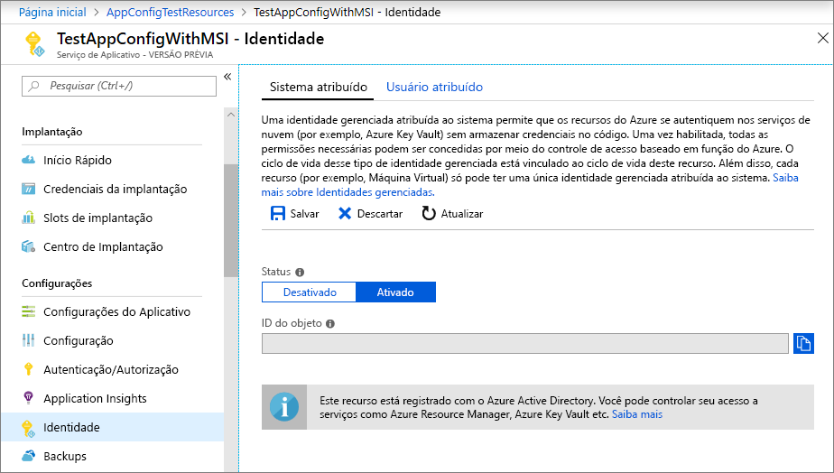
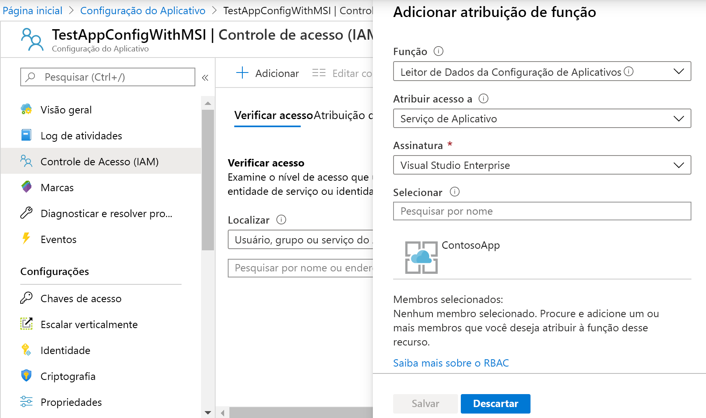

# <a name="integrate-with-azure-managed-identities"></a>Integração às Identidades Gerenciadas do Azure

[As identidades gerenciadas pelo](../active-directory/managed-identities-azure-resources/overview.md) Azure Active Directory simplificam o gerenciamento de segredos para o seu aplicativo na nuvem. Com uma identidade gerenciada, seu código pode usar o principal de serviço criado para o serviço Azure em que ele é executado. Você usa uma identidade gerenciada, em vez de uma credencial separada armazenada no Azure Key Vault ou uma cadeia de caracteres de conexão local. 

A configuração do aplicativo Azure e suas bibliotecas de clientes .NET Core, .NET Framework e Java Spring têm gerenciado o suporte à identidade incorporado a eles. Embora você não seja obrigado a usá-lo, a identidade gerenciada elimina a necessidade de um token de acesso que contenha segredos. Seu código pode acessar a loja de configuração de aplicativos usando apenas o ponto final do serviço. Você pode incorporar esta URL diretamente em seu código sem expor nenhum segredo.

Este artigo mostra como você pode tirar proveito da identidade gerenciada para acessar a configuração do aplicativo. Ele se baseia no aplicativo Web introduzido nos Inícios Rápidos. Antes de continuar, [crie um aplicativo ASP.NET Core com configuração de aplicativos](./quickstart-aspnet-core-app.md) primeiro.

Este artigo também mostra como você pode usar a identidade gerenciada em conjunto com as referências do Cofre chave da configuração do aplicativo. Com uma única identidade gerenciada, você pode acessar perfeitamente os segredos do Key Vault e os valores de configuração da Configuração do aplicativo. Se você deseja explorar esse recurso, finalize [use referências do cofre de chaves com ASP.NET Core](./use-key-vault-references-dotnet-core.md) primeiro.

Você pode usar qualquer editor de código para executar as etapas deste tutorial. O [Visual Studio Code](https://code.visualstudio.com/) é uma excelente opção disponível nas plataformas Windows, macOS e Linux.

Neste artigo, você aprenderá como:

> [!div class="checklist"]
> * Permita acesso a uma identidade gerenciada à Configuração de Aplicativo.
> * Configure seu aplicativo para usar uma identidade gerenciada ao conectar-se à Configuração de Aplicativo.
> * Opcionalmente, configure seu aplicativo para usar uma identidade gerenciada quando você se conectar ao Key Vault através de uma referência do Cofre chave de configuração do aplicativo.

## <a name="prerequisites"></a>Pré-requisitos

Para concluir este tutorial, você deve ter:

* [.NET Core SDK](https://www.microsoft.com/net/download/windows).
* [Azure Cloud Shell configurado](https://docs.microsoft.com/azure/cloud-shell/quickstart).

[!INCLUDE [quickstarts-free-trial-note](../../includes/quickstarts-free-trial-note.md)]

## <a name="add-a-managed-identity"></a>Adicionar uma identidade gerenciada

Para configurar uma identidade gerenciada no portal, primeiro crie um aplicativo e, em seguida, habilite o recurso.

1. Crie uma instância de Serviços de Aplicativos no [portal Azure](https://portal.azure.com) como você normalmente faz. Vá até ele no portal.

1. Role a página para baixo até o grupo **Configurações** no painel de navegação à esquerda e selecione **Identidade**.

1. Na guia **Sistema atribuído**, alterne o **Status** para **Ativado** e selecione **Salvar**.

1. Resposta **Sim** quando solicitada para habilitar a identidade gerenciada atribuída ao sistema.

    

## <a name="grant-access-to-app-configuration"></a>Permitir acesso à Configuração de Aplicativo

1. No [portal Azure,](https://portal.azure.com)selecione **Todos os recursos** e selecione a loja de configuração de aplicativos criada no quickstart.

1. Selecione **controle de acesso (IAM)**.

1. Na guia **Verificar acesso**, selecione **Adicionar** na interface do usuário de cartão **Adicionar uma atribuição de função**.

1. Em **Função,** selecione **O Leitor de Dados de Configuração do Aplicativo**. Em **Atribuir acesso**, selecione **Serviço de Aplicativo** em **Identidade gerenciada atribuída ao sistema**.

1. Em **Assinatura**, selecione sua assinatura do Azure. Selecione o recurso de Serviço de Aplicativo para o seu aplicativo.

1. Selecione **Salvar**.

    

1. Opcional: Se você deseja conceder acesso ao Key Vault também, siga as instruções em [Fornecer autenticação do Key Vault com uma identidade gerenciada](https://docs.microsoft.com/azure/key-vault/managed-identity).

## <a name="use-a-managed-identity"></a>Usar uma identidade gerenciada

1. Adicionar uma referência ao *pacote Azure.Identity:*

    ```cli
    dotnet add package Azure.Identity
    ```

1. Encontre o ponto final da sua loja de configuração de aplicativos. Esta URL está listada na guia **Teclas de acesso** da loja no portal Azure.

1. Abra *appsettings.json* e adicione o seguinte script. Substitua service_endpoint * \<>*, incluindo os suportes, com a URL na loja de configuração do aplicativo. 

    ```json
    "AppConfig": {
        "Endpoint": "<service_endpoint>"
    }
    ```

1. Abra *Program.cs*e adicione uma `Azure.Identity` `Microsoft.Azure.Services.AppAuthentication` referência aos espaços e nomes:

    ```csharp-interactive
    using Azure.Identity;
    ```

1. Se desejar acessar apenas valores armazenados diretamente `CreateWebHostBuilder` na Configuração `config.AddAzureAppConfiguration()` do aplicativo, atualize o método substituindo o método.

    > [!IMPORTANT]
    > `CreateHostBuilder` substitui `CreateWebHostBuilder` no .NET Core 3.0.  Selecione a sintaxe correta com base em seu ambiente.

    ### <a name="net-core-2x"></a>[.NET Core 2.x](#tab/core2x)

    ```csharp
        public static IWebHostBuilder CreateWebHostBuilder(string[] args) =>
            WebHost.CreateDefaultBuilder(args)
                .ConfigureAppConfiguration((hostingContext, config) =>
                {
                    var settings = config.Build();
                    config.AddAzureAppConfiguration(options =>
                        options.Connect(new Uri(settings["AppConfig:Endpoint"]), new ManagedIdentityCredential()));
                })
                .UseStartup<Startup>();
    ```

    ### <a name="net-core-3x"></a>[.NET Core 3.x](#tab/core3x)

    ```csharp
        public static IHostBuilder CreateHostBuilder(string[] args) =>
            Host.CreateDefaultBuilder(args)
            .ConfigureWebHostDefaults(webBuilder =>
            webBuilder.ConfigureAppConfiguration((hostingContext, config) =>
            {
                var settings = config.Build();
                    config.AddAzureAppConfiguration(options =>
                        options.Connect(new Uri(settings["AppConfig:Endpoint"]), new ManagedIdentityCredential()));
                })
                .UseStartup<Startup>());
    ```
    ---

1. Para usar os valores de configuração do aplicativo e as referências do Key Vault, atualize *Program.cs* como mostrado abaixo. Este código cria `KeyVaultClient` um `AzureServiceTokenProvider` novo usando um e `UseAzureKeyVault` passa essa referência para uma chamada para o método.

    ### <a name="net-core-2x"></a>[.NET Core 2.x](#tab/core2x)

    ```csharp
            public static IWebHostBuilder CreateWebHostBuilder(string[] args) =>
                WebHost.CreateDefaultBuilder(args)
                    .ConfigureAppConfiguration((hostingContext, config) =>
                    {
                        var settings = config.Build();
                        var credentials = new ManagedIdentityCredential();

                        config.AddAzureAppConfiguration(options =>
                        {
                            options.Connect(new Uri(settings["AppConfig:Endpoint"]), credentials)
                                    .ConfigureKeyVault(kv =>
                                    {
                                        kv.SetCredential(credentials);
                                    });
                        });
                    })
                    .UseStartup<Startup>();
    ```

    ### <a name="net-core-3x"></a>[.NET Core 3.x](#tab/core3x)

    ```csharp
        public static IHostBuilder CreateHostBuilder(string[] args) =>
            Host.CreateDefaultBuilder(args)
            .ConfigureWebHostDefaults(webBuilder =>
            webBuilder.ConfigureAppConfiguration((hostingContext, config) =>
                    {
                        var settings = config.Build();
                        var credentials = new ManagedIdentityCredential();

                        config.AddAzureAppConfiguration(options =>
                        {
                            options.Connect(new Uri(settings["AppConfig:Endpoint"]), credentials)
                                    .ConfigureKeyVault(kv =>
                                    {
                                        kv.SetCredential(credentials);
                                    });
                        });
                    })
                    .UseStartup<Startup>());
    ```
    ---

    Agora você pode acessar referências do Key Vault como qualquer outra chave de configuração do aplicativo. O provedor de configuração usará o `KeyVaultClient` que você configurou para autenticar em Key Vault e recuperar o valor.

[!INCLUDE [Prepare repository](../../includes/app-service-deploy-prepare-repo.md)]

## <a name="deploy-from-local-git"></a>Implantar a partir do Git local

A maneira mais fácil de habilitar a implantação local do Git para o seu aplicativo com o servidor de compilação Kudu é usar [o Azure Cloud Shell](https://shell.azure.com).

### <a name="configure-a-deployment-user"></a>Configurar um usuário de implantação

[!INCLUDE [Configure a deployment user](../../includes/configure-deployment-user-no-h.md)]

### <a name="enable-local-git-with-kudu"></a>Habilitar Git local com Kudu
Se você não tiver um repositório git local para o seu aplicativo, você precisará inicializar um. Para inicializar um repositório git local, execute os seguintes comandos do diretório de projetos do seu aplicativo:

```cmd
git init
git add .
git commit -m "Initial version"
```

Para habilitar a implantação local do Git para [`az webapp deployment source config-local-git`](/cli/azure/webapp/deployment/source?view=azure-cli-latest#az-webapp-deployment-source-config-local-git) o seu aplicativo com o servidor de compilação Kudu, execute no Cloud Shell.

```azurecli-interactive
az webapp deployment source config-local-git --name <app_name> --resource-group <group_name>
```

Este comando lhe dá algo semelhante à seguinte saída:

```json
{
  "url": "https://<username>@<app_name>.scm.azurewebsites.net/<app_name>.git"
}
```

### <a name="deploy-your-project"></a>Implante o seu projeto

Na _janela do terminal local,_ adicione um controle remoto Do Zure ao seu repositório Git local. Substitua _ \<o url>_ com a URL do controle remoto Git que você obteve do Enable local [Git com Kudu](#enable-local-git-with-kudu).

```bash
git remote add azure <url>
```

Envie por push para o Azure remoto para implantar seu aplicativo com o comando a seguir. Quando for solicitada uma senha, insira a senha que você criou em [Configurar um usuário de implantação](#configure-a-deployment-user). Não use a senha que você usa para entrar no portal do Azure.

```bash
git push azure master
```

Você pode ver a automação específica do runtime na saída, como MSBuild para ASP.NET, `npm install` para Node.js e `pip install` para o Python.

### <a name="browse-to-the-azure-web-app"></a>Navegar até o aplicativo Web do Azure

Procure o aplicativo web usando um navegador para verificar se o conteúdo foi implantado.

```bash
http://<app_name>.azurewebsites.net
```

## <a name="use-managed-identity-in-other-languages"></a>Usar a identidade gerenciada em outras linguagens

Os provedores da Configuração de Aplicativo para o .NET Framework e o Java Spring também têm suporte interno para a identidade gerenciada. Você pode usar o ponto final da URL da sua loja em vez de sua seqüência de conexão completa quando configurar um desses provedores. 

Por exemplo, você pode atualizar o aplicativo de console .NET Framework criado no quickstart para especificar as seguintes configurações no arquivo *App.config:*

```xml
    <configSections>
        <section name="configBuilders" type="System.Configuration.ConfigurationBuildersSection, System.Configuration, Version=4.0.0.0, Culture=neutral, PublicKeyToken=b03f5f7f11d50a3a" restartOnExternalChanges="false" requirePermission="false" />
    </configSections>

    <configBuilders>
        <builders>
            <add name="MyConfigStore" mode="Greedy" endpoint="${Endpoint}" type="Microsoft.Configuration.ConfigurationBuilders.AzureAppConfigurationBuilder, Microsoft.Configuration.ConfigurationBuilders.AzureAppConfiguration" />
            <add name="Environment" mode="Greedy" type="Microsoft.Configuration.ConfigurationBuilders.EnvironmentConfigBuilder, Microsoft.Configuration.ConfigurationBuilders.Environment" />
        </builders>
    </configBuilders>

    <appSettings configBuilders="Environment,MyConfigStore">
        <add key="AppName" value="Console App Demo" />
        <add key="Endpoint" value ="Set via an environment variable - for example, dev, test, staging, or production endpoint." />
    </appSettings>
```

## <a name="clean-up-resources"></a>Limpar recursos

[!INCLUDE [azure-app-configuration-cleanup](../../includes/azure-app-configuration-cleanup.md)]

## <a name="next-steps"></a>Próximas etapas
Neste tutorial, você adicionou uma identidade gerenciada do Azure para agilizar o acesso à configuração do aplicativo e melhorar o gerenciamento de credenciais para o seu aplicativo. Para saber mais sobre como usar a Configuração de Aplicativo, continue para ver as amostras da CLI do Azure.

> [!div class="nextstepaction"]
> [Exemplos de CLI](./cli-samples.md)
