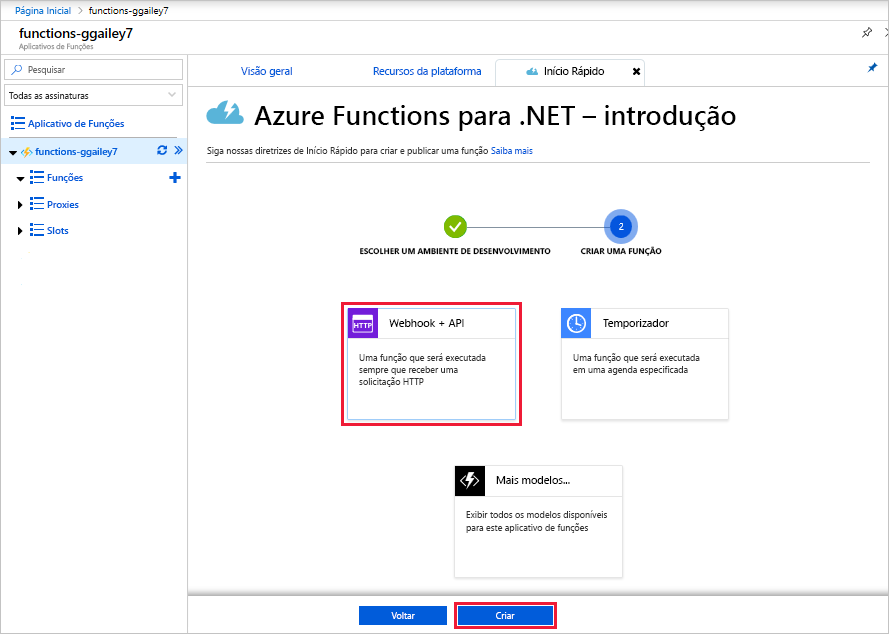

# Criar sua primeira função no portal do Azure

O Azure Functions lhe permite executar seu código em um ambiente [sem servidor](https://azure.microsoft.com/solutions/serverless/) sem que seja preciso primeiro criar uma VM ou publicar um aplicativo Web. Neste artigo, aprenda a usar o Functions para criar a função "Olá, Mundo" no portal do Azure.

[!INCLUDE [quickstarts-free-trial-note](../../includes/quickstarts-free-trial-note.md)]

> [!NOTE]
> Os desenvolvedores de C# devem considerar [criar sua primeira função no Visual Studio 2019](functions-create-your-first-function-visual-studio.md) em vez de usar o portal. 

## Fazer logon no Azure

Entre no portal do Azure em <https://portal.azure.com> com sua conta do Azure.

## Criar um aplicativo de funções

Você deve ter um aplicativo de funções para hospedar a execução de suas funções. Um aplicativo de funções lhe permite agrupar funções como uma unidade lógica para facilitar o gerenciamento, a implantação, o dimensionamento e o compartilhamento de recursos.

[!INCLUDE [Create function app Azure portal](../../includes/functions-create-function-app-portal.md)]

Em seguida, crie uma nova função no novo aplicativo de funções.

## Criar uma função disparada por HTTP

1. Expanda seu novo aplicativo de funções e selecione o botão **+** ao lado de **Functions**, escolha **No portal** e selecione **Continuar**.

    

1. Escolha **WebHook + API** e, em seguida, selecione **Criar**.

    

Uma função é criada usando um modelo específico a um idioma para uma função disparada por HTTP.

Agora você pode executar a nova função enviando uma solicitação HTTP.

## Testar a função

1. Em sua nova função, clique em **</> Obter URL da função** na parte superior direita, selecione **padrão (Tecla de função)** e depois clique em **Copiar**. 

    

2. Cole a URL de função na barra de endereços do navegador. Adicione o valor da cadeia de caracteres de consulta `&name=<yourname>` ao final desta URL e pressione `Enter` em seu teclado para executar a solicitação. Você deverá ver a resposta retornada pela função exibida no navegador.  

    O exemplo a seguir mostra a resposta no navegador:

    

    A URL da solicitação inclui uma chave que é necessária, por padrão, para acessar sua função via HTTP.

3. Quando a função é executada, informações de rastreamento são gravadas nos logs. Para ver a saída do rastreamento da execução anterior, volte para sua função no portal e clique na seta na parte inferior da tela para expandir os **Logs**.

   

## Limpar os recursos

[!INCLUDE [Clean-up resources](../../includes/functions-quickstart-cleanup.md)]

## Próximas etapas

Você criou um aplicativo de funções com uma função simples disparada por HTTP.  

[!INCLUDE [Next steps note](../../includes/functions-quickstart-next-steps.md)]

Para obter mais informações, veja [Associações HTTP do Azure Functions](functions-bindings-http-webhook.md).
