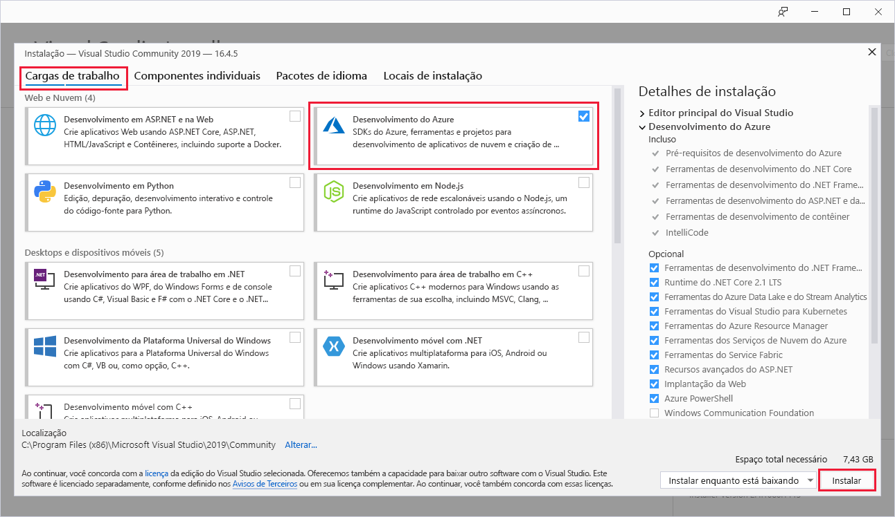

# Início Rápido: Criar sua primeira função no Azure usando o Visual Studio

O Azure Functions lhe permite executar o código em um ambiente sem servidor sem que seja preciso primeiro criar uma VM ou publicar um aplicativo Web.

Neste início rápido, você aprenderá a usar o Visual Studio 2019 para criar e testar localmente um aplicativo de funções “olá, mundo” em C# de gatilho HTTP e publicá-lo no Azure. 

Este início rápido foi criado para o Visual Studio 2019. 

## Pré-requisitos

Para concluir este tutorial, instale primeiro o [Visual Studio 2019](https://azure.microsoft.com/downloads/). Selecione a carga de trabalho de **desenvolvimento do Azure** durante a instalação. Se você quiser criar um projeto do Azure Functions usando o Visual Studio 2017, primeiro deve instalar as [ferramentas mais recentes do Azure Functions](functions-develop-vs.md#check-your-tools-version).

Se você não tiver uma [assinatura do Azure](../guides/developer/azure-developer-guide.md#understanding-accounts-subscriptions-and-billing), crie uma [conta gratuita](https://azure.microsoft.com/free/dotnet/) antes de começar.

## Crie um projeto de aplicativo de funções

[!INCLUDE [Create a project using the Azure Functions template](../../includes/functions-vstools-create.md)]

O Visual Studio cria um projeto e uma classe que contém o código clichê do tipo de função do gatilho HTTP. O atributo do método `FunctionName` define o nome da função, que é `Function1` por padrão. O atributo `HttpTrigger` especifica que a função é disparada por uma solicitação HTTP. O código padronizado envia uma resposta HTTP que inclui um valor do corpo de solicitação ou da cadeia de consulta.

Amplie as funcionalidades de sua função com associações de entrada e de saída, aplicando os atributos adequados ao método. Para obter mais informações, consulte a seção [Gatilhos e associações](functions-dotnet-class-library.md#triggers-and-bindings) da [referência do desenvolvedor C# do Azure Functions](functions-dotnet-class-library.md).

Agora que você criou o seu projeto de função e uma função de gatilho HTTP, você pode testá-la em seu computador local.

## Executar a função localmente

O Visual Studio integra-se ao Azure Functions Core Tools para que você possa testar suas funções localmente usando o runtime completo do Azure Functions.  

[!INCLUDE [functions-run-function-test-local-vs](../../includes/functions-run-function-test-local-vs.md)]

Após verificar se a função foi executada corretamente no computador local, é hora de publicar o projeto no Azure.

## Publicar o projeto no Azure

Antes de publicar o projeto, você deve ter um aplicativo de funções em sua assinatura do Azure. A publicação do Visual Studio cria um aplicativo de funções para você na primeira vez que você publica seu projeto.

[!INCLUDE [Publish the project to Azure](../../includes/functions-vstools-publish.md)]

## Testar sua função no Azure

1. Copie a URL base do aplicativo de funções na página de perfil de **Publicação**. Substitua a parte `localhost:port` da URL que você usou para testar a função localmente pela nova URL base. Acrescente o valor de cadeia de consulta `?name=<YOUR_NAME>` a essa URL e execute a solicitação.

    A URL que chama a função de gatilho HTTP está no seguinte formato:

    `http://<APP_NAME>.azurewebsites.net/api/<FUNCTION_NAME>?name=<YOUR_NAME>`

2. Cole essa nova URL para a solicitação HTTP na barra de endereços do navegador. A imagem a seguir mostra a resposta no navegador à solicitação GET remota retornada pela função:

    

## Limpar os recursos

[!INCLUDE [Clean-up resources](../../includes/functions-quickstart-cleanup.md)]

## Próximas etapas

Neste início rápido, você usou o Visual Studio para criar e publicar um aplicativo de funções em C# no Azure com uma função de gatilho HTTP simples. 

Avance para o próximo artigo para saber como adicionar uma associação de fila do Armazenamento do Azure à sua função:
> [!div class="nextstepaction"]
> [Adicionar uma associação de fila do Armazenamento do Azure à sua função](functions-add-output-binding-storage-queue-vs.md)

