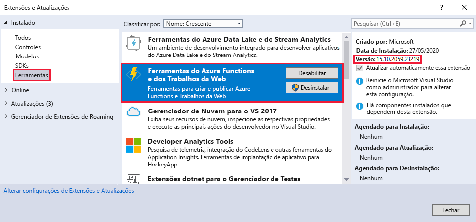
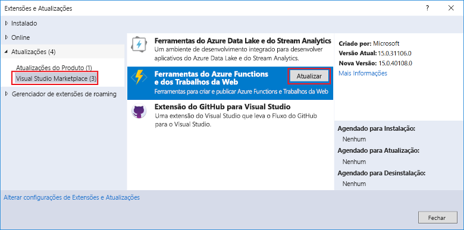
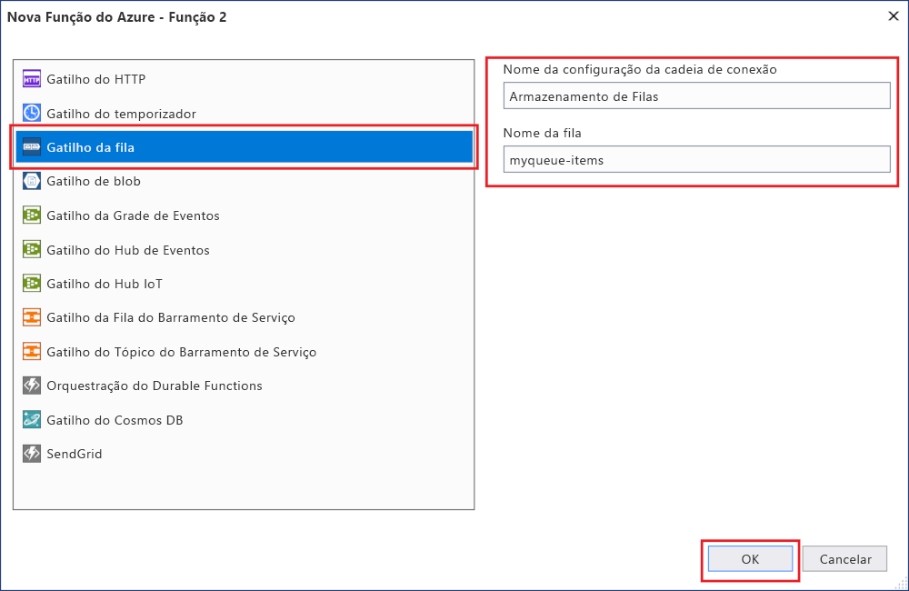
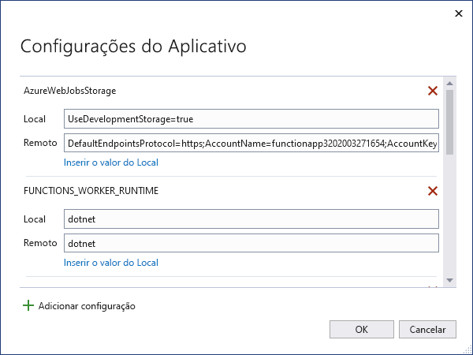

# <a name="develop-azure-functions-using-visual-studio"></a>Desenvolver o Azure Functions usando o Visual Studio  

O Visual Studio permite que você desenvolva, teste e implante funções de biblioteca de classes C# no Azure. Se essa experiência for sua primeira com Azure Functions, consulte [uma introdução ao Azure Functions](functions-overview.md).

O Visual Studio oferece os seguintes benefícios ao desenvolver suas funções: 

* Editar, criar e executar funções em seu computador de desenvolvimento local. 
* Publique seu projeto de Azure Functions diretamente no Azure e crie recursos do Azure conforme necessário. 
* Use atributos C# para declarar associações de função diretamente no código C#.
* Desenvolver e implantar funções de pré-compiladas C#. Funções pré-compiladas fornecem um desempenho de inicialização a frio melhor que funções baseadas em script C#. 
* Codificar suas funções em C# tendo todos os benefícios de desenvolvimento do Visual Studio. 

Este artigo fornece detalhes sobre como usar o Visual Studio para desenvolver funções de biblioteca de classes C# e publicá-las no Azure. Antes de ler este artigo, considere a conclusão do guia de [início rápido do Functions para Visual Studio](functions-create-your-first-function-visual-studio.md). 

Salvo indicação em contrário, os procedimentos e exemplos mostrados são para o Visual Studio 2019. 

## <a name="prerequisites"></a>Pré-requisitos

- Ferramentas de Azure Functions. Para adicionar as ferramentas do Azure Function, inclua a carga de trabalho de **desenvolvimento do Azure** na instalação do Visual Studio. Azure Functions ferramentas estão disponíveis na carga de trabalho de desenvolvimento do Azure, começando com o Visual Studio 2017.

- Outros recursos necessários, como uma conta de armazenamento do Azure, são criados em sua assinatura durante o processo de publicação.

- [!INCLUDE [quickstarts-free-trial-note](../../includes/quickstarts-free-trial-note.md)]

> [!NOTE]
> No Visual Studio 2017, a carga de trabalho de desenvolvimento do Azure instala Azure Functions ferramentas como uma extensão separada. Ao atualizar a instalação do Visual Studio 2017, verifique se você está usando a [versão mais recente](#check-your-tools-version) das ferramentas de Azure functions. As seções a seguir mostram como verificar e (se necessário) atualizar sua extensão de ferramentas de Azure Functions no Visual Studio 2017. 
>
> Ignore essas seções se você estiver usando o Visual Studio 2019.

### <a name="check-your-tools-version-in-visual-studio-2017"></a><a name="check-your-tools-version"></a>Verifique a versão das ferramentas no Visual Studio 2017

1. No menu **Ferramentas**, clique em **Extensões e Atualizações**. Expanda ferramentas **instaladas**  >  **Tools**e escolha **Azure Functions e ferramentas de trabalhos da Web**.

    

1. Anote a **versão** instalada e Compare esta versão com a versão mais recente listada nas [notas de versão](https://github.com/Azure/Azure-Functions/blob/master/VS-AzureTools-ReleaseNotes.md). 

1. Se a sua versão for mais antiga, atualize suas ferramentas no Visual Studio conforme mostrado na seção a seguir.

### <a name="update-your-tools-in-visual-studio-2017"></a>Atualize suas ferramentas no Visual Studio 2017

1. Na caixa de diálogo **Extensões e Atualizações**, expanda **Atualizações** > **Visual Studio Marketplace**, escolha **Azure Functions e Ferramentas de Trabalhos da Web ** e selecione **Atualizar**.

       

1. Depois que a atualização das ferramentas for baixada, selecione **fechar**e feche o Visual Studio para disparar a atualização das ferramentas com o instalador VSIX.

1. No instalador do VSIX, escolha **Modificar** para atualizar as ferramentas. 

1. Depois que a atualização for concluída, escolha **fechar**e reinicie o Visual Studio.

> [!NOTE]  
> No Visual Studio 2019 e posterior, a extensão de ferramentas de Azure Functions é atualizada como parte do Visual Studio.  

## <a name="create-an-azure-functions-project"></a>Criar um projeto do Azure Functions

[!INCLUDE [Create a project using the Azure Functions](../../includes/functions-vstools-create.md)]

Depois de criar um projeto Azure Functions, o modelo de projeto cria um projeto C#, instala o `Microsoft.NET.Sdk.Functions` pacote NuGet e define a estrutura de destino. O novo projeto contém os seguintes arquivos:

* **host.json**: Permite que você configure o host do Functions. Essas configurações se aplicam para execução local e no Azure. Para obter mais informações, consulte a [referência para host.json](functions-host-json.md).

* **local.Settings.json**: Mantém as configurações usadas ao executar as funções localmente. Essas configurações não são usadas durante a execução no Azure. Para obter mais informações, consulte [Local Settings File](#local-settings-file).

    >[!IMPORTANT]
    >Como o local.settings.jsno arquivo pode conter segredos, você deve excluí-lo do seu controle de origem do projeto. Verifique se a configuração **copiar para diretório de saída** para esse arquivo está definida como **copiar se for mais recente**. 

Para saber mais, confira [Projeto de biblioteca de classe de funções](functions-dotnet-class-library.md#functions-class-library-project).

[!INCLUDE [functions-local-settings-file](../../includes/functions-local-settings-file.md)]

O Visual Studio não carrega automaticamente as configurações no local.settings.jsquando você publica o projeto. Para certificar-se de que essas configurações também existam em seu aplicativo de funções no Azure, carregue-as depois de publicar seu projeto. Para obter mais informações, consulte [configurações do aplicativo de funções](#function-app-settings). Os valores em uma `ConnectionStrings` coleção nunca são publicados.

Seu código também pode ler os valores de configurações do aplicativo de funções como variáveis de ambiente. Para obter mais informações, consulte [variáveis de ambiente](functions-dotnet-class-library.md#environment-variables).

## <a name="configure-the-project-for-local-development"></a>Configurar seu projeto para desenvolvimento local

O runtime do Functions usa internamente uma conta de Armazenamento do Azure. Para todos os tipos de gatilho diferentes de HTTP e WebHooks, defina a `Values.AzureWebJobsStorage` chave para uma cadeia de conexão de conta de armazenamento do Azure válida. Seu aplicativo de funções também pode usar o [emulador de armazenamento do Azure](../storage/common/storage-use-emulator.md) para a configuração de `AzureWebJobsStorage` conexão exigida pelo projeto. Para usar o emulador, defina o valor de `AzureWebJobsStorage` como `UseDevelopmentStorage=true` . Altere essa configuração para uma cadeia de conexão de conta de armazenamento real antes da implantação.

Para definir a cadeia de conexão da conta de armazenamento:

1. No Visual Studio, selecione **Exibir**  >  **Gerenciador de nuvem**.

2. No **Cloud Explorer**, expanda **contas de armazenamento**e, em seguida, selecione sua conta de armazenamento. Na guia **Propriedades** , copie o valor da **cadeia de conexão primária** .

2. Em seu projeto, abra o local.settings.jsno arquivo e defina o valor da `AzureWebJobsStorage` chave para a cadeia de conexão que você copiou.

3. Repita a etapa anterior para adicionar chaves exclusivas à `Values` matriz para quaisquer outras conexões exigidas por suas funções. 

## <a name="add-a-function-to-your-project"></a>Adicionar uma função ao projeto

Em funções de biblioteca de classes C#, as associações usadas pela função são definidas pela aplicação de atributos no código. Quando você cria seus gatilhos de função a partir dos modelos fornecidos, os atributos de gatilho são aplicados para você. 

1. Em **Gerenciador de soluções**, clique com o botão direito do mouse no nó do projeto e selecione **Adicionar**  >  **novo item**. 

2. Selecione **Azure function**, insira um **nome** para a classe e, em seguida, selecione **Adicionar**.

3. Escolha seu gatilho, defina as propriedades de associação e, em seguida, selecione **OK**. O exemplo a seguir mostra as configurações para criar uma função de gatilho de armazenamento de fila. 

    

    Este exemplo de gatilho usa uma cadeia de conexão com uma chave chamada `QueueStorage` . Defina essa configuração de cadeia de conexão no [local.settings.jsno arquivo](functions-run-local.md#local-settings-file).

4. Examine a classe recém-adicionada. Você verá um `Run()` método estático que é atribuído com o `FunctionName` atributo. Esse atributo indica que o método é o ponto de entrada para a função.

    Por exemplo, a seguinte classe C# representa uma função básica de gatilho de armazenamento de filas:

    ```csharp
    using System;
    using Microsoft.Azure.WebJobs;
    using Microsoft.Azure.WebJobs.Host;
    using Microsoft.Extensions.Logging;

    namespace FunctionApp1
    {
        public static class Function1
        {
            [FunctionName("QueueTriggerCSharp")]
            public static void Run([QueueTrigger("myqueue-items", 
                Connection = "QueueStorage")]string myQueueItem, ILogger log)
            {
                log.LogInformation($"C# Queue trigger function processed: {myQueueItem}");
            }
        }
    }
    ```

Um atributo específico de associação é aplicado a cada parâmetro de associação fornecido ao método do ponto de entrada. O atributo utiliza as informações de associação como parâmetros. No exemplo anterior, o primeiro parâmetro tem um `QueueTrigger` atributo aplicado, indicando uma função de gatilho de armazenamento de fila. O nome da fila e o nome da configuração da cadeia de conexão são passados como parâmetros para o `QueueTrigger` atributo. Para obter mais informações, veja [Associações do armazenamento de Fila do Azure para o Azure Functions](functions-bindings-storage-queue-trigger.md).

Use o procedimento acima para adicionar mais funções ao seu projeto de aplicativo de funções. Cada função no projeto pode ter um gatilho diferente, mas uma função deve ter apenas um gatilho. Para obter mais informações, consulte [Azure Functions os conceitos de gatilhos e associações](functions-triggers-bindings.md).

## <a name="add-bindings"></a>Adicionar associações

Assim como acontece com gatilhos, as associações de entrada e saída são adicionadas à sua função como atributos de associação. Adicione associações a uma função da seguinte maneira:

1. Verifique se você [configurou o projeto para o desenvolvimento local](#configure-the-project-for-local-development).

2. Adicione o pacote de extensão do NuGet pertinente para a associação. 

   Para obter mais informações, consulte [biblioteca de classes C# com o Visual Studio](./functions-bindings-register.md#local-csharp). Localize os requisitos de pacote NuGet específicos da associação no artigo de referência para a associação. Por exemplo, encontre os requisitos do pacote para o gatilho dos Hubs de Eventos no [artigo de referência da associação dos Hubs de Eventos](functions-bindings-event-hubs.md).

3. Se houver configurações de aplicativo que a associação precisa, adicione-as à `Values` coleção no [arquivo de configuração local](functions-run-local.md#local-settings-file). 

   A função usa esses valores quando ele é executado localmente. Quando a função é executada no aplicativo de funções no Azure, ela usa as [configurações do aplicativo de funções](#function-app-settings).

4. Adicione o atributo de associação apropriado para a assinatura do método. No exemplo a seguir, uma mensagem da fila dispara a função e a associação de saída cria uma nova mensagem de fila com o mesmo texto em uma fila diferente.

    ```csharp
    public static class SimpleExampleWithOutput
    {
        [FunctionName("CopyQueueMessage")]
        public static void Run(
            [QueueTrigger("myqueue-items-source", Connection = "AzureWebJobsStorage")] string myQueueItem, 
            [Queue("myqueue-items-destination", Connection = "AzureWebJobsStorage")] out string myQueueItemCopy,
            ILogger log)
        {
            log.LogInformation($"CopyQueueMessage function processed: {myQueueItem}");
            myQueueItemCopy = myQueueItem;
        }
    }
    ```
   A conexão com o Armazenamento de filas é obtida na configuração `AzureWebJobsStorage`. Para saber mais, confira o artigo de referência da associação específica. 

[!INCLUDE [Supported triggers and bindings](../../includes/functions-bindings.md)]

## <a name="testing-functions"></a>Funções de teste

As Ferramentas Principais do Azure Functions permitem executar o projeto do Azure Functions no seu computador de desenvolvimento local. Para obter mais informações, consulte [trabalhar com Azure Functions Core Tools](functions-run-local.md). Você será solicitado a instalar essas ferramentas na primeira vez que iniciar uma função do Visual Studio. 

Para testar sua função no Visual Studio:

1. Pressione F5. Se solicitado, aceite a solicitação do Visual Studio para baixar e instalar as ferramentas principais (CLI) do Azure Functions. Além disso, talvez seja necessário habilitar uma exceção de firewall para que as ferramentas possam manipular solicitações HTTP.

2. Com o projeto em execução, teste seu código, pois você testaria uma função implantada. 

   Para saber mais informações, consulte [Estratégias para testar seu código no Azure Functions](functions-test-a-function.md). Quando você executa o Visual Studio no modo de depuração, os pontos de interrupção são atingidos conforme o esperado.

<!---
For an example of how to test a queue triggered function, see the [queue triggered function quickstart tutorial](functions-create-storage-queue-triggered-function.md#test-the-function).  
-->


## <a name="publish-to-azure"></a>Publicar no Azure

Quando você publica do Visual Studio, ele usa um dos dois métodos de implantação:

* [Implantação da Web](functions-deployment-technologies.md#web-deploy-msdeploy): empacota e implanta aplicativos do Windows em qualquer servidor IIS.
* Implantação [de zip com execução do pacote habilitada](functions-deployment-technologies.md#zip-deploy): recomendado para implantações de Azure functions.

Use as etapas a seguir para publicar seu projeto em um aplicativo de funções no Azure.

[!INCLUDE [Publish the project to Azure](../../includes/functions-vstools-publish.md)]

## <a name="function-app-settings"></a>Configurações do aplicativo de funções

Como o Visual Studio não carrega essas configurações automaticamente quando você publica o projeto, todas as configurações adicionadas na local.settings.jsem você também devem adicionar ao aplicativo de funções no Azure.

A maneira mais fácil de carregar as configurações necessárias para seu aplicativo de funções no Azure é selecionar o link **gerenciar configurações de serviço Azure app** que aparece depois que você publica com êxito o projeto.

:::image type="content" source="./media/functions-develop-vs/functions-vstools-app-settings.png" alt-text="Configurações na janela publicar":::

A seleção desse link exibe a caixa de diálogo **configurações do aplicativo** para o aplicativo de funções, em que é possível adicionar novas configurações do aplicativo ou modificar as existentes.



**Local** exibe um valor de configuração na local.settings.jsno arquivo, e **Remote** exibe um valor de configuração atual no aplicativo de funções no Azure. Escolha **Adicionar configuração** para criar uma nova configuração de aplicativo. Use o link **Inserir valor do local** para copiar um valor de configuração para o campo **Remoto**. As alterações pendentes serão gravadas no arquivo de configurações local e no aplicativo de funções quando você selecionar **OK**.

> [!NOTE]
> Por padrão, o local.settings.jsno arquivo não é verificado no controle do código-fonte. Isso significa que, se você clonar um projeto de funções locais do controle do código-fonte, o projeto não terá um local.settings.jsno arquivo. Nesse caso, você precisa criar manualmente o local.settings.jsno arquivo na raiz do projeto para que a caixa de diálogo **configurações do aplicativo** funcione conforme o esperado. 

Você também pode gerenciar as configurações de aplicativo em um desses outros modos:

* [Use o portal do Azure](functions-how-to-use-azure-function-app-settings.md#settings).
* [Use a `--publish-local-settings` opção de publicação na Azure Functions Core Tools](functions-run-local.md#publish).
* [Use o CLI do Azure](/cli/azure/functionapp/config/appsettings#az-functionapp-config-appsettings-set).

## <a name="monitoring-functions"></a>Funções de monitoramento

A maneira recomendada de monitorar a execução de suas funções é a integração do aplicativo de funções com o Azure Application Insights. Ao criar um aplicativo de funções no portal do Azure, essa integração é realizada por padrão. No entanto, ao criar o aplicativo de funções durante a publicação do Visual Studio, a integração no aplicativo de funções no Azure não é realizada.

[!INCLUDE [functions-connect-new-app-insights.md](../../includes/functions-connect-new-app-insights.md)]

Para saber mais, consulte [Monitorar Azure Functions](functions-monitoring.md).

## <a name="next-steps"></a>Próximas etapas

Para obter mais informações sobre o Azure Functions Core Tools, consulte [trabalhar com Azure Functions Core Tools](functions-run-local.md).

Para obter mais informações sobre como desenvolver funções como bibliotecas de classes do .NET, consulte [Azure Functions referência do desenvolvedor C#](functions-dotnet-class-library.md). Este tópico também fornece links para exemplos de como usar atributos para declarar os vários tipos de associações com suporte pelo Azure Functions.    
