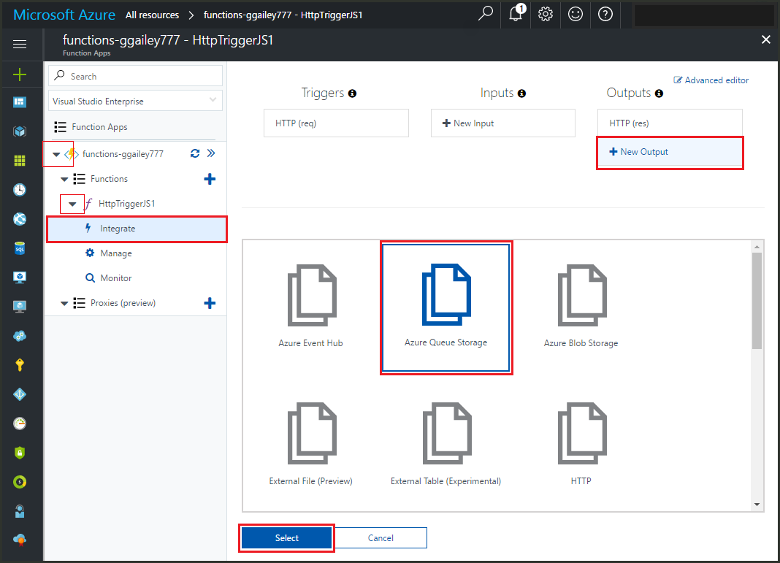
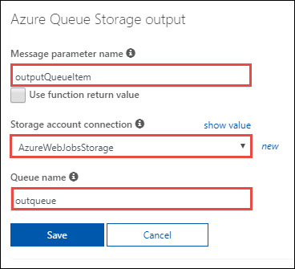

# <a name="add-messages-to-an-azure-storage-queue-using-functions"></a>Adicionar mensagens a uma fila do Armazenamento do Azure usando o Functions

No Azure Functions, as associações de entrada e saída fornecem uma maneira declarativa para criar dados a partir de serviços externos disponíveis ao seu código. Neste guia de início rápido, é possível usar uma associação de saída para criar uma mensagem em uma fila quando uma função é disparada por uma solicitação HTTP. Use o Gerenciador de Armazenamento do Azure para exibir as mensagens em fila que sua função cria:


## <a name="prerequisites"></a>Prerequisites

Para concluir este guia de início rápido:

* Siga as instruções em [Criar sua primeira função no portal do Azure](functions-create-first-azure-function.md) e não realize a etapa **Limpar recursos**. Este início rápido cria o aplicativo de funções e a função que você usa aqui.

* Instale o [Gerenciador de Armazenamento do Microsoft Azure](https://storageexplorer.com/). Esta é uma ferramenta que você usará para examinar a fila de mensagens cuja sua associação de saída cria.

## <a name="add-binding"></a>Adicionar uma associação de saída

Nesta seção, você usa a interface do usuário do portal para adicionar uma associação de saída de armazenamento de filas para a função criada anteriormente. Essa associação tornará possível gravar com o mínimo de código para criar uma mensagem em uma fila. Você não precisa escrever códigos para tarefas como abrir uma conexão de armazenamento, criar uma fila ou obter uma referência a uma fila. O Azure Functions runtime e a associação de saída da fila cuidam dessas tarefas para você.

1. No portal do Azure, abra a página de aplicativo de funções do aplicativo de funções criado por você em [Criar sua primeira função no portal do Azure](functions-create-first-azure-function.md). Para fazer isso, selecione **Todos os serviços > Aplicativo de funções** e depois selecione seu aplicativo de funções.

1. Selecione a função que você criou no guia de início rápido anterior.

1. Selecione **Integrar > Nova Saída > Armazenamento de Filas do Azure**.

1. Clique em **Selecionar**.

    

1. Se você receber uma mensagem de **Extensões não instaladas**, escolha **Instalar** para instalar a extensão Associações de armazenamento no aplicativo de funções. Isso pode levar alguns minutos.

    

1. Em **Saída de armazenamento de filas do Azure**, use as configurações conforme especificado na tabela após esta captura de tela: 

    

    | Configuração      |  Valor sugerido   | Descrição                              |
    | ------------ |  ------- | -------------------------------------------------- |
    | **Nome do parâmetro de mensagem** | outputQueueItem | O nome do parâmetro de associação de saída. | 
    | **Conexão da conta de armazenamento** | AzureWebJobsStorage | Você pode usar a conexão da conta de armazenamento que já está sendo usada por seu aplicativo de funções ou criar uma nova.  |
    | **Nome da fila**   | outqueue    | Nome da fila à qual se conectar em sua conta de armazenamento. |

1. Clique em **Salvar** para adicionar a associação.

Agora que você tem uma associação de saída definida, você precisa atualizar o código para usar a associação para adicionar mensagens a uma fila.  

## <a name="add-code-that-uses-the-output-binding"></a>Adicionar o código que usa a associação de saída

Nesta seção, você adiciona o código que grava uma mensagem na fila de saída. A mensagem inclui o valor que é passado para o gatilho HTTP na cadeia de consulta. Por exemplo, se a cadeia de consulta incluir `name=Azure`, a mensagem da fila será *Nome transmitido para a função: Azure*.

1. Selecione sua função para exibir o código de função no editor.

1. Atualize o código de função, dependendo da linguagem de programação de sua função:

    # <a name="ctabcsharp"></a>[C\#](#tab/csharp)

    Adicione um parâmetro **outputQueueItem** à assinatura do método, conforme mostrado no exemplo a seguir.

    ```cs
    public static async Task<IActionResult> Run(HttpRequest req,
        ICollector<string> outputQueueItem, ILogger log)
    {
        ...
    }
    ```

    No corpo da função, imediatamente antes da instrução `return`, adicione o código que usa o parâmetro para criar uma mensagem da fila.

    ```cs
    outputQueueItem.Add("Name passed to the function: " + name);
    ```

    # <a name="javascripttabnodejs"></a>[JavaScript](#tab/nodejs)

    Adicione código que usa a associação de saída no objeto `context.bindings` para criar uma mensagem da fila. Adicione esse código antes da instrução `context.done`.

    ```javascript
    context.bindings.outputQueueItem = "Name passed to the function: " + 
                (req.query.name || req.body.name);
    ```

    ---

1. Selecione **Salvar** para salvar as alterações.

## <a name="test-the-function"></a>Testar a função

1. Depois que as alterações de código forem salvas, selecione **Executar**. 

    

    Observe que o **Corpo da solicitação** contém o valor de `name`*Azure*. Esse valor aparece na mensagem da fila que é criada quando a função é invocada.
    
    Como uma alternativa para selecionar **Executar** aqui, você pode chamar a função inserindo uma URL em um navegador e especificando o valor `name` na cadeia de consulta. O método de navegador é mostrado no [guia de início rápido anterior](functions-create-first-azure-function.md#test-the-function).

2. Confira os logs para verificar se a função foi bem-sucedida. 

Uma nova fila denominada **outqueue** é criada na sua conta de armazenamento pelo runtime do Functions quando a associação de saída é usada pela primeira vez. Você usará o Gerenciador de Armazenamento para verificar se a fila e uma mensagem nela foram criadas.

### <a name="connect-storage-explorer-to-your-account"></a>Conectar o Gerenciador de Armazenamento à sua conta

Ignore esta seção caso já tenha instalado o Gerenciador de Armazenamento e o conectado à conta de armazenamento sendo usada neste guia de início rápido.

1. Execute a ferramenta [Gerenciador de Armazenamento do Microsoft Azure](https://storageexplorer.com/), selecione o ícone conectar-se à esquerda, escolha **Usar um nome e chave de conta de armazenamento** e selecione **Avançar**.

    

1. No portal do Azure, na página de aplicativo de funções, selecione a função e depois **Integrar**.

1. Selecione a associação de saída do **Armazenamento de fila do Azure** que você adicionou em uma etapa anterior.

1. Expanda a seção **Documentação** na parte inferior da página. 

   O portal mostra as credenciais que você pode usar no Gerenciador de Armazenamento para se conectar à conta de armazenamento.

   

1. Copie o valor **Nome da Conta** do portal e cole-o na caixa **Nome da conta** no Gerenciador de Armazenamento.
 
1. Clique no ícone mostrar/ocultar ao lado da **Chave de Conta** para exibir o valor e depois copie o valor **Chave de Conta** e cole-o na caixa **Chave de conta** no Gerenciador de Armazenamento.
  
1. Selecione **Próximo > Conectar**.

   

### <a name="examine-the-output-queue"></a>Examinar a fila de saída

1. No Gerenciador de Armazenamento, selecione a conta de armazenamento sendo usada para este guia de início rápido.

1. Expanda o nó **Filas** e selecione a fila denominada **outqueue**. 

   A fila contém a mensagem que a associação de saída de fila criou quando você executou a função disparada por HTTP. Se você tiver invocado a função com o valor `name` padrão do *Azure*, a mensagem da fila será *Nome transmitido à função: Azure*.

    

1. Execute a função novamente e você verá uma nova mensagem exibida na fila.  

## <a name="clean-up-resources"></a>Limpar os recursos

[!INCLUDE [Clean up resources](../../includes/functions-quickstart-cleanup.md)]

## <a name="next-steps"></a>Próximas etapas

Neste guia de início rápido, você adicionou uma associação de saída a uma função existente. Para obter mais informações sobre associação a Armazenamento de Filas, consulte [Associações de fila do Armazenamento do Azure Functions](functions-bindings-storage-queue.md).

[!INCLUDE [Next steps note](../../includes/functions-quickstart-next-steps-2.md)]
