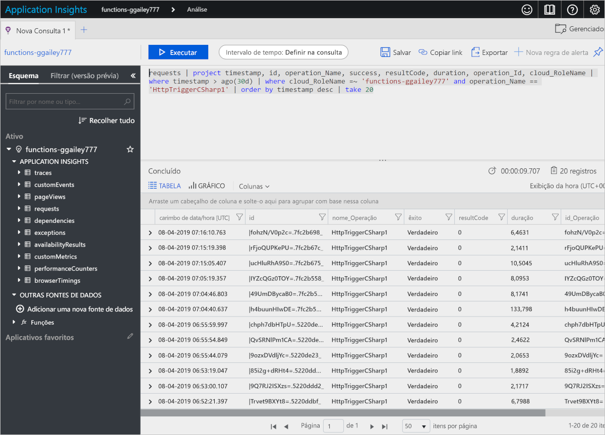
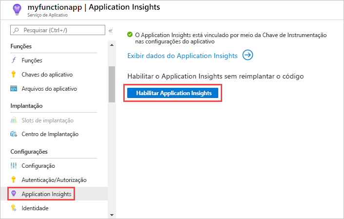
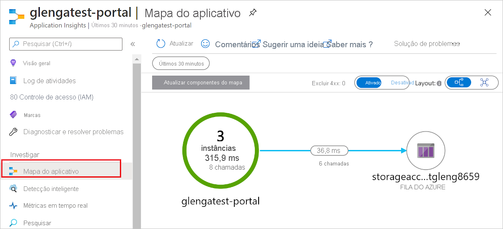
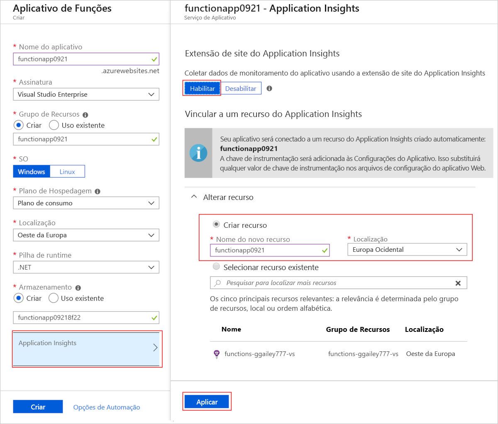
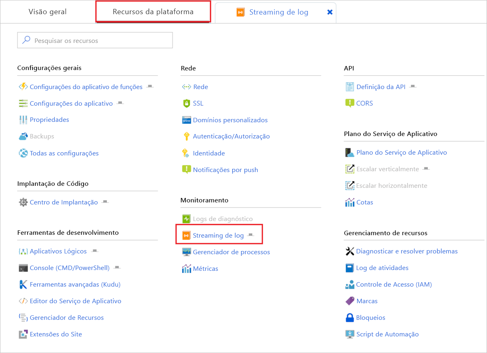
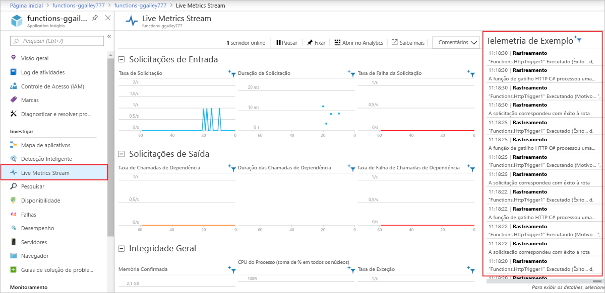

# <a name="monitor-azure-functions"></a>Monitorar Azure Functions

O [Azure Functions](functions-overview.md) oferece integração interna com o [Azure Application Insights](../azure-monitor/app/app-insights-overview.md) para monitorar funções. Este artigo mostra como configurar o Azure Functions para enviar arquivos de log gerados pelo sistema para o Application Insights.

Recomendamos usar o Application Insights porque ele coleta dados de log, desempenho e erros. Ele detecta automaticamente anomalias de desempenho e inclui ferramentas de análise avançadas para ajudar a diagnosticar problemas e entender como suas funções são usadas. Ele foi projetado para ajudar você a aprimorar continuamente o desempenho e a usabilidade do seu aplicativo. Você pode até mesmo usar Application Insights durante o desenvolvimento do projeto de aplicativo de funções local. Para obter mais informações, confira [O que é o Application Insights?](../azure-monitor/app/app-insights-overview.md).

Como a instrumentação do Application Insights necessária é incorporada ao Azure Functions, tudo o que você precisa é de uma chave de instrumentação válida para conectar seu aplicativo de funções a um recurso de Application Insights. A chave de instrumentação deve ser adicionada às configurações do aplicativo quando o recurso do aplicativo de funções é criado no Azure. Se seu aplicativo de funções ainda não tiver essa chave, você poderá [defini-la manualmente](#enable-application-insights-integration).  

## <a name="application-insights-pricing-and-limits"></a>Preços e limites do Application Insights

Você pode testar a integração do Application Insights com o Azure Functions gratuitamente. Há um limite diário para a quantidade de dados que pode ser processada gratuitamente. Você pode atingir esse limite durante o teste. O Azure fornece o portal e notificações por email quando está se aproximando do limite diário. Mas, se você perder esses alertas e atingir o limite, nenhum log novo aparecerá para as consultas do Application Insights. Lembre-se do limite para evitar desperdiçar tempo com solução de problemas. Para obter mais informações, consulte [Gerenciar o preço e o volume de dados no Application Insights](../azure-monitor/app/pricing.md).

> [!IMPORTANT]
> O Application Insights tem um recurso de [amostragem](../azure-monitor/app/sampling.md) que pode protegê-lo contra a produção de excesso de dados de telemetria em execuções concluídas em horários de pico de carregamento. A amostragem é habilitada por padrão. Se parecer que faltam dados, talvez seja necessário ajustar as configurações de amostragem para se adequarem ao seu cenário de monitoramento específico. Para obter mais informações, consulte [Configurar amostragem](#configure-sampling).

A lista completa de recursos de Application Insights disponíveis para seu aplicativo de funções é detalhada em [Recursos suportados do Application Insights para o Azure Functions](../azure-monitor/app/azure-functions-supported-features.md).

## <a name="view-telemetry-in-monitor-tab"></a>Exibir telemetria na guia Monitor

Com [a integração do Application Insights habilitada](#enable-application-insights-integration), você pode exibir dados de telemetria na guia **Monitor**.

1. Na página de aplicativo de funções, selecione uma função que tenha sido executada pelo menos uma vez depois que o Application Insights foi configurado. Em seguida, selecione **Monitor** no painel esquerdo. Selecione **Atualizar** periodicamente até que a lista de invocações de função seja exibida.

   

    > [!NOTE]
    > Pode levar até cinco minutos para que a lista seja exibida enquanto o cliente de telemetria empacota os dados para transmissão para o servidor. Esse atraso não se aplica ao [Live Metrics Stream](../azure-monitor/app/live-stream.md). Esse serviço se conecta ao host do Functions quando você carrega a página, logo os logs são transmitidos diretamente para a página.

1. Para ver os logs de uma invocação de função específica, selecione o link da coluna **Data (UTC)** para a invocação. A saída de logs para essa invocação aparece em uma nova página.

   

1. Escolha **Executar no Application Insights** para exibir a origem da consulta que recupera os dados do log de Azure Monitor no log do Azure. Se esta for a primeira vez que você usa o Azure Log Analytics na sua assinatura, será solicitado que ele seja habilitado.

1. Depois de habilitar o Log Analytics, a consulta a seguir é exibida. Você pode ver que os resultados da consulta são limitados aos últimos 30 dias (`where timestamp > ago(30d)`). Além disso, os resultados mostram, no máximo, 20 linhas (`take 20`). Por outro lado, a lista de detalhes de invocação para sua função é para os últimos 30 dias sem limite.

   

Para obter mais informações, consulte [Dados de telemetria da consulta](#query-telemetry-data) a seguir neste artigo.

## <a name="view-telemetry-in-application-insights"></a>Exibir a telemetria no Application Insights

Para abrir Application Insights de um aplicativo de funções no portal do Azure, selecione **Application Insights** em **Configurações** na página esquerda. Se esta for a primeira vez que você usa o Application Insights com sua assinatura, você será solicitado a habilitá-lo: selecione **Ativar o Application Insights** e, em seguida, selecione **Aplicar** na próxima página.



Para obter informações sobre como usar o Application Insights, consulte a [documentação do o Application Insights](/azure/application-insights/). Esta seção mostra alguns exemplos de como exibir dados no Application Insights. Se você já conhece bem o Application Insights, poderá ir diretamente para [as seções sobre como configurar e personalizar os dados de telemetria](#configure-categories-and-log-levels).


As seguintes áreas do Application Insights podem ser úteis ao avaliar o comportamento, o desempenho e os erros em suas funções:

| Investigar | Descrição |
| ---- | ----------- |
| **[Falhas](../azure-monitor/app/asp-net-exceptions.md)** |  Crie gráficos e alertas com base em falhas de função e de exceções do servidor. O **Nome da Operação** é o nome da função. Falhas nas dependências não são mostradas, a menos que você implemente telemetria personalizada para dependências. |
| **[Desempenho](../azure-monitor/app/performance-counters.md)** | Para analisar problemas de desempenho, veja a utilização de recursos e a taxa de transferência por **instâncias de função de nuvem**. Esses dados podem ser úteis para cenários de depuração em que as funções estão travando seus recursos subjacentes. |
| **[Métrica](../azure-monitor/platform/metrics-charts.md)** | Crie gráficos e alertas baseados em métricas. As métricas incluem o número de invocações de função, tempo de execução e taxas de sucesso. |
| **[Live Metrics    ](../azure-monitor/app/live-stream.md)** | Exiba os dados de métricas conforme eles são criados quase em tempo real. |

## <a name="query-telemetry-data"></a>Dados de telemetria da consulta

A [Análise do Application Insights](../azure-monitor/log-query/log-query-overview.md) oferece acesso a todos os dados de telemetria em forma de tabelas em um banco de dados. A Análise fornece uma linguagem de consulta para extrair, manipular e visualizar os dados. 

Escolha **Logs** para explorar ou consultar eventos registrados.


Veja um exemplo de consulta que mostra a distribuição de solicitações por trabalhador nos últimos 30 minutos.

<pre>
requests
| where timestamp > ago(30m) 
| summarize count() by cloud_RoleInstance, bin(timestamp, 1m)
| render timechart
</pre>

As tabelas disponíveis são mostradas na guia **Esquema** à esquerda. Você pode encontrar os dados gerados por invocações de função nas tabelas a seguir:

| Tabela | Descrição |
| ----- | ----------- |
| **traces** | Logs criados pelo runtime e por código de função. |
| **requests** | Uma solicitação para cada invocação de função. |
| **exceptions** | Todas as exceções geradas pelo runtime. |
| **customMetrics** | Contagem de invocações bem-sucedidas e com falha, taxa de sucesso e duração. |
| **customEvents** | Eventos rastreados pelo runtime, por exemplo: Solicitações HTTP que disparam uma função. |
| **performanceCounters** | Informações sobre o desempenho dos servidores em que as funções estão sendo executadas. |

As outras tabelas são para testes de disponibilidade e telemetria do cliente e navegador. Você pode implementar a telemetria personalizada para adicionar dados a ela.

Dentro de cada tabela, alguns dos dados específicos do Functions estão em um campo `customDimensions`.  Por exemplo, a consulta a seguir recupera todos os rastreamentos que têm o nível de log `Error`.

<pre>
traces 
| where customDimensions.LogLevel == "Error"
</pre>

O runtime fornece os campos `customDimensions.LogLevel` e `customDimensions.Category`. Você pode fornecer campos adicionais nos logs que você grava em seu código de função. Consulte [Registro em log estruturado](#structured-logging) mais adiante neste artigo.

## <a name="configure-categories-and-log-levels"></a>Configurar categorias e níveis de log

Você pode usar Application Insights sem nenhuma configuração personalizada. A configuração padrão pode resultar em grandes volumes de dados. Se você estiver usando uma assinatura do Azure do Visual Studio, poderá ter atingido o limite de dados para o Application Insights. Este artigo mostra como configurar e personalizar os dados que suas funções enviam ao Application Insights. Para um aplicativo de funções, o registro em log é configurado no arquivo [host. JSON].

### <a name="categories"></a>Categorias

O agente do Azure Functions inclui uma *categoria* para cada log. A categoria indica qual parte do código de runtime ou do seu código de função gravou o log. O gráfico a seguir descreve as principais categorias de logs que o runtime cria. 

| Categoria | Descrição |
| ----- | ----- | 
| Host.Results | Esses logs aparecem como **solicitações** no Application Insights. Elas indicam o sucesso ou a falha de uma função. Todos esses logs são gravados no nível de `Information`. Se você filtrar `Warning` ou acima, não verá nenhum desses dados. |
| Host.Aggregator | Esses logs fornecem contagens e médias de chamadas de função sobre um período [configurável](#configure-the-aggregator). O período padrão é de 30 segundos ou 1.000 resultados, o que ocorrer primeiro. Os logs estão disponíveis na tabela **customMetrics** no Application Insights. Exemplos são número de execuções, taxa de sucesso e duração. Todos esses logs são gravados no nível de `Information`. Se você filtrar `Warning` ou acima, não verá nenhum desses dados. |

Todos os logs para outras categorias estão disponíveis na tabela **traces** no Application Insights.

Todos os logs com categorias que começam com `Host` são gravados pelo runtime do Functions. Os logs **Função iniciada**e **Função concluída** têm categoria `Host.Executor`. Para execuções bem-sucedidas, esses logs são `Information` nível. As exceções são registradas no nível `Error`. O runtime também cria logs de nível `Warning`, por exemplo: mensagens de fila enviadas para a fila de suspeita.

O runtime do Functions cria logs com uma categoria que começa com "Host". Na versão 1.x, os logs `function started`, `function executed`e `function completed` têm a categoria `Host.Executor`. A partir da versão 2.x, esses logs têm a categoria `Function.<YOUR_FUNCTION_NAME>`.

Se você gravar logs no seu código de função, a categoria será `Function.<YOUR_FUNCTION_NAME>.User` e poderá ser qualquer nível de log. Na versão 1.x do runtime do Functions, a categoria é `Function`.

### <a name="log-levels"></a>Níveis de log

O agente de Azure Functions também inclui um *nível de log* com cada log. [LogLevel](/dotnet/api/microsoft.extensions.logging.loglevel) é uma enumeração e o código inteiro indica a importância relativa:

|LogLevel    |Código|
|------------|---|
|Trace       | 0 |
|Depurar       | 1 |
|Informações | 2 |
|Aviso     | 3 |
|Erro       | 4 |
|Crítico    | 5 |
|Nenhum        | 6 |

Nível de log `None` é explicado na próxima seção. 

### <a name="log-configuration-in-hostjson"></a>Configuração de log em host.json

O arquivo [host. JSON] configura quanto registro em log um aplicativo de função envia ao Application Insights. Para cada categoria, você deve indicar o nível de log mínimo para enviar. Há dois exemplos: o primeiro exemplo tem como alvo [versão 2.x e posterior](functions-versions.md#version-2x) do runtime do Functions (com o .NET Core) e o segundo exemplo é para o runtime da versão 1.x.

### <a name="version-2x-and-higher"></a>Versão 2.x e posterior

A versão v2.x e versões posteriores do runtime do Functions usam a [hierarquia de filtro de log do .NET Core](/aspnet/core/fundamentals/logging/?view=aspnetcore-2.1#log-filtering). 

```json
{
  "logging": {
    "fileLoggingMode": "always",
    "logLevel": {
      "default": "Information",
      "Host.Results": "Error",
      "Function": "Error",
      "Host.Aggregator": "Trace"
    }
  }
}
```

### <a name="version-1x"></a>Versão 1.x

```json
{
  "logger": {
    "categoryFilter": {
      "defaultLevel": "Information",
      "categoryLevels": {
        "Host.Results": "Error",
        "Function": "Error",
        "Host.Aggregator": "Trace"
      }
    }
  }
}
```

Este exemplo configura as seguintes regras:

* Para logs com categoria `Host.Results` ou `Function`, envie somente nível `Error` e acima para Application Insights. Os logs para o nível `Warning` e abaixo são ignorados.
* Para logs com a categoria `Host.Aggregator`, enviar todos os logs para o Application Insights. O `Trace` nível de log é o mesmo que o que chamo de alguns agentes `Verbose`, mas usar `Trace` no [host. JSON] arquivo.
* Para todos os outros logs, envie somente o nível `Information` e acima ao Application Insights.

O valor de categoria em [host. JSON] controla o registro em log para todas as categorias que começam com o mesmo valor. `Host` em [host. JSON] controla o registro em log para `Host.General`, `Host.Executor`, `Host.Results` e assim por diante.

Se [host. JSON] incluir várias categorias que comecem com a mesma cadeia de caracteres, será feito primeiro a correspondência com as mais longas. Suponha que você queira tudo do runtime, exceto `Host.Aggregator` para registrar no nível `Error`, mas deseja que `Host.Aggregator` registre no nível `Information`:

### <a name="version-2x-and-later"></a>Versão 2.x e posterior

```json
{
  "logging": {
    "fileLoggingMode": "always",
    "logLevel": {
      "default": "Information",
      "Host": "Error",
      "Function": "Error",
      "Host.Aggregator": "Information"
    }
  }
}
```

### <a name="version-1x"></a>Versão 1.x 

```json
{
  "logger": {
    "categoryFilter": {
      "defaultLevel": "Information",
      "categoryLevels": {
        "Host": "Error",
        "Function": "Error",
        "Host.Aggregator": "Information"
      }
    }
  }
}
```

Para suprimir todos os logs para uma categoria, você pode usar o nível de log `None`. Nenhum log é gravado com essa categoria e não há nenhum nível de log acima dela.

## <a name="configure-the-aggregator"></a>Configurar o agregador

Conforme observado na seção anterior, o runtime agrega dados sobre as execuções de função em um período. O período padrão é de 30 segundos ou 1.000 execuções, o que ocorrer primeiro. Você pode definir essa configuração no arquivo [host. JSON].  Aqui está um exemplo:

```json
{
    "aggregator": {
      "batchSize": 1000,
      "flushTimeout": "00:00:30"
    }
}
```

## <a name="configure-sampling"></a>Configurar a amostragem

O Application Insights tem um recurso de [amostragem](../azure-monitor/app/sampling.md) que pode protegê-lo contra a produção de excesso de dados de telemetria em execuções concluídas em horários de pico de carregamento. Quando a taxa de execuções de entrada excede um limite especificado, o Application Insights começa a ignorar aleatoriamente algumas das execuções de entrada. A configuração padrão para o número máximo de execuções por segundo é 20 (cinco na versão 1.x). Você pode configurar a amostragem em [host. JSON](./functions-host-json.md#applicationinsights).  Aqui está um exemplo:

### <a name="version-2x-and-later"></a>Versão 2.x e posterior

```json
{
  "logging": {
    "applicationInsights": {
      "samplingSettings": {
        "isEnabled": true,
        "maxTelemetryItemsPerSecond" : 20,
        "excludedTypes": "Request"
      }
    }
  }
}
```

Na versão 2. x, você pode excluir determinados tipos de telemetria da amostragem. No exemplo acima, os dados do tipo `Request` são excluídos da amostragem. Isso garante que *todas as* execuções de função (solicitações) sejam registradas enquanto outros tipos de telemetria permanecerão sujeitos à amostragem.

### <a name="version-1x"></a>Versão 1.x 

```json
{
  "applicationInsights": {
    "sampling": {
      "isEnabled": true,
      "maxTelemetryItemsPerSecond" : 5
    }
  }
}
```

## <a name="write-logs-in-c-functions"></a>Gravar logs em funções C#

Você pode gravar logs no seu código de função que apareçam como rastreamentos no Application Insights.

### <a name="ilogger"></a>ILogger

Use um parâmetro [ILogger](/dotnet/api/microsoft.extensions.logging.ilogger) em funções, em vez de um parâmetro `TraceWriter`. Logs criados com o uso de `TraceWriter` vão para o Application Insights, mas o `ILogger` permite que você faça o [registro em log estruturado](https://softwareengineering.stackexchange.com/questions/312197/benefits-of-structured-logging-vs-basic-logging).

Com um objeto `ILogger`, você chama os `Log<level>` [ métodos de extensão no ILogger](/dotnet/api/microsoft.extensions.logging.loggerextensions#methods) para criar logs. O seguinte código grava logs `Information` com categoria "Function.<YOUR_FUNCTION_NAME>.User".

```cs
public static async Task<HttpResponseMessage> Run(HttpRequestMessage req, ILogger logger)
{
    logger.LogInformation("Request for item with key={itemKey}.", id);
```

### <a name="structured-logging"></a>Registro em log estruturado

A ordem dos espaços reservados, não seus nomes, determina quais parâmetros são usados na mensagem de log. Suponha que você tenha o seguinte código:

```csharp
string partitionKey = "partitionKey";
string rowKey = "rowKey";
logger.LogInformation("partitionKey={partitionKey}, rowKey={rowKey}", partitionKey, rowKey);
```

Se você mantiver a mesma cadeia de caracteres de mensagem e inverter a ordem dos parâmetros, o texto da mensagem resultante terá os valores nos locais errados.

Os espaços reservados são tratados dessa forma para que você possa fazer registro em log estruturado. O Application Insights armazena os pares nome-valor do parâmetro e a cadeia de caracteres de mensagem. O resultado é que os argumentos da mensagem tornam-se campos que você pode consultar.

Se sua chamada de método do agente for semelhante ao exemplo anterior, você pode consultar o campo `customDimensions.prop__rowKey`. O prefixo `prop__` é adicionado para garantir que não haja colisões entre campos que o runtime adiciona e campos que o código de função adiciona.

Você também pode consultar a cadeia de caracteres da mensagem original referenciando o campo `customDimensions.prop__{OriginalFormat}`.  

Aqui está uma representação JSON de exemplo de dados `customDimensions`:

```json
{
  "customDimensions": {
    "prop__{OriginalFormat}":"C# Queue trigger function processed: {message}",
    "Category":"Function",
    "LogLevel":"Information",
    "prop__message":"c9519cbf-b1e6-4b9b-bf24-cb7d10b1bb89"
  }
}
```

### <a name="custom-metrics-logging"></a>Registro de métricas personalizadas

Em funções de script C#, você pode usar o método de extensão `LogMetric` em `ILogger` para criar métricas personalizadas no Application Insights. Aqui está um exemplo de chamada de método:

```csharp
logger.LogMetric("TestMetric", 1234);
```

Esse código é uma alternativa à chamada de `TrackMetric` usando a API do Application Insights para .NET.

## <a name="write-logs-in-javascript-functions"></a>Gravar logs em funções de JavaScript

Em funções do Node.js, use `context.log` para gravar logs. Registro em log estruturado não está habilitado.

```
context.log('JavaScript HTTP trigger function processed a request.' + context.invocationId);
```

### <a name="custom-metrics-logging"></a>Registro de métricas personalizadas

Quando estiver executando na [versão 1.x](functions-versions.md#creating-1x-apps) do runtime do Functions, as funções do Node.js poderão usar o método `context.log.metric` para criar métricas personalizadas no Application Insights. No momento, a versão 2.x e posteriores não são compatíveis com esse método. Aqui está um exemplo de chamada de método:

```javascript
context.log.metric("TestMetric", 1234);
```

Esse código é uma alternativa à chamada `trackMetric` usando SDK do Node.js para Application Insights.

## <a name="log-custom-telemetry-in-c-functions"></a>Registrar telemetria personalizada em funções C#

Há uma versão do SDK do Application Insights específica de Functions, que você pode usar para enviar dados de telemetria personalizada das suas funções para Application Insights: [Microsoft.Azure.WebJobs.Logging.ApplicationInsights](https://www.nuget.org/packages/Microsoft.Azure.WebJobs.Logging.ApplicationInsights). Use o comando a seguir, no prompt de comando, para instalar esse pacote:

# <a name="command"></a>[Comando](#tab/cmd)

```cmd
dotnet add package Microsoft.Azure.WebJobs.Logging.ApplicationInsights --version <VERSION>
```

# <a name="powershell"></a>[PowerShell](#tab/powershell)

```powershell
Install-Package Microsoft.Azure.WebJobs.Logging.ApplicationInsights -Version <VERSION>
```

---

Neste comando, substitua `<VERSION>` por uma versão desse pacote que dê suporte à versão instalada do [Microsoft.Azure.WebJobs](https://www.nuget.org/packages/Microsoft.Azure.WebJobs/). 

Os exemplos de C# a seguir usam a [API de telemetria personalizada](../azure-monitor/app/api-custom-events-metrics.md). O exemplo é para uma biblioteca de classes do .NET, mas o código do Application Insights é o mesmo para o script C#.

### <a name="version-2x-and-later"></a>Versão 2.x e posterior

A versão de runtime 2.x e posteriores usam recursos mais recentes no Application Insights para correlacionar automaticamente a telemetria com a operação atual. Não é necessário definir manualmente os campos da operação `Id`, `ParentId`, ou `Name`.

```cs
using System;
using System.Threading.Tasks;
using Microsoft.AspNetCore.Mvc;
using Microsoft.Azure.WebJobs;
using Microsoft.Azure.WebJobs.Extensions.Http;
using Microsoft.AspNetCore.Http;
using Microsoft.Extensions.Logging;

using Microsoft.ApplicationInsights;
using Microsoft.ApplicationInsights.DataContracts;
using Microsoft.ApplicationInsights.Extensibility;
using System.Linq;

namespace functionapp0915
{
    public class HttpTrigger2
    {
        private readonly TelemetryClient telemetryClient;

        /// Using dependency injection will guarantee that you use the same configuration for telemetry collected automatically and manually.
        public HttpTrigger2(TelemetryConfiguration telemetryConfiguration)
        {
            this.telemetryClient = new TelemetryClient(telemetryConfiguration);
        }

        [FunctionName("HttpTrigger2")]
        public Task<IActionResult> Run(
            [HttpTrigger(AuthorizationLevel.Anonymous, "get", Route = null)]
            HttpRequest req, ExecutionContext context, ILogger log)
        {
            log.LogInformation("C# HTTP trigger function processed a request.");
            DateTime start = DateTime.UtcNow;

            // Parse query parameter
            string name = req.Query
                .FirstOrDefault(q => string.Compare(q.Key, "name", true) == 0)
                .Value;

            // Track an Event
            var evt = new EventTelemetry("Function called");
            evt.Context.User.Id = name;
            this.telemetryClient.TrackEvent(evt);

            // Track a Metric
            var metric = new MetricTelemetry("Test Metric", DateTime.Now.Millisecond);
            metric.Context.User.Id = name;
            this.telemetryClient.TrackMetric(metric);

            // Track a Dependency
            var dependency = new DependencyTelemetry
            {
                Name = "GET api/planets/1/",
                Target = "swapi.co",
                Data = "https://swapi.co/api/planets/1/",
                Timestamp = start,
                Duration = DateTime.UtcNow - start,
                Success = true
            };
            dependency.Context.User.Id = name;
            this.telemetryClient.TrackDependency(dependency);

            return Task.FromResult<IActionResult>(new OkResult());
        }
    }
}
```

[GetMetric](../azure-monitor/app/api-custom-events-metrics.md#getmetric) é a API recomendada no momento para criar uma métrica.

### <a name="version-1x"></a>Versão 1.x

```cs
using System;
using System.Net;
using Microsoft.ApplicationInsights;
using Microsoft.ApplicationInsights.DataContracts;
using Microsoft.ApplicationInsights.Extensibility;
using Microsoft.Azure.WebJobs;
using System.Net.Http;
using System.Threading.Tasks;
using Microsoft.Azure.WebJobs.Extensions.Http;
using Microsoft.Extensions.Logging;
using System.Linq;

namespace functionapp0915
{
    public static class HttpTrigger2
    {
        private static string key = TelemetryConfiguration.Active.InstrumentationKey = 
            System.Environment.GetEnvironmentVariable(
                "APPINSIGHTS_INSTRUMENTATIONKEY", EnvironmentVariableTarget.Process);

        private static TelemetryClient telemetryClient = 
            new TelemetryClient() { InstrumentationKey = key };

        [FunctionName("HttpTrigger2")]
        public static async Task<HttpResponseMessage> Run(
            [HttpTrigger(AuthorizationLevel.Anonymous, "get", "post", Route = null)]
            HttpRequestMessage req, ExecutionContext context, ILogger log)
        {
            log.LogInformation("C# HTTP trigger function processed a request.");
            DateTime start = DateTime.UtcNow;

            // Parse query parameter
            string name = req.GetQueryNameValuePairs()
                .FirstOrDefault(q => string.Compare(q.Key, "name", true) == 0)
                .Value;

            // Get request body
            dynamic data = await req.Content.ReadAsAsync<object>();

            // Set name to query string or body data
            name = name ?? data?.name;
         
            // Track an Event
            var evt = new EventTelemetry("Function called");
            UpdateTelemetryContext(evt.Context, context, name);
            telemetryClient.TrackEvent(evt);
            
            // Track a Metric
            var metric = new MetricTelemetry("Test Metric", DateTime.Now.Millisecond);
            UpdateTelemetryContext(metric.Context, context, name);
            telemetryClient.TrackMetric(metric);
            
            // Track a Dependency
            var dependency = new DependencyTelemetry
                {
                    Name = "GET api/planets/1/",
                    Target = "swapi.co",
                    Data = "https://swapi.co/api/planets/1/",
                    Timestamp = start,
                    Duration = DateTime.UtcNow - start,
                    Success = true
                };
            UpdateTelemetryContext(dependency.Context, context, name);
            telemetryClient.TrackDependency(dependency);
        }
        
        // Correlate all telemetry with the current Function invocation
        private static void UpdateTelemetryContext(TelemetryContext context, ExecutionContext functionContext, string userName)
        {
            context.Operation.Id = functionContext.InvocationId.ToString();
            context.Operation.ParentId = functionContext.InvocationId.ToString();
            context.Operation.Name = functionContext.FunctionName;
            context.User.Id = userName;
        }
    }    
}
```

Não chame `TrackRequest` nem `StartOperation<RequestTelemetry>`, pois você verá solicitações duplicadas de uma invocação de função.  O runtime do Functions controla automaticamente as solicitações.

Não definir `telemetryClient.Context.Operation.Id`. Essa configuração global causa correlação incorreta quando muitas funções são executadas simultaneamente. Em vez disso, crie uma nova instância de telemetria (`DependencyTelemetry`, `EventTelemetry`) e modifique a propriedade `Context`. Em seguida, passe na instância de telemetria para o método `Track` correspondente em `TelemetryClient` (`TrackDependency()`, `TrackEvent()`, `TrackMetric()`). Esse método garante que a telemetria tenha os detalhes de correlação corretos para a invocação de função atual.

## <a name="log-custom-telemetry-in-javascript-functions"></a>Fazer log de telemetria personalizada em funções JavaScript

Aqui estão os trechos de código de exemplo que enviam telemetria personalizada com o [Application Insights Node.js SDK](https://github.com/microsoft/applicationinsights-node.js):

### <a name="version-2x-and-later"></a>Versão 2.x e posterior

```javascript
const appInsights = require("applicationinsights");
appInsights.setup();
const client = appInsights.defaultClient;

module.exports = function (context, req) {
    context.log('JavaScript HTTP trigger function processed a request.');

    // Use this with 'tagOverrides' to correlate custom telemetry to the parent function invocation.
    var operationIdOverride = {"ai.operation.id":context.traceContext.traceparent};

    client.trackEvent({name: "my custom event", tagOverrides:operationIdOverride, properties: {customProperty2: "custom property value"}});
    client.trackException({exception: new Error("handled exceptions can be logged with this method"), tagOverrides:operationIdOverride});
    client.trackMetric({name: "custom metric", value: 3, tagOverrides:operationIdOverride});
    client.trackTrace({message: "trace message", tagOverrides:operationIdOverride});
    client.trackDependency({target:"http://dbname", name:"select customers proc", data:"SELECT * FROM Customers", duration:231, resultCode:0, success: true, dependencyTypeName: "ZSQL", tagOverrides:operationIdOverride});
    client.trackRequest({name:"GET /customers", url:"http://myserver/customers", duration:309, resultCode:200, success:true, tagOverrides:operationIdOverride});

    context.done();
};
```

### <a name="version-1x"></a>Versão 1.x

```javascript
const appInsights = require("applicationinsights");
appInsights.setup();
const client = appInsights.defaultClient;

module.exports = function (context, req) {
    context.log('JavaScript HTTP trigger function processed a request.');

    // Use this with 'tagOverrides' to correlate custom telemetry to the parent function invocation.
    var operationIdOverride = {"ai.operation.id":context.operationId};

    client.trackEvent({name: "my custom event", tagOverrides:operationIdOverride, properties: {customProperty2: "custom property value"}});
    client.trackException({exception: new Error("handled exceptions can be logged with this method"), tagOverrides:operationIdOverride});
    client.trackMetric({name: "custom metric", value: 3, tagOverrides:operationIdOverride});
    client.trackTrace({message: "trace message", tagOverrides:operationIdOverride});
    client.trackDependency({target:"http://dbname", name:"select customers proc", data:"SELECT * FROM Customers", duration:231, resultCode:0, success: true, dependencyTypeName: "ZSQL", tagOverrides:operationIdOverride});
    client.trackRequest({name:"GET /customers", url:"http://myserver/customers", duration:309, resultCode:200, success:true, tagOverrides:operationIdOverride});

    context.done();
};
```

O parâmetro `tagOverrides` define `operation_Id` para a ID de invocação de função. Essa configuração permite que você correlacione toda a telemetria gerada automaticamente e a telemetria personalizada para uma dada invocação de função.

## <a name="dependencies"></a>Dependências

As funções v2 coletam automaticamente as dependências para solicitações HTTP, ServiceBus, EventHub e SQL.

Você pode escrever código personalizado para mostrar as dependências. Para obter exemplos, consulte o exemplo de código na [seção de telemetria personalizada C#](#log-custom-telemetry-in-c-functions). O exemplo de código resulta em um *mapa de aplicativo* no Application Insights que tem essa aparência:



> [!NOTE]
> As dependências são gravadas no nível de informação. Se você filtrar em aviso ou acima, não verá nenhum desses dados. Além disso, a coleta automática de dependências ocorre em escopo fora do usuário. Portanto, verifique se o nível está definido para pelo menos **informações** fora do escopo do usuário em seu host.jsem (ou seja, fora da função. <YOUR_FUNCTION_NAME>. Chave de usuário) se você quiser que essas dependências sejam capturadas.

## <a name="enable-application-insights-integration"></a>Habilitar a integração do Application Insights

Para um aplicativo de funções enviar dados ao Application Insights, ele precisa saber a chave de instrumentação de um recurso do Application Insights. A chave deve estar em uma configuração de aplicativo chamada **APPINSIGHTS_INSTRUMENTATIONKEY**.

Ao criar seu aplicativo de funções [no portal do Azure](functions-create-first-azure-function.md), com a linha de comando usando o [Azure Functions Core Tools](functions-create-first-azure-function-azure-cli.md), ou usando o [Visual Studio Code](functions-create-first-function-vs-code.md), a integração do Application Insights é habilitada por padrão. O recurso do Application Insights tem o mesmo nome do seu aplicativo de funções e é criado na mesma região ou na região mais próxima.

### <a name="new-function-app-in-the-portal"></a>Novo aplicativo de funções no portal

Para examinar o recurso do Application Insights que está sendo criado, selecione-o para expandir a janela do **Application Insights**. Você pode alterar o **Novo nome do recurso** ou escolher um **Local** diferente em uma [geografia do Azure](https://azure.microsoft.com/global-infrastructure/geographies/) onde deseja armazenar seus dados.



Quando você escolhe **Criar**, um recurso de Application Insights é criado com seu aplicativo de funções, que tem `APPINSIGHTS_INSTRUMENTATIONKEY` definido nas configurações do aplicativo. Tudo está pronto para começar.

<a id="manually-connect-an-app-insights-resource"></a>
### <a name="add-to-an-existing-function-app"></a>Adicionar a um aplicativo de funções existente 

Ao criar um aplicativo de funções usando o [Visual Studio](functions-create-your-first-function-visual-studio.md), você deve criar o recurso de Application Insights. Em seguida, você pode adicionar a chave de instrumentação a partir desse recurso como uma [configuração de aplicativo](functions-how-to-use-azure-function-app-settings.md#settings) no seu aplicativo de funções.

[!INCLUDE [functions-connect-new-app-insights.md](../../includes/functions-connect-new-app-insights.md)]

As primeiras versões de Functions usavam o monitoramento interno, o que não é mais recomendado. Ao habilitar a integração do Application Insights para um aplicativo de funções como esse, você também deve [desabilitar o registro em log interno](#disable-built-in-logging).  

## <a name="report-issues"></a>Relatar problemas

Para relatar um problema com a integração do Application Insights em Functions ou para fazer sugestões ou uma solicitação, [crie um problema no GitHub](https://github.com/Azure/Azure-Functions/issues/new).

## <a name="streaming-logs"></a>Logs de streaming

Ao desenvolver um aplicativo, muitas vezes você deseja ver o que está sendo gravado nos logs quase em tempo real durante a execução no Azure.

Há duas maneiras de exibir um fluxo de arquivos de log que está sendo gerado por suas execuções de funções.

* **Streaming de log interno**: a plataforma do Serviço de Aplicativo permite exibir um fluxo dos arquivos de log do aplicativo. Isso é equivalente à saída que aparece ao depurar suas funções durante o [desenvolvimento local](functions-develop-local.md) e ao usar a guia **Teste** no portal. Todas as informações baseadas em log são exibidas. Para obter mais informações, consulte [Streaming de logs](../app-service/troubleshoot-diagnostic-logs.md#stream-logs). Esse método de streaming é compatível com apenas uma única instância e não pode ser usado com um aplicativo executado no Linux em um plano de Consumo.

* **Live Metrics Stream**: quando seu aplicativo de funções está [conectado ao Application Insights](#enable-application-insights-integration), você pode exibir dados de log e outras métricas quase em tempo real no portal do Azure usando [Live Metrics Stream](../azure-monitor/app/live-stream.md). Use esse método ao monitorar funções em execução em várias instâncias ou no Linux em um plano de Consumo. Esse método usa [dados amostrados](#configure-sampling).

Os fluxos de log podem ser exibidos no portal e na maioria dos ambientes de desenvolvimento local. 

### <a name="portal"></a>Portal

Você pode exibir os dois tipos de fluxos de log no portal.

#### <a name="built-in-log-streaming"></a>Streaming de log interno

Para exibir os logs de streaming no portal, selecione a guia **Recursos da plataforma** no seu aplicativo de funções. Em seguida, em **Monitoramento**, escolha **Streaming de log**.



Isso conecta seu aplicativo ao serviço de streaming de log e os logs de aplicativo são exibidos na janela. Você pode alternar entre **Logs de aplicativo** e **Logs do servidor Web**.  


#### <a name="live-metrics-stream"></a>Live Metrics Stream

Para exibir o Live Metrics Stream para seu aplicativo, selecione a guia **Visão geral** do seu aplicativo de funções. Quando tiver Application Insights habilitado, você verá um link **Application Insights** em **Recursos configurados**. Esse link leva até a página de Application Insights para seu aplicativo.

No Application Insights, selecione **Live Metrics Stream**. [As entradas de log amostradas](#configure-sampling) são exibidas em **Telemetria da amostra**.

 

### <a name="visual-studio-code"></a>Visual Studio Code

[!INCLUDE [functions-enable-log-stream-vs-code](../../includes/functions-enable-log-stream-vs-code.md)]

### <a name="core-tools"></a>Ferramentas do Core

[!INCLUDE [functions-streaming-logs-core-tools](../../includes/functions-streaming-logs-core-tools.md)]

### <a name="azure-cli"></a>CLI do Azure

Você pode habilitar streaming de logs usando a [CLI do Azure](/cli/azure/install-azure-cli). Use os comandos a seguir para entrar, escolha sua assinatura e transmita os arquivos de log:

```azurecli
az login
az account list
az account set --subscription <subscriptionNameOrId>
az webapp log tail --resource-group <RESOURCE_GROUP_NAME> --name <FUNCTION_APP_NAME>
```

### <a name="azure-powershell"></a>Azure PowerShell

Você pode habilitar streaming de logs usando [Azure PowerShell](/powershell/azure/). Para o PowerShell, use o comando [set-AzWebApp](/powershell/module/az.websites/set-azwebapp) para habilitar o registro em log no aplicativo de funções, conforme mostrado no trecho a seguir: 

:::code language="powershell" source="~/powershell_scripts/app-service/monitor-with-logs/monitor-with-logs.ps1" range="19-20":::

Para obter mais informações, consulte o [exemplo de código completo](../app-service/scripts/powershell-monitor.md#sample-script). 

## <a name="scale-controller-logs-preview"></a>Dimensionar logs do controlador (visualização)

Esse recurso está em visualização. 

O [controlador de escala de Azure Functions](./functions-scale.md#runtime-scaling) monitora instâncias do host Azure Functions no qual seu aplicativo é executado. Esse controlador toma decisões sobre quando adicionar ou remover instâncias com base no desempenho atual. Você pode fazer com que o controlador de escala emita logs para Application Insights ou para o armazenamento de BLOBs para entender melhor as decisões que o controlador de escala está fazendo para seu aplicativo de funções.

Para habilitar esse recurso, adicione uma nova configuração de aplicativo chamada `SCALE_CONTROLLER_LOGGING_ENABLED` . O valor dessa configuração deve ser do formato `<DESTINATION>:<VERBOSITY>` , com base no seguinte:

[!INCLUDE [functions-scale-controller-logging](../../includes/functions-scale-controller-logging.md)]

Por exemplo, o comando a seguir CLI do Azure ativa o log detalhado do controlador de escala para Application Insights:

```azurecli-interactive
az functionapp config appsettings set --name <FUNCTION_APP_NAME> \
--resource-group <RESOURCE_GROUP_NAME> \
--settings SCALE_CONTROLLER_LOGGING_ENABLED=AppInsights:Verbose
```

Neste exemplo, substitua `<FUNCTION_APP_NAME>` e `<RESOURCE_GROUP_NAME>` pelo nome do seu aplicativo de funções e o nome do grupo de recursos, respectivamente. 

O comando a seguir CLI do Azure desabilita o registro em log definindo o detalhamento como `None` :

```azurecli-interactive
az functionapp config appsettings set --name <FUNCTION_APP_NAME> \
--resource-group <RESOURCE_GROUP_NAME> \
--settings SCALE_CONTROLLER_LOGGING_ENABLED=AppInsights:None
```

Você também pode desabilitar o registro em log removendo a `SCALE_CONTROLLER_LOGGING_ENABLED` configuração usando o seguinte comando de CLI do Azure:

```azurecli-interactive
az functionapp config appsettings delete --name <FUNCTION_APP_NAME> \
--resource-group <RESOURCE_GROUP_NAME> \
--setting-names SCALE_CONTROLLER_LOGGING_ENABLED
```

## <a name="disable-built-in-logging"></a>Desabilitar o registro em log interno

Ao ativar o Application Insights, desative o registro interno que usa o Armazenamento do Microsoft Azure. O registro em log interno é útil para testes com cargas de trabalho leves, mas não se destina ao uso em produção com carga alta. Para monitoramento de produção, o Application Insights é recomendado. Se o registro em log interno foi usado na produção, o registro de logs pode estar incompleto devido à limitação da largura de banda de rede no Armazenamento do Microsoft Azure.

Para desabilitar o registro em log interno, exclua a configuração de aplicativo `AzureWebJobsDashboard`. Para obter informações sobre como excluir configurações do aplicativo no portal do Azure, consulte a seção **Configurações do aplicativo** em [Como gerenciar um aplicativo de funções](functions-how-to-use-azure-function-app-settings.md#settings). Antes de excluir a configuração do aplicativo, veja se não existe nenhuma função no mesmo aplicativo de funções que use essa configuração para associações ou gatilhos do Armazenamento do Microsoft Azure.

## <a name="next-steps"></a>Próximas etapas

Para saber mais, consulte os recursos a seguir:

* [Application Insights](/azure/application-insights/)
* [Registro em log de ASP.NET Core](/aspnet/core/fundamentals/logging/)

[host. JSON]: functions-host-json.md
