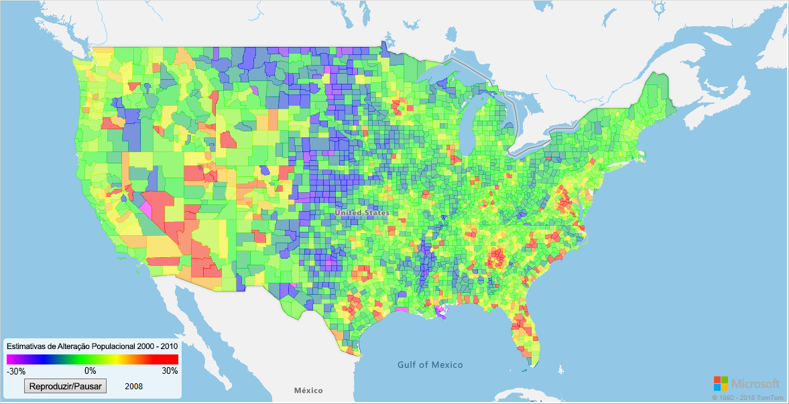
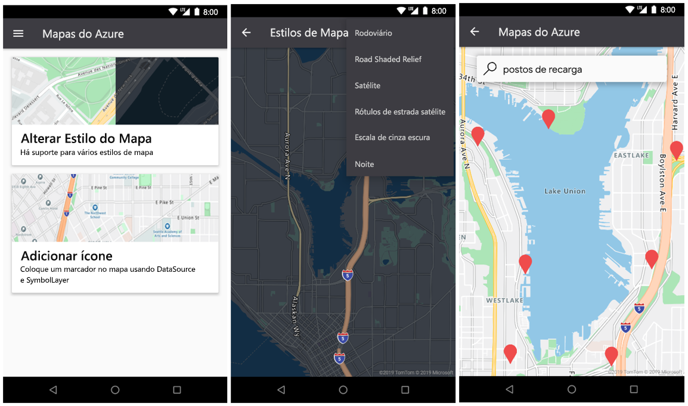
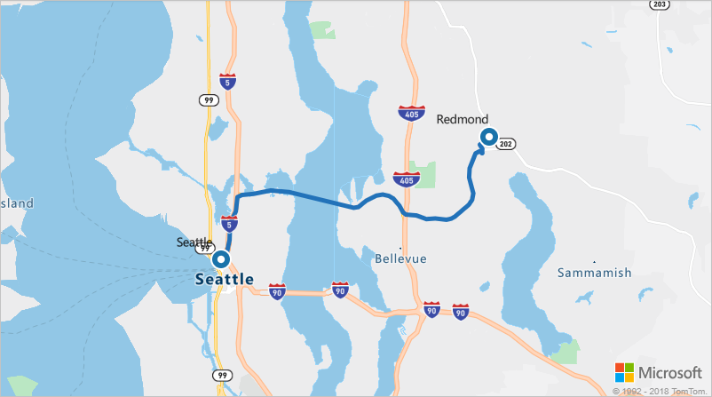

# <a name="what-is-azure-maps"></a>O que é o Azure Mapas?

O Azure Mapas é uma coleção de serviços geoespaciais que usa novos dados de mapeamento para fornecer um contexto geográfico para aplicativos Web e móveis. O Azure Mapas oferece:

* APIs REST para renderizar mapas em vários estilos e em imagens de satélite.
* Serviços de pesquisa para localizar endereços, locais e pontos de interesse em todo o mundo.
* Opções de rroteiros variadas, como ponto a ponto, multiponto, otimização multiponto, isócrono, veículo comercial, tráfego influenciado e roteiros de matriz.
* Modo de exibição de fluxo de tráfego e de incidentes, para aplicativos que exigem informações de tráfego.
* Serviço de mobilidade para solicitar logística de tráfego público, planejar rotas em tempo real e solicitar informações sobre modos alternativos de transporte.
* Fuso horário e serviços de geolocalização e conversão de uma localização em fusos horários.
* Serviços de delimitação geográfica e armazenamento de dados de mapeamento, com informações de localização hospedadas no Azure. 
* Inteligência de local por meio de análise geoespacial. 

Além disso, os serviços do Azure Mapas também são disponibilizados pelo SDK da Web ou pelo SDK do Android. Essas ferramentas ajudam os desenvolvedores a desenvolver e dimensionar rapidamente soluções que integram as informações de localização às soluções do Azure. 

Inscreva-se hoje mesmo para obter uma [conta do Azure Mapas](https://azure.microsoft.com/services/azure-maps/) gratuita e comece a desenvolver.

O vídeo a seguir explica os Mapas do Azure com detalhes:

<br/>

<iframe src="https://channel9.msdn.com/Shows/Internet-of-Things-Show/Azure-Maps/player?format=ny" width="960" height="540" allowFullScreen frameBorder="0"></iframe>

## <a name="map-controls"></a>Controles de mapeamento

### <a name="web-sdk"></a>SDK da Web

O SDK da Web dos Azure Mapas permite que você personalize mapas interativos com as imagens e o conteúdo próprios. Use esse mapa interativo para seus aplicativos Web ou móveis. Esse controle de mapa utiliza o WebGL, o que permite renderizar grandes conjuntos de dados com alto desempenho. Desenvolva com o SDK usando JavaScript ou TypeScript.



### <a name="android-sdk"></a>SDK do Android

Use o SDK do Android do Azure Mapas para criar aplicativos de mapeamento móvel. 



## <a name="services-in-azure-maps"></a>Serviços dos Mapas do Azure

O Azure Mapas consistem nos seis serviços a seguir que podem fornecer contexto geográfico aos seus aplicativos do Azure.

### <a name="data-service"></a>Serviço de Dados

Os dados são fundamentais para os mapas. Use o Serviço de Dados para carregar e armazenar dados geoespaciais para uso com operações espaciais ou composição de imagens.  Levar os dados do cliente para mais perto do serviço do Azure Mapas reduzirá a latência, aumentará a produtividade e criará novos cenários nos seus aplicativos. Para obter detalhes sobre esse serviço, confira a [documentação de APIs do Serviço de Dados](https://docs.microsoft.com/rest/api/maps/data).

### <a name="mobility-service"></a>Serviço de mobilidade

O serviço de Mobilidade do Azure Maps permite o planejamento de viagens em tempo real. Ele retorna as melhores opções de rota possíveis e fornece diferentes tipos de modos de viagem. Para áreas de metrô (cidade), esses modos podem incluir caminhar, andar de bicicleta e de transporte público. Você pode solicitar o itinerário de trânsito a geometria da linha, as listas de paradas, os horários de chegada programados e em tempo real e os alertas de serviços.

O serviço também permite pesquisas de tipos de objetos específicos em um localização. Os usuários podem pesquisar bicicletas compartilhadas, scooters ou carros em um localização. Os usuários podem solicitar o número de bicicletas disponíveis no bicicletário mais próximo e pesquisar veículos disponíveis para compartilhamento de carona. Além disso, os usuários podem encontrar detalhes como a disponibilidade futura de veículos e o nível atual de combustível.

Para saber mais sobre o serviço, confira a [documentação da API de Mobilidade](https://docs.microsoft.com/rest/api/maps/mobility).

### <a name="render-service"></a>Serviço de Renderização

O serviço de renderização ajuda os desenvolvedores a criar aplicativos Web e móveis com recursos de mapeamento. O serviço usa imagens gráficas de varredura de alta qualidade, disponíveis em 19 de níveis de zoom ou imagens de mapa do formato de vetor totalmente personalizável.


O Serviço de renderização agora oferece APIs para permitir que os desenvolvedores trabalhem com imagens de satélite. Para obter mais detalhes, leia a [documentação da API de renderização](https://docs.microsoft.com/rest/api/maps/render).

### <a name="route-service"></a>Serviço de Roteamento

O Serviço de roteiros contém cálculos robustos de geometria de infraestrutura do mundo real e instruções para vários modos de transporte. Ele permite que os desenvolvedores calculem as instruções entre vários modos de viagem como carro, caminhão, bicicleta ou caminhada. O serviço também considera entradas como condições de tráfego, restrições de peso ou transporte de material perigoso.



O Serviço de Roteiros oferece uma versão prévia de recursos avançados, como: 

* Processamento em lote de várias solicitações de roteiro.
* Matrizes de tempo e distância de viagem entre um conjunto de origens e destinos.
* Localização de rotas ou distâncias que os usuários podem viajar com base em requisitos de tempo ou de combustível. 

Para obter detalhes sobre os recursos de roteiro, leia a [Documentação da API de Roteiro](https://docs.microsoft.com/rest/api/maps/route).

### <a name="search-service"></a>Serviço Search

O Serviço de pesquisa ajuda os desenvolvedores a procurar por endereços, locais, listagens de negócios por nome ou categoria e outras informações geográficas. O Serviço de pesquisa pode [inverter os endereços código geográfico](https://en.wikipedia.org/wiki/Reverse_geocoding) e fazer o cruzamento de ruas baseado em latitudes e longitudes.


O Serviço de pesquisa também fornece recursos avançados, como:

* Pesquisar ao longo da rota.
* Pesquisar dentro de uma área mais ampla.
* Criar lote de um grupo de solicitações de pesquisa.
* Pesquisar uma área mais ampla dentre de um ponto de localização. 

As APIs de lote e a pesquisa de área estão atualmente em versão prévia. Para obter detalhes sobre os recursos de pesquisa, leia a [documentação da API de pesquisa](https://docs.microsoft.com/rest/api/maps/search).

### <a name="spatial-operations-service"></a>Serviço de Operações Espaciais

O serviço de Operações Espaciais do Azure Mapas recebe informações de localização. Ele analisa rapidamente essas informações para ajudar a informar os clientes sobre eventos em andamento que ocorrem. Ele permite a análise praticamente em tempo real e a modelagem preditiva de eventos. 

O serviço permite que os clientes aprimorem nativamente a inteligência de localização deles com uma biblioteca de cálculos matemáticos geoespaciais comuns. Os cálculos comuns incluem o ponto mais próximo, a distância do círculo máximo e buffers. Para saber mais sobre o serviço e os vários recursos, leia a [documentação da API de Operações Espaciais](https://docs.microsoft.com/rest/api/maps/spatial).

### <a name="time-zone-service"></a>Serviço de fuso horário

O serviço Fuso Horário permite consultar informações de fuso horário atuais, históricas e futuras. Você pode usar os pares de latitude e longitude ou uma [ID do IANA](https://www.iana.org/). O serviço de Fuso Horário também permite:

* Converter IDs de fuso horário do Microsoft Windows em fusos horários IANA.
* Buscar a diferença do fuso horário em relação ao UTC.
* Obter a hora atual em um fuso horário selecionado. 

Uma resposta JSON normal para uma consulta para o serviço de Fuso Horário é semelhante ao exemplo a seguir:

```JSON
{
    "Version": "2017c",
    "ReferenceUtcTimestamp": "2017-11-20T23:09:48.686173Z",
    "TimeZones": [{
        "Id": "America/Los_Angeles",
        "ReferenceTime": {
            "Tag": "PST",
            "StandardOffset": "-08:00:00",
            "DaylightSavings": "00:00:00",
            "WallTime": "2017-11-20T15:09:48.686173-08:00",
            "PosixTzValidYear": 2017,
            "PosixTz": "PST+8PDT,M3.2.0,M11.1.0"
        }
    }]
}
```

Para obter detalhes sobre esse serviço, leia a [documentação da API de fuso horário](https://docs.microsoft.com/rest/api/maps/timezone).

### <a name="traffic-service"></a>Serviço de Tráfego

O serviço Tráfego é um conjunto de serviços Web que os desenvolvedores podem usar para aplicativos Web e móveis que requerem informações de tráfego. O serviço fornece dois tipos de dados:

* Fluxo de tráfego: velocidades observadas em tempo real e tempos de deslocamento para todas as estradas principais na rede.
* Incidentes de tráfego: uma visão atualizada sobre congestionamento e incidentes na rede rodoviária.


Para obter mais informações, confira a [Documentação da API de tráfego](https://docs.microsoft.com/rest/api/maps/traffic).

### <a name="ip-to-location-service"></a>Serviço de IP para Local

Use o serviço IP para Local para visualizar o código de duas letras de país/região recuperado para um endereço IP. Esse serviço pode ajudar você a aprimorar a experiência do usuário fornecendo o conteúdo do aplicativo personalizado com base na localização geográfica.

Para obter mais detalhes sobre o IP para o serviço Localização na API REST, leia a [documentação da API de Geolocalização do Azure Mapas](https://docs.microsoft.com/rest/api/maps/geolocation).

## <a name="programming-model"></a>Modelo de programação

O Azure Mapas foi criado para a mobilidade e podem ajudar a desenvolver aplicativos de plataforma cruzada. Ele usa um modelo de programação de linguagem independente e dão suporte à saída JSON por meio de [APIs REST](https://docs.microsoft.com/rest/api/maps/).

Além disso, o Azure Mapas oferece um [controle de mapeamento JavaScript](https://docs.microsoft.com/javascript/api/azure-maps-control) conveniente com um modelo de programação simples. O desenvolvimento é rápido e fácil para aplicativos Web e móveis.

## <a name="usage"></a>Uso

Para acessar os serviços do Azure Mapas, basta acessar o [portal do Azure](https://portal.azure.com) e criar uma conta do Azure Mapas.

Os Mapas do Azure usam um esquema de autenticação baseado em chave. Sua conta vem com duas chaves previamente geradas para você. Use as duas. Comece a integrar esses recursos de localização em seu aplicativo e faça solicitações para o serviço do Azure Mapas.

Observação: o Azure Mapas compartilha consultas de endereço/local fornecidas pelo cliente ("Consultas") com o TomTom de terceiros para fins de funcionalidade de mapeamento. As consultas não estão vinculadas a nenhum cliente ou usuário final quando compartilhadas com o TomTom e não podem ser usadas para identificar indivíduos. No momento, a Microsoft está no processo de adição do TomTom à lista de Subcontratados do Online Services. Observe que os Serviços de Mobilidade e de Clima que incluem a integração com o Moovit e o AccuWeather estão atualmente em [VERSÃO PRÉVIA](https://azure.microsoft.com/support/legal/preview-supplemental-terms/).

## <a name="supported-regions"></a>Regiões com suporte

As APIs do Azure Mapas estão disponíveis no momento em todos os países e regiões, exceto os seguintes:

* China
* Coreia do Sul

Verifique se a localização de seu endereço IP atual está em um dos países/regiões com suporte.

## <a name="next-steps"></a>Próximas etapas

Experimente um aplicativo de exemplo que demonstre o Azure Mapas:

> [!div class="nextstepaction"]
> [Início Rápido: Criar um aplicativo Web](quick-demo-map-app.md)

Mantenha-se atualizado sobre o Azure Mapas: 

> [!div class="nextstepaction"]
> [Blog do Azure Mapas](https://azure.microsoft.com/blog/topics/azure-maps/)
