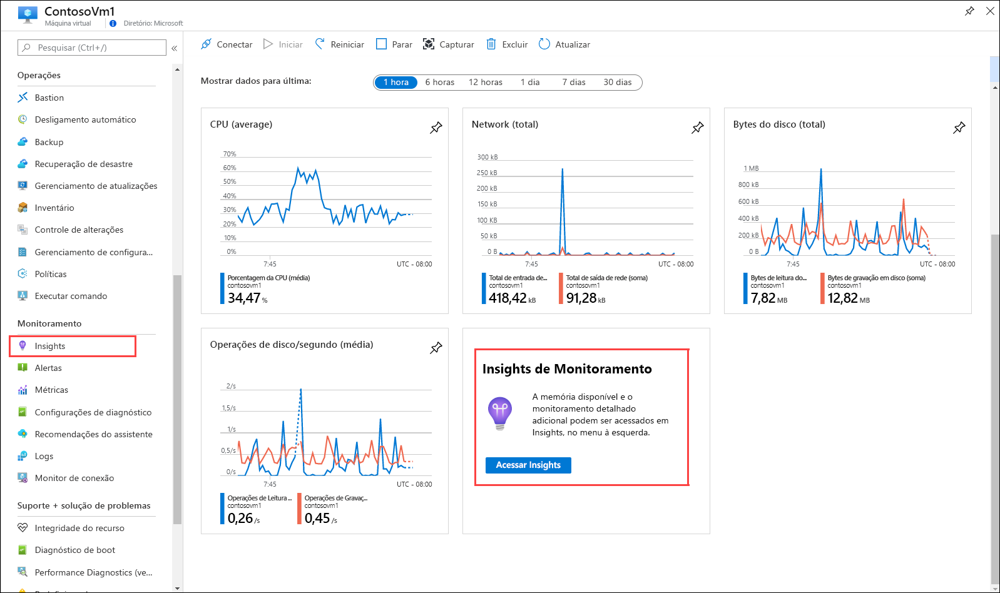
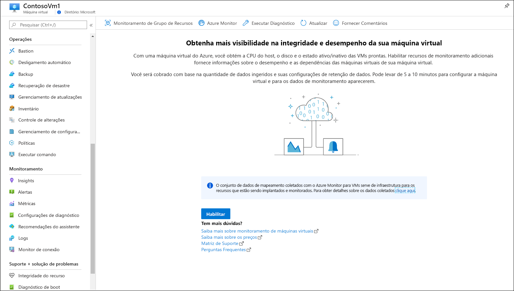
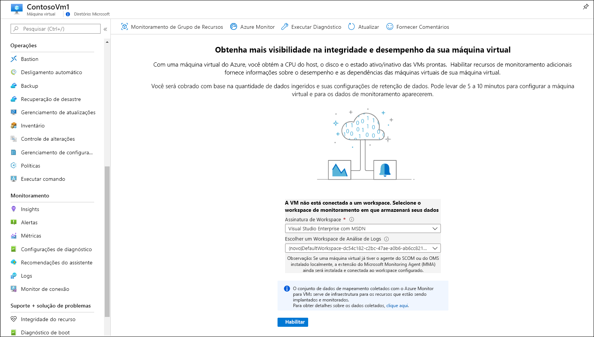
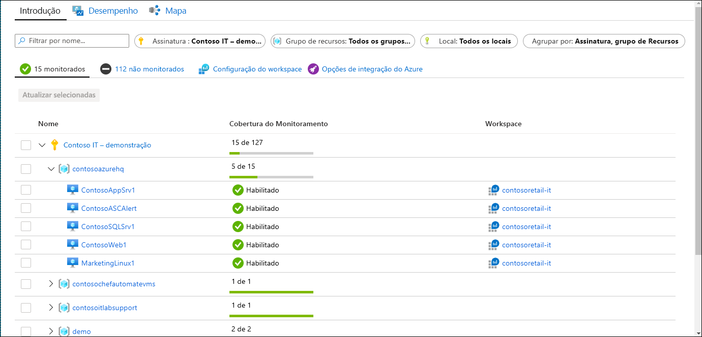
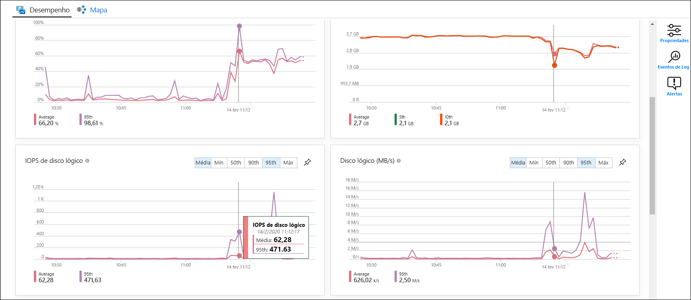
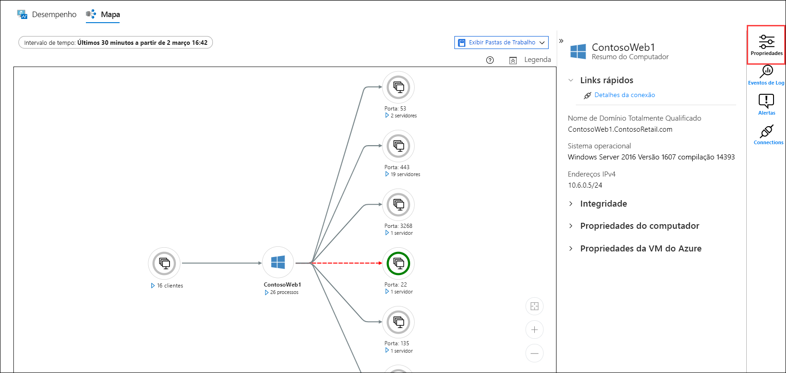
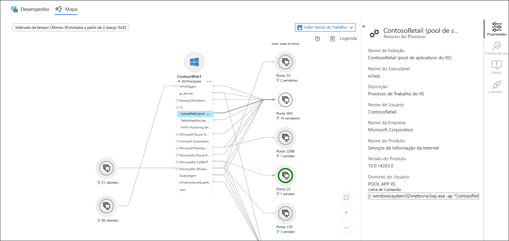
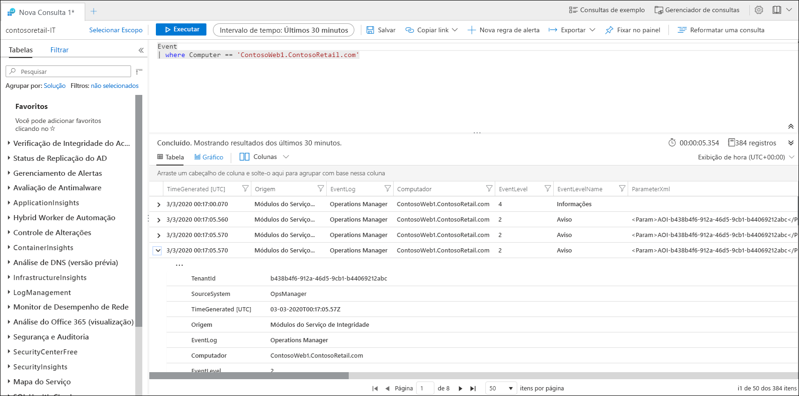

# Início Rápido: Monitorar uma máquina virtual do Azure com o Azure Monitor
O [Azure Monitor](../overview.md) inicia a coleta de dados das máquinas virtuais do Azure no momento em que elas são criadas. Neste guia de início rápido você obterá uma breve explicação dos dados que são coletados automaticamente para uma VM do Azure e como exibi-los no portal do Azure. Em seguida, você habilitará o [Azure Monitor para VMs](../insights/vminsights-overview.md) para sua VM, o que permitirá que os agentes na VM coletem e analisem dados do sistema operacional convidado, incluindo processos e suas dependências.

Este guia de início rápido pressupõe que você tenha uma máquina virtual do Azure existente. Se não tiver, crie uma [VM do Windows](../../virtual-machines/windows/quick-create-portal.md) ou uma [VM do Linux](../../virtual-machines/linux/quick-create-cli.md) seguindo nossos inícios rápidos de VM.

Para obter descrições mais detalhadas dos dados de monitoramento coletados de recursos do Azure, confira [Como monitorar máquinas virtuais do Azure com o Azure Monitor](../insights/monitor-vm-azure.md).

## Conclua o início rápido Monitorar um recurso do Azure.
Conclua o [Monitorar um recurso do Azure com o Azure Monitor](quick-monitor-azure-resource.md) para exibir a página de visão geral, o log de atividades e as métricas para uma VM em sua assinatura. As VMs do Azure coletam os mesmos dados de monitoramento que qualquer outro recurso do Azure, mas isso serve apenas para a VM do host. O restante deste guia de início rápido se concentrará no monitoramento do sistema operacional convidado e de suas cargas de trabalho.

## Habilitar o Azure Monitor para VMs
Embora os logs de atividades e as métricas sejam coletados para a VM do host, você precisa de um agente e de alguma configuração para coletar e analisar dados de monitoramento do sistema operacional convidado e de suas cargas de trabalho. O Azure Monitor para VMs instala esses agentes e fornece recursos avançados adicionais para monitoramento de suas máquinas virtuais.

1. Acesse o menu da sua máquina virtual.
2. Clique em **Acessar o Insights** no bloco da página **Visão geral** ou clique em **Insights** no menu **Monitoramento**.

    

3. Se o Azure Monitor para VMs ainda não tiver sido habilitado para a máquina virtual, clique em **Habilitar**. 

    

4. Se a máquina virtual ainda não estiver anexada a um workspace do Log Analytics, você será solicitado a selecionar um workspace existente ou criar um. Selecione o padrão que é um workspace com um nome exclusivo na mesma região que sua máquina virtual.

    

5. A integração levará alguns minutos, pois as extensões serão habilitadas e os agentes serão instalados em sua máquina virtual. Quando estiver concluído, você receberá uma mensagem informando que o Insights foi implantado com êxito. Clique em **Azure Monitor** para abrir o Azure Monitor para VMs.

    

6. Você verá sua VM com outras VMs que estão integradas na assinatura. Selecione a guia **Não monitoradas** se quiser exibir as máquinas virtuais em sua assinatura que não estão integradas.

    

## Configurar o workspace
Quando você cria um workspace do Log Analytics, ele precisa ser configurado para coletar logs. Essa configuração só precisa ser executada uma vez, pois a configuração é enviada para qualquer máquina virtual que se conecta a ela.

1. Selecione **Configuração do workspace** e, em seguida, selecione seu workspace.

2. Selecione **Configurações avançadas**

    

### Coleta de dados de VM Windows

2. Selecione **Dados** e, em seguida, **Logs de Eventos do Windows**.

3. Adicione um log de eventos digitando o nome do log.  Digite **Sistema** e, em seguida, selecione o sinal de adição **+** .

4. Na tabela, verifique as severidades **Erro** e **Aviso**.

5. Selecione **Salvar** na parte superior da página para salvar a configuração.

### Coleta de dados de VM Linux

1. Selecione **Syslog**.  

2. Adicione um log de eventos digitando o nome do log.  Digite **Syslog** e, em seguida, selecione o sinal de adição **+** .  

3. Na tabela, anule a seleção das gravidades **Informações**, **Aviso** e **Depuração**. 

4. Selecione **Salvar** na parte superior da página para salvar a configuração.

## Exibir os dados coletados

7. Clique em sua máquina virtual e selecione a guia **Desempenho**. Isso mostra um grupo selecionado de contadores de desempenho coletados do sistema operacional convidado de sua VM. Role para baixo para exibir mais contadores e mova o mouse sobre um gráfico para exibir a média e os percentis em momentos diferentes.

    

9. Selecione **Mapa** para abrir o recurso de mapas, que mostra os processos em execução na máquina virtual e suas dependências. Selecione **Propriedades** para abrir o painel de propriedades se ainda não estiver aberto.

    

11. Expanda os processos da sua máquina virtual. Selecione um dos processos para exibir seus detalhes e realçar suas dependências.

    

12. Selecione sua máquina virtual novamente e, em seguida, selecione **Eventos de Log**. 

    

13. Você verá uma lista de tabelas que são armazenadas no workspace do Log Analytics para a máquina virtual. Essa lista será diferente dependendo se você estiver usando uma máquina virtual Windows ou Linux. Clique na tabela **Evento**. Ela inclui todos os eventos do log de eventos do Windows. O Log Analytics abre com uma consulta simples para recuperar entradas do log de eventos.

    

## Próximas etapas
Neste guia de início rápido, você habilitou o Azure Monitor para VMs para uma máquina virtual e configurou o workspace do Log Analytics para coletar eventos para o sistema operacional convidado. Para saber como exibir e analisar os dados, continue lendo o tutorial.

> [!div class="nextstepaction"]
> [Exibir ou analisar dados no Log Analytics](../../azure-monitor/learn/tutorial-viewdata.md)
