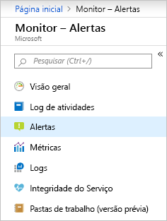
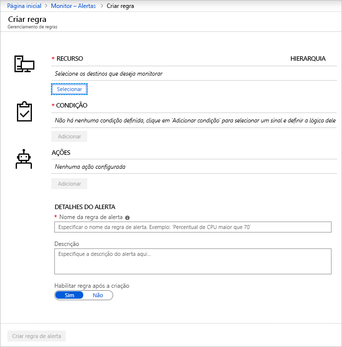
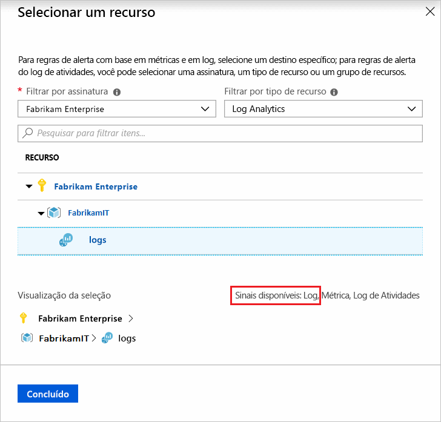
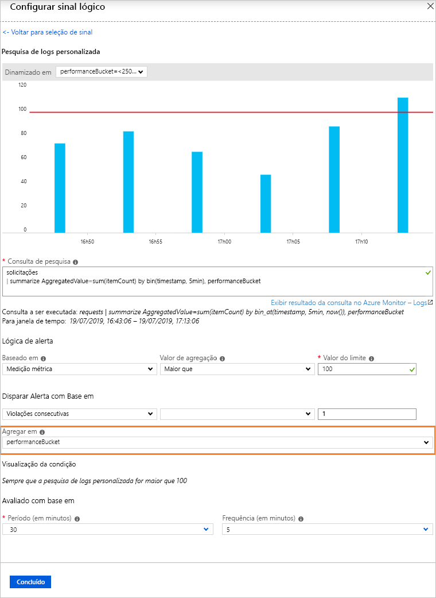
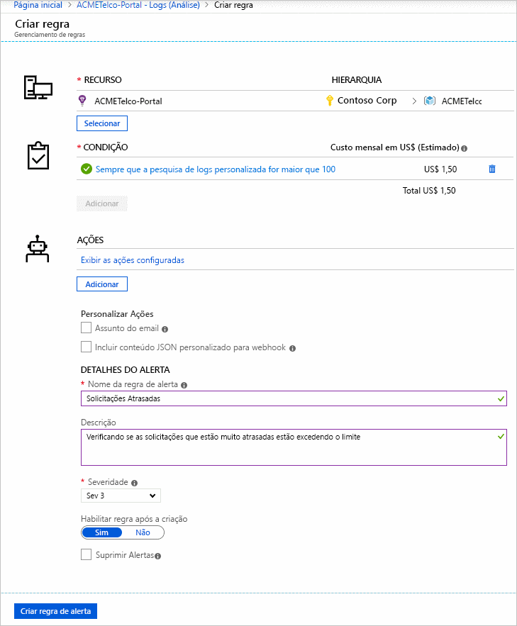

# <a name="create-view-and-manage-log-alerts-using-azure-monitor"></a>Criar, exibir e gerenciar alertas de log usando o Azure Monitor

## <a name="overview"></a>Visão geral
Este artigo mostra como configurar alertas usando a interface de alertas no portal do Azure. A definição de uma regra de alerta é realizada em três partes:
- Destino: recurso do Azure específico, que deve ser monitorado
- Critério: condição ou lógica específica que quando aparecer no sinal, deverá disparar uma ação
- Ação: chamada específica enviada a um destinatário de uma notificação – email, SMS, webhook etc.

O termo **alertas de log** para descrever alertas em que o sinal é consulta de log em um [espaço de trabalho log Analytics](../learn/tutorial-viewdata.md) ou [Application insights](../app/analytics.md). Saiba mais sobre a funcionalidade, a terminologia e o tipos em [Alertas de log – visão geral](alerts-unified-log.md).

> [!NOTE]
> Os dados de log populares de [um espaço de trabalho log Analytics](../../azure-monitor/learn/tutorial-viewdata.md) agora estão disponíveis na plataforma de métrica em Azure monitor. Para obter uma exibição detalhada, confira [Alerta de métrica para logs](alerts-metric-logs.md)

## <a name="managing-log-alerts-from-the-azure-portal"></a>Gerenciando alertas de log no portal do Azure

A seguir há um guia passo a passo detalhado para usar os alertas de log por meio da interface do portal do Azure.

### <a name="create-a-log-alert-rule-with-the-azure-portal"></a>Criar uma regra de alerta de log com o portal do Azure

1. No [portal](https://portal.azure.com/), selecione **Monitor** e na seção MONITOR, escolha **Alertas**.

    

1. Selecione o botão **Nova Regra de Alerta** para criar um novo alerta no Azure.

    

1. A seção Criar Alerta é mostrada com três partes que consistem em: *Definir condição de alerta*, *Definir detalhes do alerta* e *Definir grupo de ação*.

    

1. Defina a condição de alerta usando o link **Selecionar Recurso** e especificando o destino ao selecionar um recurso. Filtre escolhendo a _Assinatura_, o _Tipo de Recurso_ e o _Recurso_ necessário.

   > [!NOTE]
   > Para a criação de um log de alerta, verifique se o sinal do **log** está disponível para o recurso selecionado antes de continuar.
   >  

1. *Alertas de Log*: verifique se **Tipo de Recurso** é uma fonte de análise como *Log Analytics* ou *Application Insights* e se o tipo de sinal é **Log**; em seguida, depois de escolher o **recurso** apropriado, clique em *Concluído*. Em seguida, use o botão **Adicionar critérios** para exibir uma lista de opções de sinais disponíveis para o recurso e na opção **Pesquisa de logs personalizada**para o serviço de monitoramento de log escolhido como *Log Analytics* ou *Application Insights*.

   

   > [!NOTE]
   > 
   > Listas de alertas podem importar consulta analítica como tipo de sinal - **Log (Consulta Salva)** , como mostrado na ilustração acima. Portanto, os usuários podem aperfeiçoar sua consulta no Analytics e, em seguida, salvá-las para uso futuro em alertas-mais detalhes sobre como usar a consulta de salvamento disponível em [usando a consulta de log em Azure monitor](../log-query/log-query-overview.md) ou [consulta compartilhada na análise do Application insights](../app/app-insights-overview.md).

1. *Alertas de Log*: depois de selecionado, a consulta de alerta poderá ser declarada no campo **Consulta de Pesquisa**. Se a sintaxe de consulta estiver incorreta, o campo exibirá o erro em vermelho. Se a sintaxe de consulta estiver correta – para referência, os dados históricos da consulta indicada serão mostrados como um gráfico com a opção de ajustar a janela de tempo das últimas seis horas até a última semana.

    

   > [!NOTE]
   > 
   > A visualização de dados históricos somente poderá ser mostrada se os resultados da consulta tiverem detalhes de tempo. Se a consulta resultar em dados resumidos ou em valores de coluna específicos, isso será mostrado como um único gráfico.
   > Para o tipo de medida da métrica de alertas de log usando o Application Insights ou [alternada para a nova API](alerts-log-api-switch.md), você pode especificar qual variável específica para agrupar os dados usando a opção **Agregar**, conforme ilustrado abaixo:
   > 
   > 

1. *Alertas de Log*: com a visualização exibida, a **Lógica de Alerta** poderá ser selecionada nas opções de condição, agregação e, finalmente, limite mostradas. Finalmente, especifique na lógica, o tempo para avaliar a condição especificada, usando a opção **Período**. Juntamente com frequência em que o Alerta deve ser executado, selecionando **Frequência**. Os **Alertas de Log** podem se basear em:
    - [Número de Registros](../../azure-monitor/platform/alerts-unified-log.md#number-of-results-alert-rules): um alerta será criado se a contagem de registros retornada pela consulta for maior ou menor que o valor fornecido.
    - [Medição de Métrica](../../azure-monitor/platform/alerts-unified-log.md#metric-measurement-alert-rules): um alerta será criado se cada *valor agregado* nos resultados exceder o valor limite fornecido e estiver *agrupado por* valor escolhido. O número de violações de um alerta é o número de vezes que o limite é excedido no período escolhido. Especifique o Total de violações para qualquer combinação de violações no conjunto de resultados ou as Violações consecutivas para exigir que as violações ocorram em amostras consecutivas.


1. Na segunda etapa, defina um nome para o alerta no campo **Nome da regra de alerta** juntamente com uma **Descrição**, detalhando as especificações do alerta, e o valor de **Gravidade** nas opções fornecidas. Esses detalhes são reutilizados em todos os emails de alerta, notificações ou pushs realizados pelo Azure Monitor. Além disso, o usuário pode optar por ativar a regra de alerta imediatamente na criação, ativando adequadamente a opção **Habilitar regra após a criação**.

    Para **Alertas de Log** apenas, algumas funcionalidades adicionais estão disponíveis em detalhes do alerta:

    - **Suprimir Alertas**: quando você ativa a supressão da regra de alerta, as ações da regra são desabilitadas durante um período definido após a criação de um novo alerta. A regra ainda é executada e cria registros de alerta quando os critérios são atendidos. Permitindo que você tenha tempo para corrigir o problema sem executar ações duplicadas.

        

        > [!TIP]
        > Especifique um valor de supressão de alerta maior do que a frequência do alerta para garantir que as notificações sejam interrompidas sem sobreposição

1. Na terceira e última etapa, especifique se algum **Grupo de Ação** precisa ser acionado para a regra de alerta quando a condição de alerta é atendida. Você pode escolher qualquer Grupo de Ação existente com alerta ou criar um novo Grupo de Ação. De acordo com o Grupo de Ação selecionado, quando o alerta for disparado, o Azure vai: enviar email(s), enviar SMS(s), chamar Webhook(s), corrigir o uso de Runbooks do Azure, enviar por push para a ferramenta ITSM, etc. Saiba mais sobre [Grupos de Ação](action-groups.md).

    > [!NOTE]
    > Veja os [Limites do serviço de assinatura do Azure](../../azure-resource-manager/management/azure-subscription-service-limits.md) para saber quais são os limites de conteúdo de Runbook disparados para alertas de log por meio de grupos de ações do Azure

    Para **Alertas de Log**, algumas funcionalidades adicionais estão disponíveis para substituir as ações padrão:

    - **Notificação por Email**: substitui o *assunto do email* no email, enviado pelo Grupo de Ação, se há uma ou mais ações de email no Grupo de Ação. Não é possível modificar o corpo do email e esse campo **não** se destina ao endereço de email.
    - **Incluir conteúdo personalizado do JSON**: substitui o webhook JSON usado pelos Grupos de Ação se há uma ou mais ações de webhook no Grupo de Ação. O usuário pode especificar o formato do JSON a ser usado para todos os webhooks configurados no Grupo de Ação associado; para obter mais informações sobre formatos de webhook, consulte [Ação de webhook para Alertas de Log](../../azure-monitor/platform/alerts-log-webhook.md). A opção Exibir Webhook é fornecida para verificar o formato usando dados JSON de exemplo.

        


1. Se todos os campos forem válidos e tiverem um tique verde, o botão **criar regra de alerta** poderá ser clicado e o alerta será criado no Azure Monitor – Alertas. Todos os alertas podem ser exibidos no painel do Alertas.

     

     Em alguns minutos, o alerta estará ativo e disparará conforme descrito anteriormente.

Os usuários também podem finalizar a consulta de análise no [log Analytics](../log-query/portals.md) e, em seguida, enviá-la por push para criar um alerta por meio do botão ' Set Alert ' (definir alerta), seguindo as instruções da etapa 6 em diante no tutorial acima.

 

### <a name="view--manage-log-alerts-in-azure-portal"></a>Exibir e gerenciar alertas de log no portal do Azure

1. No [portal](https://portal.azure.com/), selecione **Monitor** e na seção MONITOR, escolha **Alertas**.

1. O **Painel de Alertas** é exibido, no qual todos os alertas do Azure (incluindo os alertas de log) são exibidos em um único painel, incluindo todas as instâncias de quando a regra de alerta de log foi acionada. Para saber mais, confira [Gerenciamento de Alertas](https://aka.ms/managealertinstances).
    > [!NOTE]
    > As regras de alerta do log consistem em uma lógica personalizada com base em consulta, fornecida pelos usuários e, portanto, sem um estado resolvido. Devido a ela, toda vez que as condições especificadas na regra de alerta de log são atendidas, a regra é acionada.

1. Selecione o botão **Gerenciar regras** na barra superior, para navegar até a seção de gerenciamento de regra, na qual todas as regras de alerta criadas são listadas, incluindo os alertas que foram desabilitados.
    

## <a name="managing-log-alerts-using-azure-resource-template"></a>Gerenciando alertas de log usando o modelo de recurso do Azure

Os alertas de log no Azure Monitor são associadas ao tipo de recurso `Microsoft.Insights/scheduledQueryRules/`. Para obter mais informações sobre esse tipo de recurso, consulte [Azure Monitor - referência da API de regras de consulta agendada](https://docs.microsoft.com/rest/api/monitor/scheduledqueryrules/). Os alertas de log para o Application Insights ou Log Analytics podem ser criados usando a [API Regras de Consulta Agendada](https://docs.microsoft.com/rest/api/monitor/scheduledqueryrules/).

> [!NOTE]
> Os alertas de log para o Log Analytics também podem ser gerenciados usando a [API Alerta do Log Analytics](api-alerts.md) herdada, bem como modelos herdados de [alertas e pesquisas salvas do Log Analytics](../insights/solutions-resources-searches-alerts.md). Para saber mais sobre como usar a nova API ScheduledQueryRules detalhada aqui por padrão, confira [Alternar para a nova API de alertas do Log Analytics](alerts-log-api-switch.md).


### <a name="sample-log-alert-creation-using-azure-resource-template"></a>Exemplo de criação de alerta de log usando o Modelo de Recurso do Azure

A seguir vemos a estrutura para a [criação de Regras de Consulta Agendada](https://docs.microsoft.com/rest/api/monitor/scheduledqueryrules/createorupdate) com base em modelo de recursos usando a consulta de pesquisa de logs padrão de [alerta de log do tipo número de resultados](alerts-unified-log.md#number-of-results-alert-rules), com o conjunto de dados de exemplo como variáveis.

```json
{
    "$schema": "https://schema.management.azure.com/schemas/2015-01-01/deploymentTemplate.json#",
    "contentVersion": "1.0.0.0",
    "parameters": {
    },
    "variables": {
        "alertLocation": "southcentralus",
        "alertName": "samplelogalert",
        "alertDescription": "Sample log search alert",
        "alertStatus": "true",
        "alertSource":{
            "Query":"requests",
            "SourceId": "/subscriptions/a123d7efg-123c-1234-5678-a12bc3defgh4/resourceGroups/myRG/providers/microsoft.insights/components/sampleAIapplication",
            "Type":"ResultCount"
        },
        "alertSchedule":{
            "Frequency": 15,
            "Time": 60
        },
        "alertActions":{
            "SeverityLevel": "4"
        },
        "alertTrigger":{
            "Operator":"GreaterThan",
            "Threshold":"1"
        },
        "actionGrp":{
            "ActionGroup": "/subscriptions/a123d7efg-123c-1234-5678-a12bc3defgh4/resourceGroups/myRG/providers/microsoft.insights/actiongroups/sampleAG",
            "Subject": "Customized Email Header",
            "Webhook": "{ \"alertname\":\"#alertrulename\", \"IncludeSearchResults\":true }"
        }
    },
    "resources":[ {
        "name":"[variables('alertName')]",
        "type":"Microsoft.Insights/scheduledQueryRules",
        "apiVersion": "2018-04-16",
        "location": "[variables('alertLocation')]",
        "properties":{
            "description": "[variables('alertDescription')]",
            "enabled": "[variables('alertStatus')]",
            "source": {
                "query": "[variables('alertSource').Query]",
                "dataSourceId": "[variables('alertSource').SourceId]",
                "queryType":"[variables('alertSource').Type]"
            },
            "schedule":{
                "frequencyInMinutes": "[variables('alertSchedule').Frequency]",
                "timeWindowInMinutes": "[variables('alertSchedule').Time]"
            },
            "action":{
                "odata.type": "Microsoft.WindowsAzure.Management.Monitoring.Alerts.Models.Microsoft.AppInsights.Nexus.DataContracts.Resources.ScheduledQueryRules.AlertingAction",
                "severity":"[variables('alertActions').SeverityLevel]",
                "aznsAction":{
                    "actionGroup":"[array(variables('actionGrp').ActionGroup)]",
                    "emailSubject":"[variables('actionGrp').Subject]",
                    "customWebhookPayload":"[variables('actionGrp').Webhook]"
                },
                "trigger":{
                    "thresholdOperator":"[variables('alertTrigger').Operator]",
                    "threshold":"[variables('alertTrigger').Threshold]"
                }
            }
        }
    } ]
}

```

O json de exemplo acima pode ser salvo como (digamos) sampleScheduledQueryRule.json para os fins deste passo a passo e pode ser implantado usando o [Azure Resource Manager no portal do Azure](../../azure-resource-manager/templates/deploy-portal.md#deploy-resources-from-custom-template).


### <a name="log-alert-with-cross-resource-query-using-azure-resource-template"></a>Alerta do log com consulta entre recursos usando o Modelo de Recurso do Azure

A seguir vemos a estrutura para a [criação de Regras de Consulta Agendada](https://docs.microsoft.com/rest/api/monitor/scheduledqueryrules/createorupdate) com base em modelo de recursos usando a [consulta de pesquisa de logs entre recursos](../../azure-monitor/log-query/cross-workspace-query.md) de [alerta de log do tipo medida de métrica](../../azure-monitor/platform/alerts-unified-log.md#metric-measurement-alert-rules), com o conjunto de dados de exemplo como variáveis.

```json

{
    "$schema": "https://schema.management.azure.com/schemas/2015-01-01/deploymentTemplate.json#",
    "contentVersion": "1.0.0.0",
    "parameters": {
    },
    "variables": {
        "alertLocation": "Region Name for your Application Insights App or Log Analytics Workspace",
        "alertName": "sample log alert",
        "alertDescr": "Sample log search alert",
        "alertStatus": "true",
        "alertSource":{
            "Query":"union workspace(\"servicews\").Update, app('serviceapp').requests | summarize AggregatedValue = count() by bin(TimeGenerated,1h), Classification",
            "Resource1": "/subscriptions/a123d7efg-123c-1234-5678-a12bc3defgh4/resourceGroups/contosoRG/providers/microsoft.OperationalInsights/workspaces/servicews",
            "Resource2": "/subscriptions/a123d7efg-123c-1234-5678-a12bc3defgh4/resourceGroups/contosoRG/providers/microsoft.insights/components/serviceapp",
            "SourceId": "/subscriptions/a123d7efg-123c-1234-5678-a12bc3defgh4/resourceGroups/contosoRG/providers/microsoft.OperationalInsights/workspaces/servicews",
            "Type":"ResultCount"
        },
        "alertSchedule":{
            "Frequency": 15,
            "Time": 60
        },
        "alertActions":{
            "SeverityLevel": "4",
            "SuppressTimeinMin": 20
        },
        "alertTrigger":{
            "Operator":"GreaterThan",
            "Threshold":"1"
        },
        "metricMeasurement": {
            "thresholdOperator": "Equal",
            "threshold": "1",
            "metricTriggerType": "Consecutive",
            "metricColumn": "Classification"
        },
        "actionGrp":{
            "ActionGroup": "/subscriptions/a123d7efg-123c-1234-5678-a12bc3defgh4/resourceGroups/contosoRG/providers/microsoft.insights/actiongroups/sampleAG",
            "Subject": "Customized Email Header",
            "Webhook": "{ \"alertname\":\"#alertrulename\", \"IncludeSearchResults\":true }"
        }
    },
    "resources":[ {
        "name":"[variables('alertName')]",
        "type":"Microsoft.Insights/scheduledQueryRules",
        "apiVersion": "2018-04-16",
        "location": "[variables('alertLocation')]",
        "properties":{
            "description": "[variables('alertDescr')]",
            "enabled": "[variables('alertStatus')]",
            "source": {
                "query": "[variables('alertSource').Query]",
                "authorizedResources": "[concat(array(variables('alertSource').Resource1), array(variables('alertSource').Resource2))]",
                "dataSourceId": "[variables('alertSource').SourceId]",
                "queryType":"[variables('alertSource').Type]"
            },
            "schedule":{
                "frequencyInMinutes": "[variables('alertSchedule').Frequency]",
                "timeWindowInMinutes": "[variables('alertSchedule').Time]"
            },
            "action":{
                "odata.type": "Microsoft.WindowsAzure.Management.Monitoring.Alerts.Models.Microsoft.AppInsights.Nexus.DataContracts.Resources.ScheduledQueryRules.AlertingAction",
                "severity":"[variables('alertActions').SeverityLevel]",
                "throttlingInMin": "[variables('alertActions').SuppressTimeinMin]",
                "aznsAction":{
                    "actionGroup": "[array(variables('actionGrp').ActionGroup)]",
                    "emailSubject":"[variables('actionGrp').Subject]",
                    "customWebhookPayload":"[variables('actionGrp').Webhook]"
                },
                "trigger":{
                    "thresholdOperator":"[variables('alertTrigger').Operator]",
                    "threshold":"[variables('alertTrigger').Threshold]",
                    "metricTrigger":{
                        "thresholdOperator": "[variables('metricMeasurement').thresholdOperator]",
                        "threshold": "[variables('metricMeasurement').threshold]",
                        "metricColumn": "[variables('metricMeasurement').metricColumn]",
                        "metricTriggerType": "[variables('metricMeasurement').metricTriggerType]"
                    }
                }
            }
        }
    } ]
}

```

> [!IMPORTANT]
> Ao usar a consulta entre recursos no log de alerta, o uso de [authorizedResources](https://docs.microsoft.com/rest/api/monitor/scheduledqueryrules/createorupdate#source) será obrigatório e o usuário deverá ter acesso à lista de recursos indicada

O json de exemplo acima pode ser salvo como (digamos) sampleScheduledQueryRule.json para os fins deste passo a passo e pode ser implantado usando o [Azure Resource Manager no portal do Azure](../../azure-resource-manager/templates/deploy-portal.md#deploy-resources-from-custom-template).

## <a name="managing-log-alerts-using-powershell"></a>Gerenciando alertas de log usando o PowerShell

[!INCLUDE [updated-for-az](../../../includes/updated-for-az.md)]

Azure Monitor-a [API de regras de consulta agendada](https://docs.microsoft.com/rest/api/monitor/scheduledqueryrules/) é uma API REST e totalmente compatível com Azure Resource Manager API REST. E os cmdlets do PowerShell listados abaixo estão disponíveis para aproveitar a [API de regras de consulta agendada](https://docs.microsoft.com/rest/api/monitor/scheduledqueryrules/).

1. [New-AzScheduledQueryRule](https://docs.microsoft.com/powershell/module/az.monitor/new-azscheduledqueryrule) : cmdlet do PowerShell para criar uma nova regra de alerta de log.
1. [Set-AzScheduledQueryRule](https://docs.microsoft.com/powershell/module/az.monitor/set-azscheduledqueryrule) : cmdlet do PowerShell para atualizar uma regra de alerta de log existente.
1. [New-AzScheduledQueryRuleSource](https://docs.microsoft.com/powershell/module/az.monitor/new-azscheduledqueryrulesource) : cmdlet do PowerShell para criar ou atualizar um objeto especificando parâmetros de origem para um alerta de log. Usado como entrada pelo cmdlet [New-AzScheduledQueryRule](https://docs.microsoft.com/powershell/module/az.monitor/new-azscheduledqueryrule) e [set-AzScheduledQueryRule](https://docs.microsoft.com/powershell/module/az.monitor/set-azscheduledqueryrule) .
1. [New-AzScheduledQueryRuleSchedule](https://docs.microsoft.com/powershell/module/az.monitor/New-AzScheduledQueryRuleSchedule): cmdlet do PowerShell para criar ou atualizar objeto especificando parâmetros de agendamento para um alerta de log. Usado como entrada pelo cmdlet [New-AzScheduledQueryRule](https://docs.microsoft.com/powershell/module/az.monitor/new-azscheduledqueryrule) e [set-AzScheduledQueryRule](https://docs.microsoft.com/powershell/module/az.monitor/set-azscheduledqueryrule) .
1. [New-AzScheduledQueryRuleAlertingAction](https://docs.microsoft.com/powershell/module/az.monitor/New-AzScheduledQueryRuleAlertingAction) : cmdlet do PowerShell para criar ou atualizar objeto especificando parâmetros de ação para um alerta de log. Usado como entrada pelo cmdlet [New-AzScheduledQueryRule](https://docs.microsoft.com/powershell/module/az.monitor/new-azscheduledqueryrule) e [set-AzScheduledQueryRule](https://docs.microsoft.com/powershell/module/az.monitor/set-azscheduledqueryrule) .
1. [New-AzScheduledQueryRuleAznsActionGroup](https://docs.microsoft.com/powershell/module/az.monitor/new-azscheduledqueryruleaznsactiongroup) : cmdlet do PowerShell para criar ou atualizar objetos especificando parâmetros de grupos de ação para um alerta de log. Usado como entrada pelo cmdlet [New-AzScheduledQueryRuleAlertingAction](https://docs.microsoft.com/powershell/module/az.monitor/New-AzScheduledQueryRuleAlertingAction) .
1. [New-AzScheduledQueryRuleTriggerCondition](https://docs.microsoft.com/powershell/module/az.monitor/new-azscheduledqueryruletriggercondition) : cmdlet do PowerShell para criar ou atualizar objeto especificando parâmetros de condição de gatilho para alerta de log. Usado como entrada pelo cmdlet [New-AzScheduledQueryRuleAlertingAction](https://docs.microsoft.com/powershell/module/az.monitor/New-AzScheduledQueryRuleAlertingAction) .
1. [New-AzScheduledQueryRuleLogMetricTrigger](https://docs.microsoft.com/powershell/module/az.monitor/new-azscheduledqueryrulelogmetrictrigger) : cmdlet do PowerShell para criar ou atualizar objeto especificando parâmetros de condição de gatilho de métrica para o [alerta de log do tipo de medição métrica](../../azure-monitor/platform/alerts-unified-log.md#metric-measurement-alert-rules). Usado como entrada pelo cmdlet [New-AzScheduledQueryRuleTriggerCondition](https://docs.microsoft.com/powershell/module/az.monitor/new-azscheduledqueryruletriggercondition) .
1. [Get-AzScheduledQueryRule](https://docs.microsoft.com/powershell/module/az.monitor/get-azscheduledqueryrule) : cmdlet do PowerShell para listar regras de alerta de log existentes ou uma regra de alerta de log específica
1. [Update-AzScheduledQueryRule](https://docs.microsoft.com/powershell/module/az.monitor/update-azscheduledqueryrule) : cmdlet do PowerShell para habilitar ou desabilitar a regra de alerta de log
1. [Remove-AzScheduledQueryRule](https://docs.microsoft.com/powershell/module/az.monitor/remove-azscheduledqueryrule): cmdlet do PowerShell para excluir uma regra de alerta de log existente

> [!NOTE]
> Os cmdlets do PowerShell ScheduledQueryRules só podem gerenciar regras criadas por meio do próprio cmdlet ou usando Azure Monitor [API de regras de consulta agendada](https://docs.microsoft.com/rest/api/monitor/scheduledqueryrules/). Regras de alerta de log criadas usando a [API de alerta log Analytics](api-alerts.md) herdada e modelos herdados de [log Analytics pesquisas e alertas salvos](../insights/solutions-resources-searches-alerts.md) podem ser gerenciados usando cmdlets do PowerShell do ScheduledQueryRules somente depois que o usuário [alternar a preferência de API para log Analytics alertas](alerts-log-api-switch.md).

Em seguida, ilustramos as etapas para a criação de uma regra de alerta de log de exemplo usando os cmdlets do PowerShell scheduledQueryRules.
```powershell
$source = New-AzScheduledQueryRuleSource -Query 'Heartbeat | summarize AggregatedValue = count() by bin(TimeGenerated, 5m), _ResourceId' -DataSourceId "/subscriptions/a123d7efg-123c-1234-5678-a12bc3defgh4/resourceGroups/contosoRG/providers/microsoft.OperationalInsights/workspaces/servicews"

$schedule = New-AzScheduledQueryRuleSchedule -FrequencyInMinutes 15 -TimeWindowInMinutes 30

$metricTrigger = New-AzScheduledQueryRuleLogMetricTrigger -ThresholdOperator "GreaterThan" -Threshold 2 -MetricTriggerType "Consecutive" -MetricColumn "_ResourceId"

$triggerCondition = New-AzScheduledQueryRuleTriggerCondition -ThresholdOperator "LessThan" -Threshold 5 -MetricTrigger $metricTrigger

$aznsActionGroup = New-AzScheduledQueryRuleAznsActionGroup -ActionGroup "/subscriptions/a123d7efg-123c-1234-5678-a12bc3defgh4/resourceGroups/contosoRG/providers/microsoft.insights/actiongroups/sampleAG" -EmailSubject "Custom email subject" -CustomWebhookPayload "{ `"alert`":`"#alertrulename`", `"IncludeSearchResults`":true }"

$alertingAction = New-AzScheduledQueryRuleAlertingAction -AznsAction $aznsActionGroup -Severity "3" -Trigger $triggerCondition

New-AzScheduledQueryRule -ResourceGroupName "contosoRG" -Location "Region Name for your Application Insights App or Log Analytics Workspace" -Action $alertingAction -Enabled $true -Description "Alert description" -Schedule $schedule -Source $source -Name "Alert Name"
```

## <a name="managing-log-alerts-using-cli-or-api"></a>Gerenciando alertas de log usando a CLI ou a API

Azure Monitor-a [API de regras de consulta agendada](https://docs.microsoft.com/rest/api/monitor/scheduledqueryrules/) é uma API REST e totalmente compatível com Azure Resource Manager API REST. Portanto, ele pode ser usado por meio do PowerShell usando comandos do Resource Manager para CLI do Azure.


> [!NOTE]
> Os alertas de log para o Log Analytics também podem ser gerenciados usando a [API Alerta do Log Analytics](api-alerts.md) herdada, bem como modelos herdados de [alertas e pesquisas salvas do Log Analytics](../insights/solutions-resources-searches-alerts.md). Para saber mais sobre como usar a nova API ScheduledQueryRules detalhada aqui por padrão, confira [Alternar para a nova API de alertas do Log Analytics](alerts-log-api-switch.md).

Os alertas de log atualmente não têm comandos de CLI dedicados atualmente; Mas, conforme ilustrado abaixo, pode ser usado por meio do comando Azure Resource Manager CLI para o modelo de recurso de exemplo mostrado anteriormente (sampleScheduledQueryRule. JSON) na seção modelo de recurso:

```azurecli
az group deployment create --resource-group contosoRG --template-file sampleScheduledQueryRule.json
```

Operação bem-sucedida, 201 será retornado para a criação da regra de alerta de novo estado ou 200 será retornado se uma regra de alerta existente for modificada.

## <a name="next-steps"></a>{1&gt;{2&gt;Próximas etapas&lt;2}&lt;1}

* Saiba mais sobre os [Alertas de log nos alertas do Azure](../../azure-monitor/platform/alerts-unified-log.md)
* Entender [Ações de Webhook para alertas de log](../../azure-monitor/platform/alerts-log-webhook.md)
* Saiba mais sobre o [Application Insights](../../azure-monitor/app/analytics.md)
* Saiba mais sobre [consultas de log](../log-query/log-query-overview.md).
