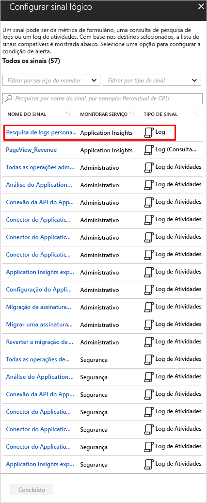
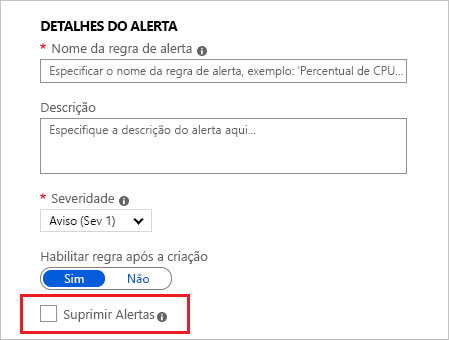
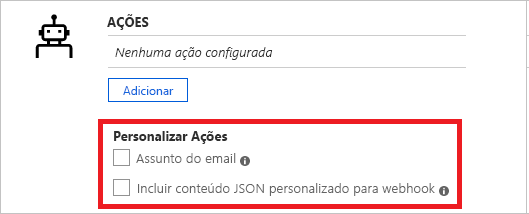

# <a name="create-view-and-manage-log-alerts-using-azure-monitor"></a>Criar, exibir e gerenciar alertas de log usando o Azure Monitor

## <a name="overview"></a>Visão geral
Este artigo mostra como criar e gerenciar alertas de log usando a interface alertas dentro do portal do Azure. As regras de alerta são definidas por três componentes:
- Destino: um recurso específico do Azure a ser monitorado
- Critérios: uma condição ou lógica a ser avaliada para a verdade. Se for true, o alerta será acionado.  
- Ação: chamada específica enviada a um destinatário de uma notificação – email, SMS, webhook etc.

O termo **alerta de log** descreve alertas em que uma consulta de log no [espaço de trabalho log Analytics](../log-query/get-started-portal.md) ou [Application insights](../log-query/log-query-overview.md) é avaliada e um alerta é disparado se o resultado for verdadeiro. Saiba mais sobre a funcionalidade, a terminologia e o tipos em [Alertas de log – visão geral](alerts-unified-log.md).

> [!NOTE]
> Os dados de log de [um espaço de trabalho de log Analytics](../log-query/get-started-portal.md) também podem ser roteados para o Azure monitor banco de dados de métricas. Os alertas de métricas têm [comportamento diferente](alerts-metric-overview.md), o que pode ser mais desejável, dependendo dos dados com os quais você está trabalhando.   Para obter informações sobre o que e como você pode rotear logs para métricas, consulte [alerta de métrica para logs](alerts-metric-logs.md).

## <a name="create-a-log-alert-rule-with-the-azure-portal"></a>Criar uma regra de alerta de log com o portal do Azure

1. No [portal](https://portal.azure.com/), selecione **Monitor**. Nessa seção, escolha **alertas**.

    

1. Clique em **nova regra de alerta**. 

    

1. O painel **criar alerta** é exibido. Ele tem quatro partes: 
    - O recurso ao qual o alerta se aplica
    - A condição a ser verificada
    - A ação a ser tomada se a condição for verdadeira
    - Os detalhes para nomear e descrever o alerta. 

    

1. Defina a condição de alerta usando o link **Selecionar Recurso** e especificando o destino ao selecionar um recurso. Filtre escolhendo a *Assinatura*, o *Tipo de Recurso* e o *Recurso* necessário. 

   

1. Verifique se o **tipo de recurso** é uma fonte de análise como *log Analytics* ou *Application insights* e tipo de sinal como *log*. Clique em **Concluído**. Em seguida, use o botão **Adicionar critérios** para exibir a lista de opções de sinal disponíveis para o recurso. Localize e escolha a opção de **pesquisa de logs personalizada** para *log Analytics* ou *Application insights*, dependendo de onde os dados dos alertas de log residem.

   

   > [!NOTE]
   > 
   > Listas de alertas podem importar consulta analítica como tipo de sinal - **Log (Consulta Salva)**, como mostrado na ilustração acima. Portanto, os usuários podem aperfeiçoar sua consulta no Analytics e, em seguida, salvá-las para uso futuro em alertas. Para obter mais detalhes sobre como usar consultas salvas, consulte [usando a consulta de log em Azure monitor](../log-query/log-query-overview.md) e [consulta compartilhada no Application insights Analytics](../app/app-insights-overview.md).

1. Depois de selecionado, crie a consulta de alerta no campo de **consulta de pesquisa** . Se a sintaxe da consulta estiver incorreta, o campo exibirá e erro em vermelho. 

1. Se a sintaxe da consulta estiver correta, os dados históricos da consulta aparecerão como um grafo com a opção de ajustar a janela de tempo das últimas seis horas até a última semana.

    

   A visualização de dados históricos só será mostrada se os resultados da consulta tiverem detalhes de tempo. Se a consulta resultar em dados resumidos ou em valores de coluna específicos, a exibição mostrará um único gráfico.
  
   Para medidas métricas usando Application Insights ou [a API log Analytics](/rest/api/monitor/scheduledqueryrules), você pode especificar qual variável específica para agrupar os dados usando a opção **agregar em** ; como mostrado aqui: 
  
   


1. Em seguida, escolha a condição, a agregação e o limite da **lógica de alerta** . 

1. Escolha o período de tempo durante o qual avaliar a condição especificada, usando a opção **período** . 

1. Escolha a frequência com que o alerta é executado em **frequência**. 

    Os **Alertas de Log** podem se basear em:
    - [Número de Registros](./alerts-unified-log.md#number-of-results-alert-rules): um alerta será criado se a contagem de registros retornada pela consulta for maior ou menor que o valor fornecido.
    - [Medição de Métrica](./alerts-unified-log.md#metric-measurement-alert-rules): um alerta será criado se cada *valor agregado* nos resultados exceder o valor limite fornecido e estiver *agrupado por* valor escolhido. O número de violações de um alerta é o número de vezes que o limite é excedido no período escolhido. Especifique o Total de violações para qualquer combinação de violações no conjunto de resultados ou as Violações consecutivas para exigir que as violações ocorram em amostras consecutivas.


1. Clique em **Concluído**. 

1. Defina um nome para o alerta no campo **nome da regra de alerta** , juntamente com uma **Descrição** detalhando as especificações do alerta e do valor de **severidade** das opções fornecidas. Esses detalhes são reutilizados em todos os emails de alerta, notificações ou Pushes feitos pelo Azure Monitor. Além disso, você pode optar por ativar imediatamente a regra de alerta na criação clicando em **Habilitar Regra após a criação**.

1. Escolha se deseja **suprimir alertas** por um período de tempo.  Quando você ativa a supressão da regra de alerta, as ações da regra são desabilitadas por um período definido depois de criar um novo alerta. A regra ainda é executada e cria registros de alerta, desde que os critérios sejam atendidos. Essa configuração permite o tempo para corrigir o problema sem executar ações duplicadas.

   

    > [!TIP]
    > Especifique um valor de alerta de supressão maior que a frequência de alerta para garantir que as notificações sejam interrompidas sem sobreposição

1. Como a terceira e última etapa, especifique se a regra de alerta deve disparar um ou mais **grupos de ações** quando a condição de alerta for atendida. Você pode escolher qualquer grupo de ações existente ou criar um novo. Com os grupos de ação, você pode enviar uma série de ações como enviar emails, enviar SMS (s), chamar webhook (s), corrigir usando Runbooks do Azure, enviá-lo por push para sua ferramenta de ITSM e muito mais. Saiba mais sobre [grupos de ações](action-groups.md).

    > [!NOTE]
    > Consulte os [limites do serviço de assinatura do Azure](../../azure-resource-manager/management/azure-subscription-service-limits.md) para obter limites sobre as ações que podem ser executadas.  

    Algumas funcionalidades adicionais estão disponíveis para substituir as ações padrão:

    - **Notificação por email**: substitui o *assunto de email* no email enviado por meio do grupo de ações. Não é possível modificar o corpo do email e esse campo **não** se destina ao endereço de email.
    - **Incluir carga JSON personalizada**: substitui o JSON de webhook usado por grupos de ação supondo que o grupo de ações contenha um tipo de webhook. Para obter mais informações sobre formatos de webhook, consulte [ação de webhook para alertas de log](./alerts-log-webhook.md). A opção Exibir Webhook é fornecida para verificar o formato usando dados JSON de exemplo.

        


1. Se todos os campos forem válidos e tiverem um tique verde, o botão **criar regra de alerta** poderá ser clicado e o alerta será criado no Azure Monitor – Alertas. Todos os alertas podem ser exibidos no painel do Alertas.

     

     Em alguns minutos, o alerta estará ativo e disparará conforme descrito anteriormente.

Os usuários também podem finalizar a consulta de análise no [log Analytics](../log-query/log-query-overview.md) e, em seguida, enviá-la por push para criar um alerta por meio do botão ' Set Alert ' (definir alerta), seguindo as instruções da etapa 6 em diante no tutorial acima.

 

### <a name="view--manage-log-alerts-in-azure-portal"></a>Exibir e gerenciar alertas de log no portal do Azure

1. No [portal](https://portal.azure.com/), selecione **Monitor** e, na seção monitor, escolha **alertas**.

1. O **painel de alertas** é exibido-onde todos os alertas do Azure (incluindo alertas de log) são exibidos em uma placa singular; incluindo todas as instâncias do quando a regra de alerta de log foi acionada. Para saber mais, confira [Gerenciamento de Alertas](https://aka.ms/managealertinstances).
    > [!NOTE]
    > As regras de alerta do log consistem em uma lógica personalizada com base em consulta, fornecida pelos usuários e, portanto, sem um estado resolvido. Devido a ela, toda vez que as condições especificadas na regra de alerta de log são atendidas, a regra é acionada.

1. Selecione o botão **Gerenciar regras** na barra superior, para navegar até a seção de gerenciamento de regra, na qual todas as regras de alerta criadas são listadas, incluindo os alertas que foram desabilitados.
    

## <a name="managing-log-alerts-using-azure-resource-template"></a>Gerenciando alertas de log usando o modelo de recurso do Azure

Os alertas de log no Azure Monitor são associadas ao tipo de recurso `Microsoft.Insights/scheduledQueryRules/`. Para obter mais informações sobre esse tipo de recurso, consulte [Azure Monitor - referência da API de regras de consulta agendada](/rest/api/monitor/scheduledqueryrules/). Os alertas de log para o Application Insights ou Log Analytics podem ser criados usando a [API Regras de Consulta Agendada](/rest/api/monitor/scheduledqueryrules/).

> [!NOTE]
> Os alertas de log para o Log Analytics também podem ser gerenciados usando a [API Alerta do Log Analytics](api-alerts.md) herdada, bem como modelos herdados de [alertas e pesquisas salvas do Log Analytics](../insights/solutions.md). Para saber mais sobre como usar a nova API ScheduledQueryRules detalhada aqui por padrão, confira [Alternar para a nova API de alertas do Log Analytics](alerts-log-api-switch.md).


### <a name="sample-log-alert-creation-using-azure-resource-template"></a>Exemplo de criação de alerta de log usando o Modelo de Recurso do Azure

A seguir vemos a estrutura para a [criação de Regras de Consulta Agendada](/rest/api/monitor/scheduledqueryrules/createorupdate) com base em modelo de recursos usando a consulta de pesquisa de logs padrão de [alerta de log do tipo número de resultados](alerts-unified-log.md#number-of-results-alert-rules), com o conjunto de dados de exemplo como variáveis.

```json
{
    "$schema": "https://schema.management.azure.com/schemas/2015-01-01/deploymentTemplate.json#",
    "contentVersion": "1.0.0.0",
    "parameters": {
    },
    "variables": {
        "alertLocation": "southcentralus",
        "alertName": "samplelogalert",
        "alertDescription": "Sample log search alert",
        "alertStatus": "true",
        "alertSource":{
            "Query":"requests",
            "SourceId": "/subscriptions/a123d7efg-123c-1234-5678-a12bc3defgh4/resourceGroups/myRG/providers/microsoft.insights/components/sampleAIapplication",
            "Type":"ResultCount"
        },
        "alertSchedule":{
            "Frequency": 15,
            "Time": 60
        },
        "alertActions":{
            "SeverityLevel": "4"
        },
        "alertTrigger":{
            "Operator":"GreaterThan",
            "Threshold":"1"
        },
        "actionGrp":{
            "ActionGroup": "/subscriptions/a123d7efg-123c-1234-5678-a12bc3defgh4/resourceGroups/myRG/providers/microsoft.insights/actiongroups/sampleAG",
            "Subject": "Customized Email Header",
            "Webhook": "{ \"alertname\":\"#alertrulename\", \"IncludeSearchResults\":true }"
        }
    },
    "resources":[ {
        "name":"[variables('alertName')]",
        "type":"Microsoft.Insights/scheduledQueryRules",
        "apiVersion": "2018-04-16",
        "location": "[variables('alertLocation')]",
        "properties":{
            "description": "[variables('alertDescription')]",
            "enabled": "[variables('alertStatus')]",
            "source": {
                "query": "[variables('alertSource').Query]",
                "dataSourceId": "[variables('alertSource').SourceId]",
                "queryType":"[variables('alertSource').Type]"
            },
            "schedule":{
                "frequencyInMinutes": "[variables('alertSchedule').Frequency]",
                "timeWindowInMinutes": "[variables('alertSchedule').Time]"
            },
            "action":{
                "odata.type": "Microsoft.WindowsAzure.Management.Monitoring.Alerts.Models.Microsoft.AppInsights.Nexus.DataContracts.Resources.ScheduledQueryRules.AlertingAction",
                "severity":"[variables('alertActions').SeverityLevel]",
                "aznsAction":{
                    "actionGroup":"[array(variables('actionGrp').ActionGroup)]",
                    "emailSubject":"[variables('actionGrp').Subject]",
                    "customWebhookPayload":"[variables('actionGrp').Webhook]"
                },
                "trigger":{
                    "thresholdOperator":"[variables('alertTrigger').Operator]",
                    "threshold":"[variables('alertTrigger').Threshold]"
                }
            }
        }
    } ]
}

```

O json de exemplo acima pode ser salvo como (digamos) sampleScheduledQueryRule.json para os fins deste passo a passo e pode ser implantado usando o [Azure Resource Manager no portal do Azure](../../azure-resource-manager/templates/deploy-portal.md#deploy-resources-from-custom-template).


### <a name="log-alert-with-cross-resource-query-using-azure-resource-template"></a>Alerta do log com consulta entre recursos usando o Modelo de Recurso do Azure

A seguir vemos a estrutura para a [criação de Regras de Consulta Agendada](/rest/api/monitor/scheduledqueryrules/createorupdate) com base em modelo de recursos usando a [consulta de pesquisa de logs entre recursos](../log-query/cross-workspace-query.md) de [alerta de log do tipo medida de métrica](./alerts-unified-log.md#metric-measurement-alert-rules), com o conjunto de dados de exemplo como variáveis.

```json

{
    "$schema": "https://schema.management.azure.com/schemas/2015-01-01/deploymentTemplate.json#",
    "contentVersion": "1.0.0.0",
    "parameters": {
    },
    "variables": {
        "alertLocation": "Region Name for your Application Insights App or Log Analytics Workspace",
        "alertName": "sample log alert",
        "alertDescr": "Sample log search alert",
        "alertStatus": "true",
        "alertSource":{
            "Query":"union workspace(\"servicews\").Update, app('serviceapp').requests | summarize AggregatedValue = count() by bin(TimeGenerated,1h), Classification",
            "Resource1": "/subscriptions/a123d7efg-123c-1234-5678-a12bc3defgh4/resourceGroups/contosoRG/providers/microsoft.OperationalInsights/workspaces/servicews",
            "Resource2": "/subscriptions/a123d7efg-123c-1234-5678-a12bc3defgh4/resourceGroups/contosoRG/providers/microsoft.insights/components/serviceapp",
            "SourceId": "/subscriptions/a123d7efg-123c-1234-5678-a12bc3defgh4/resourceGroups/contosoRG/providers/microsoft.OperationalInsights/workspaces/servicews",
            "Type":"ResultCount"
        },
        "alertSchedule":{
            "Frequency": 15,
            "Time": 60
        },
        "alertActions":{
            "SeverityLevel": "4",
            "SuppressTimeinMin": 20
        },
        "alertTrigger":{
            "Operator":"GreaterThan",
            "Threshold":"1"
        },
        "metricMeasurement": {
            "thresholdOperator": "Equal",
            "threshold": "1",
            "metricTriggerType": "Consecutive",
            "metricColumn": "Classification"
        },
        "actionGrp":{
            "ActionGroup": "/subscriptions/a123d7efg-123c-1234-5678-a12bc3defgh4/resourceGroups/contosoRG/providers/microsoft.insights/actiongroups/sampleAG",
            "Subject": "Customized Email Header",
            "Webhook": "{ \"alertname\":\"#alertrulename\", \"IncludeSearchResults\":true }"
        }
    },
    "resources":[ {
        "name":"[variables('alertName')]",
        "type":"Microsoft.Insights/scheduledQueryRules",
        "apiVersion": "2018-04-16",
        "location": "[variables('alertLocation')]",
        "properties":{
            "description": "[variables('alertDescr')]",
            "enabled": "[variables('alertStatus')]",
            "source": {
                "query": "[variables('alertSource').Query]",
                "authorizedResources": "[concat(array(variables('alertSource').Resource1), array(variables('alertSource').Resource2))]",
                "dataSourceId": "[variables('alertSource').SourceId]",
                "queryType":"[variables('alertSource').Type]"
            },
            "schedule":{
                "frequencyInMinutes": "[variables('alertSchedule').Frequency]",
                "timeWindowInMinutes": "[variables('alertSchedule').Time]"
            },
            "action":{
                "odata.type": "Microsoft.WindowsAzure.Management.Monitoring.Alerts.Models.Microsoft.AppInsights.Nexus.DataContracts.Resources.ScheduledQueryRules.AlertingAction",
                "severity":"[variables('alertActions').SeverityLevel]",
                "throttlingInMin": "[variables('alertActions').SuppressTimeinMin]",
                "aznsAction":{
                    "actionGroup": "[array(variables('actionGrp').ActionGroup)]",
                    "emailSubject":"[variables('actionGrp').Subject]",
                    "customWebhookPayload":"[variables('actionGrp').Webhook]"
                },
                "trigger":{
                    "thresholdOperator":"[variables('alertTrigger').Operator]",
                    "threshold":"[variables('alertTrigger').Threshold]",
                    "metricTrigger":{
                        "thresholdOperator": "[variables('metricMeasurement').thresholdOperator]",
                        "threshold": "[variables('metricMeasurement').threshold]",
                        "metricColumn": "[variables('metricMeasurement').metricColumn]",
                        "metricTriggerType": "[variables('metricMeasurement').metricTriggerType]"
                    }
                }
            }
        }
    } ]
}

```

> [!IMPORTANT]
> Ao usar a consulta entre recursos no log de alerta, o uso de [authorizedResources](/rest/api/monitor/scheduledqueryrules/createorupdate#source) será obrigatório e o usuário deverá ter acesso à lista de recursos indicada

O json de exemplo acima pode ser salvo como (digamos) sampleScheduledQueryRule.json para os fins deste passo a passo e pode ser implantado usando o [Azure Resource Manager no portal do Azure](../../azure-resource-manager/templates/deploy-portal.md#deploy-resources-from-custom-template).

## <a name="managing-log-alerts-using-powershell"></a>Gerenciando alertas de log usando o PowerShell

[!INCLUDE [updated-for-az](../../../includes/updated-for-az.md)]

Azure Monitor-a [API de regras de consulta agendada](/rest/api/monitor/scheduledqueryrules/) é uma API REST e totalmente compatível com Azure Resource Manager API REST. E os cmdlets do PowerShell listados abaixo estão disponíveis para aproveitar a [API de regras de consulta agendada](/rest/api/monitor/scheduledqueryrules/).

- [New-AzScheduledQueryRule](/powershell/module/az.monitor/new-azscheduledqueryrule) : cmdlet do PowerShell para criar uma nova regra de alerta de log.
- [Set-AzScheduledQueryRule](/powershell/module/az.monitor/set-azscheduledqueryrule) : cmdlet do PowerShell para atualizar uma regra de alerta de log existente.
- [New-AzScheduledQueryRuleSource](/powershell/module/az.monitor/new-azscheduledqueryrulesource) : cmdlet do PowerShell para criar ou atualizar um objeto especificando parâmetros de origem para um alerta de log. Usado como entrada pelo cmdlet [New-AzScheduledQueryRule](/powershell/module/az.monitor/new-azscheduledqueryrule) e [set-AzScheduledQueryRule](/powershell/module/az.monitor/set-azscheduledqueryrule) .
- [New-AzScheduledQueryRuleSchedule](/powershell/module/az.monitor/new-azscheduledqueryruleschedule): cmdlet do PowerShell para criar ou atualizar objeto especificando parâmetros de agendamento para um alerta de log. Usado como entrada pelo cmdlet [New-AzScheduledQueryRule](/powershell/module/az.monitor/new-azscheduledqueryrule) e [set-AzScheduledQueryRule](/powershell/module/az.monitor/set-azscheduledqueryrule) .
- [New-AzScheduledQueryRuleAlertingAction](/powershell/module/az.monitor/new-azscheduledqueryrulealertingaction) : cmdlet do PowerShell para criar ou atualizar objeto especificando parâmetros de ação para um alerta de log. Usado como entrada pelo cmdlet [New-AzScheduledQueryRule](/powershell/module/az.monitor/new-azscheduledqueryrule) e [set-AzScheduledQueryRule](/powershell/module/az.monitor/set-azscheduledqueryrule) .
- [New-AzScheduledQueryRuleAznsActionGroup](/powershell/module/az.monitor/new-azscheduledqueryruleaznsactiongroup) : cmdlet do PowerShell para criar ou atualizar objetos especificando parâmetros de grupos de ação para um alerta de log. Usado como entrada pelo cmdlet [New-AzScheduledQueryRuleAlertingAction](/powershell/module/az.monitor/new-azscheduledqueryrulealertingaction) .
- [New-AzScheduledQueryRuleTriggerCondition](/powershell/module/az.monitor/new-azscheduledqueryruletriggercondition) : cmdlet do PowerShell para criar ou atualizar objeto especificando parâmetros de condição de gatilho para alerta de log. Usado como entrada pelo cmdlet [New-AzScheduledQueryRuleAlertingAction](/powershell/module/az.monitor/new-azscheduledqueryrulealertingaction) .
- [New-AzScheduledQueryRuleLogMetricTrigger](/powershell/module/az.monitor/new-azscheduledqueryrulelogmetrictrigger) : cmdlet do PowerShell para criar ou atualizar objeto especificando parâmetros de condição de gatilho de métrica para o [alerta de log do tipo de medição métrica](./alerts-unified-log.md#metric-measurement-alert-rules). Usado como entrada pelo cmdlet [New-AzScheduledQueryRuleTriggerCondition](/powershell/module/az.monitor/new-azscheduledqueryruletriggercondition) .
- [Get-AzScheduledQueryRule](/powershell/module/az.monitor/get-azscheduledqueryrule) : cmdlet do PowerShell para listar regras de alerta de log existentes ou uma regra de alerta de log específica
- [Update-AzScheduledQueryRule](/powershell/module/az.monitor/update-azscheduledqueryrule) : cmdlet do PowerShell para habilitar ou desabilitar a regra de alerta de log
- [Remove-AzScheduledQueryRule](/powershell/module/az.monitor/remove-azscheduledqueryrule): cmdlet do PowerShell para excluir uma regra de alerta de log existente

> [!NOTE]
> Os cmdlets do PowerShell ScheduledQueryRules só podem gerenciar regras criadas por meio do próprio cmdlet ou usando Azure Monitor [API de regras de consulta agendada](/rest/api/monitor/scheduledqueryrules/). Regras de alerta de log criadas usando a [API de alerta log Analytics](api-alerts.md) herdada e modelos herdados de [log Analytics pesquisas e alertas salvos](../insights/solutions.md) podem ser gerenciados usando cmdlets do PowerShell do ScheduledQueryRules somente depois que o usuário [alternar a preferência de API para log Analytics alertas](alerts-log-api-switch.md).

Em seguida, ilustramos as etapas para a criação de uma regra de alerta de log de exemplo usando os cmdlets do PowerShell scheduledQueryRules.

```powershell
$source = New-AzScheduledQueryRuleSource -Query 'Heartbeat | summarize AggregatedValue = count() by bin(TimeGenerated, 5m), _ResourceId' -DataSourceId "/subscriptions/a123d7efg-123c-1234-5678-a12bc3defgh4/resourceGroups/contosoRG/providers/microsoft.OperationalInsights/workspaces/servicews"

$schedule = New-AzScheduledQueryRuleSchedule -FrequencyInMinutes 15 -TimeWindowInMinutes 30

$metricTrigger = New-AzScheduledQueryRuleLogMetricTrigger -ThresholdOperator "GreaterThan" -Threshold 2 -MetricTriggerType "Consecutive" -MetricColumn "_ResourceId"

$triggerCondition = New-AzScheduledQueryRuleTriggerCondition -ThresholdOperator "LessThan" -Threshold 5 -MetricTrigger $metricTrigger

$aznsActionGroup = New-AzScheduledQueryRuleAznsActionGroup -ActionGroup "/subscriptions/a123d7efg-123c-1234-5678-a12bc3defgh4/resourceGroups/contosoRG/providers/microsoft.insights/actiongroups/sampleAG" -EmailSubject "Custom email subject" -CustomWebhookPayload "{ `"alert`":`"#alertrulename`", `"IncludeSearchResults`":true }"

$alertingAction = New-AzScheduledQueryRuleAlertingAction -AznsAction $aznsActionGroup -Severity "3" -Trigger $triggerCondition

New-AzScheduledQueryRule -ResourceGroupName "contosoRG" -Location "Region Name for your Application Insights App or Log Analytics Workspace" -Action $alertingAction -Enabled $true -Description "Alert description" -Schedule $schedule -Source $source -Name "Alert Name"
```

## <a name="managing-log-alerts-using-cli-or-api"></a>Gerenciando alertas de log usando a CLI ou a API

Azure Monitor-a [API de regras de consulta agendada](/rest/api/monitor/scheduledqueryrules/) é uma API REST e totalmente compatível com Azure Resource Manager API REST. Portanto, ele pode ser usado por meio do PowerShell usando comandos do Resource Manager para CLI do Azure.


> [!NOTE]
> Os alertas de log para o Log Analytics também podem ser gerenciados usando a [API Alerta do Log Analytics](api-alerts.md) herdada, bem como modelos herdados de [alertas e pesquisas salvas do Log Analytics](../insights/solutions.md). Para saber mais sobre como usar a nova API ScheduledQueryRules detalhada aqui por padrão, confira [Alternar para a nova API de alertas do Log Analytics](alerts-log-api-switch.md).

Os alertas de log atualmente não têm comandos de CLI dedicados atualmente; Mas, conforme ilustrado abaixo, pode ser usado por meio do comando Azure Resource Manager CLI para o modelo de recurso de exemplo mostrado anteriormente (sampleScheduledQueryRule.jsem) na seção modelo de recurso:

```azurecli
az group deployment create --resource-group contosoRG --template-file sampleScheduledQueryRule.json
```

Operação bem-sucedida, 201 será retornado para a criação da regra de alerta de novo estado ou 200 será retornado se uma regra de alerta existente for modificada.

## <a name="next-steps"></a>Próximas etapas

* Saiba mais sobre os [alertas de log nos alertas do Azure](./alerts-unified-log.md)
* Entender [Ações de Webhook para alertas de log](./alerts-log-webhook.md)
* Saiba mais sobre o [Application insights](../log-query/log-query-overview.md)
* Saiba mais sobre [consultas de log](../log-query/log-query-overview.md).

