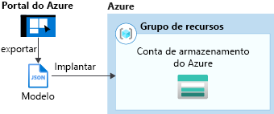

# Criar e implantar modelos de ARM usando a ideia IntelliJ

Saiba como implantar um modelo de Azure Resource Manager (ARM) no Azure usando a ideia IntelliJ e o processo de edição e atualização do modelo diretamente do IDE. Os modelos de ARM são arquivos JSON que definem os recursos que você precisa implantar para sua solução. Para entender os conceitos associados à implantação e ao gerenciamento de soluções do Azure, confira a [visão geral da implantação de modelo](overview.md).

Depois de concluir o tutorial, você implantará uma conta do Armazenamento do Azure. O mesmo processo pode ser usado para implantar outros recursos do Azure.

Se você não tiver uma assinatura do Azure, [crie uma conta gratuita](https://azure.microsoft.com/free/) antes de começar.

## Pré-requisitos

Para concluir este artigo, você precisa do seguinte:

* Um [IntelliJ IDEA](https://www.jetbrains.com/idea/download/) Ultimate Edition ou Community Edition instalado
* O [Azure Toolkit for IntelliJ](https://plugins.jetbrains.com/plugin/8053) instalado; confira o [guia de gerenciamento de plug-ins do IntelliJ](https://www.jetbrains.com/help/idea/managing-plugins.html) para obter mais informações
* Estar [conectado](/java/azure/intellij/azure-toolkit-for-intellij-sign-in-instructions) à sua conta do Azure para o Azure Toolkit for IntelliJ

## Implantar um modelo de Início Rápido

Em vez de criar um modelo do zero, você pode abrir um modelo de [Modelos de Início Rápido do Azure](https://azure.microsoft.com/resources/templates/). Modelos de Início Rápido do Azure é um repositório de modelos do ARM. O modelo usado neste artigo é chamado de [criar uma conta de armazenamento padrão](https://github.com/Azure/azure-quickstart-templates/tree/master/101-storage-account-create/). Ele define um recurso da conta de Armazenamento do Azure.

1. Clique com o botão direito do [`azuredeploy.json`](https://raw.githubusercontent.com/Azure/azure-quickstart-templates/master/101-storage-account-create/azuredeploy.json) mouse [`azuredeploy.parameters.json`](https://raw.githubusercontent.com/Azure/azure-quickstart-templates/master/101-storage-account-create/azuredeploy.parameters.json) e salve o e em seu computador local.

1. Se o Azure Toolkit está instalado e conectado corretamente, você deve ver o Azure Explorer na barra lateral do IntelliJ IDEA. Clique com o botão direito do mouse no **Gerenciamento de Recursos** e selecione **Criar Implantação**.

    

1. Configure o **Nome da Implantação**, a **Assinatura**, o **Grupo de Recursos** e a **Região**. Aqui, implantamos o modelo em um novo grupo de recursos `testRG`. Em seguida, selecione o caminho para o **Modelo do Recurso** como `azuredeploy.json` e os **Parâmetros de Recurso** como o `azuredeploy.parameters.json` que você baixou.

    

1. Depois que você clicar em OK, a implantação será iniciada. Até a conclusão da implantação, você poderá encontrar o progresso na **barra de status** do IntelliJ IDEA, na parte inferior.

    

## Procurar uma implantação existente

1. Depois que a implantação for concluída, você poderá ver o novo grupo de recursos `testRG` e uma nova implantação que foram criados. Clique com o botão direito do mouse na implantação e você poderá ver uma lista de possíveis ações. Agora, selecione **Mostrar Propriedades**.

    

1. Uma exibição de guia será aberta para mostrar algumas propriedades úteis, assim como o status da implantação e a estrutura do modelo.

    

## Editar e atualizar uma implantação existente

1. Selecione **Editar Implantação** no menu de clique com o botão direito do mouse ou na exibição Mostrar Propriedades mostrada anteriormente. Outra exibição de guia será aberta, mostrando os arquivos de modelo e de parâmetro para a implantação no Azure. Para salvar esses arquivos em um local, você pode clicar em **Exportar Arquivo de Modelo** ou **Exportar Arquivos de Parâmetro**.

    

1. Você pode editar os dois arquivos nesta página e implantar as alterações no Azure. Aqui, modificamos o valor de **storageAccountType** em arquivos de parâmetro de `Standard_LRS` para `Standard_GRS`. Em seguida, clique em **Atualizar Implantação** na parte inferior e confirme a atualização.

    

1. Após a conclusão da implantação da atualização, você pode verificar no portal que a conta de armazenamento criada foi alterada para `Standard_GRS`.

## Limpar os recursos

1. Quando os recursos do Azure já não forem necessários, limpe os recursos implantados excluindo o grupo de recursos. Você pode fazer isso no portal do Azure ou na CLI do Azure. No Azure Explorer, do IntelliJ IDEA, clique com o botão direito do mouse no **grupo de recursos** criado e selecione excluir.

    

> [!NOTE]
> Observe que a exclusão de uma implantação não excluirá os recursos criados por ela. Exclua o grupo de recursos ou os recursos específicos correspondentes depois que você não precisar mais deles.

## Próximas etapas

O foco principal deste artigo é usar o IntelliJ IDEA para implantar um modelo existente de modelos de início rápido do Azure. Você também aprendeu como exibir e atualizar uma implantação existente no Azure. Os modelos do Início Rápido do Azure podem não oferecer tudo o que você precisa. Para saber mais sobre o desenvolvimento de modelos, confira nossa nova série de tutoriais para iniciantes:

> [!div class="nextstepaction"]
> [Tutoriais para iniciante](./template-tutorial-create-first-template.md)

> [!div class="nextstepaction"]
> [Visite o Java no Centro de Desenvolvimento do Azure](https://docs.microsoft.com/azure/java)
