# <a name="quickstart-create-azure-resource-manager-templates-with-visual-studio-code"></a>Início Rápido: Criar modelos do Azure Resource Manager usando o Visual Studio Code

As ferramentas do Azure Resource Manager para o Visual Studio Code fornecem suporte à linguagem, snippets de recursos e preenchimento automático de recursos. Essas ferramentas ajudam a criar e validar modelos do Azure Resource Manager. Neste início rápido, você usará a extensão para criar um modelo do Azure Resource Manager do zero. Ao fazer isso, você experimenta as funcionalidades de extensões, como snippets de modelos do Resource Manager, validação, conclusões e suporte ao arquivo de parâmetro.

Para concluir este início rápido, você precisa do [Visual Studio Code](https://code.visualstudio.com/), com a instalação da [extensão das ferramentas do Azure Resource Manager](https://marketplace.visualstudio.com/items?itemName=msazurermtools.azurerm-vscode-tools). Você também precisa da [CLI do Azure](/cli/azure/?view=azure-cli-latest) ou do [módulo do Azure PowerShell](/powershell/azure/new-azureps-module-az?view=azps-3.7.0) instalado e autenticado.

Se você não tiver uma assinatura do Azure, [crie uma conta gratuita](https://azure.microsoft.com/free/) antes de começar.

## <a name="create-an-arm-template"></a>Criar um modelo do Resource Manager

Crie e abra com um novo arquivo chamado *azuredeploy.json* com o Visual Studio Code. Insira `arm` no editor de códigos, que inicia os snippets do Azure Resource Manager para o scaffolding de um modelo do Resource Manager.

Selecione `arm!` para criar um modelo com escopo para uma implantação do grupo de recursos do Azure.


Este snippet cria os blocos de construção básicos para um modelo do Resource Manager.


Observe que o modo de linguagem Visual Studio Code mudou de *JSON* para o *Modelo do Azure Resource Manager*. A extensão inclui um servidor de linguagem específico para modelos do Resource Manager que fornecem validação, conclusão e outros serviços de linguagem específicos para modelos do Resource Manager.


## <a name="add-an-azure-resource"></a>Adicionar um recurso do Azure

A extensão inclui snippets para muitos recursos do Azure. Esses snippets podem ser usados para adicionar recursos facilmente à implantação de modelo.

Coloque o cursor sobre o bloco **recursos** do modelo, digite `storage` e selecione o snippet *arm-storage*.

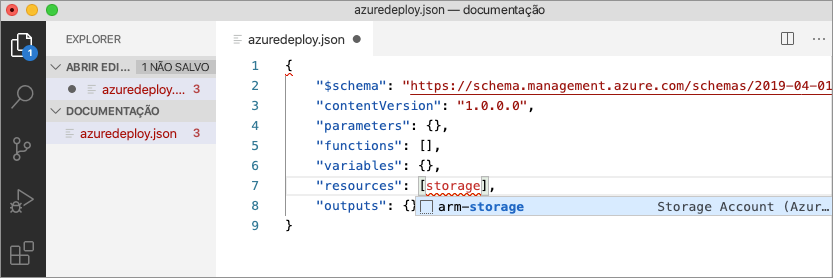

Esta ação adiciona um recurso de armazenamento ao modelo.

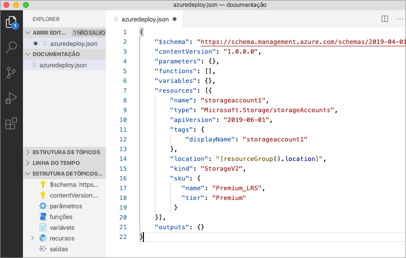

A tecla **tab** pode ser usada para tabular pelas propriedades configuráveis na conta de armazenamento.

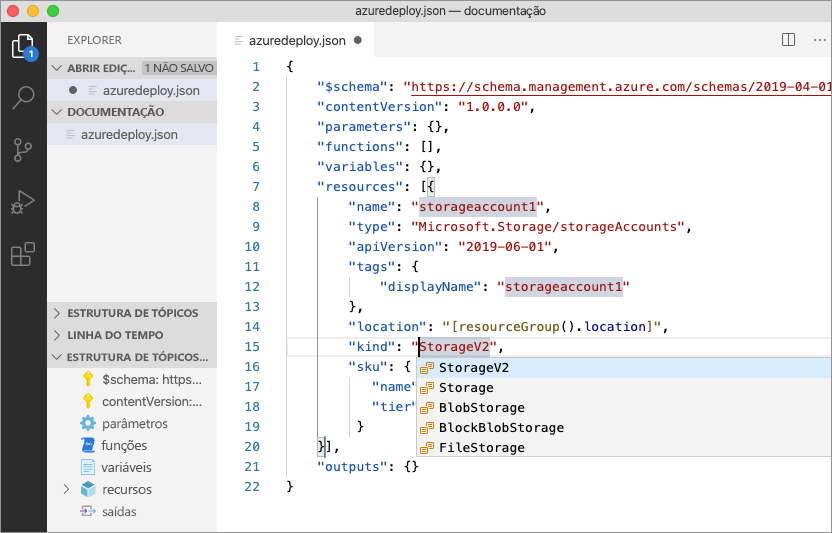

## <a name="completion-and-validation"></a>Conclusão e validação

Uma das funcionalidades mais poderosas da extensão é a integração com os esquemas do Azure. Os esquemas do Azure fornecem à extensão as funcionalidades de validação e de conclusão com reconhecimento de recursos. Vamos modificar a conta de armazenamento para ver a validação e a conclusão em ação. 

Primeiro, atualize o tipo de conta de armazenamento para um valor inválido, como `megaStorage`. Observe que esta ação produz um aviso indicando que `megaStorage` não é um valor válido.

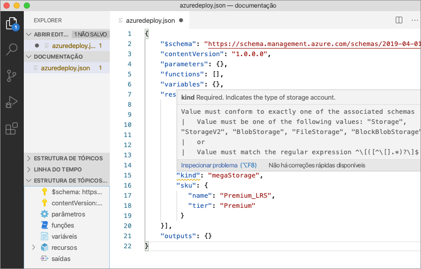

Para usar as funcionalidades de conclusão, remova `megaStorage`, coloque o cursor dentro das aspas duplas e pressione `ctrl` + `space`. Esta ação apresenta uma lista de conclusão de valores válidos.

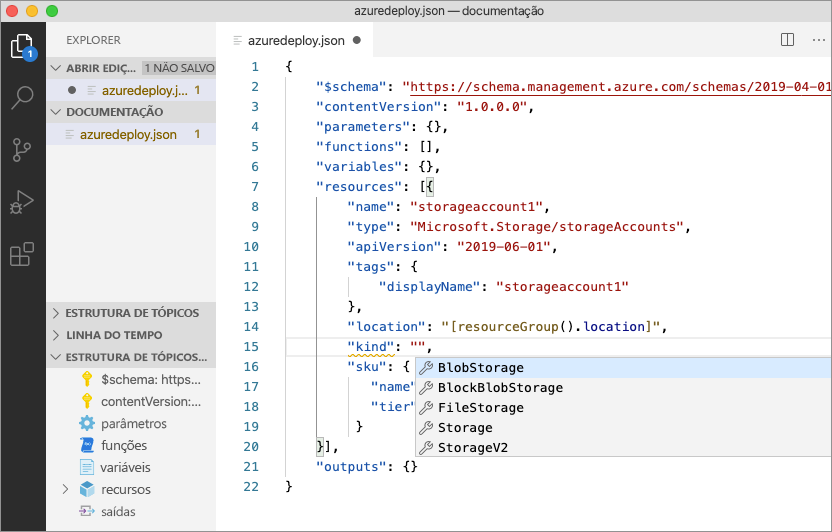

## <a name="add-template-parameters"></a>Adicionar parâmetros do modelo

Agora crie e use um parâmetro para especificar o nome da conta de armazenamento.

Coloque o cursor no bloco de parâmetros, adicione um retorno de carro, digite `par` e selecione o snippet `arm-param-value`. Esta ação adiciona um parâmetro genérico ao modelo.

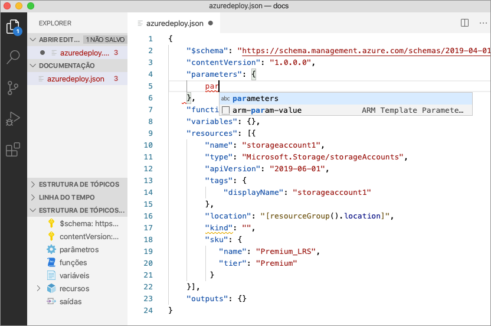

Atualize o nome do parâmetro para `storageAccountName` e a descrição para `Storage Account Name`.

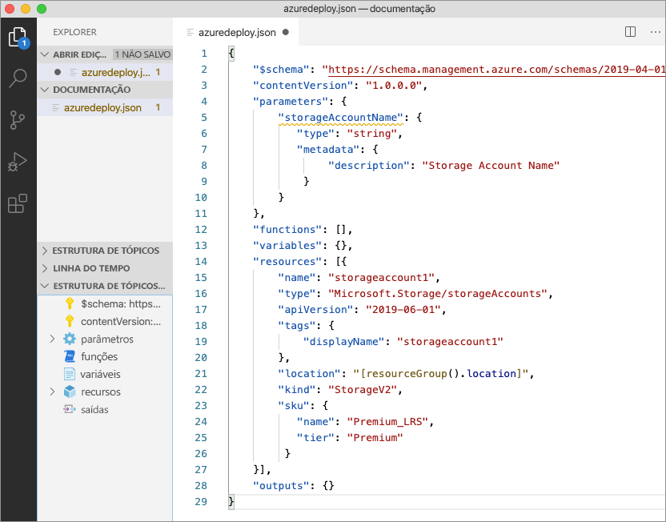

Os nomes da conta de armazenamento do Azure têm um comprimento mínimo de 3 caracteres e um máximo de 24. Adicione `minLength` e `maxLength` ao parâmetro e forneça os valores apropriados.

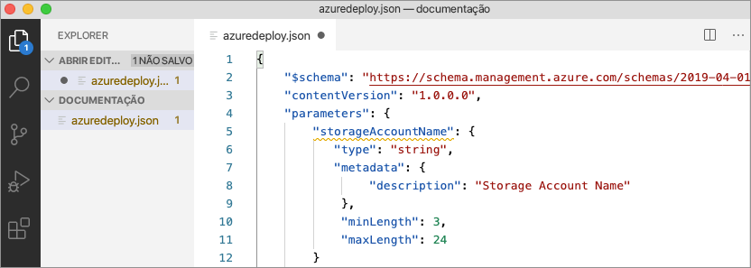

Agora, no recurso de armazenamento, atualize a propriedade nome para usar o parâmetro. Para fazer isso, remova o nome atual. Insira aspas duplas e um colchete de abertura `[`, que produz uma lista de funções de modelo do Resource Manager. Selecione *parâmetros* na lista. 

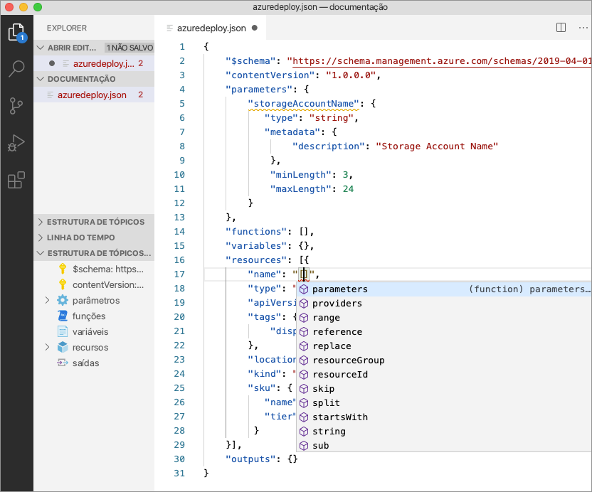

Inserir uma aspa simples `'` dentro dos parênteses produz uma lista de todos os parâmetros definidos no modelo, neste caso, *storageAccountName*. Selecione o parâmetro.

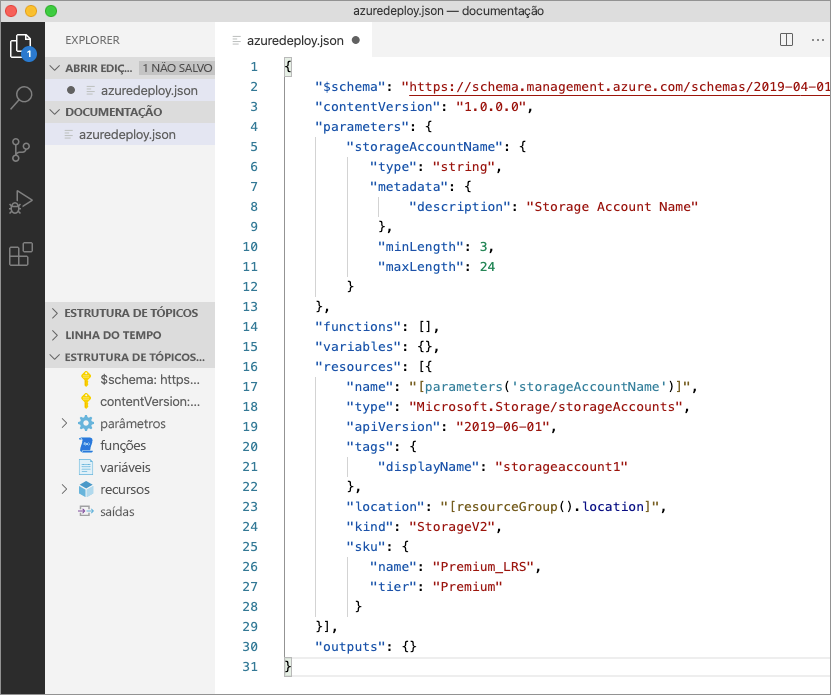

## <a name="create-a-parameter-file"></a>Criar um arquivo de parâmetro

Um arquivo de parâmetro do modelo do Resource Manager permite armazenar valores de parâmetros específicos do ambiente e transmitir esses valores como um grupo no momento da implantação. Por exemplo, você pode ter um arquivo de parâmetro com valores específicos para um ambiente de teste e outro para um ambiente de produção.

A extensão facilita a criação de um arquivo de parâmetro usando os modelos existentes. Para isso, clique com o botão direito do mouse no modelo do editor de códigos e selecione `Select/Create Parameter File`.

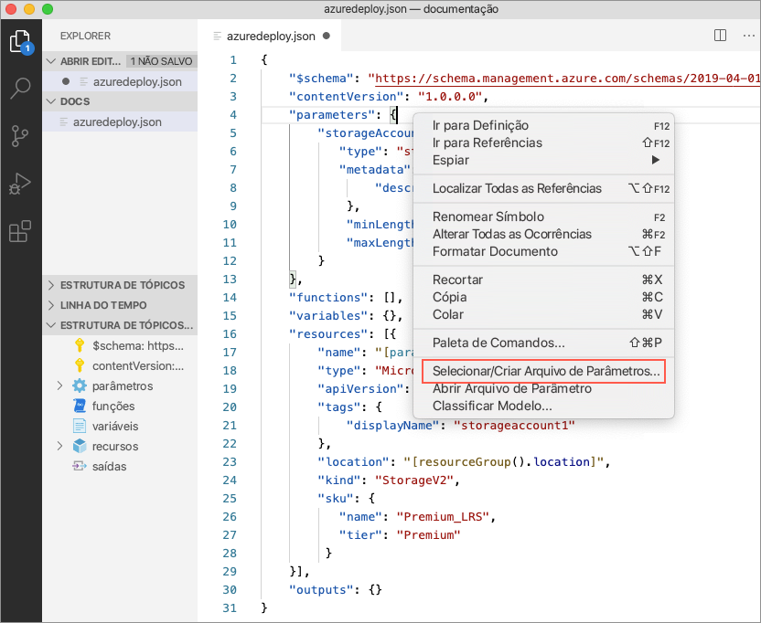

Selecione `New` > `All Parameters` > Selecione um nome e um local para o arquivo de parâmetro.


Essa ação cria um novo arquivo de parâmetro e o mapeia com o modelo do qual ele foi criado. Você pode ver e modificar o mapeamento atual do arquivo de modelo/parâmetro na barra de status do Visual Studio Code enquanto o modelo está selecionado.


Agora que o arquivo de parâmetro foi mapeado para o modelo, a extensão valida o modelo e o arquivo de parâmetro juntos. Para ver essa validação na prática, adicione um valor de dois caracteres ao parâmetro `storageAccountName` no arquivo de parâmetro e salve o arquivo.

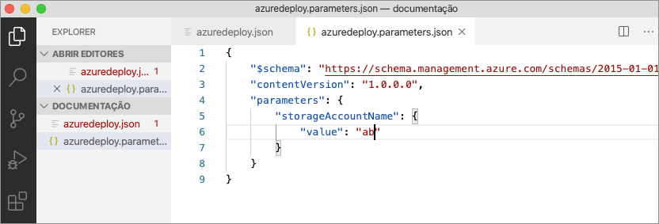

Navegue de volta ao modelo do Resource Manager e observe que um erro indicando que o valor não atende aos critérios de parâmetro foi gerado.

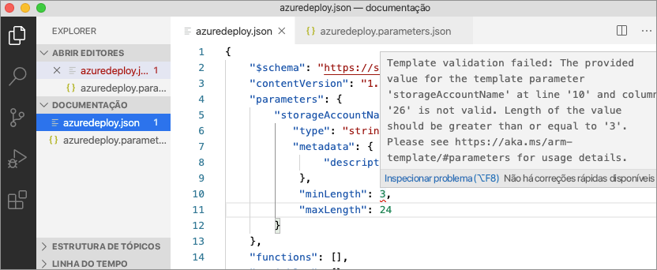

Atualize o valor para algo apropriado, salve o arquivo e navegue de volta ao modelo. Observe que o erro no parâmetro foi resolvido.

## <a name="deploy-the-template"></a>Implantar o modelo

Abra o terminal integrado do Visual Studio Code usando a combinação de teclas `ctrl` + ```` ` ```` e use o módulo da CLI do Azure ou do Azure PowerShell para implantar o modelo.

# <a name="cli"></a>[CLI](#tab/CLI)

```azurecli
az group create --name arm-vscode --location eastus

az deployment group create --resource-group arm-vscode --template-file azuredeploy.json --parameters azuredeploy.parameters.json
```

# <a name="powershell"></a>[PowerShell](#tab/PowerShell)

```azurepowershell
New-AzResourceGroup -Name arm-vscode -Location eastus

New-AzResourceGroupDeployment -ResourceGroupName arm-vscode -TemplateFile ./azuredeploy.json -TemplateParameterFile ./azuredeploy.parameters.json
```
---

## <a name="clean-up-resources"></a>Limpar os recursos

Quando os recursos do Azure não forem mais necessários, use o módulo da CLI do Azure ou do Azure PowerShell para excluir o grupo de recursos de início rápido.

# <a name="cli"></a>[CLI](#tab/CLI)

```azurecli
az group delete --name arm-vscode
```

# <a name="powershell"></a>[PowerShell](#tab/PowerShell)

```azurepowershell
Remove-AzResourceGroup -Name arm-vscode
```
---

## <a name="next-steps"></a>Próximas etapas

> [!div class="nextstepaction"]
> [Tutoriais para iniciante](./template-tutorial-create-first-template.md)
