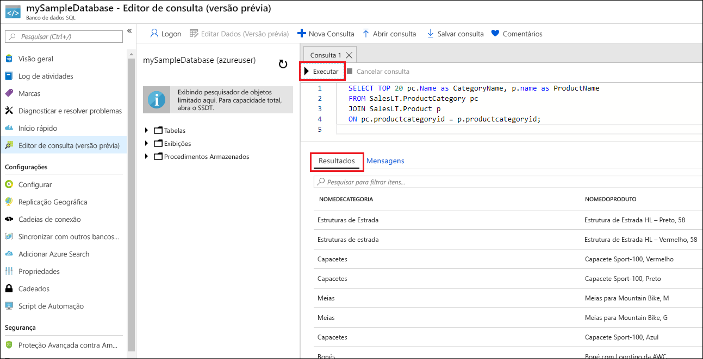

# <a name="quickstart-create-an-azure-sql-database-single-database"></a>Início Rápido: Criar um banco de dados individual do Banco de Dados SQL do Azure

Neste início rápido, você usará o portal do Azure, um script do PowerShell ou um script da CLI do Azure para criar um banco de dados individual no Banco de Dados SQL do Azure. Em seguida, você consultará o banco de dados usando o **Editor de consultas** no portal do Azure.

Um [banco de dados individual](single-database-overview.md) é a opção mais rápida e simples do Banco de Dados SQL do Azure. Você gerencia um banco de dados individual dentro de um [servidor](logical-servers.md), que está dentro de um [grupo de recursos do Azure](../../azure-resource-manager/management/manage-resource-groups-portal.md) em uma região especificada do Azure. Neste início rápido, você criará um grupo de recursos e um servidor para o novo banco de dados.

Você poderá criar um banco de dados individual na camada de computação *provisionada* ou *sem servidor*. É pré-alocada a um banco de dados provisionado uma quantidade fixa de recursos de computação, incluindo CPU e memória, e esse banco de dados usa um dos dois [modelos de compra](purchasing-models.md). Este início rápido cria um banco de dados provisionado usando o modelo de compra [baseado em vCore](service-tiers-vcore.md), mas você também pode escolher um modelo [baseado em DTU](service-tiers-dtu.md).

A camada de computação sem servidor só está disponível no modelo de compra baseado em vCore e tem um intervalo dimensionado automaticamente de recursos de computação, incluindo CPU e memória. Para criar um banco de dados individual na camada de computação sem servidor, confira [Criar um banco de dados sem servidor](serverless-tier-overview.md#create-a-new-database-in-the-serverless-compute-tier).

## <a name="prerequisite"></a>Pré-requisito

- Uma assinatura ativa do Azure. Se você não tiver uma, [crie uma conta gratuita](https://azure.microsoft.com/free/).

## <a name="create-a-single-database"></a>Criar um banco de dados individual

[!INCLUDE [sql-database-create-single-database](../includes/sql-database-create-single-database.md)]

## <a name="query-the-database"></a>Consultar o banco de dados

Depois que o banco de dados for criado, você poderá usar o **Editor de consultas** interno no portal do Azure para se conectar ao banco de dados e consultar os dados.

1. No portal, pesquise e selecione **bancos de dados SQL** e selecione seu banco de dados na lista.
1. Na página **Banco de Dados SQL** do banco de dados, selecione **Editor de consulta (versão prévia)** no menu à esquerda.
1. Insira suas informações de logon do administrador do servidor e selecione **OK**.

   

1. Insira a consulta a seguir no painel **Editor de consultas**.

   ```sql
   SELECT TOP 20 pc.Name as CategoryName, p.name as ProductName
   FROM SalesLT.ProductCategory pc
   JOIN SalesLT.Product p
   ON pc.productcategoryid = p.productcategoryid;
   ```

1. Selecione **Executar** e, em seguida, examine os resultados da consulta no painel **Resultados**.

   

1. Feche a página **Editor de consultas** e selecione **OK** quando solicitado para descartar as edições não salvas.

## <a name="clean-up-resources"></a>Limpar os recursos

Mantenha o grupo de recursos, o servidor e o banco de dados individual para as próximas etapas e saiba como conectar e consultar seu banco de dados com métodos diferentes.

Quando você terminar de usar esses recursos, você poderá excluir o grupo de recursos criado, que também excluirá o servidor e o banco de dados individual dentro dele.

### <a name="the-azure-portal"></a>[O portal do Azure](#tab/azure-portal)

Para excluir **myResourceGroup** e todos os recursos dele usando o portal do Azure:

1. No portal, pesquise e selecione **Grupos de recursos** e, em seguidas, **myResourceGroup** na lista.
1. Na página Grupo de recursos, selecione **Excluir grupo de recursos**.
1. Em **Digite o nome do grupo de recursos**, insira *myResourceGroup* e selecione **Excluir**.

### <a name="the-azure-cli"></a>[A CLI do Azure](#tab/azure-cli)

Para excluir o grupo de recursos e os recursos dele, execute o seguinte comando da CLI do Azure usando o nome do seu grupo de recursos:

```azurecli-interactive
az group delete --name <your resource group>
```

### <a name="powershell"></a>[PowerShell](#tab/azure-powershell)

Para excluir o grupo de recursos e os recursos dele, execute o seguinte cmdlet do PowerShell usando o nome do seu grupo de recursos:

```azurepowershell-interactive
Remove-AzResourceGroup -Name <your resource group>
```

---

## <a name="next-steps"></a>Próximas etapas

[Conectar e consultar](connect-query-content-reference-guide.md) seu banco de dados usando diferentes ferramentas e linguagens:
> [!div class="nextstepaction"]
> [Conectar e consultar usando o SQL Server Management Studio](connect-query-ssms.md)
>
> [Conectar e consultar usando o Azure Data Studio](/sql/azure-data-studio/quickstart-sql-database?toc=/azure/sql-database/toc.json)

Deseja otimizar e reduzir seus gastos com a nuvem?

> [!div class="nextstepaction"]
> [Comece a analisar os custos com o Gerenciamento de Custos](https://docs.microsoft.com/azure/cost-management-billing/costs/quick-acm-cost-analysis?WT.mc_id=costmanagementcontent_docsacmhorizontal_-inproduct-learn)
