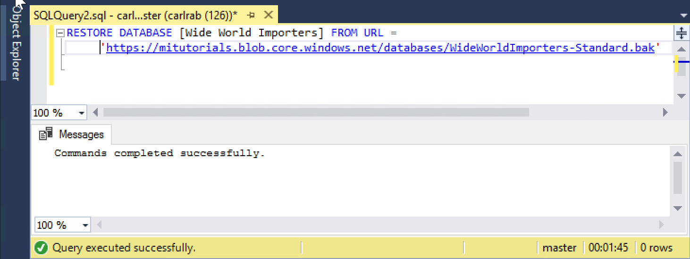

# <a name="quickstart-restore-a-database-to-azure-sql-managed-instance-with-ssms"></a>Início Rápido: restaurar um banco de dados em uma Instância Gerenciada de SQL do Azure com o SSMS
[!INCLUDE[appliesto-sqlmi](../includes/appliesto-sqlmi.md)]

Neste início rápido, você usará o SSMS (SQL Server Management Studio) para restaurar um banco de dados (o arquivo de backup padrão Wide World Importers) do Armazenamento de Blobs do Azure em uma [Instância Gerenciada de SQL do Azure](sql-managed-instance-paas-overview.md).

> [!VIDEO https://www.youtube.com/embed/RxWYojo_Y3Q]

> [!NOTE]
> Para obter mais informações sobre a migração usando o Serviço de Migração de Banco de Dados do Azure, confira [Migração de Instância Gerenciada de SQL usando o Serviço de Migração de Banco de Dados](../../dms/tutorial-sql-server-to-managed-instance.md).
> Para obter mais informações sobre vários métodos de migração, confira [Migração do SQL Server para a Instância Gerenciada de SQL do Azure](migrate-to-instance-from-sql-server.md).

## <a name="prerequisites"></a>Pré-requisitos

Este início rápido:

- Usa os recursos do início rápido [Criar uma instância gerenciada](instance-create-quickstart.md).
- Requer a instalação da versão mais recente do [SSMS](https://docs.microsoft.com/sql/ssms/sql-server-management-studio-ssms).
- Requer o uso do SSMS para se conectar à Instância Gerenciada de SQL. Confira estes inícios rápidos sobre como se conectar:
  - [Habilitar o ponto de extremidade público](public-endpoint-configure.md) na Instância Gerenciada de SQL. Essa é a abordagem recomendada para este tutorial.
  - [Conectar-se a uma Instância Gerenciada de SQL por meio de uma VM do Azure](connect-vm-instance-configure.md).
  - [Configurar uma conexão ponto a site com a Instância Gerenciada de SQL do local](point-to-site-p2s-configure.md).

> [!NOTE]
> Para saber mais sobre como fazer backup e restaurar um banco de dados do SQL Server usando o Armazenamento de Blobs do Azure e uma [chave de SAS (Assinatura de Acesso Compartilhado)](https://docs.microsoft.com/azure/storage/common/storage-dotnet-shared-access-signature-part-1), confira [Backup do SQL Server para URL](https://docs.microsoft.com/sql/relational-databases/backup-restore/sql-server-backup-to-url?view=sql-server-2017).

## <a name="restore-from-a-backup-file"></a>Restaurar de um arquivo de backup

No SQL Server Management Studio, siga estas etapas para restaurar o banco de dados da Wide World Importers na Instância gerenciada de SQL. O arquivo de backup de banco de dados é armazenado em uma conta pré-configurada de Armazenamento de Blobs do Azure.

1. Abra o SSMS e conecte-se à instância gerenciada.
2. No **Pesquisador de Objetos**, clique com o botão direito do mouse na instância gerenciada e selecione **Nova Consulta** para abrir uma nova janela de consulta.
3. Execute o script SQL a seguir, que usa uma conta de armazenamento pré-configurada e uma chave SAS para [criar uma credencial](https://docs.microsoft.com/sql/t-sql/statements/create-credential-transact-sql) na instância gerenciada.

   ```sql
   CREATE CREDENTIAL [https://mitutorials.blob.core.windows.net/databases]
   WITH IDENTITY = 'SHARED ACCESS SIGNATURE'
   , SECRET = 'sv=2017-11-09&ss=bfqt&srt=sco&sp=rwdlacup&se=2028-09-06T02:52:55Z&st=2018-09-04T18:52:55Z&spr=https&sig=WOTiM%2FS4GVF%2FEEs9DGQR9Im0W%2BwndxW2CQ7%2B5fHd7Is%3D'
   ```

    

4. Para verificar a credencial, execute o script a seguir, que usa uma URL de [contêiner](https://azure.microsoft.com/services/container-instances/) para obter uma lista de arquivos de backup.

   ```sql
   RESTORE FILELISTONLY FROM URL =
      'https://mitutorials.blob.core.windows.net/databases/WideWorldImporters-Standard.bak'
   ```

    

5. Execute o script a seguir para restaurar o banco de dados da Wide World Importers.

   ```sql
   RESTORE DATABASE [Wide World Importers] FROM URL =
     'https://mitutorials.blob.core.windows.net/databases/WideWorldImporters-Standard.bak'
   ```

    

6. Execute o script a seguir para acompanhar o status da restauração.

   ```sql
   SELECT session_id as SPID, command, a.text AS Query, start_time, percent_complete
      , dateadd(second,estimated_completion_time/1000, getdate()) as estimated_completion_time
   FROM sys.dm_exec_requests r
   CROSS APPLY sys.dm_exec_sql_text(r.sql_handle) a
   WHERE r.command in ('BACKUP DATABASE','RESTORE DATABASE')
   ```

7. Quando a restauração for concluída, exiba o banco de dados no Pesquisador de Objetos. Você pode verificar se a restauração do banco de dados foi concluída usando a exibição [sys.dm_operation_status](https://docs.microsoft.com/sql/relational-databases/system-dynamic-management-views/sys-dm-operation-status-azure-sql-database).

> [!NOTE]
> Uma operação de restauração do banco de dados é assíncrona e repetível. Você poderá receber um erro no SQL Server Management Studio se a conexão for interrompida ou o tempo limite expirar. O Banco de Dados SQL do Azure continuará tentando restaurar o banco de dados em segundo plano e você poderá acompanhar o progresso da restauração usando as exibições [sys.dm_exec_requests](https://docs.microsoft.com/sql/relational-databases/system-dynamic-management-views/sys-dm-exec-requests-transact-sql) e [sys.dm_operation_status](https://docs.microsoft.com/sql/relational-databases/system-dynamic-management-views/sys-dm-operation-status-azure-sql-database).
> Em algumas fases do processo de restauração, você verá o identificador exclusivo em vez do nome real do banco de dados nas exibições do sistema. Saiba mais sobre as diferenças de comportamento da instrução `RESTORE` [aqui](https://docs.microsoft.com/azure/sql-database/sql-database-managed-instance-transact-sql-information#restore-statement).

## <a name="next-steps"></a>Próximas etapas

- Se, na etapa 5, uma restauração de banco de dados for encerrada com a ID da mensagem 22003, crie um arquivo de backup que contenha somas de verificação de backup e execute a restauração novamente. Confira [Habilitar ou desabilitar as somas de verificação de backup durante o backup ou a restauração](https://docs.microsoft.com/sql/relational-databases/backup-restore/enable-or-disable-backup-checksums-during-backup-or-restore-sql-server).
- Para solução de problemas de um backup em uma URL, confira [Melhores práticas e solução de problemas de backup em uma URL do SQL Server](https://docs.microsoft.com/sql/relational-databases/backup-restore/sql-server-backup-to-url-best-practices-and-troubleshooting).
- Para obter uma visão geral das opções de conexão de aplicativos, confira [Conectar seu aplicativo à Instância Gerenciada de SQL](connect-application-instance.md).
- Para consulta usando suas ferramentas ou linguagens favoritas, confira [Inícios Rápidos: conexão e consulta do Banco de Dados SQL do Azure](../database/connect-query-content-reference-guide.md).
