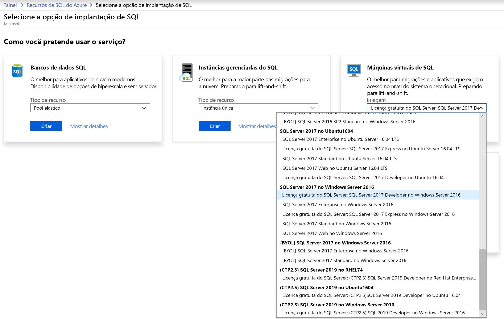
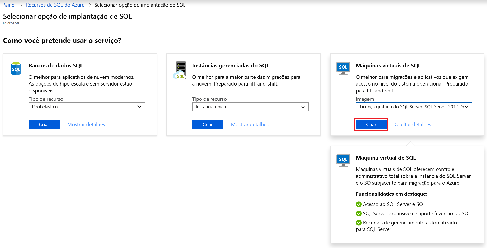
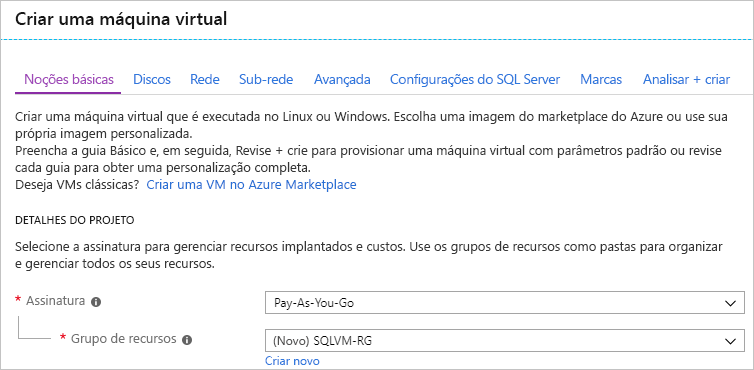
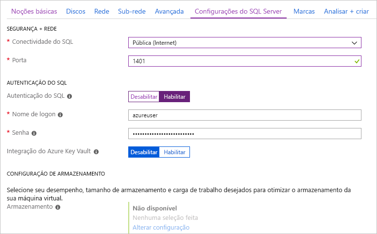
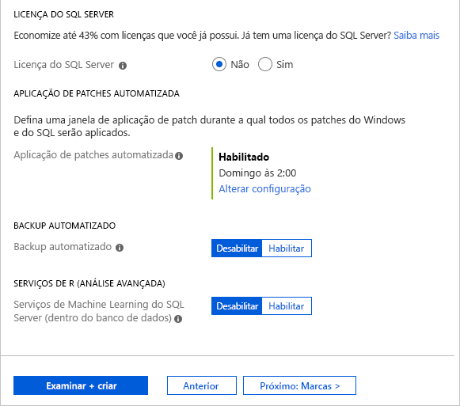
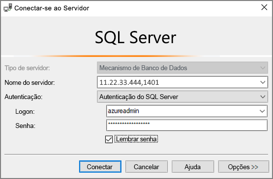

# Início Rápido: Criar um SQL Server 2017 em uma máquina virtual do Windows no portal do Azure

[!INCLUDE[appliesto-sqlvm](../../includes/appliesto-sqlvm.md)]

> [!div class="op_single_selector"]
> * [Windows](sql-vm-create-portal-quickstart.md)
> * [Linux](../linux/sql-vm-create-portal-quickstart.md)

Este início rápido descreve a criação de uma VM (máquina virtual) do SQL Server no portal do Azure.

  > [!TIP]
  > - Este início rápido fornece um caminho para provisionar rapidamente e conectar-se a uma VM do SQL. Para obter mais informações sobre outras opções de provisionamento da VM do SQL, confira o [Guia de provisionamento do SQL Server em uma VM do Windows no portal do Azure](create-sql-vm-portal.md).
  > - Em caso de dúvidas sobre máquinas virtuais do SQL Server, consulte as [Perguntas frequentes](frequently-asked-questions-faq.md).

##  Obter uma assinatura do Azure

Se você não tiver uma assinatura do Azure, crie uma [conta gratuita](https://azure.microsoft.com/free/?WT.mc_id=A261C142F) antes de começar.

##  Selecione uma imagem da VM do SQL Server

1. Entre no [portal do Azure](https://portal.azure.com) usando sua conta.

1. Selecione **SQL do Azure** no menu à esquerda do portal do Azure. Se o **SQL do Azure** não estiver na lista, selecione **Todos os serviços** e, em seguida, digite *SQL do Azure* na caixa de pesquisa.
1. Selecione **+Adicionar** para abrir a página **Selecionar opção de implantação do SQL**. Você pode exibir informações adicionais selecionando **mostrar detalhes** no bloco **máquinas virtuais do SQL**.
1. Selecione a imagem **Licença Gratuita do SQL Server: Imagem do SQL Server 2017 Developer no Windows Server 2016** da lista suspensa.

   

1. Selecione **Criar**.

   

##  Forneça detalhes básicos

Na folha **Informações Básicas** , forneça as seguintes informações:

1. Na seção **Detalhes do Projeto** , selecione sua assinatura do Azure e, em seguida, selecione **Criar novo** para criar um grupo de recursos. Digite _SQLVM-RG_ para o nome.

   

1. Em **Detalhes da instância** :
    1. Digite _SQLVM_ para o **Nome da máquina virtual**. 
    1. Escolha uma localização para sua **região**. 
    1. Para a finalidade deste Início Rápido, mantenha **Opções de disponibilidade** definido como _Nenhuma redundância de infraestrutura necessária_. Para obter mais informações sobre as opções de disponibilidade, consulte [Disponibilidade](../../../virtual-machines/availability.md). 
    1. Na lista **Imagem** , selecione _Licença Gratuita do SQL Server: SQL Server 2017 Developer no Windows Server 2016_. 
    1. Escolha **Alterar tamanho** para o **Tamanho** da máquina virtual e selecione a oferta **A2 Básico**. Limpe os recursos assim que terminar de trabalhar com eles para evitar encargos inesperados. 

   

1. Em **Conta de administrador** , forneça um nome de usuário, como _azureuser_ e uma senha. A senha deve ter no mínimo 12 caracteres e atender a [requisitos de complexidade definidos](../../../virtual-machines/windows/faq.md#what-are-the-password-requirements-when-creating-a-vm).

   

1. Em **Regras de portas de entrada** , escolha **Permitir portas selecionadas** e, em seguida, selecione **RDP (3389)** na lista suspensa. 

   

## Configurações do SQL Server

Na guia **Configurações do SQL Server** , configure as seguintes opções:

1. Em **Segurança e Rede** , selecione _Pública (Internet_ ) para **Conectividade do SQL** e altere a porta para `1401` a fim de evitar o uso de um número de porta conhecido no cenário público. 
1. Em **Autenticação do SQL** , selecione **Habilitar**. As credenciais de logon do SQL são definidas com o mesmo nome de usuário e a senha que você configurou para a VM. Use a configuração padrão para a [**Integração do Azure Key Vault**](azure-key-vault-integration-configure.md). A **configuração de armazenamento** não está disponível para a imagem básica de VM do SQL Server, mas você pode encontrar mais informações sobre as opções disponíveis para outras imagens na [configuração do armazenamento](storage-configuration.md#new-vms).  

   

1. Altere outras configurações, se necessário e, em seguida, selecione **Examinar + criar**. 

   

## Criar a VM do SQL Server

Na guia **Examinar + criar** , examine o resumo e selecione **Criar** para criar o SQL Server, o grupo de recursos e os recursos específicos dessa VM.

Você pode monitorar a implantação no portal do Azure. O botão **Notificações** na parte superior da tela mostra o status básico da implantação. A implantação pode levar vários minutos. 

## Conecte-se ao SQL Server

1. No portal, localize o **Endereço IP público** da VM do SQL Server na seção **Visão Geral** das propriedades da máquina virtual.

1. Em outro computador conectado à Internet, abra o [SSMS (SQL Server Management Studio)](/sql/ssms/download-sql-server-management-studio-ssms).

1. Na caixa de diálogo **Conectar ao Servidor** ou **Conectar ao Mecanismo de Banco de Dados** , edite o valor **Nome do servidor**. Insira o endereço IP público da VM. Em seguida, adicione uma vírgula e a porta personalizada ( **1401** ) que você especificou quando configurou a nova VM. Por exemplo, `11.22.33.444,1401`.

1. Na caixa **Autenticação** , selecione **Autenticação do SQL Server**.

1. Na caixa **Login** , digite o nome de um login válido do SQL.

1. Na caixa **Senha** , digite a senha de login.

1. Selecione **Conectar**.

    

##  Faça logon na VM remotamente

Use as etapas a seguir para se conectar à máquina virtual do SQL Server com a Área de Trabalho Remota:

[!INCLUDE [Connect to SQL Server VM with remote desktop](../../../../includes/virtual-machines-sql-server-remote-desktop-connect.md)]

Depois de se conectar à máquina virtual do SQL Server, você pode iniciar o SQL Server Management Studio e conectar-se à Autenticação do Windows usando suas credenciais de administrador local. Se você habilitou a Autenticação do SQL Server, também será possível se conectar com a Autenticação do SQL usando o logon e a senha do SQL configurados durante o provisionamento.

O acesso à máquina permite que você altere diretamente as configurações da máquina e do SQL Server com base em suas necessidades. Por exemplo, você pode definir as configurações do firewall ou alterar as configuração do SQL Server.

## Limpar os recursos

Se você não precisar que sua VM do SQL seja executada continuamente, será possível interrompê-la quando não estiver em uso para evitar encargos desnecessários. Você pode excluir também permanentemente todos os recursos associados à máquina virtual excluindo seu grupo de recursos associado no portal. Isso excluirá permanentemente a máquina virtual também, portanto, use esse comando com cuidado. Para obter mais informações, consulte [Gerenciar recursos do Azure pelo portal](../../../azure-resource-manager/management/manage-resource-groups-portal.md).

## Próximas etapas

Neste Início Rápido, você criou uma máquina virtual do SQL Server 2017 no portal do Azure. Para saber mais sobre como migrar seus dados para o novo SQL Server, consulte o artigo a seguir.

> [!div class="nextstepaction"]
> [Migrar um banco de dados para uma VM do SQL](migrate-to-vm-from-sql-server.md)