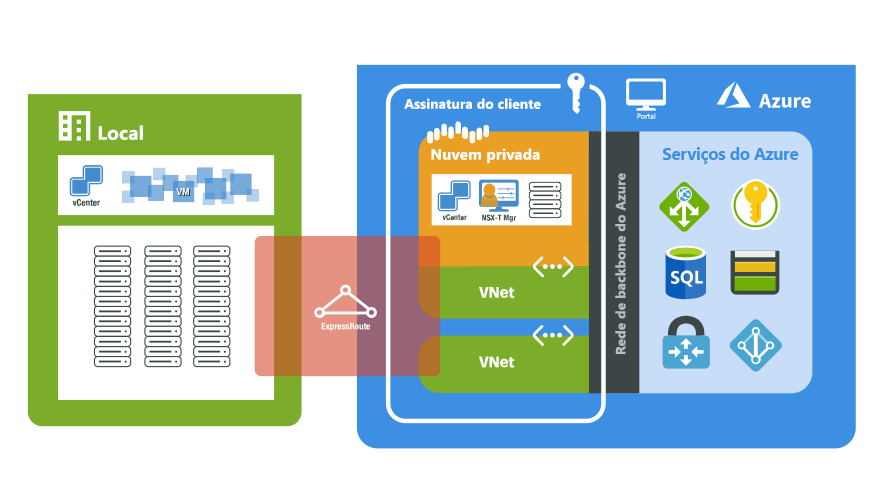

# O que é a versão prévia da Solução VMware no Azure?

A Solução VMware no Azure fornece nuvens privadas no Azure. As nuvens privadas contêm clusters de vSphere, criados com base na infraestrutura bare-metal dedicada do Azure. Você pode escalar clusters da nuvem privada de 3 para 16 hosts, com a capacidade de ter vários clusters em uma só nuvem privada. Todas as nuvens privadas são provisionadas com o vCenter Server, o vSAN, o vSphere e o NSX-T. Você pode migrar cargas de trabalho de seus ambientes locais, criar ou implantar máquinas virtuais e consumir serviços do Azure de suas nuvens privadas.

A Solução VMware no Azure é uma solução validada pela VMware, com validação contínua e testes de aprimoramentos e atualizações. O software e a infraestrutura de nuvem privada são gerenciados e mantidos pela Microsoft, permitindo que você se concentre no desenvolvimento e na execução das cargas de trabalho em suas nuvens privadas.

O diagrama a seguir mostra a adjacência entre as nuvens privadas e as VNets no Azure, nos serviços do Azure e nos ambientes locais. O acesso à rede das nuvens privadas para os serviços do Azure ou VNets fornece integração controlada por SLA dos pontos de extremidade de serviço do Azure. O acesso à nuvem privada de ambientes locais usa o Alcance Global do ExpressRoute para estabelecer conexões privadas e seguras.

## Hosts, clusters e nuvens privadas

As nuvens privadas e os clusters da Solução VMware no Azure são criados com base em um host de infraestrutura bare-metal hiperconvergente do Azure. Os hosts de alto nível têm 576 GB de RAM e processadores Intel duplos de 18 núcleos, com 2,3 GHz. Esses hosts de alto nível têm dois grupos de discos vSAN com um nível de capacidade bruta total do vSAN (SSD) de 15,36 TB e um nível de cache do vSAN (NVMe) de 3,2 TB.

Novas nuvens privadas são implantadas por meio do portal do Azure ou da CLI do Azure.

## Rede

Quando uma nuvem privada é implantada, redes privadas para gerenciamento, provisionamento e vMotion são criadas. Essas redes privadas são usadas para acessar o vCenter e o NSX-T Manager, bem como para o vMotion ou a implantação da máquina virtual. Todas as redes privadas podem ser acessadas de uma VNet no Azure ou de ambientes locais. O Alcance Global do ExpressRoute é usado para conectar nuvens privadas a ambientes locais. Essa conexão requer uma VNet com um circuito do ExpressRoute em sua assinatura.

O acesso à Internet e aos serviços do Azure é provisionado quando uma nuvem privada é implantada. O acesso é fornecido para que as VMs em redes de carga de trabalho de produção possam consumir serviços do Azure ou baseados na Internet. O acesso à Internet é desabilitado por padrão para novas nuvens privadas e pode ser habilitado ou desabilitado a qualquer momento.

Para obter mais informações sobre rede e interconectividade, confira o artigo [Conceitos de rede](concepts-networking.md).

## Acesso e segurança

Para aumentar a segurança, as nuvens privadas da Solução VMware no Azure usam o controle de acesso baseado em função do vSphere. Os recursos de LDAP com SSO do vSphere podem ser integrados ao Azure Active Directory. Para obter mais informações sobre identidade e privilégios, confira o artigo [Conceitos de acesso e identidade](concepts-identity.md).

A criptografia de dados em repouso do vSAN é habilitada por padrão e é usada para fornecer segurança ao armazenamento de dados do vSAN. Ela é descrita com mais detalhes no artigo [Conceitos de armazenamento](concepts-storage.md).

## Manutenção do ciclo de vida do host e do software

As atualizações regulares da nuvem privada da Solução VMware no Azure e do software da VMware garantem que a segurança, a estabilidade e os conjuntos de recursos mais recentes estejam em execução nas suas nuvens privadas. Mais detalhes sobre a manutenção e as atualizações da plataforma estão disponíveis no artigo [conceitos de atualização](concepts-upgrades.md).

## Monitoramento da nuvem privada

Use os [Logs do Azure Monitor](../azure-monitor/overview.md) para coletar os logs nas máquinas virtuais em execução na nuvem privada da Solução VMware no Azure. [Baixe e instale o agente MMA](../azure-monitor/platform/log-analytics-agent.md#installation-options) nas máquinas virtuais do Windows e do Linux em execução nas nuvens privadas da Solução VMware no Azure, usando as mesmas consultas executadas nas VMs locais. Você pode executar as mesmas consultas que normalmente executaria em suas máquinas virtuais, da mesma maneira. Para saber mais sobre a criação de consultas, confira [como escrever consultas](../azure-monitor/log-query/log-query-overview.md#how-can-i-learn-how-to-write-queries).

## Próximas etapas

A próxima etapa é aprender os [conceitos chave do cluster e da nuvem privada](concepts-private-clouds-clusters.md).

<!-- LINKS - external -->

<!-- LINKS - internal -->
[concepts-private-clouds-clusters]: ./concepts-private-clouds-clusters.md
