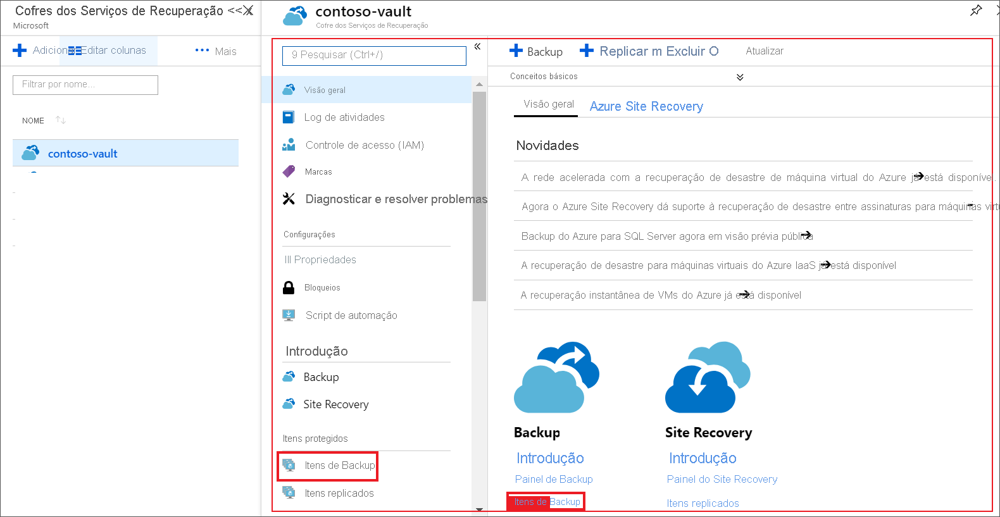
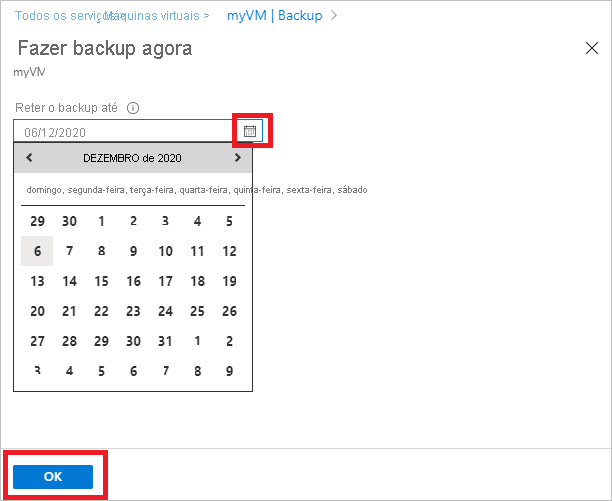

# Gerenciar backups de VM do Azure com o serviço de backup do Azure

Este artigo descreve como gerenciar VMs (máquinas virtuais) do Azure cujo backup é feito usando o serviço de [backup do Azure](backup-overview.md). O artigo também resume as informações de backup que você pode encontrar no painel do cofre.

No portal do Azure, o painel do cofre dos serviços de recuperação fornece acesso a informações do cofre, incluindo:

* O backup mais recente, que também é o ponto de restauração mais recente.
* A política de backup.
* O tamanho total de todos os instantâneos de backup.
* O número de VMs que estão habilitadas para backups.

Você pode gerenciar backups usando o painel e fazendo Drill down para VMs individuais. Para iniciar os backups do computador, abra o cofre no painel.

## Exibir VMs no painel

Para exibir as VMs no painel do cofre:

1. Entre no [portal do Azure](https://portal.azure.com/).
2. No menu Hub, selecione **procurar**. Na lista de recursos, digite **Serviços de Recuperação**. Conforme você digita, a lista é filtrada com base em sua entrada. Selecione **Cofres de Serviços de Recuperação**.

    

3. Para facilitar o uso, clique com o botão direito do mouse no cofre e selecione **fixar no painel**.
4. Abra o painel do cofre.

    

5. No bloco **itens de backup** , selecione **máquinas virtuais do Azure**.

    

6. No painel **itens de backup** , você pode exibir a lista de VMs protegidas. Neste exemplo, o cofre protege uma máquina virtual: demobackup.  

    

7. No painel do item do cofre, modifique as políticas de backup, execute um backup sob demanda, pare ou retome a proteção de VMs, exclua dados de backup, exiba pontos de restauração e execute uma restauração.

    

## Gerenciar a política de backup para uma VM

Para gerenciar uma política de backup:

1. Entre no [portal do Azure](https://portal.azure.com/). Abra o painel do cofre.
2. No bloco **itens de backup** , selecione **máquinas virtuais do Azure**.

    

3. No painel **itens de backup** , você pode exibir a lista de VMs protegidas e o status do último backup com o tempo dos pontos de restauração mais recentes.

    

4. No painel do item do cofre, você pode selecionar uma política de backup.

   * Para alternar políticas, selecione uma política diferente e, em seguida, selecione **salvar**. A nova política será aplicada imediatamente no cofre.

     

## Executar um backup sob demanda

Você pode executar um backup sob demanda de uma VM depois de configurar sua proteção. Tenha estes detalhes em mente:

* Se o backup inicial estiver pendente, o backup sob demanda criará uma cópia completa da VM no cofre dos serviços de recuperação.
* Se o backup inicial for concluído, um backup sob demanda só enviará alterações do instantâneo anterior para o cofre dos serviços de recuperação. Ou seja, os backups posteriores são sempre incrementais.
* O período de retenção para um backup sob demanda é o valor de retenção que você especifica ao disparar o backup.

Para disparar um backup sob demanda:

1. No [painel do item do cofre](#view-vms-on-the-dashboard), em **item protegido**, selecione **item de backup**.

    

2. Em **tipo de gerenciamento de backup**, selecione **máquina virtual do Azure**. O painel **item de backup (máquina virtual do Azure)** é exibido.
3. Selecione uma VM e selecione **fazer backup agora** para criar um backup sob demanda. O painel **fazer backup agora** é exibido.
4. No campo **reter backup até** , especifique uma data para o backup a ser retido.

    

5. Selecione **OK** para executar o trabalho de backup.

Para acompanhar o progresso do trabalho, no painel do cofre, selecione o bloco **trabalhos de backup** .

## Interromper a proteção de uma VM

Há duas maneiras de interromper a proteção de uma VM:

* **Interromper a proteção e manter os dados de backup**. Esta opção impedirá que todos os trabalhos de backup futuros protejam sua VM; no entanto, o serviço de backup do Azure manterá os pontos de recuperação que foram armazenados em backup.  Você precisará pagar para manter os pontos de recuperação no cofre (consulte [preços de backup do Azure](https://azure.microsoft.com/pricing/details/backup/) para obter detalhes). Você poderá restaurar a VM, se necessário. Se você decidir retomar a proteção da VM, poderá usar a opção *retomar backup* .
* **Interrompa a proteção e exclua os dados de backup**. Esta opção impedirá que todos os trabalhos de backup futuros protejam sua VM e exclua todos os pontos de recuperação. Você não poderá restaurar a VM nem usar a opção *retomar backup* .

>[!NOTE]
>Se você excluir uma fonte de dados sem interromper os backups, os novos backups falharão. Os pontos de recuperação antigos expirarão de acordo com a política, mas um último ponto de recuperação será sempre mantido até que você interrompa os backups e exclua os dados.
>

### Interromper a proteção e manter os dados de backup

Para interromper a proteção e manter os dados de uma VM:

1. No [painel do item do cofre](#view-vms-on-the-dashboard), selecione **parar backup**.
2. Escolha **reter dados de backup**e confirme sua seleção, conforme necessário. Se desejar, adicione um comentário. Se você não tiver certeza do nome do item, passe o mouse sobre o ponto de exclamação para exibir o nome.

    

Uma notificação permite que você saiba que os trabalhos de backup foram interrompidos.

### Interromper a proteção e excluir dados de backup

Para interromper a proteção e excluir dados de uma VM:

1. No [painel do item do cofre](#view-vms-on-the-dashboard), selecione **parar backup**.
2. Escolha **excluir dados de backup**e confirme sua seleção, conforme necessário. Insira o nome do item de backup e adicione um comentário, se desejar.

    

## Retomar a proteção de uma VM

Se você escolheu a opção [parar proteção e manter dados de backup](#stop-protection-and-retain-backup-data) durante a proteção da VM de parada, você pode usar o **retomar backup**. Essa opção não estará disponível se você escolher a opção [parar proteção e excluir dados de backup](#stop-protection-and-delete-backup-data) ou [excluir dados de backup](#delete-backup-data).

Para retomar a proteção de uma VM:

1. No [painel do item do cofre](#view-vms-on-the-dashboard), selecione **retomar backup**.

2. Siga as etapas em [gerenciar políticas de backup](#manage-backup-policy-for-a-vm) para atribuir a política para a VM. Você não precisa escolher a política de proteção inicial da VM.
3. Depois de aplicar a política de backup à VM, você verá a seguinte mensagem:

    

## Excluir dados de backup

Há duas maneiras de excluir os dados de backup de uma VM:

* No painel do item do cofre, selecione parar backup e siga as instruções para [parar proteção e excluir dados de backup](#stop-protection-and-delete-backup-data) .

  

* No painel do item do cofre, selecione excluir dados de backup. Essa opção será habilitada se você tiver optado por [interromper a proteção e manter a opção de dados de backup](#stop-protection-and-retain-backup-data) durante a proteção da VM de parada

  

  * No [painel do item do cofre](#view-vms-on-the-dashboard), selecione **excluir dados de backup**.
  * Digite o nome do item de backup para confirmar que você deseja excluir os pontos de recuperação.

    

  * Para excluir os dados de backup do item, selecione **excluir**. Uma mensagem de notificação permite que você saiba que os dados de backup foram excluídos.

Para proteger seus dados, o backup do Azure inclui o recurso de exclusão reversível. Com a exclusão reversível, mesmo após o backup (todos os pontos de recuperação) de uma VM é excluído, os dados de backup são mantidos por 14 dias adicionais. Para obter mais informações, consulte [a documentação de exclusão reversível](https://docs.microsoft.com/azure/backup/backup-azure-security-feature-cloud).

  > [!NOTE]
  > Ao excluir dados de backup, você exclui todos os pontos de recuperação associados. Você não pode escolher pontos de recuperação específicos para excluir.

### Item de backup em que a fonte de dados primária não existe mais

* Se as VMs do Azure configuradas para o backup do Azure forem excluídas ou movidas sem interromper a proteção, os trabalhos de backup agendados e os trabalhos de backup sob demanda (ad-hoc) falharão com o erro UserErrorVmNotFoundV2. A pré-verificação de backup será exibida como crítica somente para trabalhos de backup sob demanda com falha (trabalhos agendados com falha não são exibidos).
* Esses itens de backup permanecem ativos no sistema que aderem à política de backup e retenção definida pelo usuário. Os dados de backup para essas VMs do Azure serão mantidos de acordo com a política de retenção. Os pontos de recuperação expirados (exceto o último ponto de recuperação) são limpos de acordo com o período de retenção definido na política de backup.
* Os usuários são recomendados para excluir os itens de backup em que a fonte de dados primária não existe mais para evitar custos adicionais, se o item/dados de backup dos recursos de exclusão não for mais necessário, pois o último ponto de recuperação é mantido para sempre e o usuário é cobrado de acordo com o preço de backup aplicável.

## Próximas etapas

* Saiba como [fazer backup de VMs do Azure nas configurações da VM](backup-azure-vms-first-look-arm.md).
* Saiba como [restaurar VMs](backup-azure-arm-restore-vms.md).
* Saiba como [monitorar backups de VM do Azure](backup-azure-monitor-vms.md).
