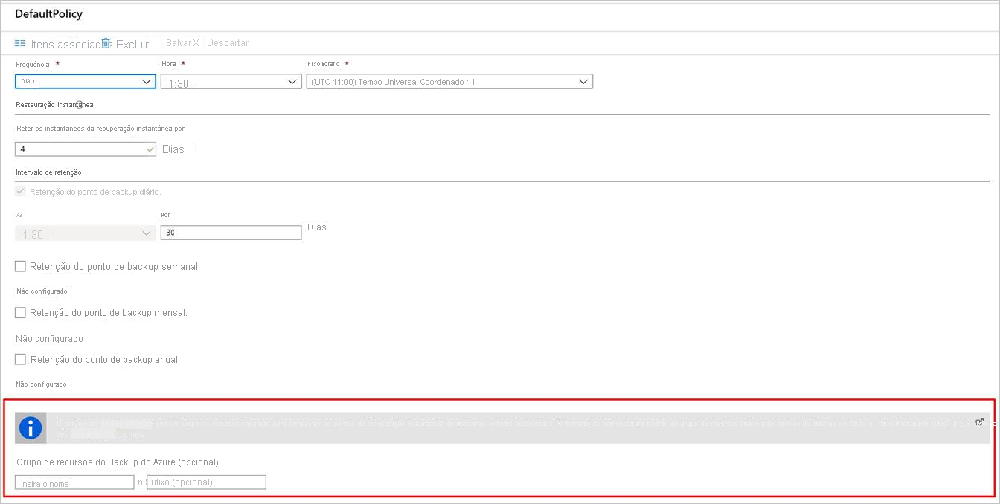
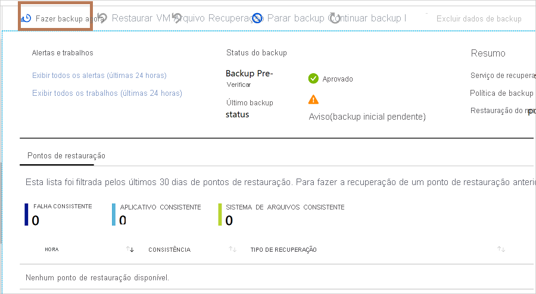

# Habilitar o backup ao criar uma VM do Azure

Use o serviço de backup do Azure para fazer backup de máquinas virtuais (VMs) do Azure. As VMs são copiadas de acordo com um cronograma especificado em uma política de backup, e os pontos de recuperação são criados a partir de backups. Os pontos de recuperação são armazenados nos cofres dos Serviços de Recuperação.

Este artigo detalha como ativar o backup quando você cria uma máquina virtual (VM) no portal Azure.  

## Antes de começar

- [Verifique](backup-support-matrix-iaas.md#supported-backup-actions) quais sistemas operacionais são suportados se você habilitar backup quando criar uma VM.

## Entrar no Azure

Se você ainda não fez login na sua conta, faça login no [portal Azure](https://portal.azure.com).

## Crie uma VM com backup configurado

1. No portal Azure, clique **em Criar um recurso**.

2. No Azure Marketplace, clique **em Computação**e selecione uma imagem VM.

3. Configure a VM de acordo com as instruções do [Windows](https://docs.microsoft.com/azure/virtual-machines/windows/quick-create-portal) ou [Linux.](https://docs.microsoft.com/azure/virtual-machines/linux/quick-create-portal)

4. Na guia **'Gerenciamento',** em **Ativar backup**, clique **em 'Ativação**.
5. Backup do Azure faz backup em um cofre dos Serviços de Recuperação. Clique **em Criar novo** se você não tiver um cofre existente.
6. Aceite o nome do cofre sugerido ou especifique o seu próprio.
7. Especifique ou crie um grupo de recursos no qual o cofre será localizado. O cofre do grupo de recursos pode ser diferente do grupo de recursos VM.

    

8. Aceite a diretiva de backup padrão ou modifique as configurações.
    - Uma política de backup especifica com que freqüência tirar instantâneos de backup da VM e quanto tempo para manter essas cópias de backup.
    - A política padrão apoia a VM uma vez por dia.
    - Você pode personalizar sua própria política de backup para uma VM Azure para fazer backups diariamente ou semanalmente.
    - [Saiba mais](backup-azure-vms-introduction.md#backup-and-restore-considerations) sobre considerações de backup para VMs do Azure.
    - [Saiba mais](backup-instant-restore-capability.md) sobre a funcionalidade de restauração instantânea.

      

## Grupo de recursos do Azure Backup para Máquinas Virtuais

O serviço backup cria um grupo de recursos separado (RG), diferente do grupo de recursos da VM para armazenar a coleção de pontos de restauração (RPC). A RPC abriga os pontos de recuperação instantânea de VMs gerenciados. O formato de nomeação padrão do grupo de `AzureBackupRG_<Geo>_<number>`recursos criado pelo serviço Backup é: . Por exemplo: *AzureBackupRG_northeurope_1*. Agora você pode personalizar o nome do grupo Resource criado pelo Azure Backup.

Pontos a serem observados:

1. Você pode usar o nome padrão do RG ou editá-lo de acordo com os requisitos da sua empresa.
2. Você fornece o padrão de nome RG como entrada durante a criação da política de backup da VM. O nome RG deve ser `<alpha-numeric string>* n <alpha-numeric string>`do seguinte formato: . 'n' é substituído por um inteiro (a partir de 1) e é usado para dimensionar se o primeiro RG estiver cheio. Um RG pode ter um máximo de 600 RPCs hoje.
              
3. O padrão deve seguir as regras de nomeação rg abaixo e o comprimento total não deve exceder o comprimento máximo permitido do nome RG.
    1. Os nomes de grupos de recursos só permitem caracteres alfanuméricos, períodos, sublinhados, hífens e parênteses. Eles não podem terminar em um período.
    2. Os nomes do grupo de recursos podem conter até 74 caracteres, incluindo o nome do RG e do sufixo.
4. O `<alpha-numeric-string>` primeiro é obrigatório, enquanto o segundo após 'n' é opcional. Isso só se aplica se você der um nome personalizado. Se você não inserir nada em nenhuma das caixas de texto, o nome padrão será usado.
5. Você pode editar o nome do RG modificando a política se e quando necessário. Se o padrão de nome for alterado, novos RPs serão criados no novo RG. No entanto, os RPs antigos ainda residirão no RG antigo e não serão movidos, pois o RP Collection não suporta movimentação de recursos. Eventualmente, os RPs receberão lixo coletado à medida que os pontos expirarem.

6. É aconselhável não bloquear o grupo de recursos criado para uso pelo serviço backup.

## Inicie um backup depois de criar o VM

O backup da VM será executado de acordo com sua política de backup. No entanto, recomendamos que você execute um backup inicial.

Depois que a VM for criada, faça o seguinte:

1. Nas propriedades VM, clique **em Backup**. O status da VM é backup inicial pendente até que o backup inicial seja executado
2. Clique **em Fazer backup agora** para executar um backup sob demanda.

    

## Use um modelo de Gerenciador de recursos para implantar uma VM protegida

As etapas anteriores explicam como usar o portal Azure para criar uma máquina virtual e protegê-la em um cofre de Serviços de Recuperação. Para implantar rapidamente uma ou mais VMs e protegê-las em um cofre de Serviços de Recuperação, consulte o modelo [Implantar uma VM do Windows e ativar o backup](https://azure.microsoft.com/resources/templates/101-recovery-services-create-vm-and-configure-backup/).

## Próximas etapas

Agora que você protegeu sua VM, aprenda como gerenciá-los e restaurá-los.

- [Gerenciar e monitorar VMs](backup-azure-manage-vms.md)
- [Restaurar VM](backup-azure-arm-restore-vms.md)

Se você encontrar algum problema, [revise](backup-azure-vms-troubleshoot.md) o guia de solução de problemas.
