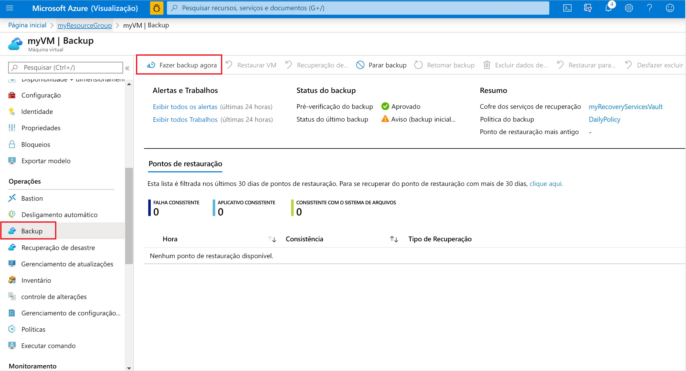
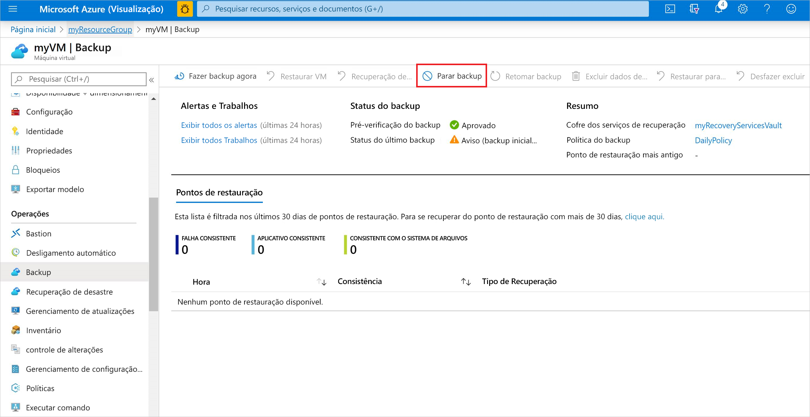

# Fazer backup de uma máquina virtual no Azure

Os backups do Azure podem ser criados por meio do portal do Azure. Esse método fornece uma interface de usuário baseada em navegador para criar e configurar os backups do Azure e todos os recursos relacionados. Você pode proteger seus dados fazendo backups em intervalos regulares. O Backup do Azure cria pontos de recuperação que são armazenados em cofres de recuperação com redundância geográfica. Este artigo fornece detalhes sobre como fazer backup de uma máquina virtual (VM) com o portal do Azure.

Este início rápido habilita o backup em uma VM do Azure existente. Se você precisar criar uma máquina virtual, poderá [criar uma máquina virtual com o portal do Azure](../virtual-machines/windows/quick-create-portal.md).

## Entrar no Azure

Entre no [portal do Azure](https://portal.azure.com).

## Selecionar uma máquina virtual para fazer backup

Crie um backup diário agendado simples em um cofre dos Serviços de Recuperação.

1. No menu à esquerda, selecione **Máquinas virtuais**.
2. Na lista, escolha uma máquina virtual para fazer backup. Se você tiver usado os comandos de início rápido da VM de exemplo, a VM se chamará *myVM* no grupo de recursos *myResourceGroup*.
3. Na seção **Operações**, escolha **Backup**. A janela **Habilitar backup** será aberta.

## Habilitar o backup em uma máquina virtual

Um cofre dos Serviços de Recuperação é um contêiner lógico que armazena os dados de backup para cada recurso protegido, como VMs do Azure. Quando o trabalho de backup para um recurso protegido é executado, ele cria um ponto de recuperação no cofre dos Serviços de Recuperação. Você pode usar um desses pontos de recuperação para restaurar dados para um determinado ponto no tempo.

1. Selecione **Criar novo** e forneça um nome para o novo cofre, tais como *myRecoveryServicesVault*.
2. Se ainda não tiver selecionado, escolha **Usar existente** e então selecione o grupo de recursos da VM no menu suspenso.

    

    Por padrão, o cofre é definido para o armazenamento com redundância geográfica. Para proteger ainda mais os seus dados, esse nível de redundância de armazenamento garante que os dados de backup sejam replicados para uma região secundária do Azure a centenas de quilômetros de distância da região primária.

    Criar e usar políticas para definir quando um trabalho de backup é executado e por quanto tempo os pontos de recuperação serão armazenados. A política de proteção padrão executa um trabalho de backup a cada dia e retém pontos de recuperação por 30 dias. Você pode usar esses valores de política padrão para proteger rapidamente sua VM.

3. Para aceitar os valores de política de backup padrão, selecione **Habilitar Backup**.

Ele demora alguns minutos para criar o cofre dos Serviços de Recuperação.

## Iniciar um trabalho de backup

Você pode iniciar um backup agora em vez de aguardar a política padrão executar o trabalho no horário agendado. O primeiro trabalho de backup cria um ponto de recuperação completa. Cada trabalho de backup depois que o backup inicial cria pontos de recuperação incremental. Os pontos de recuperação incrementais são eficientes em termos de armazenamento e de tempo, já que eles transferem somente as alterações feitas desde o último backup.

1. Na janela **Backup** para sua VM, selecione **Fazer backup agora**.

    

2. Para aceitar a política de retenção de backup de 30 dias, deixe a data **Reter Backup até** padrão. Para iniciar o trabalho, selecione **Backup**.

## Monitorar o trabalho de backup

Na janela **Backup** para sua VM, o status do backup e o número de pontos de restauração concluídos são mostrados. Quando o trabalho de backup da VM for concluído, as informações sobre a **Hora do último backup**, o **Ponto de restauração mais recente** e o **Ponto de restauração mais antigo** serão mostradas no lado direito da janela **Visão geral**.

## Limpar a implantação

Quando não for mais necessária, você poderá desabilitar a proteção na máquina virtual, remover os pontos de restauração e o cofre dos Serviços de Recuperação, então excluir o grupo de recursos e recursos associados de VM

Se você pretende prosseguir para um tutorial de Backup que explica como restaurar dados para sua VM, ignore as etapas desta seção e vá para [Próximas etapas](#next-steps).

1. Selecione a opção **Backup** para sua VM.

2. Escolha **Parar backup**.

    

3. Selecione **Excluir Dados de Backup** no menu suspenso.

4. Na caixa de diálogo **Digite o nome do item de Backup**, insira seu nome VM, como *myVM*. Selecionar **Parar Backup**.

    Depois que o backup VM tiver sido interrompido e os pontos de recuperação removidos, você pode excluir o grupo de recursos. Se você tiver uma VM existente, poderá deixar o grupo de recursos e a VM em vigor.

5. No menu à esquerda, selecione **Grupos de recursos**.
6. Na lista, escolha o grupo de recursos. Se você tiver usado os comandos de início rápido de VM de exemplo, o grupo de recursos será denominado *myResourceGroup*.
7. Selecione **Excluir grupo de recursos**. Para confirmar, insira o nome do grupo de recursos, selecione **Excluir**.

    

## Próximas etapas

Neste início rápido, você criou um cofre dos Serviços de Recuperação, habilitou a proteção em uma VM e criou o ponto de recuperação inicial. Para saber mais sobre os Serviços de Recuperação e o Backup do Azure, prossiga para os tutoriais.

> [!div class="nextstepaction"]
> [Fazer backup de várias VMs do Azure](./tutorial-backup-vm-at-scale.md)
