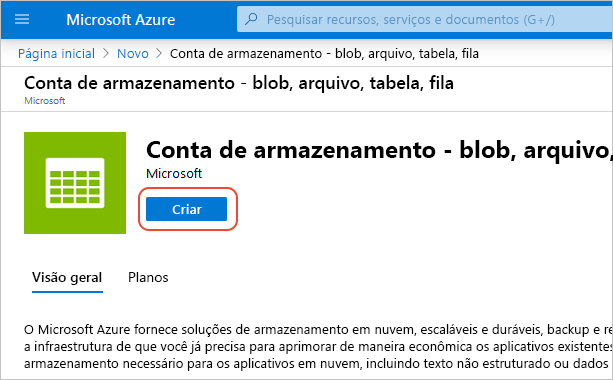
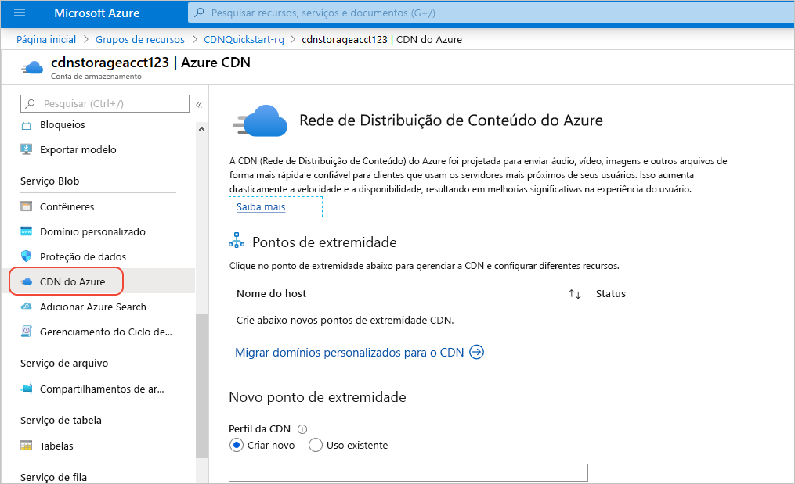
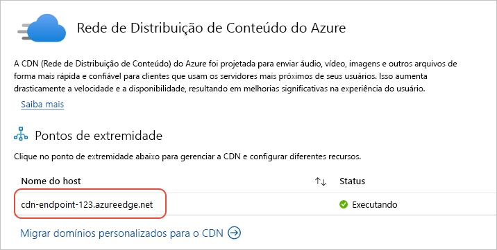

# Início Rápido: Integrar uma conta de Armazenamento do Azure à CDN do Azure

Neste início rápido, você habilita a [Rede de Distribuição de Conteúdo (CDN) do Azure](cdn-overview.md) para armazenar em cache o conteúdo do Armazenamento do Azure. A CDN do Azure oferece aos desenvolvedores uma solução global para fornecimento de conteúdo de alta largura de banda. Ele consegue armazenar em cache blobs e conteúdo estático de instâncias de computação em nós físicos nos Estados Unidos, na Europa, na Ásia, na Austrália e na América do Sul.

## Pré-requisitos

- Uma conta do Azure com uma assinatura ativa. [Crie uma conta gratuitamente](https://azure.microsoft.com/free/?ref=microsoft.com&utm_source=microsoft.com&utm_medium=docs&utm_campaign=visualstudio).

## Entre no Portal do Azure

Entre no [portal do Azure](https://portal.azure.com) com sua conta do Azure.

## Criar uma conta de armazenamento

A conta de armazenamento dá acesso aos serviços de Armazenamento do Microsoft Azure. A conta de armazenamento representa o mais alto nível do namespace para acessar cada um dos componentes do serviço de Armazenamento do Microsoft Azure: Blob do Azure, Fila e Tabela: Blob do Azure, fila e Armazenamento de Tabela. Para obter mais informações, consulte: [Introdução ao Armazenamento do Microsoft Azure](../storage/common/storage-introduction.md) .

Para criar uma conta de armazenamento, você deve ser o administrador de serviços ou um coadministrador da assinatura associada.

1. No portal do Azure, selecione **Criar um recurso** no canto superior esquerdo. O **Novo** painel é exibido.

1. Pesquise **Conta de armazenamento** e selecione **Conta de armazenamento – blob, arquivo, tabela** de fila na lista suspensa. Em seguida, selecione **Criar**:
    
    

1. No painel **Criar conta de armazenamento**, insira os seguintes detalhes:

    | Configuração | Valor | 
    | --- | --- |
    | Detalhes do projeto > Grupo de recursos | Selecione **Criar** e use o nome *CDNQuickstart-rg*. Você também poderá usar um grupo de recursos existente, se preferir. |
    | Detalhes da instância > Nome da conta de armazenamento | Insira um nome para a conta usando apenas 3-24 letras minúsculas e números. O nome deve ser exclusivo no Azure e se torna o nome do host na URL usada para endereçar recursos de blob, fila ou tabela para a assinatura. Para resolver um recurso de contêiner no Armazenamento de Blobs, use um URI no seguinte formato: http:// *&lt;nomedacontadearmazenamento&gt;* .blob.core.windows.net/ *&lt;nome-do-contêiner&gt;* .
    | Detalhes da instância > Localização | Selecione uma região do Azure perto de você na lista suspensa. |
    
    Deixe todos os outros detalhes definidos para os padrões e, em seguida, selecione **Examinar + criar**.

1. A criação da conta de armazenamento pode levar vários minutos para ser concluída. Após a conclusão da criação, selecione **Ir para recurso** para abrir a página da conta de armazenamento para a próxima etapa.

## Habilitar a CDN do Azure para a conta de armazenamento

1. Na página de sua conta de armazenamento, selecione **Serviço Blob** > **CDN do Azure** no menu à esquerda. A página **CDN do Azure** é exibida.

    
    
1. Na seção **Novo ponto de extremidade**, insira as seguintes informações:

    | Configuração  | Valor |
    | -------- | ----- |
    | **Perfil do CDN** | Selecione **Criar** e insira seu nome de perfil, por exemplo, *cdn-profile-123*. Um perfil é uma coleção de pontos de extremidade. |
    | **Tipo de preços** | Selecione uma das opções **Standard**, como **Standard Microsoft**. |
    | **Nome do ponto de extremidade do CDN** | Insira o nome de host do ponto de extremidade, como *cdn-endpoint-123*. Esse nome deve ser globalmente exclusivo no Azure porque é para acessar os recursos armazenados em cache na URL _&lt;nome-do-ponto-de-extremidade&gt;_ .azureedge.net. |
    | **Nome do host de origem** | Por padrão, um novo ponto de extremidade CDN usa o nome do host de sua conta de armazenamento como o servidor de origem. |

1. Selecione **Criar**. Depois que o ponto de extremidade é criado, ele aparece na lista de pontos de extremidade.

    

> [!TIP]
> Se você deseja especificar as configurações avançadas para o ponto de extremidade CDN, como a [otimização do download de grandes arquivos](cdn-optimization-overview.md#large-file-download), use a [extensão da CDN do Azure](cdn-create-new-endpoint.md) para criar um perfil ou um ponto de extremidade CDN.

## Habilitar recursos adicionais da CDN

Na página da **CDN do Azure** da conta de armazenamento, selecione o ponto de extremidade da CDN na lista para abrir a página de configuração da CDN.

Nessa página, é possível habilitar recursos adicionais da CDN para sua entrega, como [compactação](cdn-improve-performance.md), [armazenamento em cache da cadeia de caracteres de consulta](cdn-query-string.md) e [filtragem de área geográfica](cdn-restrict-access-by-country.md). 
    
## Habilitar SAS

Se você deseja conceder acesso limitado aos contêineres de armazenamento privado, você pode usar o recurso de Assinatura de Acesso Compartilhado (SAS) de sua conta de Armazenamento do Azure. Uma SAS é um URI que concede direitos de acesso restrito aos seus recursos do armazenamento do Azure sem expor sua chave de conta. Para obter mais informações, consulte [Usar a CDN do Azure com o SAS](cdn-sas-storage-support.md).

## Acesse o conteúdo CDN

Para acessar o conteúdo armazenado em cache na CDN, utilize a URL da CDN fornecida no portal. O endereço de um blob armazenado em cache tem o seguinte formato:

http://<*nome-do-ponto-de-extremidade*\>.azureedge.net/<*meuContêinerPúbllico*\>/<*NomeDoBlob*\>

> [!NOTE]
> Depois de habilitar o acesso à CDN do Azure para uma conta de armazenamento, todos os objetos disponíveis publicamente estarão qualificados para armazenamento em cache de POP da CDN. Se você modificar um objeto que está armazenado em cache na CDN atualmente, o novo conteúdo não estará disponível por meio da CDN do Azure até que esta atualize seu conteúdo após o período de vida do conteúdo em cache expirar.

## Remover o conteúdo da CDN do Azure

Se não desejar mais armazenar em cache um objeto na CDN do Azure, você poderá executar uma das seguintes etapas:

- Torne o contêiner particular em vez de público. Para obter mais informações, confira [Gerenciar acesso anônimo de leitura aos contêineres e blobs](../storage/blobs/storage-manage-access-to-resources.md).
- Desabilite ou exclua o ponto de extremidade CDN usando o Portal do Azure.
- Modifique seu serviço hospedado para não responder a solicitações do objeto.

Um objeto que já está armazenado em cache na CDN do Azure permanecerá em cache até que o período de vida útil do objeto expire ou até que o ponto de extremidade seja [limpo](cdn-purge-endpoint.md). Quando o período de vida expira, a CDN do Azure determina se o ponto de extremidade CDN ainda é válido e se o objeto ainda pode ser acessado anonimamente. Se não for, o objeto não estará mais armazenado em cache.

## Limpar os recursos

Nas etapas anteriores, você criou um perfil CDN e um ponto de extremidade em um grupo de recursos. Salve esses recursos se você deseja ir para as [Próximas etapas](#next-steps) e saiba como adicionar um domínio personalizado em seu ponto de extremidade. No entanto, se você não espera usar esses recursos no futuro, poderá excluí-los ao excluir o grupo de recursos, evitando assim encargos adicionais:

1. No menu à esquerda no portal do Azure, selecione **Grupos de recursos** e *CDNQuickstart-rg*\*.

2. Na página **Grupo de recursos**, selecione **Excluir grupo de recursos**, digite *CDNQuickstart-rg* na caixa de texto e, em seguida, selecione **Excluir**.

    Essa ação excluirá o grupo de recursos, o perfil e o ponto de extremidade que você criou neste início rápido.

3. Para excluir sua conta de armazenamento, selecione-a no painel e selecione **Excluir** no menu superior.

## Próximas etapas

> [!div class="nextstepaction"]
> [Criar um perfil e um ponto de extremidade da CDN do Azure](cdn-create-new-endpoint.md)

> [!div class="nextstepaction"]
> [Tutorial: Usar a CDN para o conteúdo estático do servidor de um aplicativo Web](cdn-add-to-web-app.md)
