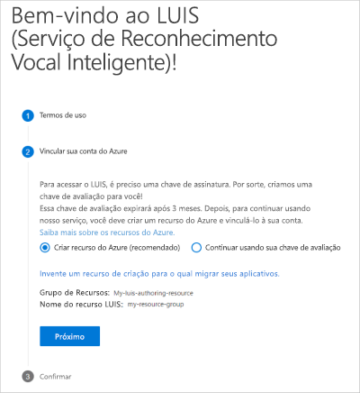
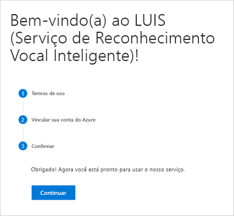

## Entrar no portal do LUIS

Um novo usuário do LUIS precisa seguir este procedimento:

1. Entre no [portal do LUIS (versão prévia)](https://preview.luis.ai), selecione seu país e aceite os Termos de Uso. Caso, em vez disso, você consulte **Meus aplicativos**, um recurso do LUIS já existirá e você deverá avançar e criar um aplicativo.

1. Selecionar **Criar recurso do Azure** e, em seguida, selecionar **Criar um recurso de criação para o qual migrar seus aplicativos.**

    

1. Preencher os detalhes do recurso.

    

    Ao **criar um novo recurso de criação**, forneça as seguintes informações:

    * **Nome do recurso** – um nome personalizado que você escolher, usado como parte da URL para as consultas de ponto de extremidade de criação e previsão.
    * **Locatário** – o locatário ao qual sua assinatura do Azure está associada.
    * **Nome da assinatura** – a assinatura que será cobrada pelo recurso.
    * **Grupo de recursos** – o nome de um grupo de recursos personalizado que você escolher ou criar. Os grupos de recursos permitem agrupar os recursos do Azure para acesso e gerenciamento.
    * **Local** – a escolha de local é baseada na seleção do **grupo de recursos**.
    * **Tipo de preço** – o tipo de preço determina a transação máxima por segundo e mês.

1. Um resumo do recurso a ser criado é exibido. Selecione **Avançar**.

    

1. Confirme selecionando **Continuar**.

    