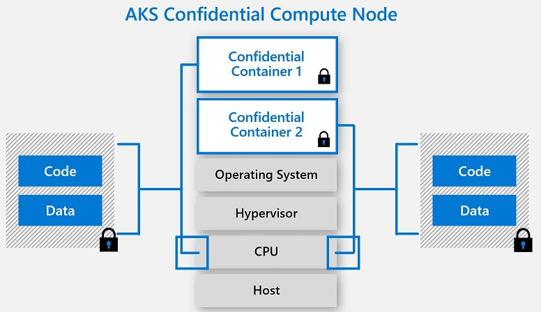

# Nós de computação confidencial no Serviço de Kubernetes do Azure (visualização pública)

A [computação confidencial do Azure](overview.md) permite que você proteja seus dados confidenciais enquanto eles estão sendo usados. As infraestruturas subjacentes protegem esses dados de outros aplicativos, administradores e provedores de nuvem. 

## Visão geral

O AKS (Serviço de Kubernetes do Azure) dá suporte à adição dos [nós de computação confidencial DCsv2](confidential-computing-enclaves.md) no Intel SGX. Esses nós executam cargas de trabalho confidenciais em um TEE (ambiente de execução confiável) baseado em hardware, permitindo que o código do nível do usuário seja alocado a regiões de memória privada. Essas regiões de memória privada são chamadas de enclaves. Os enclaves têm a finalidade de proteger o código e os dados contra processos em execução com privilégios mais elevados. O modelo de execução SGX remove as camadas intermediárias do SO convidado e do Hipervisor. Isso permite que você execute aplicativos de contêiner diretamente sobre a CPU, mantendo o bloco especial de memória criptografado. 

## Recursos dos Nós Confidenciais do AKS

- Isolamento de contêineres no nível do processo e baseado em hardware por meio de um TEE (ambiente de execução confiável) SGX 
- Clusters de pools de nós heterogêneos (mistura de pools de nós confidenciais e não confidenciais)
- Agendamento de pod baseado em memória EPC (Cache de Página Criptografada)
- Driver SGX DCAP pré-instalado
- Patch Intel FSGS pré-instalado
- Dá suporte ao dimensionamento automático de pod horizontal baseado em consumo e ao dimensionamento automático de cluster
- Auxiliar de atestado fora do proc por meio do DaemonSet do AKS
- Suporte para Contêineres Linux por meio dos nós de trabalho de VM do Ubuntu 18.04 Gen 2

## DaemonSets fornecidos pelo AKS

#### Plug-in de dispositivo SGX 

O Plug-in de dispositivo SGX implementa a interface de plug-in de dispositivo do Kubernetes para a memória EPC. Efetivamente, esse plug-in faz da memória EPC um tipo de recurso adicional no Kubernetes. Os usuários podem especificar limites para esse recurso, assim como ocorre com outros recursos. Além da função de agendamento, o plug-in do dispositivo ajuda a atribuir permissões do driver do dispositivo SGX aos contêineres de carga de trabalho confidenciais. Veja um exemplo de implementação da amostra de implantação baseada em memória EPC (`kubernetes.azure.com/sgx_epc_mem_in_MiB`) [aqui](https://github.com/Azure-Samples/confidential-computing/blob/main/containersamples/helloworld/helm/templates/helloworld.yaml)

#### Serviço de auxiliar de cotação do SGX 

Os aplicativos de enclave que executam o atestado remoto precisam gerar uma COTAÇÃO. A COTAÇÃO fornece uma prova criptográfica da identidade e do estado do aplicativo, bem como o ambiente no qual o enclave está sendo executado. A geração da COTAÇÃO depende de determinados componentes de software confiáveis da Intel, que fazem parte dos Componentes de software da plataforma SGX (PSW/DCAP). Esse PSW é empacotado como um DaemonSet que é executado por nó. Ele pode ser usado ao solicitar uma COTAÇÃO de atestado dos aplicativos de enclave. O uso do serviço fornecido pelo AKS ajudará a manter melhor a compatibilidade entre o PSW e os outros componentes de SW no host. [Leia mais](confidential-nodes-out-of-proc-attestation.md) sobre os detalhes de seu uso e seus recursos.

## Programação e modelos de aplicativo

### Contêineres confidenciais

Os [contêineres confidenciais](confidential-containers.md) executam programas existentes e a maioria dos runtimes de **linguagens de programação comuns** (Python, Node, Java etc.), bem como suas dependências de bibliotecas existentes, sem nenhuma modificação nem recompilação do código-fonte. Esse é o modelo de confidencialidade mais rápido habilitado por meio de Projetos de software livre e de Parceiros do Azure. As imagens de contêiner criadas e prontas para serem executadas nos enclaves seguros são chamadas de contêineres confidenciais.

### Contêineres com reconhecimento de enclave

O AKS dá suporte a aplicativos programados para serem executados em nós confidenciais e utilizam **conjuntos de instruções especiais** disponibilizados por meio de SDKs e estruturas. Esse modelo de aplicativo fornece o maior controle para seus aplicativos com a menor TCB (Base de computação confiável). [Leia mais](enclave-aware-containers.md) sobre os contêineres com reconhecimento de enclave.

## Próximas etapas

[Implantar o Cluster do AKS com nós de computação confidencial](./confidential-nodes-aks-get-started.md)

[Exemplos de contêiner confidencial para início rápido](https://github.com/Azure-Samples/confidential-container-samples)

[Lista de SKUs do DCsv2](https://docs.microsoft.com/azure/virtual-machines/dcv2-series)

<!-- LINKS - external -->
[Azure Attestation]: https://docs.microsoft.com/en-us/azure/attestation/

<!-- LINKS - internal -->
[DC Virtual Machine]: /confidential-computing/virtual-machine-solutions