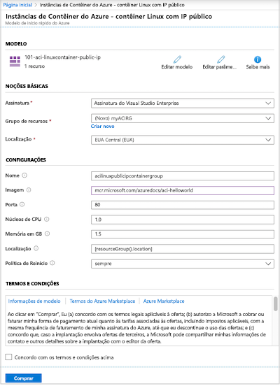
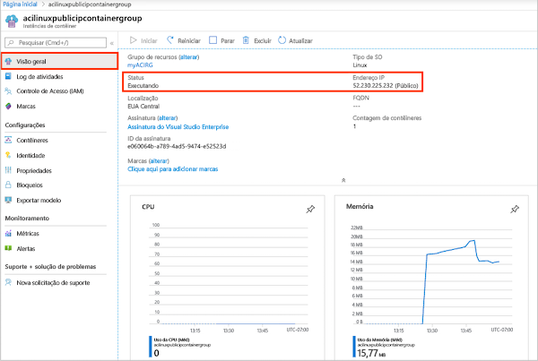
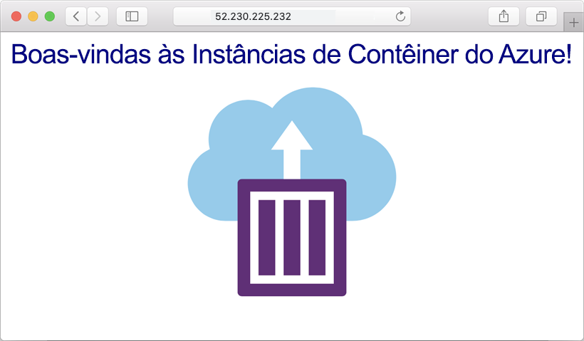
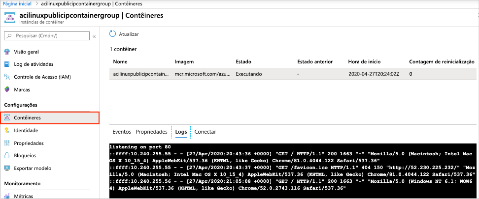

# Início Rápido: Implantar uma instância de contêiner no Azure usando um modelo do Resource Manager

Use as Instâncias de Contêiner do Azure para executar contêineres do Docker sem servidor no Azure de maneira simples e rápida. Implante um aplicativo em uma instância de contêiner sob demanda quando você não precisa de uma plataforma de orquestração de contêiner completa como o Serviço de Kubernetes do Azure.

Neste guia de início rápido, você usa um modelo do Azure Resource Manager para implantar um contêiner do Docker isolado e disponibilizar seu aplicativo Web com um endereço IP público. 

[!INCLUDE [About Azure Resource Manager](../../includes/resource-manager-quickstart-introduction.md)]

Se você não tiver uma assinatura do Azure, crie uma conta [gratuita](https://azure.microsoft.com/free/) antes de começar.

## Pré-requisitos

Nenhum.

## Criar uma instância de contêiner

### Examinar o modelo

O modelo usado neste início rápido é proveniente dos [modelos de Início Rápido do Azure](https://github.com/Azure/azure-quickstart-templates/tree/master/101-aci-linuxcontainer-public-ip).

[!code-json[<Azure Resource Manager template create geo-replicated registry>](~/quickstart-templates/101-aci-linuxcontainer-public-ip/azuredeploy.json)]

O seguinte recurso é definido no modelo:

* **[Microsoft.ContainerInstance/containerGroups](/azure/templates/microsoft.containerinstance/containergroups)** : criar um grupo de contêineres do Azure. Este modelo define um grupo que consiste em uma instância de contêiner.

Mais exemplos de modelo de Instâncias de Contêiner do Azure podem ser encontrados na [galeria de modelos de início rápido](https://azure.microsoft.com/resources/templates/?resourceType=Microsoft.Containerinstance&pageNumber=1&sort=Popular).

### Implantar o modelo

 1. Selecione a imagem a seguir para entrar no Azure e abrir um modelo. O modelo cria um Registro e uma réplica em outra localização.

    

 2. Selecione ou insira os seguintes valores.

    * **Assinatura**: selecione uma assinatura do Azure.
    * **Grupo de recursos**: selecione **Criar**, insira um nome exclusivo para o grupo de recursos e, em seguida, selecione **OK**.
    * **Local**: selecione um local para o grupo de recursos. Exemplo: **EUA Central**.
    * **Nome**: aceite o nome gerado para a instância ou insira um nome.
    * **Imagem**: aceite o nome da imagem padrão. Esta imagem de exemplo do Linux empacota um pequeno aplicativo Web escrito no Node.js que veicula a uma página HTML estática. 

    Aceite os valores padrão para as propriedades restantes.

    Examine os termos e condições. Se concordar, selecione **Concordo com os termos e condições declarados acima**.

    

 3. Depois que a instância tiver sido criada com êxito, você receberá uma notificação:

    

 O portal do Azure é usado para implantar o modelo. Além do portal do Azure, você pode usar o Azure PowerShell, a CLI do Azure e a API REST. Para saber mais sobre outros métodos de implantação, confira [Implantar modelos](../azure-resource-manager/templates/deploy-cli.md).

## Examinar os recursos implantados

Use o portal do Azure ou uma ferramenta como a [CLI do Azure](container-instances-quickstart.md) para examinar as propriedades da instância de contêiner.

1. No portal, pesquise Instâncias de Contêiner e selecione a instância de contêiner que você criou.

1. Na página **Visão geral**, observe o **Status** da instância do e seu **endereço IP**.

    

2. Quando seu status for *Em execução*, navegue até o endereço IP em seu navegador. 

    

### Exibir logs do contêiner

Exibir os logs para uma instância de contêiner é útil ao solucionar problemas com o contêiner ou o aplicativo que é executado.

Para ver os logs do contêiner, em **Configurações**, selecione **Contêineres** > **Logs**. Você verá a solicitação HTTP GET gerada quando você exibiu o aplicativo em seu navegador.

## Limpar os recursos

Quando você terminar o contêiner, na página **Visão geral** para a instância de contêiner, selecione **Excluir**. Quando receber a solicitação, confirme a exclusão.

## Próximas etapas

Neste início rápido, você criou uma instância de contêiner do Azure com base em uma imagem da Microsoft pública. Se você quiser criar uma imagem de contêiner e implantá-la usando um Registro de Contêiner do Azure privado, prossiga para o tutorial das Instâncias de Contêiner do Azure.

> [!div class="nextstepaction"]
> [Tutorial: Criar uma imagem de contêiner para implantação nas Instâncias de Contêiner do Azure](./container-instances-tutorial-prepare-app.md)

Para obter um tutorial passo a passo que orienta você durante o processo de criação de um modelo, confira:

> [!div class="nextstepaction"]
> [Tutorial: Criar e implantar seu primeiro modelo do Azure Resource Manager](../azure-resource-manager/templates/template-tutorial-create-first-template.md)