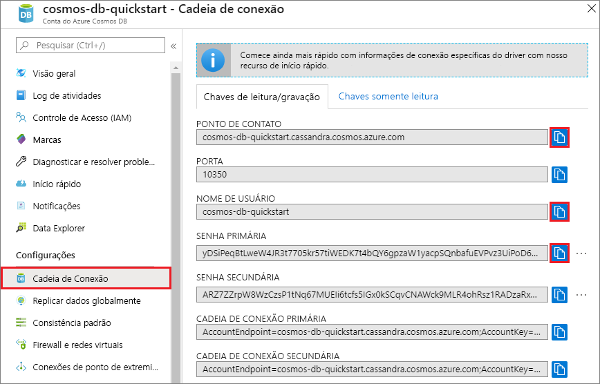
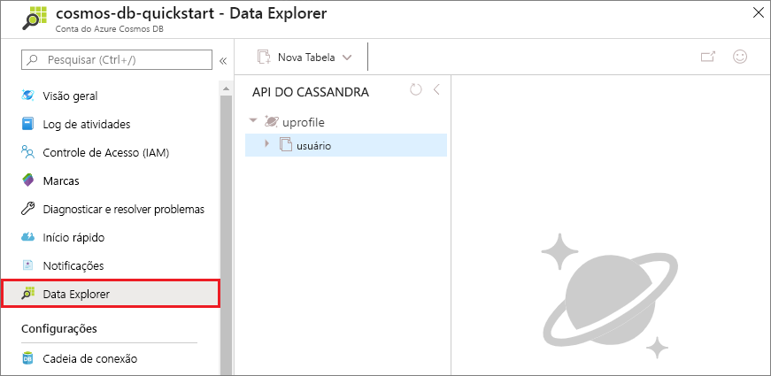

# <a name="quickstart-build-a-java-app-to-manage-azure-cosmos-db-cassandra-api-data"></a>Início Rápido: Criar um aplicativo Java para gerenciar os dados de API do Cassandra do Azure Cosmos DB

> [!div class="op_single_selector"]
> * [.NET](create-cassandra-dotnet.md)
> * [Java](create-cassandra-java.md)
> * [Node.js](create-cassandra-nodejs.md)
> * [Python](create-cassandra-python.md)
>  

Neste início rápido, você cria uma conta de API do Cassandra do Azure Cosmos DB e usa um aplicativo Cassandra Java clonado no GitHub para criar um banco de dados e contêiner Cassandra. O Azure Cosmos DB é um serviço de banco de dados multimodelo que permite criar e consultar rapidamente bancos de dados de documentos, tabelas, pares chave-valor e grafo com funcionalidades de escala horizontal e distribuição global.

## <a name="prerequisites"></a>Pré-requisitos

- Uma conta do Azure com uma assinatura ativa. [Crie um gratuitamente](https://azure.microsoft.com/free/?ref=microsoft.com&utm_source=microsoft.com&utm_medium=docs&utm_campaign=visualstudio). Ou então [experimente o Azure Cosmos DB gratuitamente](https://azure.microsoft.com/try/cosmosdb/) sem uma assinatura do Azure.
- [JDK (Java Development Kit) 8](https://www.azul.com/downloads/azure-only/zulu/?&version=java-8-lts&architecture=x86-64-bit&package=jdk). Aponte a variável de ambiente `JAVA_HOME` para a pasta em que o JDK está instalado.
- Um [arquivo binário do Maven](https://maven.apache.org/download.cgi). No Ubuntu, execute `apt-get install maven` para instalar o Maven.
- [Git](https://www.git-scm.com/downloads). No Ubuntu, execute `sudo apt-get install git` para instalar o Git.

## <a name="create-a-database-account"></a>Criar uma conta de banco de dados

Antes de criar um banco de dados de documentos, você precisa criar uma conta Cassandra com o Azure Cosmos DB.

[!INCLUDE [cosmos-db-create-dbaccount-cassandra](../../includes/cosmos-db-create-dbaccount-cassandra.md)]

## <a name="clone-the-sample-application"></a>Clonar o aplicativo de exemplo

Agora, vamos trabalhar com o código. Agora vamos clonar um aplicativo do Cassandra do GitHub, definir a cadeia de conexão e executá-lo. Você verá como é fácil trabalhar usando dados de forma programática. 

1. Abra um prompt de comando. Crie uma pasta chamada `git-samples`. Em seguida, feche o prompt de comando.

    ```bash
    md "C:\git-samples"
    ```

2. Abra uma janela de terminal de git, como git bash, e use o comando `cd` para alterar para a nova pasta para instalar o aplicativo de exemplo.

    ```bash
    cd "C:\git-samples"
    ```

3. Execute o comando a seguir para clonar o repositório de exemplo. Este comando cria uma cópia do aplicativo de exemplo no seu computador.

    ```bash
    git clone https://github.com/Azure-Samples/azure-cosmos-db-cassandra-java-getting-started.git
    ```

## <a name="review-the-code"></a>Examine o código

Esta etapa é opcional. Se você estiver interessado em aprender como o código cria os recursos de banco de dados,examine os snippets a seguir. Caso contrário, você poderá pular para [Atualizar sua cadeia de conexão](#update-your-connection-string). Esses snippets são extraídos do arquivo *src/main/java/com/azure/cosmosdb/cassandra/util/CassandraUtils.java*.  

* O host, a porta, o nome de usuário, a senha e as opções de TLS/SSL do Cassandra já estão definidos. A informação da cadeia de conexão vem da página Cadeia de Conexão no Portal do Azure.

   ```java
   cluster = Cluster.builder().addContactPoint(cassandraHost).withPort(cassandraPort).withCredentials(cassandraUsername, cassandraPassword).withSSL(sslOptions).build();
   ```

* O `cluster` se conecta à API Cassandra do Azure Cosmos DB e retorna uma sessão para acessar.

    ```java
    return cluster.connect();
    ```

Os snippets de código a seguir são do arquivo *src/main/java/com/azure/cosmosdb/cassandra/repository/UserRepository.java*.

* Crie um novo keyspace.

    ```java
    public void createKeyspace() {
        final String query = "CREATE KEYSPACE IF NOT EXISTS uprofile WITH replication = {'class': 'SimpleStrategy', 'replication_factor': '3' } ";
        session.execute(query);
        LOGGER.info("Created keyspace 'uprofile'");
    }
    ```

* Crie uma nova tabela.

   ```java
   public void createTable() {
        final String query = "CREATE TABLE IF NOT EXISTS uprofile.user (user_id int PRIMARY KEY, user_name text, user_bcity text)";
        session.execute(query);
        LOGGER.info("Created table 'user'");
   }
   ```

* Insira entidades de usuário usando um objeto de instrução preparado.

    ```java
    public PreparedStatement prepareInsertStatement() {
        final String insertStatement = "INSERT INTO  uprofile.user (user_id, user_name , user_bcity) VALUES (?,?,?)";
        return session.prepare(insertStatement);
    }

    public void insertUser(PreparedStatement statement, int id, String name, String city) {
        BoundStatement boundStatement = new BoundStatement(statement);
        session.execute(boundStatement.bind(id, name, city));
    }
    ```

* Consulte para obter todas as informações de usuário.

    ```java
   public void selectAllUsers() {
        final String query = "SELECT * FROM uprofile.user";
        List<Row> rows = session.execute(query).all();

        for (Row row : rows) {
            LOGGER.info("Obtained row: {} | {} | {} ", row.getInt("user_id"), row.getString("user_name"), row.getString("user_bcity"));
        }
    }
    ```

* Consulte para obter uma informação única de usuário.

    ```java
    public void selectUser(int id) {
        final String query = "SELECT * FROM uprofile.user where user_id = 3";
        Row row = session.execute(query).one();

        LOGGER.info("Obtained row: {} | {} | {} ", row.getInt("user_id"), row.getString("user_name"), row.getString("user_bcity"));
    }
    ```

## <a name="update-your-connection-string"></a>Atualizar sua cadeia de conexão

Agora, volte ao portal do Azure para obter informações sobre a cadeia de conexão e copiá-las para o aplicativo. Os detalhes da cadeia de conexão permitem que o aplicativo se comunique com o banco de dados hospedado.

1. Em sua conta do Azure Cosmos DB no [portal do Azure](https://portal.azure.com/), selecione **Cadeia de Conexão**. 

    

2. Use o  no lado direito da tela para copiar o valor do PONTO DE CONTATO.

3. Abra o arquivo *config.properties* da pasta *C:\git-samples\azure-cosmosdb-cassandra-java-getting-started\java-examples\src\main\resources*. 

3. Cole o valor do PONTO DE CONTATO do portal sobre `<Cassandra endpoint host>` na linha 2.

    A linha 2 do *config.properties* agora deve ser semelhante a 

    `cassandra_host=cosmos-db-quickstart.cassandra.cosmosdb.azure.com`

3. Volte ao portal e copie o valor do NOME DE USUÁRIO. Cole o valor do NOME DE USUÁRIO do portal sobre `<cassandra endpoint username>` na linha 4.

    A linha 4 do *config.properties* agora deve ser semelhante a 

    `cassandra_username=cosmos-db-quickstart`

4. Volte ao portal e copie o valor da SENHA. Cole o valor da SENHA do portal sobre `<cassandra endpoint password>` na linha 5.

    A linha 5 do *config.properties* agora deve ser semelhante a 

    `cassandra_password=2Ggkr662ifxz2Mg...==`

5. Na linha 6, se você quiser usar um certificado TLS/SSL específico, substitua `<SSL key store file location>` pela localização do certificado TLS/SSL. Se um valor não for fornecido, será usado o certificado JDK instalado em <JAVA_HOME>/jre/lib/security/cacerts. 

6. Se você alterou a linha 6 para usar um certificado TLS/SSL específico, atualize a linha 7 para usar a senha desse certificado. 

7. Salve o arquivo *config.properties*.

## <a name="run-the-java-app"></a>Executar o aplicativo Java

1. Na janela do terminal do Git, execute `cd` na pasta `azure-cosmosdb-cassandra-java-getting-started`.

    ```git
    cd "C:\git-samples\azure-cosmosdb-cassandra-java-getting-started"
    ```

2. Na janela do terminal do Git, use o seguinte comando para gerar o arquivo `cosmosdb-cassandra-examples.jar`.

    ```git
    mvn clean install
    ```

3. Na janela do terminal git, execute os comandos a seguir para iniciar o aplicativo Java.

    ```git
    java -cp target/cosmosdb-cassandra-examples.jar com.azure.cosmosdb.cassandra.examples.UserProfile
    ```

    A janela do terminal exibe notificações de que o keyspace e a tabela foram criados. Em seguida, todos os usuários na tabela são selecionados e retornados, e é exibida a saída. Depois, é selecionada uma linha por ID, e o valor é exibido.  

    Pressione Ctrl+C para interromper a execução do programa e feche a janela do console.

4. No portal do Azure, abra **Data Explorer** para consultar, modificar e trabalhar com esses novos dados. 

    

## <a name="review-slas-in-the-azure-portal"></a>Examinar SLAs no Portal do Azure

[!INCLUDE [cosmosdb-tutorial-review-slas](../../includes/cosmos-db-tutorial-review-slas.md)]

## <a name="clean-up-resources"></a>Limpar os recursos

[!INCLUDE [cosmosdb-delete-resource-group](../../includes/cosmos-db-delete-resource-group.md)]

## <a name="next-steps"></a>Próximas etapas

Neste início rápido, você aprendeu como criar uma conta do Azure Cosmos DB com a API do Cassandra e executar um aplicativo Cassandra Java que cria um banco de dados e contêiner Cassandra. Agora, é possível importar outros dados para sua conta do Azure Cosmos DB. 

> [!div class="nextstepaction"]
> [Importar dados do Cassandra para o Azure Cosmos DB](cassandra-import-data.md)
