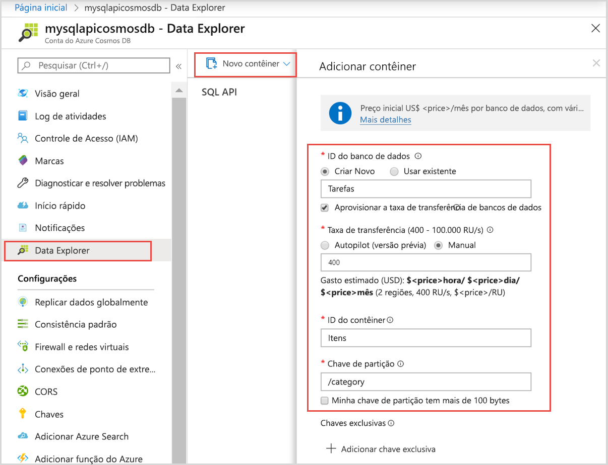
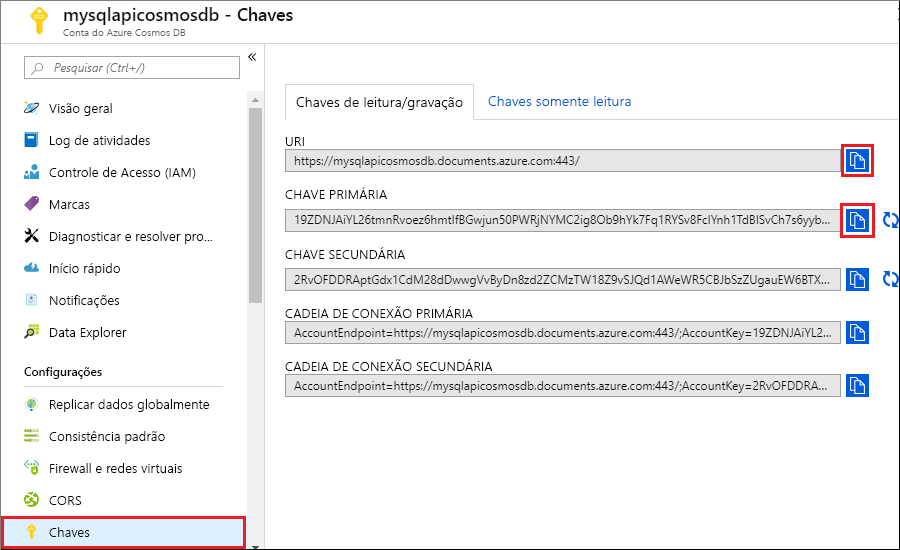

# <a name="quickstart-use-nodejs-to-connect-and-query-data-from-azure-cosmos-db-sql-api-account"></a>Início Rápido: Usar o Node.js para se conectar e consultar dados de uma conta da API SQL do Azure Cosmos DB

> [!div class="op_single_selector"]
> * [.NET V3](create-sql-api-dotnet.md)
> * [.NET V4](create-sql-api-dotnet-V4.md)
> * [Java](create-sql-api-java.md)
> * [Node.js](create-sql-api-nodejs.md)
> * [Python](create-sql-api-python.md)
> * [Xamarin](create-sql-api-xamarin-dotnet.md)

Neste início rápido, você criará e gerenciará uma conta da API do SQL para Azure Cosmos DB (grafo) no portal do Azure, usando um aplicativo Node.js clonado do GitHub. O Azure Cosmos DB é um serviço de banco de dados multimodelo que permite criar e consultar rapidamente bancos de dados de documentos, tabelas, pares chave-valor e grafo com funcionalidades de escala horizontal e distribuição global.

## <a name="prerequisites"></a>Pré-requisitos

- Uma conta do Azure com uma assinatura ativa. [Crie um gratuitamente](https://azure.microsoft.com/free/?ref=microsoft.com&utm_source=microsoft.com&utm_medium=docs&utm_campaign=visualstudio). Ou então [experimente o Azure Cosmos DB gratuitamente](https://azure.microsoft.com/try/cosmosdb/) sem uma assinatura do Azure. Você também pode usar o [Emulador do Azure Cosmos DB](https://aka.ms/cosmosdb-emulator) com um URI de `https://localhost:8081` e a chave `C2y6yDjf5/R+ob0N8A7Cgv30VRDJIWEHLM+4QDU5DE2nQ9nDuVTqobD4b8mGGyPMbIZnqyMsEcaGQy67XIw/Jw==`.
- [Node.js 6.0.0+](https://nodejs.org/).
- [Git](https://www.git-scm.com/downloads).

## <a name="create-a-database"></a>Criar um banco de dados

[!INCLUDE [cosmos-db-create-dbaccount](../../includes/cosmos-db-create-dbaccount.md)]

## <a name="add-a-container"></a>Adicionar um contêiner

Agora, você pode usar a ferramenta Data Explorer no portal do Azure para criar um banco de dados e um contêiner. 

1. Selecione **Data Explorer** > **Novo Contêiner**. 
    
    A área **Adicionar Contêiner** é exibida à extrema direita; talvez seja necessário rolar a página para a direita para vê-la.

    

2. Na página **Adicionar contêiner**, insira as configurações do novo contêiner.

    |Configuração|Valor sugerido|Descrição
    |---|---|---|
    |**ID do banco de dados**|Tarefas|Digite *Tarefas* como o nome do novo banco de dados. Os nomes dos banco de dados devem conter de 1 a 255 caracteres e não podem conter `/, \\, #, ?` nem um espaço à direita. Marque a opção **Provisionar a produtividade do banco de dados**; ela permite que você compartilhe a produtividade provisionada para o banco de dados em todos os contêineres no banco de dados. Essa opção também ajuda na economia de custo. |
    |**Taxa de transferência**|400|Deixe a taxa de transferência em 400 unidades de solicitação por segundo (RU/s). Se quiser reduzir a latência, você poderá escalar verticalmente a taxa de transferência mais tarde.| 
    |**ID do contêiner**|Itens|Insira *Itens* como o nome do novo contêiner. As IDs do contêiner têm os mesmos requisitos de caractere dos nomes de bancos de dados.|
    |**Chave de partição**| /category| O exemplo descrito neste artigo usa */category* como a chave de partição.|
    
    Além das configurações anteriores, opcionalmente, você pode adicionar **Chaves exclusivas** ao contêiner. Vamos deixar o campo vazio neste exemplo. As chaves exclusivas oferecem aos desenvolvedores a capacidade de adicionar uma camada de integridade dos dados ao seu banco de dados. Ao criar uma política de chave exclusiva durante a criação de um contêiner, você garante a exclusividade de um ou mais valores por chave de partição. Para obter mais informações, consulte o artigo [Chaves exclusivas no Azure Cosmos DB](unique-keys.md).
    
    Selecione **OK**. O Data Explorer exibe o novo banco de dados e o contêiner.

## <a name="add-sample-data"></a>Adicionar dados de exemplo

[!INCLUDE [cosmos-db-create-sql-api-add-sample-data](../../includes/cosmos-db-create-sql-api-add-sample-data.md)]

## <a name="query-your-data"></a>Consultar seus dados

[!INCLUDE [cosmos-db-create-sql-api-query-data](../../includes/cosmos-db-create-sql-api-query-data.md)]

## <a name="clone-the-sample-application"></a>Clonar o aplicativo de exemplo

Agora, vamos clonar um aplicativo Node.js do GitHub, definir a cadeia de conexão e executá-lo.

1. Execute o comando a seguir para clonar o repositório de exemplo. Este comando cria uma cópia do aplicativo de exemplo no seu computador.

   ```bash
   git clone https://github.com/Azure-Samples/azure-cosmos-db-sql-api-nodejs-getting-started.git
   ```

## <a name="review-the-code"></a>Examine o código

Esta etapa é opcional. Se você estiver interessado em aprender como os recursos de banco de dados do Azure Cosmos são criados no código, poderá examinar os snippets de código a seguir. Caso contrário, você poderá pular para [Atualizar sua cadeia de conexão](#update-your-connection-string).

Se você está familiarizado com a versão anterior do SDK do SQL JavaScript, pode estar acostumado a ver os termos _coleção_ e _documento_. Como o Azure Cosmos DB dá suporte a [vários modelos de API](introduction.md), a [versão 2.0 ou superior do SDK do JavaScript](https://www.npmjs.com/package/@azure/cosmos) usa o termos genéricos _contêiner_, que pode ser uma coleção, um gráfico ou uma tabela, e _item_ para descrever o conteúdo do contêiner.

Todos os snippets de código a seguir são retirados do arquivo _app.js_.

- O objeto `CosmosClient` é inicializado.

  ```javascript
  const client = new CosmosClient({ endpoint, key });
  ```

- Selecione o banco de dados "Tasks".

  ```javascript
  const database = await client.databases(databaseId);
  ```

- Selecione o contêiner/a coleção "Items".

  ```javascript
  const container = await client.databases(containerId);
  ```

- Selecione todos os itens do contêiner "Items".

  ```javascript
  // query to return all items
  const querySpec = {
    query: "SELECT * from c"
  };

  const { resources: results } = await container.items
    .query(querySpec)
    .fetchAll();

  return results;
  ```

- Criar um item

  ```javascript
  const { resource: createdItem } = await container.items.create(newItem);
  ```

- Atualizar um item

  ```javascript
  const { id, category } = createdItem;

  createdItem.isComplete = true;
  const { resource: itemToUpdate } = await container
    .item(id, category)
    .replace(itemToUpdate);

  return result;
  ```

- Excluir um item

  ```javascript
  const { resource: result } = await this.container.item(id, category).delete();
  ```

> [!NOTE]
> Nos métodos "update" e "delete", o item deve ser selecionado no banco de dados com uma chamada a `container.item()`. Os dois parâmetros transmitidos são a ID do item e a chave de partição do item. Nesse caso, a chave de partição é o valor do campo "category".

## <a name="update-your-connection-string"></a>Atualizar sua cadeia de conexão

Agora, volte para a portal do Azure para obter os detalhes da cadeia de conexão de sua conta do Azure Cosmos. Copie a cadeia de conexão no aplicativo para que ele possa se conectar ao banco de dados.

1. Na sua conta do Azure Cosmos DB no [portal do Azure](https://portal.azure.com/), selecione **Chaves** no painel de navegação esquerdo e, em seguida, selecione **Chaves de leitura/gravação**. Use os botões de cópia no lado direito da tela para copiar o URI e a Chave Primária no arquivo _app.js_ na próxima etapa.

   

2. Abra o arquivo _config.js_.

3. Copie o valor do URI do portal (usando o botão de cópia) e transforme-o no valor da chave do ponto de extremidade em _config.js_.

   `endpoint: "<Your Azure Cosmos account URI>"`

4. Em seguida, copie o valor da CHAVE PRIMÁRIA do portal e transforme-o no valor da `config.key` em _config.js_. Agora, você atualizou o aplicativo com todas as informações necessárias para se comunicar com o Azure Cosmos DB.

   `key: "<Your Azure Cosmos account key>"`

## <a name="run-the-app"></a>Executar o aplicativo

1. Executar `npm install` em um terminal para instalar os módulos npm necessários

2. Execute `node app.js` em um terminal para iniciar o aplicativo de nó.

Agora, é possível voltar ao Data Explorer, modificar e trabalhar com esses novos dados.

## <a name="review-slas-in-the-azure-portal"></a>Examinar SLAs no Portal do Azure

[!INCLUDE [cosmosdb-tutorial-review-slas](../../includes/cosmos-db-tutorial-review-slas.md)]

## <a name="clean-up-resources"></a>Limpar os recursos

[!INCLUDE [cosmosdb-delete-resource-group](../../includes/cosmos-db-delete-resource-group.md)]

## <a name="next-steps"></a>Próximas etapas

Neste início rápido, você aprendeu como criar uma conta do Azure Cosmos DB, como criar um contêiner usando o Data Explorer e como executar um aplicativo Node.js. Agora, é possível importar outros dados para sua conta do Azure Cosmos DB.

> [!div class="nextstepaction"]
> [Importar dados no Azure Cosmos DB](import-data.md)
