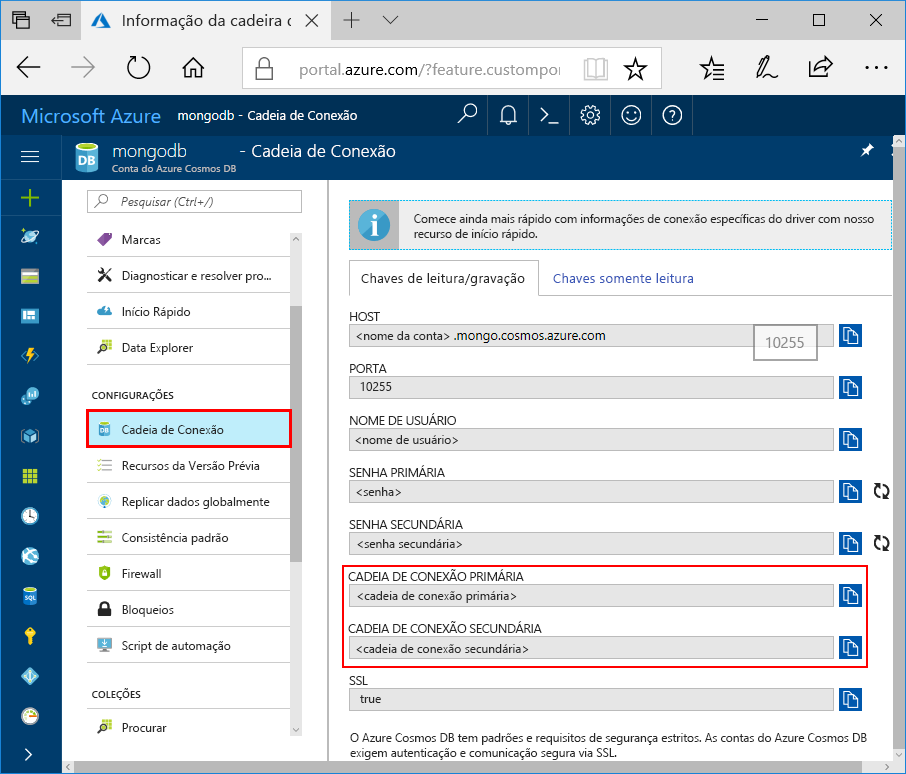

# Use o MongoDB Compass para conectar-se à API do Azure Cosmos DB para MongoDB 

Este tutorial demonstra como usar o [MongoDB Compass](https://www.mongodb.com/products/compass) ao armazenar o Cosmos DB. Usaremos a API do Azure Cosmos DB para o MongoDB para este passo a passo. Para aqueles não familiarizados, o Compass é uma interface gráfica de usuário para MongoDB. É comumente usado para visualizar dados, executar consultas ad-hoc e gerenciar dados. 

O Azure Cosmos DB é um serviço de banco de dados multimodelo distribuído globalmente da Microsoft. É possível criar e consultar rapidamente bancos de dados de documentos, de chave/valor e de grafo, que se beneficiem das funcionalidades de escala horizontal e distribuição global no núcleo do Cosmos DB.

## Pré-requisitos 
Para se conectar à sua conta do Cosmos DB usando o Robo 3T, você precisa:

* Baixar e instalar [Compass](https://www.mongodb.com/download-center/compass?jmp=hero)
* Obtenha informações da [cadeia de conexão](connect-mongodb-account.md) do Cosmos DB

## Conectar-se à API do Azure Cosmos DB para MongoDB 
Para conectar sua conta do Cosmos DB ao Compass, você pode seguir as etapas:

1. Recupere as informações de conexão da sua conta do Cosmos configurada com a API do Azure Cosmos DB para MongoDB usando as instruções que estão [aqui](connect-mongodb-account.md).

    

2. Clique no botão que diz **Copiar para a Área de Transferência** ao lado de sua **Cadeia de conexão primária/secundária** no Cosmos DB. Clicar nesse botão copiará toda a cadeia de conexão para a área de transferência. 

    

3. Abra o Compass na sua área de trabalho/computador e clique em **Conectar** e em **Conectar a...** . 

4. O Compass irá detectar automaticamente uma cadeia de conexão na área de transferência, e irá pedir para perguntar se você deseja usar isso para se conectar. Clique em **Sim** conforme mostrado na captura de tela abaixo.

    

5. Ao clicar em **Sim** na etapa anterior, os detalhes da cadeia de conexão serão preenchidos automaticamente. Remova o valor preenchido automaticamente a **nome do conjunto de réplica** campo para garantir que é deixado em branco. 

    

6. Na parte inferior da página, clique em **Conectar**. Sua conta e bancos de dados do Cosmos DB agora devem estar visíveis no MongoDB Compass.

## Próximas etapas

- Saiba como [usar o Studio 3T](mongodb-mongochef.md) com a API do Azure Cosmos DB para MongoDB.
- Explore [exemplos](mongodb-samples.md) do MongoDB com a API do Azure Cosmos DB para MongoDB.