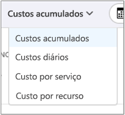
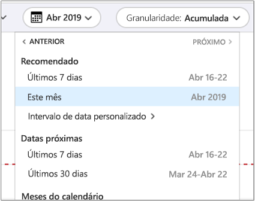
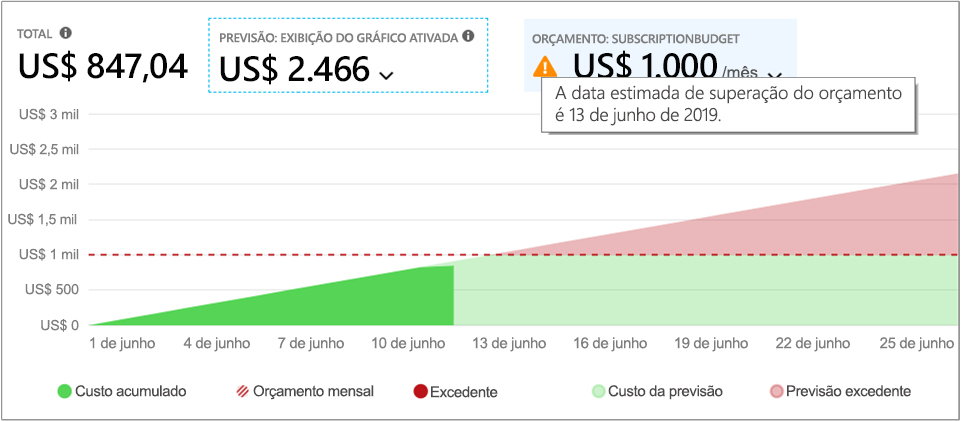
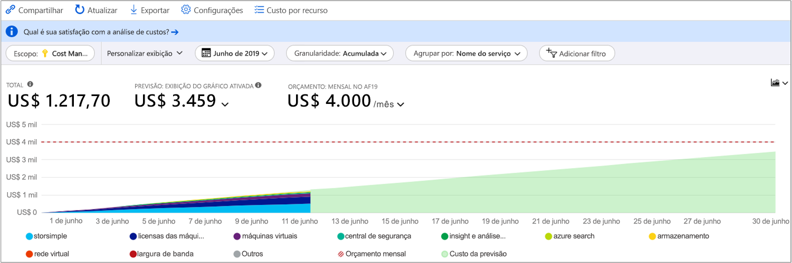
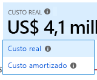
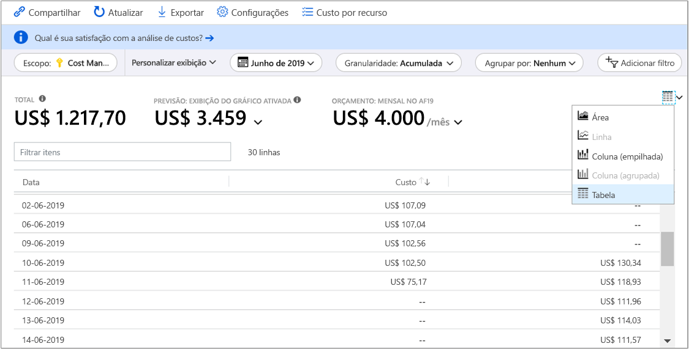

# <a name="quickstart-explore-and-analyze-costs-with-cost-analysis"></a>Início Rápido: Explorar e analisar os custos com a análise de custo

Antes de poder controlar e otimizar adequadamente seus custos do Azure, você precisa entender onde os custos se originaram em sua organização. Também é útil saber quanto custam os seus serviços e quais ambientes e sistemas recebem suporte. A visibilidade em todo o espectro de custos é fundamental para entender com precisão os padrões de gastos da organização. Você pode usar padrões de gastos para impor mecanismos de controle de custos, como orçamentos.

Neste início rápido, você usa a análise de custo para explorar e analisar seus custos organizacionais. Você pode visualizar os custos agregados por organização para entender onde os custos ocorrem ao longo do tempo e identificar tendências de gastos. Você pode visualizar os custos acumulados ao longo do tempo para estimar as tendências de custo mensais, trimestrais ou mesmo anuais em comparação a um orçamento. Um orçamento ajuda a fornecer aderência às restrições financeiras. E um orçamento é usado para visualizar os custos diários ou mensais para isolar as irregularidades de gastos. E, então, você pode baixar dados do relatório atual para análise posterior ou para usar em um sistema externo.

Neste guia de início rápido, você aprende a:

- Examine os custos de análise de custo
- Personalizar as exibições de custo
- Baixar dados de análise de custo


## <a name="prerequisites"></a>Prerequisites

A análise de custo dá suporte a diferentes tipos de conta do Azure. Para exibir a lista completa dos tipos de contas compatíveis, confira [Entender os dados do Gerenciamento de Custos](understand-cost-mgt-data.md). Para exibir os dados de custo, você precisará de, pelo menos, acesso de leitura em sua conta do Azure.

Para obter informações sobre como atribuir o acesso aos dados do Gerenciamento de Custos do Azure, confira [Atribuir acesso aos dados](../../cost-management/assign-access-acm-data.md).

## <a name="sign-in-to-azure"></a>Entrar no Azure

- Entre no Portal do Azure em https://portal.azure.com.

## <a name="review-costs-in-cost-analysis"></a>Examine os custos de análise de custo

Para examinar os custos de análise de custo, abra o escopo no portal do Azure e selecione **Análise de custo** no menu. Por exemplo, navegue até **Inscrições**, selecione uma assinatura na lista e depois escolha **Análise de custo** no menu. Use o item **Escopo** para alterar para um escopo diferente na análise de custo. Para obter mais informações sobre escopos, consulte [Entender e trabalhar com escopos](understand-work-scopes.md).

O escopo que você seleciona é usado em todo o Gerenciamento de Custos para fornecer a consolidação de dados e para controlar o acesso a informações de custo. Ao usar escopos, você não faz multisseleção. Em vez disso, selecione um escopo mais amplo em que os outros fiquem acumulados e, em seguida, filtre os escopos aninhados de que você precisa. É importante compreender essa abordagem pois algumas pessoas podem não ter acesso a um escopo pai único, que abranja vários escopos aninhados.

A exibição inicial da análise de custos inclui as áreas a seguir.

**Exibição Custo acumulado**: representa a configuração de exibição de análise de custo predefinida. Cada exibição inclui as configurações de intervalo de datas, granularidade, agrupar por e filtrar. A exibição padrão mostra os custos acumulados para o período de cobrança atual, mas pode ser alterada para outras exibições internas. Para obter mais informações, confira [Personalizar exibições de custo](#customize-cost-views).

**Custo real**: mostra os custos totais de uso e de compra para o mês atual, uma vez que eles são acumulados e serão exibidos na sua fatura.

**Previsão**: mostra o total de custos previstos para o período escolhido. A previsão está em versão prévia.

**Orçamento**: mostra o limite de gastos planejados para o escopo selecionado, se disponível.

**Granularidade acumulada**: mostra os custos diários totais agregados desde o início do período de cobrança. Depois que você [criar um orçamento](tutorial-acm-create-budgets.md) para sua conta de faturamento ou assinatura, poderá ver rapidamente sua tendência de gastos em relação ao orçamento. Passe o mouse sobre uma data para visualizar o custo acumulado desse dia.

**Gráficos dinâmicos (rosca)** : fornecem gráficos dinâmicos que dividem o custo total por um conjunto comum de propriedades padrão. Mostram dos maiores para os menores custos do mês atual. Você pode alterar gráficos dinâmicos a qualquer momento selecionando um pivô diferente. Os custos são categorizados por serviço (categoria do medidor), localização (região) e escopo filho por padrão. Por exemplo, contas de inscrição ficam em contas de faturamento, grupos de recursos ficam em assinaturas e recursos estão em grupos de recursos.


## <a name="customize-cost-views"></a>Personalizar as exibições de custo

A análise de custo tem quatro modos de exibição internos, otimizados para os objetivos mais comuns:

Visualizar | Responder a perguntas como
--- | ---
Custo acumulado | Quanto gastei até o momento neste mês? Será permanecer dentro do meu orçamento?
Custo diário | Houve algum aumento nos custos diários nos últimos 30 dias?
Custo por serviço | Qual foi a variação do meu uso mensal nas últimas três faturas?
Custo por recurso | Quais recursos custam mais até o momento neste mês?



No entanto, existem muitos casos em que você precisa de uma análise mais profunda. A personalização começa no topo da página, com a seleção da data.

Análise de custo mostra os dados para o mês atual por padrão. Use o seletor de data para alternar para os intervalos de datas comuns rapidamente. Os exemplos incluem os últimos sete dias, o último mês, o ano atual ou um intervalo de datas personalizado. As assinaturas para pagamento conforme o uso também incluem os intervalos de datas com base em seu período de cobrança, que não está associado ao mês do calendário, como o período de cobrança atual ou a última fatura. Use os links **<ANTERIOR** e **PRÓXIMO>** na parte superior do menu para saltar para o período anterior ou seguinte, respectivamente. Por exemplo, **<ANTERIOR** alterna dos **Últimos sete dias** para **8 a 14 dias atrás** e, em seguida, **15 a 21 dias atrás**.



A análise de custo mostra **custos acumulados** por padrão. Os custos acumulados incluem todos os custos para cada dia mais os dias anteriores, para uma visão em constante crescimento de seus custos diários agregados. Essa visualização é otimizada para mostrar como você está tendendo contra um orçamento para o período selecionado.

Ao usar a exibição de gráfico de previsão, você consegue identificar possíveis violações de orçamento. Quando há uma possível violação de orçamento, o excesso de gastos projetados é mostrado em vermelho. Um símbolo indicador também é mostrado no gráfico. Focalizar o símbolo mostra a data estimada da violação de orçamento.



Há também a visualização **diária** mostrando os custos para cada dia. O modo de exibição de diário não mostra uma tendência de crescimento. A exibição é projetada para mostrar irregularidades como picos de custos ou quedas diárias. Se você selecionar um orçamento, a visualização diária também mostra uma estimativa do orçamento diário.

Quando seus custos diários estão consistentemente acima do orçamento diário estimado, você pode esperar que seu orçamento mensal seja ultrapassado. O orçamento diário estimado é um meio de ajudar a visualizar seu orçamento em um nível inferior. Quando você tem flutuações nos custos diários, a comparação do orçamento diário estimado com o orçamento mensal é menos precisa.

Aqui está uma exibição diária dos gastos recentes com a previsão de gastos ativada.


Ao desligar a previsão de gastos, você não vê os gastos projetados para datas futuras. Além disso, quando você examina os custos para os períodos anteriores, a previsão de custo não mostra os custos.

Em geral, você pode esperar ver dados ou notificações para os recursos consumidos de 8 a 12 horas.


**Agrupar por** propriedades comuns para dividir os custos e identificar os principais colaboradores. Para agrupar por marcas de recurso, por exemplo, selecione a chave de marca pela qual deseja agrupar. Os custos estão divididos por cada valor de marca, com um segmento extra para recursos sem essa marca aplicada.

A maioria dos [recursos do Azure permitem marcas](../../azure-resource-manager/management/tag-support.md). No entanto, algumas marcas não estão disponíveis no Gerenciamento de Custos e Cobrança. Além disso, não há suporte para marcas do grupo de recursos. O suporte para marcas aplica-se ao uso relatado *depois* da aplicação da marca ao recurso. As marcas não são aplicadas retroativamente para rollups de custo.

Assista ao vídeo [How to review tag policies with Azure Cost Management](https://www.youtube.com/watch?v=nHQYcYGKuyw) (Como revisar as políticas de marcação com o Gerenciamento de Custos do Azure) para saber mais sobre como usar a política de marcação do Azure a fim de melhorar a visibilidade dos dados de custo.

Aqui está uma exibição dos custos de serviço do Azure para o mês atual.



Por padrão, a análise de custo mostra todos os custos de uso e compra conforme eles são acumulados e serão exibidos na sua fatura, também conhecido como **Custo real**. A exibição do custo real é ideal para reconciliar sua fatura. No entanto, picos de compra no custo podem ser alarmantes quando você está atento a anomalias de gastos e outras alterações no custo. Para nivelar os picos causados pelos custos de compra de reserva, mude para **Custo amortizado**.



O custo amortizado detalha as compras de reserva em partes diárias e as distribui ao longo da duração do termo de reserva. Por exemplo, em vez de ver uma compra de US$ 365 em 1º de janeiro, você verá uma compra de US$ 1 todos os dias de 1º de janeiro a 31 de dezembro. Além da amortização básica, esses custos também são realocados e associados ao usar os recursos específicos que usaram a reserva. Por exemplo, se esse preço diário de US$ 1 for dividido entre duas máquinas virtuais, você verá dois preços de US$ 0,50 para o dia. Se parte da reserva não for utilizada para o dia, você verá um preço de US$ 0,50 associado à máquina virtual aplicável e outro preço de US$ 0,50 com um tipo de preço de `UnusedReservation`. Observe que os custos de reserva não usados somente podem ser vistos ao exibir o custo amortizado.

Devido à alteração em como os custos são representados, é importante observar que o custo real e as exibições de custo amortizado mostram números totais diferentes. Em geral, o custo total de meses com uma compra de reserva diminuirá ao exibir os custos amortizados e os meses após a uma compra de reserva aumentarão. A amortização só está disponível para compras de reserva e não se aplica a compras do Azure Marketplace no momento.

A imagem a seguir mostra nomes de grupo de recursos. Você pode agrupar por tag para exibir os custos totais por tag ou usar a exibição **Custo por recurso** para ver todas as marcas para um recurso específico.


Ao agrupar os custos segundo um atributo específico, os 10 principais colaboradores de custo são mostrados do mais alto para o mais baixo. Se houver mais de 10, os nove principais colaboradores de custo serão mostrados com um grupo **Outros** que representa todos os grupos restantes combinados. Ao agrupar por marcas, você também poderá ver que o grupo **Sem marca** é exibido para custos sem a chave de marca aplicada. Os custos **Sem marca** aparecem sempre por último, mesmo que os custos sem marca sejam maiores do que os com marca. Os custos sem marca farão parte da categoria **Outros** se houver 10 ou mais valores de marca. Alterne para o modo de exibição de tabela e mude a granularidade para **Nenhum** para ver todos os valores classificados do maior para o menor custo.

As máquinas virtuais clássicas, as redes e os recursos de armazenamento não compartilham dados detalhados de cobrança. Eles são mesclados como **Serviços clássicos** quando os custos são agrupados.

Os gráficos dinâmicos sob os gráficos principais exibem diferentes agrupamentos para dar uma visão mais ampla dos custos gerais para o período de tempo e filtros selecionados. Selecione uma propriedade ou uma marca para exibir os custos agregados em qualquer dimensão.


Você pode exibir o conjunto de dados completo de qualquer exibição. As seleções ou os filtros aplicados afetam os dados apresentados. Para ver o conjunto de dados completo, selecione a lista **tipo de gráfico** e a exibição **Tabela**.




## <a name="understanding-grouping-and-filtering-options"></a>Como entender opções de agrupamento e filtragem

A tabela a seguir lista algumas das opções mais comuns de agrupamento e filtragem, bem como quando você deve usá-las.

| Propriedade | Quando usar |
| --- | --- |
| **Período de cobrança** | Detalhe os custos por mês da fatura. Essa opção é importante para assinaturas de teste/desenvolvimento e pagas conforme o uso, que não estão associadas a meses do calendário. As contas EA/MCA podem usar meses do calendário no seletor de data ou a granularidade mensal para atingir a mesma meta. |
| **Tipo de preço** | Detalhe uso, compra, reembolso e custos de reserva não usada. As compras de reserva e reembolsos só estão disponíveis ao usar custos de ação, e não custos amortizados. Os custos da reserva não usada somente ficam disponíveis ao examinar os custos amortizados. |
| **Cloud** | Detalhe os custos por AWS e Azure. Os custos do AWS só estão disponíveis para grupos de gerenciamento, contas de cobrança externas e assinaturas externas. |
| **Departamento** / **Seção de fatura** | Detalhe os custos por seção de fatura MCA ou departamento EA. Essa opção está disponível somente para contas de cobrança EA/MCA e perfis de cobrança MCA. |
| **Conta de registro** | Detalhe os custos pelo proprietário da conta EA. Essa opção está disponível somente para departamentos e contas de cobrança EA. |
| **Frequência** | Detalhe os custos com base no uso, únicos e recorrentes. |
| **Medidor** | Detalhe os custos pelo medidor de uso do Azure. Esta opção está disponível somente para o uso do Azure. Todas as compras e o uso do Marketplace mostrarão **Não especificado** ou **não atribuído**. |
| **Tipo de publicador** | Detalhe os custos do AWS, do Azure e do Marketplace. |
| **Reserva** | Detalhe os custos por reserva. Qualquer uso que não inclua uma reserva será mostrado como **Não especificado**. |
| **Recurso** | Detalhe os custos por recurso. Todas as compras serão mostradas como **Não especificado**, pois são aplicadas no nível do perfil de cobrança MCA ou de conta de cobrança EA/PAYG.  |
| **Grupo de recursos** | Detalhe os custos por grupo de recursos. Esta opção está disponível apenas para uso não clássico. O uso de recurso clássico mostrará **outro** e compras mostrarão **Não especificado**. |
| **Tipo de recurso** | Detalhe os custos por tipo de recurso. Esta opção está disponível apenas para uso não clássico. O uso de recurso clássico mostrará **outro** e compras mostrarão **Não especificado**. |
| **Nome do serviço** ou **Categoria do medidor** | Detalhe o custo por serviço do Azure. Esta opção está disponível somente para o uso do Azure. Todas as compras e o uso do Marketplace mostrarão **Não especificado** ou **não atribuído**. |
| **Camada de serviço** ou **Subcategoria de medidor** | Detalhe o custo por subclassificação do medidor de uso do Azure. Esta opção está disponível somente para o uso do Azure. Todas as compras e o uso do Marketplace mostrarão **Não especificado** ou **não atribuído**. |
| **Assinatura** | Detalhe os custos por assinatura. Todas as compras mostram **Não especificado**. |
| **Tag** | Detalhe os custos por valores de tag para uma chave de tag específica. |

Para obter mais informações sobre termos, confira [Compreender os termos usados no arquivo de preços e uso do Azure](../understand/understand-usage.md).


## <a name="saving-and-sharing-customized-views"></a>Como salvar e compartilhar exibições personalizadas

Salve e compartilhe exibições personalizadas com outras pessoas fixando a análise de custo ao painel do portal do Azure ou copiando um link para análise de custo.

Para fixar a análise de custo, selecione o ícone de alfinete no canto superior direito. Fixar a análise de custo salvará apenas a exibição principal de gráfico ou a tabela. Compartilhe o painel para dar a outras pessoas acesso ao bloco. Observe que isso compartilha apenas a configuração do painel e não concede acesso a outras pessoas aos dados subjacentes. Se você não tiver acesso aos custos, mas tiver acesso a um painel compartilhado, verá a mensagem "acesso negado".

Para compartilhar um link para a análise de custo, selecione **Compartilhar** na parte superior da folha. Uma URL personalizada será mostrada, abrindo a exibição específica para esse escopo específico. Se você não tiver acesso aos custos e receber essa URL, verá a mensagem de "acesso negado".

Para saber mais sobre como conceder acesso aos custos para cada escopo com suporte, examine [Entender e trabalhar com escopos](understand-work-scopes.md).

## <a name="automation-and-offline-analysis"></a>Automação e análise offline

Às vezes você precisa baixar os dados para análise posterior, mesclá-lo com seus próprios dados ou integrá-los a seus próprios sistemas. O Gerenciamento de Custos oferece algumas opções diferentes. Como ponto de partida, se você precisar de um resumo ad hoc de alto nível, como o que se obtém na análise de custo, crie a exibição necessária. Em seguida, baixe-a selecionando **Exportar** e depois **Baixar dados como CSV** ou **Baixar dados no Excel**. O download para Excel fornece contexto adicional sobre a exibição que você usou para gerar o download, como escopo, configuração de consulta, totais e data da geração.

Se você precisar do conjunto de dados completo não agregado, baixe-o da conta de cobrança. Em seguida, na lista de serviços no painel de navegação esquerdo do portal, acesse **Gerenciamento de Custos + Cobrança**. Selecione a conta de cobrança, se aplicável. Acesse **Uso + encargos** e selecione o ícone **Baixar** do período de cobrança desejado.

Adote uma abordagem semelhante para automatizar o recebimento de dados de custos. Use a [API de Consulta](/rest/api/cost-management/query) para uma análise mais avançada com filtragem dinâmica, agrupamento e agregação ou use a [API UsageDetails](/rest/api/consumption/usageDetails) para obter o conjunto de dados completo não agregado. A versão de GA (disponibilidade geral) dessas APIs é 2019-01-01. Use a **2019-04-01-preview** para obter acesso à versão prévia de reserva e compras no Marketplace dentro dessas APIs.

Por exemplo, vamos obter uma exibição agregada de custos amortizados detalhados por tipo de preço (uso, compra ou reembolso), tipo de publicador (Azure ou Marketplace), grupo de recursos (vazio para compras) e reserva (vazio se não aplicável).

```
POST https://management.azure.com/{scope}/providers/Microsoft.CostManagement/query?api-version=2019-04-01-preview
Content-Type: application/json

{
  "type": "AmortizedCost",
  "timeframe": "Custom",
  "timePeriod": { "from": "2019-04-01", "to": "2019-04-30" },
  "dataset": {
    "granularity": "None",
    "aggregation": {
      "totalCost": { "name": "PreTaxCost", "function": "Sum" }
    },
    "grouping": [
      { "type": "dimension", "name": "ChargeType" },
      { "type": "dimension", "name": "PublisherType" },
      { "type": "dimension", "name": "Frequency" },
      { "type": "dimension", "name": "ResourceGroup" },
      { "type": "dimension", "name": "SubscriptionName" },
      { "type": "dimension", "name": "SubscriptionId" },
      { "type": "dimension", "name": "ReservationName" },
      { "type": "dimension", "name": "ReservationId" },
    ]
  },
}
```

Caso você não precise de agregação e prefira o conjunto de dados bruto completo:

```
GET https://management.azure.com/{scope}/providers/Microsoft.Consumption/usageDetails?metric=AmortizedCost&$filter=properties/usageStart+ge+'2019-04-01'+AND+properties/usageEnd+le+'2019-04-30'&api-version=2019-04-01-preview
```

Se você precisar que os custos reais mostrem as compras conforme são acumuladas, altere **tipo**/**métrica** para **ActualCost**. Para obter mais informações sobre essas APIs, confira a documentação de API de [Query](/rest/api/cost-management/query) e [UsageDetails](/rest/api/consumption/usageDetails). Observe que os documentos publicados são para a versão GA. Mas ambos funcionam da mesma forma para a versão da API *2019-04-01-preview* fora do novo atributo de tipo/métrica e com os nomes de propriedades alterados. (Mais informações sobre os nomes de propriedades a seguir.)

As APIs de Gerenciamento de Custos trabalham em todos os escopos acima dos recursos: grupo de recursos, assinaturas e grupo de gerenciamento por meio do acesso de RBAC do Azure, contas de cobrança de EA (registros), departamentos e contas de registro por meio de acesso ao Portal do EA. Saiba mais sobre escopos, incluindo como determinar a ID do escopo ou gerenciar o acesso, em [Entender e trabalhar com escopos](understand-work-scopes.md).

## <a name="next-steps"></a>Próximas etapas

Avance para o primeiro tutorial para aprender como criar e gerenciar orçamentos.

> [!div class="nextstepaction"]
> [Crie e gerencie orçamentos](tutorial-acm-create-budgets.md)
