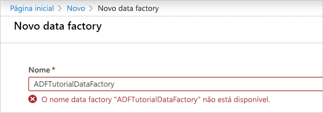
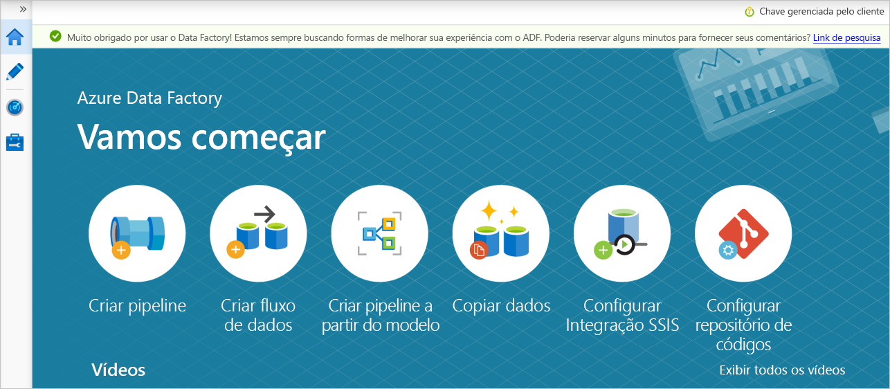

# Copiar incrementalmente novos arquivos com base no nome do arquivo particionado usando a ferramenta de Copiar Dados

[!INCLUDE[appliesto-adf-xxx-md](includes/appliesto-adf-xxx-md.md)]

Neste tutorial, você pode usar o portal do Azure para criar um Data Factory. Em seguida, você usa a ferramenta Copiar Dados para criar um pipeline que copia incrementalmente novos arquivos com base no nome de arquivo particionado do armazenamento de BLOBs do Azure para o armazenamento de BLOBs do Azure.

> [!NOTE]
> Se estiver se familiarizando com o Azure Data Factory, confira [Introdução ao Azure Data Factory](introduction.md).

Neste tutorial, você executa as seguintes etapas:

> [!div class="checklist"]
> * Criar um data factory.
> * Usar a ferramenta Copy Data para criar um pipeline.
> * Monitore as execuções de pipeline e de atividade.

## Pré-requisitos

* **Assinatura do Azure**: Se você não tiver uma assinatura do Azure, crie uma [conta gratuita](https://azure.microsoft.com/free/) antes de começar.
* **Conta de armazenamento do Azure**: Use o armazenamento de BLOBs como o armazenamento de dados de _origem_  e de _coletor_ . Se você não tiver uma conta de armazenamento do Azure, consulte as instruções em [criar uma conta de armazenamento](../storage/common/storage-account-create.md).

### Criar dois contêineres no armazenamento de BLOBs

Prepare o armazenamento de BLOBs para o tutorial executando estas etapas.

1. Crie um contêiner chamado **origem**.  Crie um caminho de pasta como **2020/03/17/03** em seu contêiner. Crie um arquivo de texto vazio e nomeie-o como **file1.txt**. Carregue o file1.txt no caminho da pasta **Source/2020/03/17/03** em sua conta de armazenamento.  É possível usar várias ferramentas para executar essas tarefas, como o [Azure Storage Explorer](https://storageexplorer.com/).

    

    > [!NOTE]
    > Ajuste o nome da pasta com a hora UTC.  Por exemplo, se a hora UTC atual for 3:38 em 17 de março de 2020, você poderá criar o caminho da pasta como **origem/2020/03/17/03/** pela regra de **origem/{ano}/{mês}/{dia}/{hora}/**.

2. Crie um contêiner chamado **destino**. É possível usar várias ferramentas para executar essas tarefas, como o [Azure Storage Explorer](https://storageexplorer.com/).

## Criar uma data factory

1. No menu à esquerda, selecione **Criar um recurso** > **Dados + Análise** > **Data Factory**:

   

2. Na página **Novo data factory**, em **Nome**, insira **ADFTutorialDataFactory**.

    O nome do seu data factory deve ser _globalmente exclusivo_. Você deve ver a seguinte mensagem de erro:

   

   Se você receber uma mensagem de erro sobre o valor do nome, insira um nome diferente para o data factory. Por exemplo, use o nome _**seunome**_**ADFTutorialDataFactory**. Para ver as regras de nomenclatura de artefatos do Data Factory, confira [Regras de nomenclatura do Data Factory](naming-rules.md).
3. Selecione a **assinatura** do Azure na qual deseja criar o novo data factory.
4. Em **Grupo de Recursos**, use uma das seguintes etapas:

    a. Selecione **Usar existente**e selecione um grupo de recursos existente na lista suspensa.

    b. Selecione **Criar novo**e insira o nome de um grupo de recursos. 
         
    Para saber mais sobre grupos de recursos, confira [Usar grupos de recursos para gerenciar recursos do Azure](../azure-resource-manager/management/overview.md).

5. Em **versão**, selecione **V2** para a versão.
6. Em **local**, selecione o local para o data factory. Somente os locais com suporte são exibidos na lista suspensa. Os armazenamentos de dados (por exemplo, Armazenamento do Azure e Banco de Dados SQL) e os serviços de computação (por exemplo, Azure HDInsight) usados pelo seu data factory podem estar em outros locais e regiões.
7. Selecione **Criar**.
8. Depois de finalizada a criação, a home page do **Data Factory** é exibida.
9. Para iniciar a interface do usuário do Azure Data Factory em uma guia separada, selecione o bloco **Criar e Monitorar**.

    

## Usar a ferramenta Copy Data para criar um pipeline

1. Na página **introdução** , selecione o título de **copiar dados** para iniciar a ferramenta de copiar dados.

   

2. Na página **Propriedades** , execute as seguintes etapas:

    a. Em **nome da tarefa**, insira **DeltaCopyFromBlobPipeline**.

    b. Em **cadência da tarefa ou no agendamento da tarefa**, selecione **executar regularmente na agenda**.

    c. Em **tipo de gatilho**, selecione **janela em cascata**.

    d. Em **recorrência**, insira **1 hora (s)**.

    e. Selecione **Avançar**.

    A interface do usuário do Data Factory cria um pipeline com o nome especificado da tarefa.

    
3. Na página **Configurações do armazenamento de dados**, conclua as seguintes etapas:

    a. Clique em **+ Criar nova conexão** para adicionar uma conexão
    
    b. Selecione Armazenamento de Blobs do Azure na galeria e, em seguida, selecione Continuar.
    
    c. Na página **novo serviço vinculado (armazenamento de BLOBs do Azure)** , insira um nome para o serviço vinculado. Selecione sua assinatura do Azure e selecione sua conta de armazenamento na lista **nome da conta de armazenamento** . Teste a conexão e, em seguida, selecione **Concluir**.

    

    d. Selecione o serviço vinculado recém-criado na página **armazenamento de dados de origem** e clique em **Avançar**.

4. Na página **Escolher o arquivo ou a pasta de entrada**, execute as etapas a seguir:

    a. Procure e selecione o contêiner de **origem** e selecione **escolher**.

    

    b. Em **comportamento de carregamento de arquivo**, selecione **carga incremental: nomes de pasta/arquivo particionados por tempo**.

    c. Grave o caminho da pasta dinâmica como **origem/{ano}/{mês}/{dia}/{hora}/** e altere o formato, conforme mostrado na captura de tela a seguir. Marque **cópia binária** e clique em **Avançar**.

         

5. Na página **armazenamento de dados de destino** , selecione o **AzureBlobStorage**, que é a mesma conta de armazenamento que o armazenamento de fonte de dados e clique em **Avançar**.

    
6. Na página **escolher o arquivo de saída ou a pasta** , execute as seguintes etapas:

    a. Procure e selecione a pasta de **destino** e clique em **escolher**.

    b. Grave o caminho da pasta dinâmica como **destino/{ano}/{mês}/{dia}/{hora}/** e altere o formato da seguinte maneira:

    

    c. Clique em **Avançar**.

    
7. Na página **Configurações**, selecione **Avançar**.

8. Na página **Resumo**, analise as configurações e selecione **Avançar**.

    

9. Na **página Implantação**, selecione **Monitorar** para monitorar o pipeline (tarefa).
    

10. Observe que a guia **Monitor** à esquerda é selecionada automaticamente.  Você precisa aguardar a execução do pipeline quando ele é disparado automaticamente (aproximadamente uma hora). Quando ele for executado, clique no nome do pipeline link **DeltaCopyFromBlobPipeline** para exibir detalhes da execução da atividade ou execute novamente o pipeline. Selecione **Atualizar** para atualizar a lista.

    
11. Há apenas uma atividade (atividade de cópia) no pipeline. Assim, você vê apenas uma entrada. Ajuste a largura da coluna das colunas de **origem** e de **destino** (se necessário) para exibir mais detalhes, você pode ver que o arquivo de origem (file1.txt) foi copiado de  *origem/2020/03/17/03/* para *destino/2020/03/17/03/* com o mesmo nome de arquivo. 

    

    Você também pode verificar o mesmo usando Gerenciador de Armazenamento do Azure ( https://storageexplorer.com/) para verificar os arquivos.

    

12. Crie outro arquivo de texto vazio com o novo nome como **file2.txt**. Carregue o arquivo de file2.txt no caminho da pasta **Source/2020/03/17/04** em sua conta de armazenamento. É possível usar várias ferramentas para executar essas tarefas, como o [Azure Storage Explorer](https://storageexplorer.com/).

    > [!NOTE]
    > Você pode estar ciente de que um novo caminho de pasta deve ser criado. Ajuste o nome da pasta com a hora UTC.  Por exemplo, se a hora UTC atual for 4:20 em mar. 17, 2020, você poderá criar o caminho da pasta como **Source/2020/03/17/04/** pela regra de **{year}/{month}/{Day}/{Hour}/**.

13. Para voltar para a exibição **execuções de pipeline** , selecione **todos os pipelines são executados**e aguarde até que o mesmo pipeline seja disparado novamente automaticamente após outra hora.  

    

14. Selecione o novo link **DeltaCopyFromBlobPipeline** para a segunda execução de pipeline quando ele vier e faça o mesmo para examinar os detalhes. Você verá que o arquivo de origem (file2.txt) foi copiado de  **origem/2020/03/17/04**  /para **destino/2020/03/17/04/** com o mesmo nome de arquivo. Você também pode verificar o mesmo usando Gerenciador de Armazenamento do Azure ( https://storageexplorer.com/) para examinar os arquivos no contêiner de **destino** .

## Próximas etapas
Avance para o tutorial a seguir para saber mais sobre como transformar dados usando um cluster Spark no Azure:

> [!div class="nextstepaction"]
>[Transformar dados usando o cluster Spark na nuvem](tutorial-transform-data-spark-portal.md)
