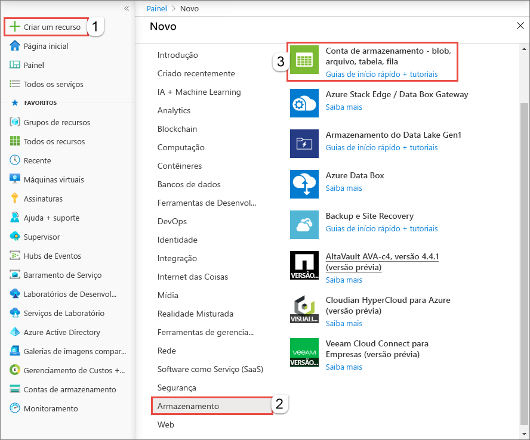
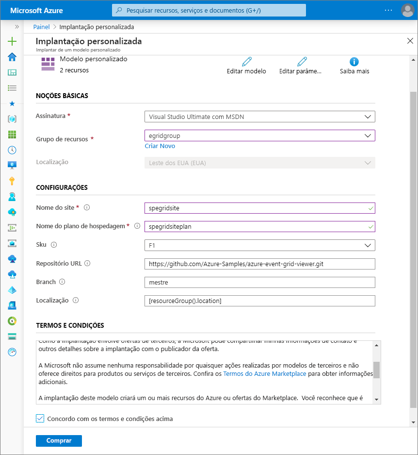
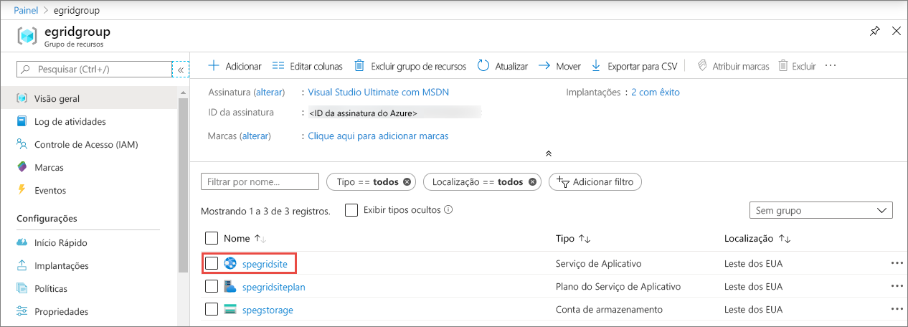
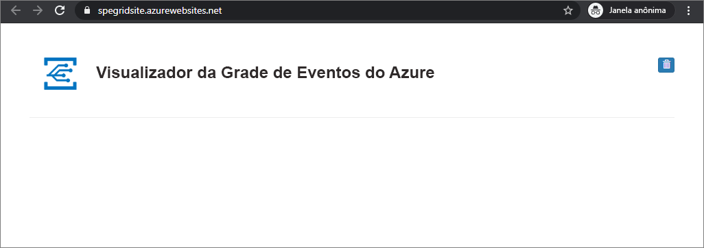
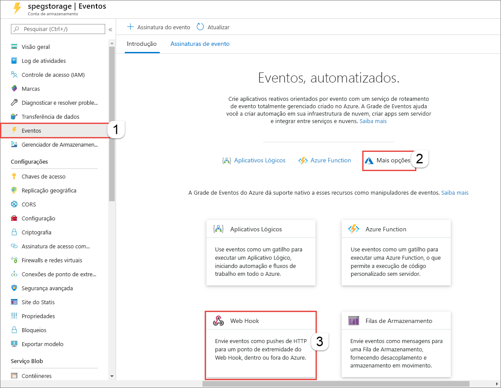
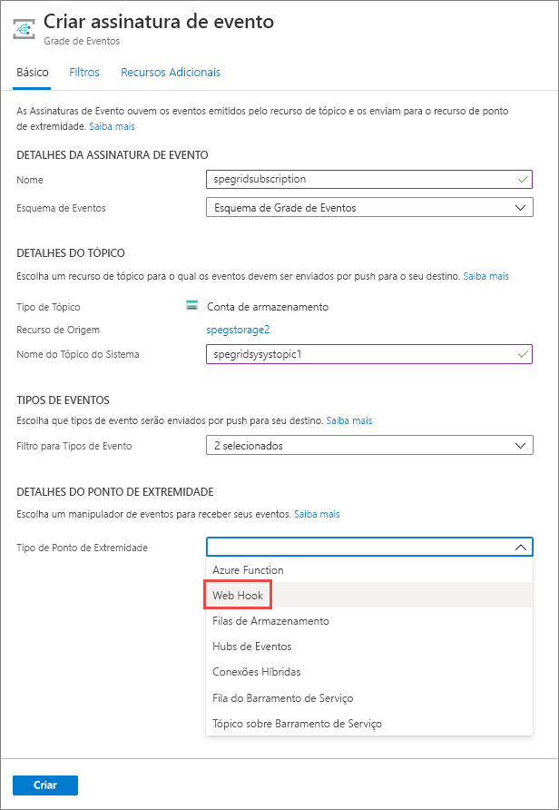
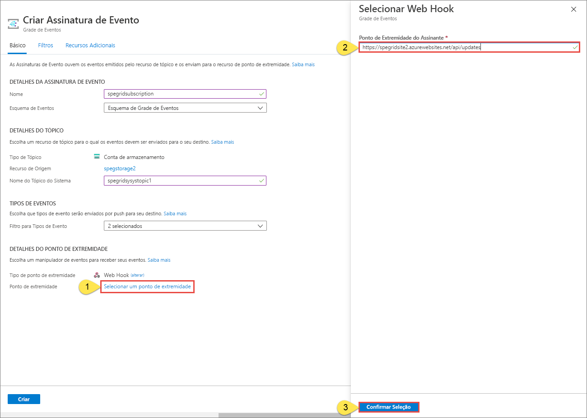
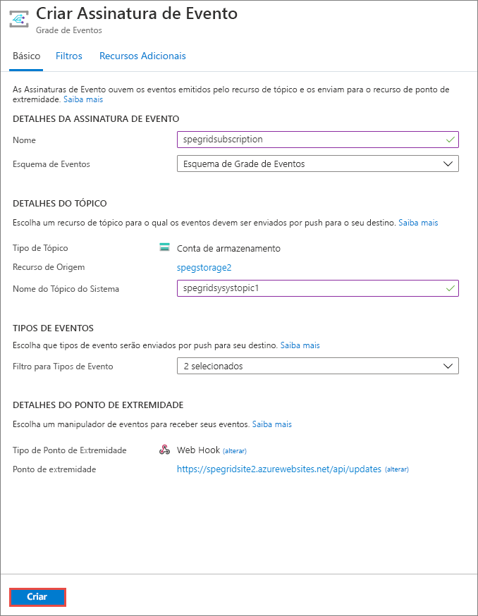
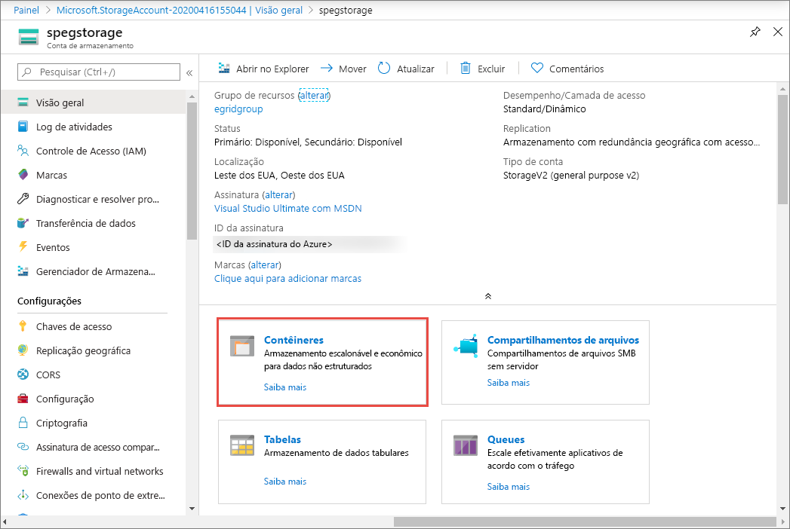
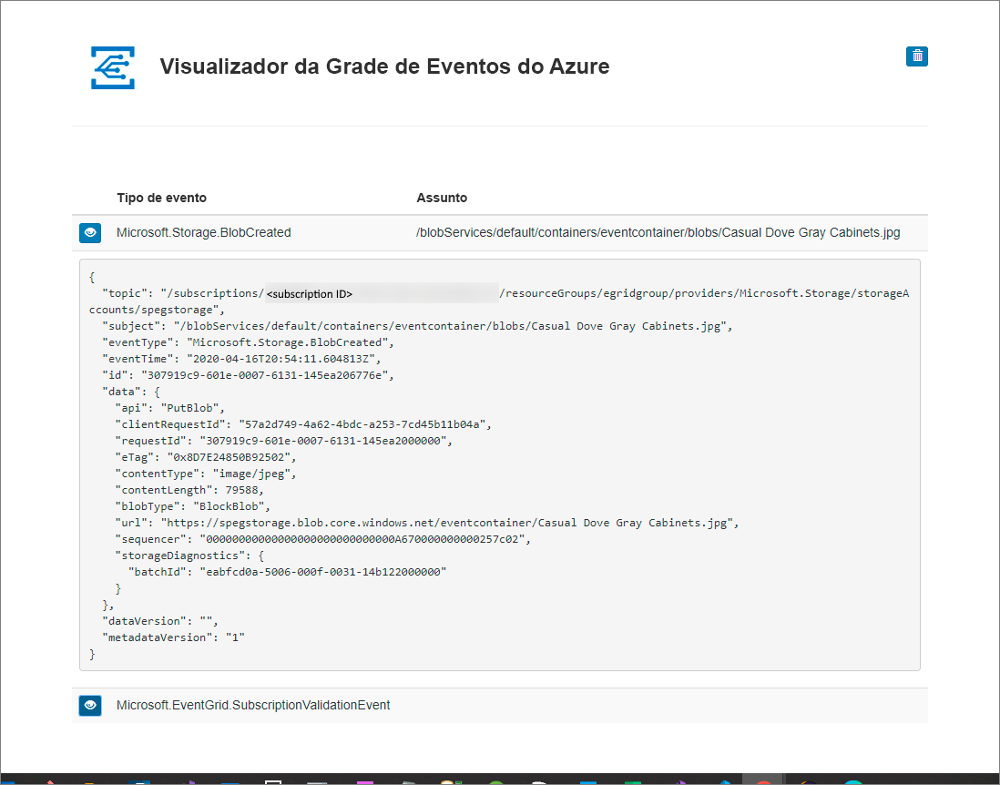

# Início Rápido: Encaminhar eventos de Armazenamento de Blobs para o ponto de extremidade da Web com o portal do Azure

A Grade de Eventos do Azure é um serviço de eventos para a nuvem. Neste artigo, você usa o portal do Azure para criar uma conta de armazenamento de Blobs, faz uma assinatura para os eventos desse mesmo armazenamento de Blobs e dispara um evento para exibir o resultado. Normalmente, você envia eventos para um ponto de extremidade que processa os dados de evento e realiza ações. No entanto, para simplificar este artigo, você enviará os eventos para um aplicativo Web que coleta e exibe as mensagens.

[!INCLUDE [quickstarts-free-trial-note.md](../../includes/quickstarts-free-trial-note.md)]

Ao concluir, você verá que os dados do evento foram enviados para um aplicativo Web.

## Criar uma conta de armazenamento

1. Entre no [Portal do Azure](https://portal.azure.com/).

1. Para criar um armazenamento de Blobs, selecione **Criar um recurso**. 

1. Selecione **Armazenamento** para filtrar as opções disponíveis e selecione **Conta de armazenamento - Blobs, arquivos, tabelas, filas**.

   

   Para assinar eventos, crie uma conta de armazenamento v2 para uso geral ou uma conta de armazenamento de blobs.
   
1. Na página **Criar conta de armazenamento**, execute as etapas a seguir:
    1. Selecione sua assinatura do Azure. 
    2. Para **Grupo de recursos**, crie um novo grupo de recursos ou selecione um existente. 
    3. Insira o nome para a conta de armazenamento. 
    4. Selecione **Examinar + criar**. 

           
    5. Na página **Revisar + criar**, examine as configurações e selecione **Criar**. 

        >[!NOTE]
        > Somente contas de armazenamento do tipo **StorageV2 (v2 de uso geral)** e **BlobStorage** dão suporte à integração de eventos. Contas do tipo **Armazenamento (v1 de uso geral)** *não* dão suporte à integração com a Grade de Eventos.

## Criar um ponto de extremidade de mensagem

Antes de assinar eventos para o armazenamento de Blobs, vamos criar o ponto de extremidade para mensagens de evento. Normalmente, o ponto de extremidade executa ações com base nos dados de evento. Para simplificar este início rápido, você implanta um [aplicativo Web criado previamente](https://github.com/Azure-Samples/azure-event-grid-viewer) que exibe as mensagens de eventos. A solução implantada inclui um plano do Serviço de Aplicativo, um aplicativo Web do Aplicativo do Serviço de e o código-fonte do GitHub.

1. Selecione **Implantar no Azure** para implantar a solução na sua assinatura. 

   
2. Na página **Implantação personalizada**, realize as seguintes etapas: 
    1. Para **Grupo de recursos**, selecione o mesmo grupo de recursos que você usou ao criar a conta de armazenamento. Será mais fácil fazer a limpeza após a concluir o tutorial, excluindo o grupo de recursos.  
    2. Em **Nome do Site**, insira um nome para o aplicativo Web.
    3. Em **Nome do plano de hospedagem**, insira um nome para o plano do Serviço de Aplicativo a usar para hospedar o aplicativo Web.
    4. Selecione a caixa de seleção **Concordo com os termos e condições declarados acima**. 
    5. Selecione **Comprar**. 

       
1. A implantação pode levar alguns minutos para ser concluída. Selecione alertas (ícone de sino) no portal e, em seguida, selecione **Ir para o grupo de recursos**. 

    
4. Na página **Grupo de recursos**, na lista de recursos, selecione o aplicativo Web que você criou. Você também verá o plano do Serviço de Aplicativo e a conta de armazenamento nesta lista. 

    
5. Na página **Serviço de Aplicativo** para seu aplicativo Web, selecione a URL para navegar até o site da Web. A URL deve estar neste formato: `https://<your-site-name>.azurewebsites.net`.
    
    

6. Confirme que você vê o site, mas que nenhum evento foi postado nele ainda.

   

[!INCLUDE [event-grid-register-provider-portal.md](../../includes/event-grid-register-provider-portal.md)]

## Inscreva-se no armazenamento de Blobs

Assine um tópico para indicar à Grade de Eventos quais eventos você deseja acompanhar e para onde enviar os eventos.

1. No portal, navegue para a conta de Armazenamento do Azure criada anteriormente. No menu esquerdo, selecione **Todos os recursos** e, em seguida, selecione sua conta de armazenamento. 
2. Na página da **Conta de armazenamento**, selecione **Eventos** no menu esquerdo.
1. Selecione **Mais opções** e **Web Hook**. Você está enviando eventos para o seu aplicativo visualizador, usando para isso um web hook para o ponto de extremidade. 

   
3. Na página **Criar Assinatura de Eventos**, faça o seguinte: 
    1. Insira um **nome** para a assinatura de evento.
    2. Selecione **Web Hook** para o **Tipo de ponto de extremidade**. 

       
4. Para **Ponto de extremidade**, clique em **Selecionar um ponto de extremidade**, insira a URL do aplicativo Web, adicione `api/updates` à URL da home page (por exemplo: `https://spegridsite.azurewebsites.net/api/updates`) e, em seguida, selecione **Confirmar Seleção**.

   
5. Agora, na página **Criar Assinatura de Evento**, selecione **Criar** para criar a assinatura de evento. 

   

1. Exiba novamente o seu aplicativo Web e observe que um evento de validação de assinatura foi enviado a ele. Selecione o ícone de olho para expandir os dados de evento. A Grade de Eventos envia o evento de validação de modo que o ponto de extremidade possa verificar se ele deseja receber os dados de evento. O aplicativo Web inclui o código para validar a assinatura.

   

Agora, vamos disparar um evento para ver como a Grade de Eventos distribui a mensagem para o ponto de extremidade.

## Enviar um evento para o ponto de extremidade

Você pode disparar um evento para o armazenamento de Blobs carregando um arquivo. O arquivo não precisa de um conteúdo específico. Os artigos supõem que você tem um arquivo chamado testfile.txt, mas você pode usar qualquer arquivo.

1. No portal do Azure, navegue até sua conta do Armazenamento de Blobs e, na página **Visão geral**, selecione **Contêineres**.

   

1. Selecionar **+ Contêiner**. Dê um nome ao seu contêiner, use qualquer nível de acesso e selecione **Criar**. 

   

1. Selecione o novo contêiner.

   

1. Para carregar um arquivo, selecione **Carregar**. Na página **Carregar blob**, procure por um arquivo que você deseja carregar para teste, selecione-o e, em seguida, selecione **Carregar** nessa página. 

   

1. Navegue até seu arquivo de teste e carregue-o.

1. Você disparou o evento, e a Grade de Eventos enviou a mensagem para o ponto de extremidade configurado durante a assinatura. A mensagem está no formato JSON e contém uma matriz com um ou mais eventos. No exemplo a seguir, a mensagem JSON contém uma matriz com um evento. Veja seu aplicativo Web e observe que um evento **criado por blob** foi recebido. 

   

## Limpar os recursos

Caso planeje continuar a trabalhar com esse evento, não limpe os recursos criados neste artigo. Caso contrário, exclua os recursos criados neste artigo.

Selecione o grupo de recursos e selecione **Excluir grupo de recursos**.

## Próximas etapas

Agora que você sabe como criar tópicos e assinaturas de evento personalizados, saiba mais sobre como a Grade de Eventos pode ajudá-lo:

- [Sobre a Grade de Eventos](overview.md)
- [Rotear eventos do Armazenamento de Blobs para um ponto de extremidade da Web personalizado](../storage/blobs/storage-blob-event-quickstart.md?toc=%2fazure%2fevent-grid%2ftoc.json)
- [Monitorar alterações de máquina virtual com a Grade de Eventos do Azure e os Aplicativos Lógicos](monitor-virtual-machine-changes-event-grid-logic-app.md)
- [Transmitir Big Data para um data warehouse](event-grid-event-hubs-integration.md)
