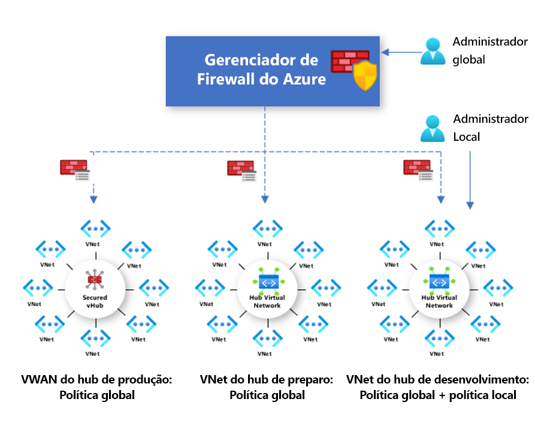

# Visão geral da política do Gerenciador de Firewall do Azure

A política de firewall é um recurso do Azure que contém coleções de regra de aplicativo, de rede e de NAT, bem como configurações de inteligência contra ameaças. É um recurso global que pode ser usado em várias instâncias do Firewall do Azure em hubs virtuais seguros e redes virtuais de hub. As políticas funcionam em regiões e assinaturas diferentes.

## Criação e associação de política

Uma política pode ser criada e gerenciada de várias maneiras, incluindo o portal do Azure, a API REST, os modelos, o Azure PowerShell e a CLI.

Você também pode migrar regras existentes do Firewall do Azure usando o portal ou o Azure PowerShell para criar políticas. Para obter mais informações, confira [Como migrar configurações do Firewall do Azure para a política de Firewall do Azure](migrate-to-policy.md). 

As políticas podem ser associadas a um ou mais hubs virtuais ou VNets. O firewall pode estar em qualquer assinatura associada à sua conta e em qualquer região.

## Políticas hierárquicas

Políticas podem ser criadas do zero ou herdadas de políticas existentes. A herança permite que o DevOps crie políticas de firewall locais sobre a política base obrigatória da organização.

As políticas criadas com políticas pai não vazias herdam todas as coleções de regras da política pai. As coleções de regras de rede herdadas de uma política pai sempre são priorizadas acima das coleções de regras de rede definidas como parte de uma nova política. A mesma lógica também se aplica às coleções de regras de aplicativo. No entanto, as coleções de regras de rede são sempre processadas antes de coleções de regras de aplicativo, independentemente da herança.

O modo de inteligência contra ameaças também é herdado da política pai. Você pode definir o modo de inteligência contra ameaças para um valor diferente a fim de substituir esse comportamento, mas não pode desativá-lo. Só é possível substituí-lo por um valor mais estrito. Por exemplo, se a política pai estiver definida como **Somente alerta**, você poderá configurar essa política local para **Alertar e recusar**.

Assim como o modo da Inteligência Contra Ameaças, a lista de permissões da Inteligência Contra Ameaças é herdada da política pai. A política filho pode adicionar outros endereços IP à lista de permissões.

As coleções de regras de NAT não são herdadas porque são específicas a um determinado firewall.

Com a herança, todas as alterações na política pai são aplicadas automaticamente a políticas filho de firewall associadas.

## Regras e políticas tradicionais

O Firewall do Azure dá suporte a regras e políticas tradicionais. A seguinte tabela compara políticas e regras:

|         |Política  |Regras  |
|---------|---------|---------|
|Contém     |Regras de NAT, Rede e Aplicativo, configurações personalizadas de proxy DNS e DNS, Grupos de IP e configurações da Inteligência Contra Ameaças (incluindo lista de permissões)|Regras de NAT, Rede e Aplicativo, configurações personalizadas de proxy DNS e DNS, Grupos de IP e configurações da Inteligência Contra Ameaças (incluindo lista de permissões)|
|Protege     |Hubs virtuais e redes virtuais|Somente Redes Virtuais|
|Experiência do Portal     |Gerenciamento central usando o Gerenciador de Firewall|Experiência de firewall autônomo|
|Suporte a vários firewalls     |A política de firewall é um recurso separado que pode ser usado em firewalls|Exportar e importar regras manualmente ou usar soluções de gerenciamento de terceiros |
|Preços     |Cobrado com base na associação de firewall. Veja [Preço](#pricing).|Grátis|
|Mecanismos de implantação compatíveis     |Portal, API REST, modelos, Azure PowerShell e CLI|Portal, API REST, modelos, PowerShell e CLI. |

## Preços

As políticas são cobradas com base nas associações de firewall. Uma política com zero ou uma associação de firewall é gratuita. Uma política com várias associações de firewall é cobrada segundo uma taxa fixa. Para obter mais informações, confira [Preços do Gerenciador de Firewall do Azure](https://azure.microsoft.com/pricing/details/firewall-manager/).

## Próximas etapas

Para saber como implantar um Firewall do Azure, confira [Tutorial: Proteger sua rede na nuvem com o Gerenciador de Firewall do Azure usando o portal do Azure](secure-cloud-network.md).
