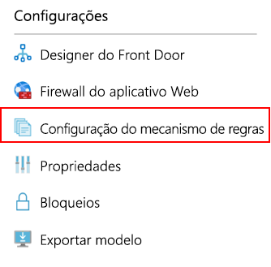
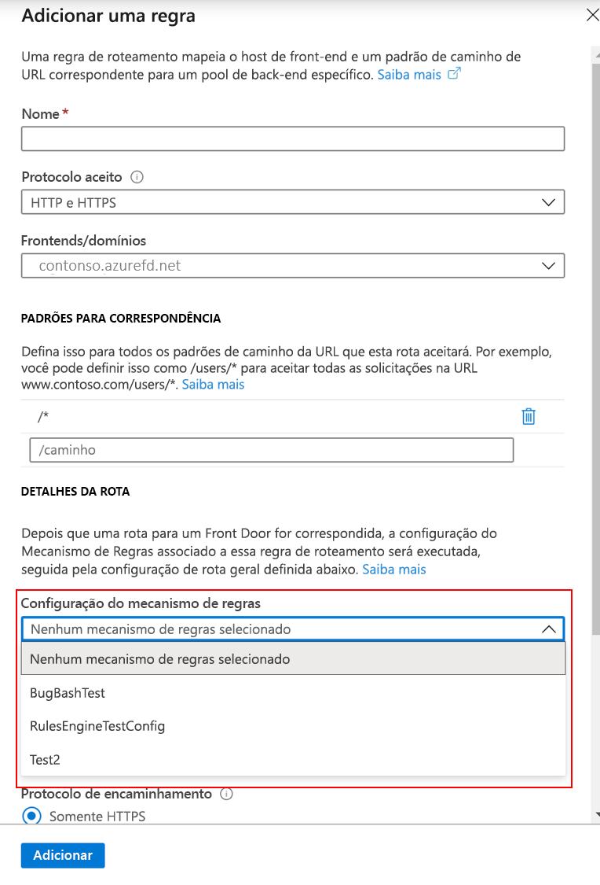

# <a name="configure-your-rules-engine"></a>Configurar o mecanismo de regras

Este artigo fornece etapas para criar uma configuração de mecanismo de regras e sua primeira regra no portal do Azure e na CLI. 

## <a name="configure-rules-engine-in-azure-portal"></a>Configurar o mecanismo de regras no portal do Azure
1. Antes de criar uma configuração de mecanismo de regras, [crie uma Front Door](quickstart-create-front-door.md).

2. No recurso de Front Door, acesse **Configurações** e selecione **Configuração do mecanismo de regras**. Clique em **Adicionar**, dê um nome à sua configuração e comece a criar sua primeira configuração do mecanismo de regras.

    

3. Clique em **Adicionar Regra** para criar sua primeira regra. Em seguida, clicando **Adicionar condição** ou **Adicionar ação**, você pode definir sua regra.
    
    > [!NOTE]
    >- Para excluir uma condição ou ação da regra, use a lixeira no lado direito da condição ou ação específica.
    > - Para criar uma regra que se aplica a todo o tráfego de entrada, não especifique nenhuma condição.
    > - Para interromper a avaliação de regras depois que a primeira condição de correspondência for atendida, marque **parar de avaliar a regra restante**. Se essa opção estiver marcada e todas as condições de correspondência de uma regra específica forem atendidas, as regras restantes na configuração não serão executadas.  

     

4. Determine a prioridade das regras em sua configuração usando os botões mover para cima, mover para baixo e mover para o topo. A prioridade está em ordem crescente, o que significa que a regra listada primeiro é a mais importante.

5. Depois de criar uma ou mais regras, pressione **Salvar**. Essa ação cria a configuração do mecanismo de regras.

6. Depois de criar uma ou mais configurações, associe uma configuração de mecanismo de regras a uma regra de rota. Embora uma configuração possa ser aplicada a muitas regras de rota, uma regra de rota pode conter apenas uma configuração de mecanismo de regras. Para fazer a associação, vá para **Designer do Front Door** > **Regras de rota**. Selecione a regra de rota à qual você gostaria de adicionar a configuração do mecanismo de regras, vá para **Detalhes da rota** > **Configuração do mecanismo de regras** e selecione a configuração que você deseja associar.

    


## <a name="configure-rules-engine-in-azure-cli"></a>Configurar o mecanismo de regras na CLI do Azure

1. Caso ainda não tenha feito isso, instale a [CLI do Azure](https://docs.microsoft.com/cli/azure/install-azure-cli?view=azure-cli-latest). Adicione a extensão "front-door":- az extension add --name front-door. Em seguida, faça logon e alterne para sua assinatura az account set --subscription <nome_ou_ID>.

2. Comece criando um mecanismo de regras – este exemplo mostra uma regra com uma ação baseada em cabeçalho e uma condição de correspondência. 

```azurecli-interactive
az network front-door rules-engine rule create -f {front_door} -g {resource_group} --rules-engine-name {rules_engine} --name {rule1} --priority 1 --action-type RequestHeader --header-action Overwrite --header-name Rewrite --header-value True --match-variable RequestFilenameExtension --operator Contains --match-values jpg png --transforms Lowercase
```

3. Listar todas as regras. 

```azurecli-interactive
az network front-door rules-engine rule list -f {front_door} -g {rg} --name {rules_engine}
```

4. Adicione uma ação de substituição de rota de encaminhamento. 

```azurecli-interactive
az network front-door rules-engine rule action add -f {front_door} -g {rg} --rules-engine-name {rules_engine} --name {rule1} --action-type ForwardRouteOverride --backend-pool {backend_pool_name} --caching Disabled
```

5. Listar todas as ações em uma regra. 

```azurecli-interactive
az network front-door rules-engine rule action list -f {front_door} -g {rg} -r {rules_engine} --name {rule1}
```

6. Vincular uma configuração do mecanismo de regras a uma regra de roteamento.  

```azurecli-interactive
az network front-door routing-rule update -g {rg} -f {front_door} -n {routing_rule_name} --rules-engine {rules_engine}
```

7. Desvincular mecanismo de regras. 

```azurecli-interactive
az network front-door routing-rule update -g {rg} -f {front_door} -n {routing_rule_name} --remove rulesEngine # case sensitive word ‘rulesEngine’
```

Para obter mais informações, uma lista completa de comandos do mecanismo de regras do AFD pode ser encontrada [aqui](https://docs.microsoft.com/cli/azure/ext/front-door/network/front-door/rules-engine?view=azure-cli-latest).   

## <a name="next-steps"></a>Próximas etapas

- Saiba mais sobre o [Mecanismo de regras de AFD](front-door-rules-engine.md). 
- Saiba como [criar um Front Door](quickstart-create-front-door.md).
- Saiba [como o Front Door funciona](front-door-routing-architecture.md).
- Confira mais na [referência da CLI](https://docs.microsoft.com/cli/azure/ext/front-door/network/front-door/rules-engine?view=azure-cli-latest) do Mecanismo de regras do AFD. 
- Confira mais na [referência do PowerShell](https://docs.microsoft.com/powershell/module/az.frontdoor/?view=azps-3.8.0) do Mecanismo de regras do AFD. 
