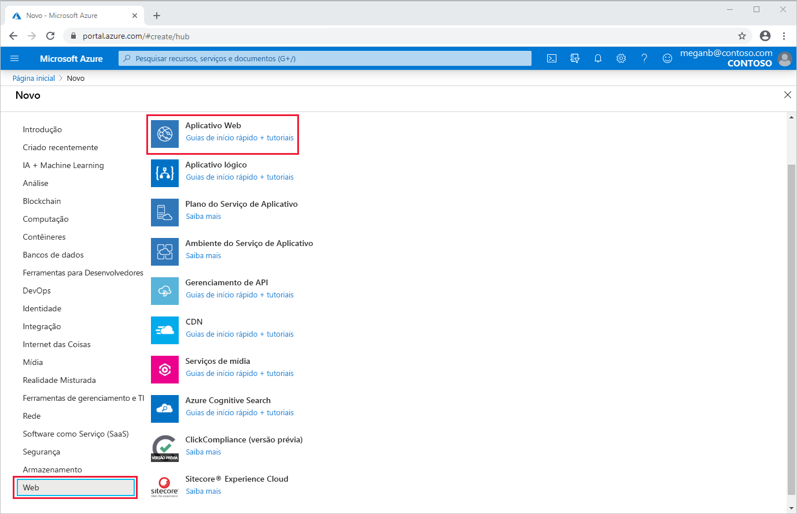
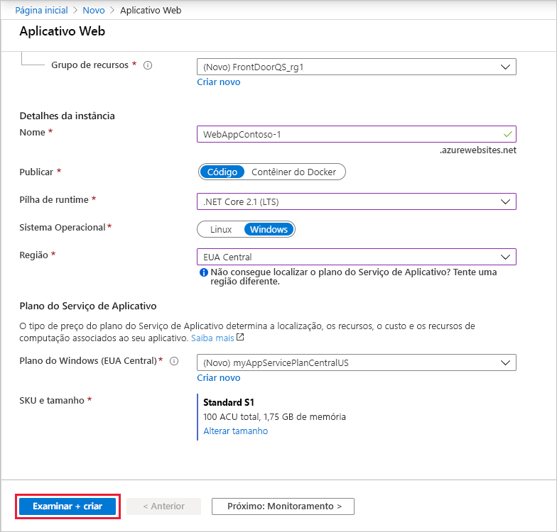
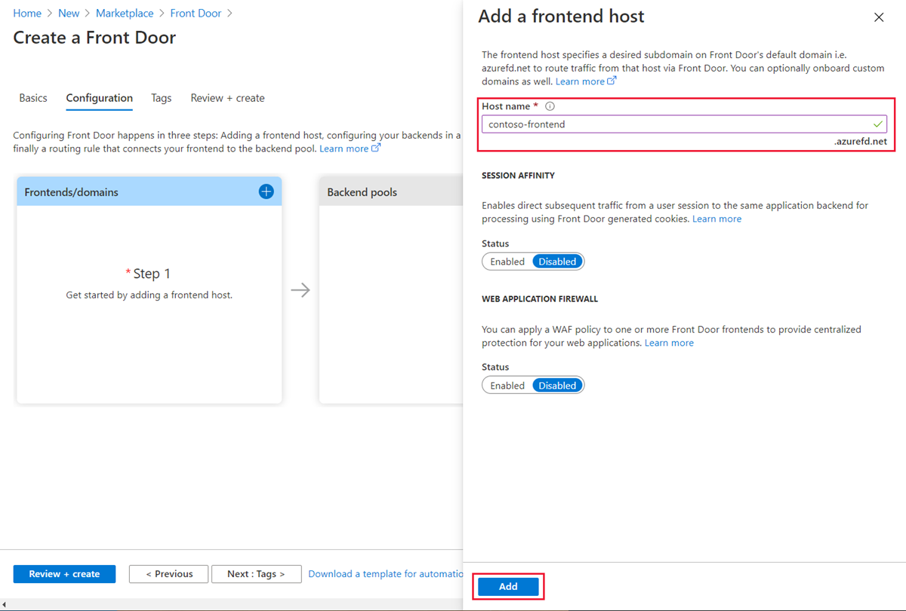
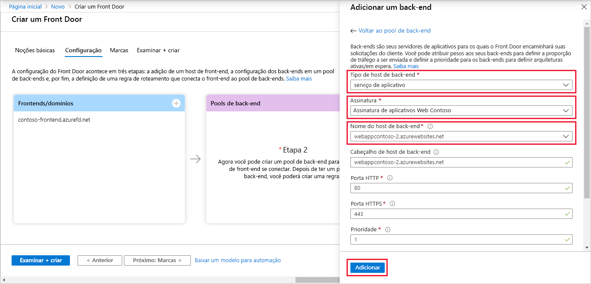
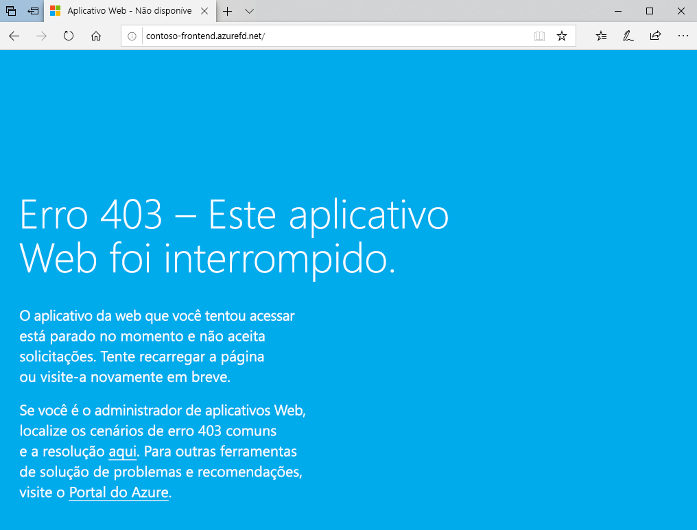

# Início Rápido: Crie um Front Door para um aplicativo Web global altamente disponível

Comece a usar o Azure Front Door usando o portal do Azure para configurar a alta disponibilidade para um aplicativo Web.

Neste início rápido, o Azure Front Door coloca em pool duas instâncias de um aplicativo Web em execução em regiões do Azure diferentes. Você cria uma configuração de Front Door com base em back-ends com pesos e prioridades iguais. Essa configuração direciona o tráfego para o site mais próximo que executa o aplicativo. O Azure Front Door monitora o aplicativo Web continuamente. O serviço fornecerá failover automático para o próximo site disponível quando o site mais próximo estiver não disponível.

## Pré-requisitos

- Uma conta do Azure com uma assinatura ativa. [Crie uma conta gratuitamente](https://azure.microsoft.com/free/?WT.mc_id=A261C142F).

## Criar duas instâncias de um aplicativo Web

Este início rápido requer duas instâncias de um aplicativo Web em execução em regiões do Azure diferentes. Ambas as instâncias do aplicativo Web são executadas no modo *Ativo/Ativo*, portanto, qualquer uma pode aceitar tráfego. Essa configuração difere de uma configuração *Ativa/Em Espera*, em que uma delas atua como um failover.

Se você ainda não tiver um aplicativo Web, use as etapas a seguir para configurar aplicativos Web de exemplo.

1. Entre no Portal do Azure em https://portal.azure.com.

1. Da Página Inicial ou do menu do Azure, selecione **Criar um recurso**.

1. Selecione **Web** > **Aplicativo Web**.

   

1. Em **Aplicativo Web**, selecione a **Assinatura** a usar.

1. Para **Grupo de Recursos**, selecione **Criar**. Insira *FrontDoorQS_rg1* para o **Nome** e selecione **OK**.

1. Em **Detalhes da Instância**, insira um **Nome** para o aplicativo Web. Este exemplo usa *WebAppContoso-1*.

1. Selecione uma **pilha de Runtime**, neste exemplo, *.NET Core 2.1 (LTS)* .

1. Selecione uma região, como *EUA Central*.

1. Em **Plano do Windows**, selecione **Criar**. Digite *myAppServicePlanCentralUS* para **Name** e selecione **OK**.

1. Verifique se o **SKU e Tamanho** é **Standard S1 100 ACU total, 1,75 GB de memória**.

1. Selecione **Examinar + criar**, examine o **Resumo** e, em seguida, selecione **Criar**. Pode levar vários minutos para que a implantação seja concluída.

   

Depois que a implantação for concluída, crie um segundo aplicativo Web. Use o mesmo procedimento com os mesmos valores, exceto pelos seguintes valores:

| Configuração          | Valor     |
| ---              | ---  |
| **Grupo de recursos**   | Selecione **Novo** e insira *FrontDoorQS_rg2* |
| **Nome**             | Insira um nome exclusivo para seu aplicativo Web, neste exemplo, *WebAppContoso-2*  |
| **Região**           | Uma região diferente, neste exemplo, *Centro-Sul dos EUA* |
| **Plano do Serviço de Aplicativo** > **Plano do Windows**         | Selecione **Novo** e insira *myAppServicePlanSouthCentralUS*, depois selecione **OK** |

## Criar um Front Door para seu aplicativo

Configure o Azure Front Door para direcionar o tráfego do usuário com base na latência mais baixa entre dois servidores dos aplicativos Web. Para começar, adicione um host de front-end para o Azure Front Door.

1. Da Página Inicial ou do menu do Azure, selecione **Criar um recurso**. Selecione **Rede** > **Front Door**.

1. Em **Criar um Front Door**, selecione uma **Assinatura**.

1. Para **Grupo de recursos**, selecione **Novo** e, em seguida, digite *FrontDoorQS_rg0* e selecione **OK**.  Alternativamente, você pode usar um grupo de recursos existente.

1. Se tiver criado um grupo de recursos, selecione um **Localização do grupo de recursos** e selecione **Avançar: Configuração**.

1. Em **Front-ends/domínios**, selecione **+** para abrir **Adicionar um host de front-end**.

1. Para **Nome do host**, insira um nome do host globalmente exclusivo. Este exemplo usa *contoso-frontend*. Selecione **Adicionar**.

   

Em seguida, crie um pool de back-end que contenha os dois aplicativos Web.

1. Ainda em **Criar um Front Door**, em **Pools de back-end**, selecione **+** para abrir **Adicionar um pool de back-end**.

1. Em **Nome**, insira *myBackendPool*.

1. Selecione **Adicionar um back-end**. Para **Tipo de host de back-end**, selecione *Serviço de Aplicativo*.

1. Selecione sua assinatura e escolha o primeiro aplicativo Web que você criou em **Nome do host de back-end**. Neste exemplo, o aplicativo Web era *WebAppContoso-1*. Selecione **Adicionar**.

1. Selecione **Adicionar um back-end** novamente. Para **Tipo de host de back-end**, selecione *Serviço de Aplicativo*.

1. Selecione sua assinatura novamente e escolha o segundo aplicativo Web que você criou em **Nome do host de back-end**. Selecione **Adicionar**.

   

Por fim, adicione uma regra de roteamento. Uma regra de roteamento mapeia o host de front-end para o pool de back-end. A regra encaminha uma solicitação de `contoso-frontend.azurefd.net` para **myBackendPool**.

1. Ainda em **Criar um Front Door**, em **Regras de roteamento**, selecione **+** para configurar uma regra de roteamento.

1. Em **Adicionar uma regra**, para **Nome**, insira *LocationRule*. Aceite todos os valores padrão e, em seguida, selecione **Adicionar** para adicionar a regra de roteamento.

   >[!WARNING]
   > É **necessário** garantir que cada um dos hosts de front-end no seu Front Door tem uma regra de roteamento com um caminho padrão (`\*`) associado a ela. Ou seja, entre todas as suas regras de roteamento, deve haver pelo menos uma regra de roteamento para cada um dos seus hosts de front-end definida no caminho padrão (`\*`). Não fazer isso poderá fazer o tráfego do seu usuário final não ser roteado corretamente.

1. Selecione **Examinar + Criar** e depois **Criar**.

   

## Ver o Azure Front Door em ação

Depois de você criar um Front Door, a configuração leva alguns minutos para ser implantada globalmente. Depois de concluído, acesse o host de front-end que você criou. Em um navegador, acesse `contoso-frontend.azurefd.net`. Sua solicitação será roteada automaticamente para o servidor mais próximo de você dos servidores especificados no pool de back-end.

Se tiver criado criou esses aplicativos neste início rápido, você verá uma página de informações.

Para testar o failover global instantâneo em ação, tente as seguintes etapas:

1. Abra um navegador conforme descrito acima e vá para o endereço de front-end: `contoso-frontend.azurefd.net`.

1. No portal do Azure, pesquise e selecione *Serviços de Aplicativos*. Role para baixo para encontrar um dos seus aplicativos Web, **WebAppContoso-1**, neste exemplo.

1. Selecione seu aplicativo Web e, em seguida, selecione **Parar** e **Sim** para verificar.

1. Atualize seu navegador. Você deverá ver a mesma página de informações.

   >[!TIP]
   >Há um pouco de atraso para essas ações. Talvez você precise atualizar novamente.

1. Localize o outro aplicativo Web e interrompa-o também.

1. Atualize seu navegador. Desta vez, você deverá ver uma mensagem de erro.

   

## Limpar os recursos

Depois de terminar, você poderá remover todos os itens que criou. Excluir um grupo de recursos também exclui o conteúdo dele. Se você não pretende usar esse Front Door, remova os recursos para evitar encargos desnecessários.

1. No portal do Azure, pesquise por **Grupos de recursos** e selecione essa opção. Alternativamente, selecione **Grupos de recursos** no menu do portal do Azure.

1. Filtre ou role para baixo para localizar um grupo de recursos, como **FrontDoorQS_rg0**.

1. Selecione o grupo de recursos e selecione **Excluir grupo de recursos**.

   >[!WARNING]
   >Esta ação é irreversível.

1. Digite o nome do grupo de recursos para verificá-lo e selecione **Excluir**.

Repita o procedimento para os outros dois grupos.

## Próximas etapas

Avance para o próximo artigo para saber como adicionar um domínio personalizado ao Front Door.
> [!div class="nextstepaction"]
> [Adicionar um domínio personalizado](front-door-custom-domain.md)
