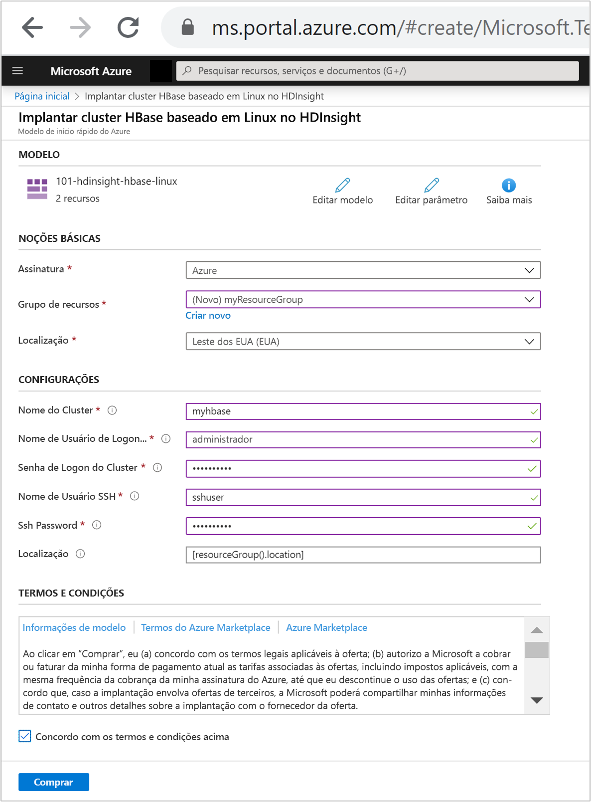
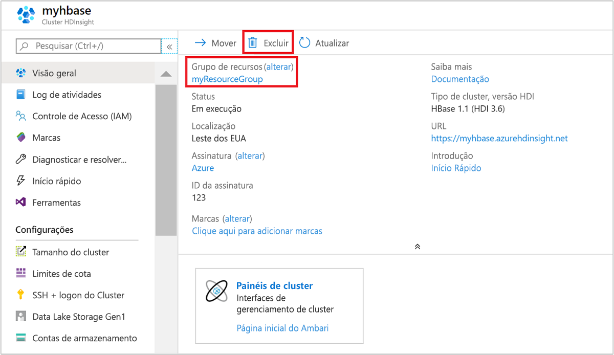

# Início Rápido: Criar um cluster do Apache HBase no Azure HDInsight usando o modelo do Resource Manager

Neste início rápido, você usará um modelo do Azure Resource Manager para criar um cluster do [Apache HBase](./apache-hbase-overview.md) no Azure HDInsight. O HBase é um banco de dados NoSQL de software livre, que se baseia no Apache Hadoop e é modelado com base no [Google BigTable](https://cloud.google.com/bigtable/).

[!INCLUDE [About Azure Resource Manager](../../../includes/resource-manager-quickstart-introduction.md)]

Se você não tiver uma assinatura do Azure, crie uma [conta gratuita](https://azure.microsoft.com/free/?WT.mc_id=A261C142F) antes de começar.

## Criar um cluster do Apache HBase

### Examinar o modelo

O modelo usado neste início rápido é proveniente dos [modelos de Início Rápido do Azure](https://github.com/Azure/azure-quickstart-templates/tree/master/101-hdinsight-hbase-linux).

:::code language="json" source="~/quickstart-templates/101-hdinsight-hbase-linux/azuredeploy.json" range="1-145":::

Há dois recursos do Azure definidos no modelo:

* [Microsoft.Storage/storageAccounts](https://docs.microsoft.com/azure/templates/microsoft.storage/storageaccounts): crie uma Conta de Armazenamento do Azure.
* [Microsoft.HDInsight/cluster](https://docs.microsoft.com/azure/templates/microsoft.hdinsight/clusters): crie um cluster HDInsight.

### Implantar o modelo

1. Selecione o botão **Implantar no Azure** abaixo para entrar no Azure e abrir o modelo do Resource Manager.

    

1. Digite ou selecione os valores a seguir:

    |Propriedade |Descrição |
    |---|---|
    |Subscription|Na lista suspensa, selecione a assinatura do Azure usada para o cluster.|
    |Resource group|Na lista suspensa, selecione o grupo de recursos existente ou selecione **Criar**.|
    |Location|O valor será preenchido automaticamente com o local usado para o grupo de recursos.|
    |Nome do cluster|Insira um nome global exclusivo. Para este modelo, use apenas letras minúsculas e números.|
    |Nome de usuário de logon do cluster|Forneça o nome de usuário, o padrão é **admin**.|
    |Senha de logon do cluster|Forneça uma senha. A senha precisa ter no mínimo 10 caracteres e precisa conter pelo menos um dígito, uma letra maiúscula, uma minúscula e um caractere não alfanumérico (exceto pelos caracteres ' " ` ). |
    |Nome de Usuário SSH|Forneça o nome de usuário, o padrão é sshuser|
    |Senha SSH|Forneça a senha.|

    

1. Examine os **TERMOS E CONDIÇÕES**. Em seguida, selecione **Concordo com os termos e condições declarados acima** e **Comprar**. Você receberá uma notificação de que a implantação está em andamento. Demora cerca de 20 minutos para criar um cluster.

## Examinar os recursos implantados

Depois que o cluster for criado, você receberá uma notificação de **Implantação bem-sucedida** com um link **Ir para o recurso**. A página do Grupo de recursos listará o novo cluster HDInsight e o armazenamento padrão associado a ele. Cada cluster tem uma dependência na conta do [Armazenamento do Azure](../hdinsight-hadoop-use-blob-storage.md) ou na [conta do Azure Data Lake Storage](../hdinsight-hadoop-use-data-lake-store.md). Ela é conhecida como a conta de armazenamento padrão. O cluster do HDInsight e sua conta de armazenamento padrão devem estar colocados na mesma região do Azure. A exclusão dos clusters não exclui a conta de armazenamento.

## Limpar os recursos

Após concluir o início rápido, poderá ser conveniente excluir o cluster. Com o HDInsight, seus dados são armazenados no Armazenamento do Azure, assim você poderá excluir, com segurança, um cluster quando ele não estiver em uso. Você também é cobrado por um cluster HDInsight, mesmo quando ele não está em uso. Como os encargos para o cluster são muitas vezes maiores do que os encargos para armazenamento, faz sentido, do ponto de vista econômico, excluir os clusters quando não estiverem em uso.

No portal do Azure, navegue até seu cluster e selecione **Excluir**.

Também é possível selecionar o nome do grupo de recursos para abrir a página do grupo de recursos, e depois selecionar **Excluir grupo de recursos**. Ao excluir o grupo de recursos, você exclui o cluster HDInsight e a conta de armazenamento padrão.

## Próximas etapas

Neste início rápido, você aprenderá a criar um cluster do Apache HBase no HDInsight usando um modelo do Resource Manager. No próximo artigo, você aprenderá a consultar o HBase no HDInsight com o Shell do HBase.

> [!div class="nextstepaction"]
> [Consulta Apache HBase no Azure HDInsight com o Shell do HBase](./query-hbase-with-hbase-shell.md)
