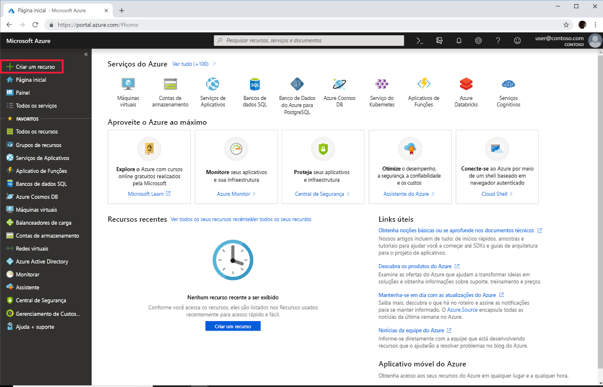

# Início Rápido: Implantar a API do Azure para FHIR usando o portal do Azure

Neste guia de início rápido, você aprenderá a implantar a API do Azure para FHIR usando o portal do Azure.

Se você não tiver uma assinatura do Azure, crie uma [conta gratuita](https://azure.microsoft.com/free/?WT.mc_id=A261C142F) antes de começar.

## Criar novo recurso

Abra o [portal do Azure](https://portal.azure.com) e clique em **Criar um recurso**

## Pesquisar a API do Azure para FHIR

Você pode encontrar a API do Azure para FHIR digitando "FHIR" na caixa de pesquisa:

:::image type="content" source="media/quickstart-paas-portal/portal-search-healthcare-apis.png" alt-text="Pesquisar APIs de Saúde":::

## Criar conta da API do Azure para FHIR

Selecione **Criar** para criar uma conta da API do Azure para FHIR:

:::image type="content" source="media/quickstart-paas-portal/portal-create-healthcare-apis.png" alt-text="Criar conta da API do Azure para FHIR":::

## Inserir detalhes da conta

Selecione um grupo de recursos ou crie um, escolha um nome para a conta e, por fim, clique em **Examinar + criar**:

:::image type="content" source="media/quickstart-paas-portal/portal-new-healthcareapi-details.png" alt-text="Novos detalhes da API de saúde":::

Confirme a criação e aguarde a implantação da API do FHIR.

## Configurações adicionais (opcional)

Você também pode clicar em **Avançar: configurações adicionais** para exibir as configurações de autenticação. A configuração padrão para a API do Azure para FHIR é [usar o RBAC do Azure para atribuir funções de plano de dados](configure-azure-rbac.md). Quando configurado nesse modo, a "Autoridade" do serviço FHIR será definida como o locatário do Azure Active Directory da assinatura:

:::image type="content" source="media/rbac/confirm-azure-rbac-mode-create.png" alt-text="Configurações de autenticação padrão":::

Observe que a caixa para inserir as IDs de objeto permitidas está esmaecida, já que usamos o RBAC do Azure para configurar atribuições de função nesse caso.

Se desejar configurar o serviço FHIR para usar um locatário de Azure Active Directory externo ou secundário, altere a autoridade e insira as IDs de objeto para usuários e grupos que devem ter acesso permitido ao servidor. Para obter mais informações, confira o guia de [configuração do RBAC local](configure-local-rbac.md).

## Instrução de funcionalidade Buscar API de FHIR

Para validar que a nova conta da API do FHIR é provisionada, busque uma declaração de capacidade apontando um navegador para `https://<ACCOUNT-NAME>.azurehealthcareapis.com/metadata`.

## Limpar os recursos

Quando ele não for mais necessário, você poderá excluir o grupo de recursos, API do Azure para FHIR e todos os recursos relacionados. Para fazer isso, selecione o grupo de recursos que contém a conta da API do Azure para FHIR, selecione **Excluir grupo de recursos** e confirme o nome do grupo de recursos a ser excluído.

## Próximas etapas

Neste guia de início rápido, você implantou a API do Azure para FHIR em sua assinatura. Para definir configurações adicionais em sua API do Azure para FHIR, vá para o guia de instruções de configurações adicionais.

>[!div class="nextstepaction"]
>[Configurações adicionais na API do Azure para FHIR](azure-api-for-fhir-additional-settings.md)
