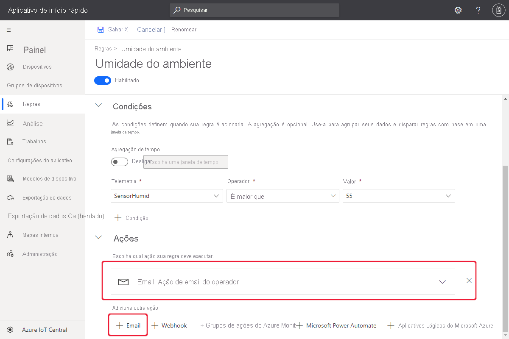

# Início Rápido: Configurar regras e ações para o seu dispositivo no Azure IoT Central

*Este artigo aplica-se a operadores, construtores e administradores.*

Neste início rápido, você criará uma regra que envia um email quando a temperatura informada por um sensor do dispositivo que ultrapassou 90&deg; F.

## Pré-requisitos

Antes de começar, você deve concluir os dois inícios rápidos anteriores [Criar um aplicativo do Azure IoT Central](./quick-deploy-iot-central.md) e [Adicionar um dispositivo simulado ao seu aplicativo do IoT Central](./quick-create-pnp-device.md) para criar o modelo de dispositivo **MXChip IoT DevKit** com o qual trabalhar.

## Criar uma regra baseada em telemetria

1. Para adicionar uma nova regra baseada em telemetria ao aplicativo, no painel esquerdo, selecione **Regras**.

1. Para criar uma regra, selecione **+** .

1. Insira **Temperatura ambiental** como o nome da regra.

1. Na seção **Dispositivos de destino**, selecione **MXChip IoT DevKit** como o modelo de dispositivo. Essa opção filtra os dispositivos aos quais a regra se aplica por tipo de modelo de dispositivo. Você pode adicionar mais critérios de filtro selecionando **+ Filtro**.

1. Na seção **Condições**, defina o que dispara a regra. Use as seguintes informações para definir uma condição com base na telemetria de temperatura:

    | Campo        | Valor            |
    | ------------ | ---------------- |
    | Medida  | Temperatura      |
    | Operador     | é maior que  |
    | Valor        | 90               |

    Para adicionar mais condições, selecione **+Condição**.

    

1. Para adicionar uma ação de email a ser executada quando a regra for disparada, selecione **+ Email**.

1. Use as informações da seguinte tabela para definir a ação e, em seguida, selecione **Concluído**:

    | Configuração   | Valor                                             |
    | --------- | ------------------------------------------------- |
    | Nome de exibição | Ação de email do operador                          |
    | Para        | Seu endereço de email                                |
    | Observações     | A temperatura ambiental excedeu o limite. |

    > [!NOTE]
    > Para receber uma notificação por email, o endereço de email deve ser uma [ID de usuário no aplicativo](howto-administer.md), e esse usuário deve entrar no aplicativo pelo menos uma vez.

    

1. Clique em **Salvar**. A regra é listada na página **Regras**.

## Teste a regra

Logo depois de salvar a regra, ela passa a valer. Quando as condições definidas na regra são atendidas, o aplicativo envia uma mensagem para o endereço de email especificado na ação.

> [!NOTE]
> Depois que os testes forem concluídos, desligue a regra para interromper o recebimento de alertas na caixa de entrada.

## Próximas etapas

Neste guia de início rápido, você aprendeu a:

* Criar uma regra baseada em telemetria
* Adicionar uma ação

Para saber mais sobre como monitorar dispositivos conectados ao seu aplicativo, passe para o início rápido:

> [!div class="nextstepaction"]
> [Usar o Azure IoT Central para monitorar seus dispositivos](quick-monitor-devices.md).
