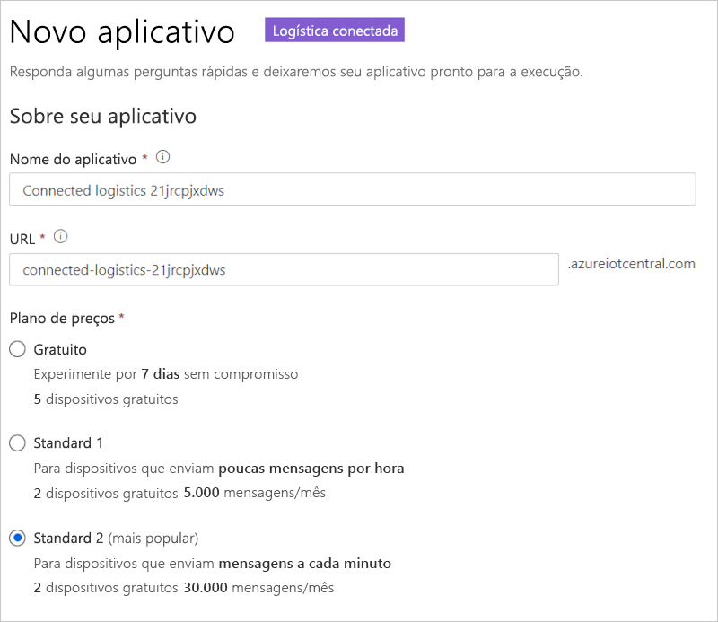
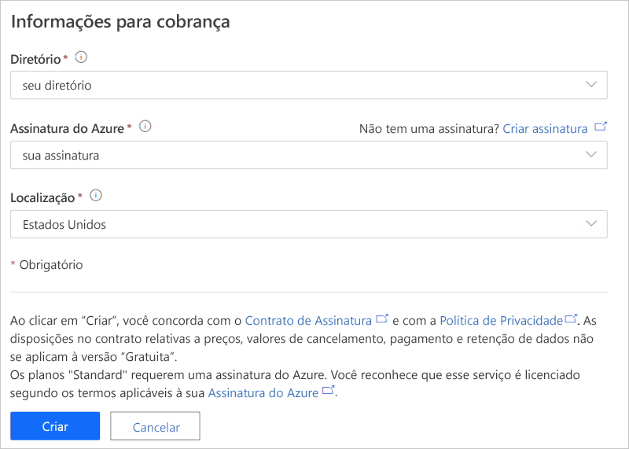

# Tutorial: Implantar e usar um modelo de aplicativo de logística conectada

Este tutorial mostra como começar a usar o modelo de aplicativo de *logística conectada* do IoT Central. Você aprenderá a implantar e usar o modelo.

Neste tutorial, você aprenderá como:

> [!div class="checklist"]
> * Criar um aplicativo de logística conectada.
> * Usar os principais recursos do aplicativo.
> * Usar o painel para mostrar a atividade crítica das operações do dispositivo de logística.
> * Usar o modelo de dispositivo
> * Seguir regras
> * Usar trabalhos

## Pré-requisitos

* Não há pré-requisitos específicos para implantar este aplicativo.
* Você pode usar o plano de preços gratuito ou usar uma assinatura do Azure.

## Criar aplicativo de logística conectada

Crie um aplicativo usando as seguintes etapas:

1. Navegue até o site do [Build do Azure IoT Central](https://aka.ms/iotcentral). Em seguida, entre com uma conta pessoal, corporativa ou de estudante da Microsoft. Selecione o **Build** na barra de navegação esquerda e, em seguida, a guia **Varejo**:

    :::image type="content" source="media/tutorial-iot-central-connected-logistics/iotc-retail-homepage.png" alt-text="Modelo de logística conectada":::

2. Selecione **Criar aplicativo** em **Aplicativo de Logística Conectada**.

3. **Criar aplicativo** abre o formulário **Novo aplicativo**. Insira os seguintes detalhes:

    * **Nome do aplicativo**: use o nome sugerido padrão ou crie um nome de aplicativo amigável.
    * **URL**: use a URL sugerida padrão ou crie uma URL amigável exclusiva de fácil memorização. Em seguida, recomendamos usar a configuração padrão, caso você já tenha uma assinatura do Azure. Você pode começar com o plano de preço de avaliação gratuita de 7 dias e optar por converter em um plano de preço padrão a qualquer momento antes que a avaliação gratuita expire.
    * **Informações de Cobrança**: o diretório, a assinatura do Azure e os detalhes da região são necessários para provisionar os recursos.
    * **Criar**: selecione Criar, no final da página, para implantar o aplicativo.

    :::image type="content" source="media/tutorial-iot-central-connected-logistics/connected-logistics-app-create.png" alt-text="Modelo de logística conectada":::

    :::image type="content" source="media/tutorial-iot-central-connected-logistics/connected-logistics-app-create-billinginfo.png" alt-text="Modelo de logística conectada":::

## Explorar o aplicativo

Abaixo está a captura de tela mostrando como selecionar o modelo de aplicativo de logística conectada.

> [!div class="mx-imgBorder"]
> 

As seções a seguir explicam os principais recursos do aplicativo.

### Painel

Depois de implantar o modelo de aplicativo, o painel padrão será um portal com foco no operador de logística conectada. A Northwind Trader é um provedor de logística fictício que gerencia uma frota de carga no mar e em terra. Nesse painel, há dois gateways diferentes que fornecem a telemetria das remessas, juntamente com as ações, os comandos e trabalhos associados.

> [!div class="mx-imgBorder"]
> 

> [!div class="mx-imgBorder"]
> 

Esse painel é pré-configurado para mostrar a atividade crítica das operações do dispositivo de logística.

O painel permite duas operações diferentes de gerenciamento de dispositivo de gateway:

* Exibir as rotas de logística para remessas de caminhão e os detalhes de local de remessas por oceano.
* Exibir o status do gateway e outras informações relevantes.

:::image type="content" source="media/tutorial-iot-central-connected-logistics/connected-logistics-dashboard1.png" alt-text="Modelo de logística conectada":::

* Você pode acompanhar a quantidade de gateways, bem como as marcas ativas ou desconhecidas.
* Você pode executar operações de gerenciamento de dispositivo, como atualizar firmware, desabilitar e habilitar sensores, atualizar um limite de sensor, atualizar intervalos de telemetria e atualizar contratos de serviço de dispositivo.
* Exiba o consumo de bateria do dispositivo.

:::image type="content" source="media/tutorial-iot-central-connected-logistics/connected-logistics-dashboard2.png" alt-text="Modelo de logística conectada":::

#### Modelo de dispositivo

Selecione **Modelos de dispositivo** para ver o modelo de funcionalidade do gateway. O modelo de funcionalidade é estruturado em duas interfaces: **Propriedade e Telemetria de Gateway** e **Comandos de Gateway**.

**Propriedade e Telemetria de Gateway** – essa interface define toda a telemetria relacionada a sensores, localização e informações do dispositivo. A interface também define funcionalidades de propriedade de dispositivo gêmeo, como limites de sensor e intervalos de atualização.

:::image type="content" source="media/tutorial-iot-central-connected-logistics/connected-logistics-devicetemplate1.png" alt-text="Modelo de logística conectada":::

**Comandos de Gateway** – essa interface organiza todas as funcionalidades de comando do gateway:

:::image type="content" source="media/tutorial-iot-central-connected-logistics/connected-logistics-devicetemplate2.png" alt-text="Modelo de logística conectada":::

### Regras

Selecione a guia **Regras** para as regras neste modelo de aplicativo. Essas regras são configuradas para enviar notificações por email aos operadores para fins de investigações posteriores:

**Alerta de roubo de gateway**: essa regra é disparada quando há uma detecção de luz inesperada pelos sensores durante o percurso. Os operadores precisam ser notificados imediatamente para que possam investigar o possível roubo.

**Gateway sem resposta**: essa regra será disparada se o gateway não enviar relatórios à nuvem por um período prolongado. O gateway pode ficar sem resposta por causa da bateria fraca, perda de conectividade e danos ao dispositivo.

:::image type="content" source="media/tutorial-iot-central-connected-logistics/connected-logistics-rules.png" alt-text="Modelo de logística conectada":::

### Trabalhos

Selecione a guia **Trabalhos** para ver os trabalhos neste aplicativo:

:::image type="content" source="media/tutorial-iot-central-connected-logistics/connected-logistics-jobs.png" alt-text="Modelo de logística conectada":::

Você pode usar trabalhos para executar operações em todo o aplicativo. Os trabalhos nesse aplicativo usam comandos do dispositivo e funcionalidades de gêmeos para executar tarefas, como desabilitar sensores específicos em todos os gateways ou modificar o limite do sensor, dependendo da rota e do modo de remessa:

* Desabilitar sensores de impacto é uma operação padrão nas remessas marítimas para preservar a bateria ou diminuir o limite de temperatura durante o transporte em cadeias de frio.

* Com o recurso Trabalhos, você pode fazer operações em todo o sistema, como atualizar firmware nos gateways ou atualizar o contrato de serviço para ficar em dia com as atividades de manutenção.

## Limpar os recursos

Caso não pretenda usar esse aplicativo, acesse **Administração** > **Configurações do Aplicativo** e selecione **Excluir** para excluir o modelo de aplicativo.

:::image type="content" source="media/tutorial-iot-central-connected-logistics/connected-logistics-cleanup.png" alt-text="Modelo de logística conectada":::

## Próximas etapas
* Saiba mais sobre 
> [!div class="nextstepaction"]
> [Conceito de logística conectada](./architecture-connected-logistics.md)
* Saiba mais sobre outros [modelos comerciais do IoT Central](./overview-iot-central-retail.md)
* Saiba mais sobre a [Visão geral do IoT Central](../core/overview-iot-central.md).
