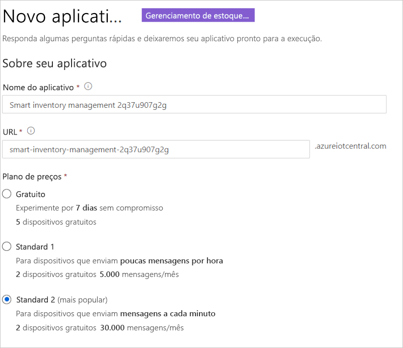
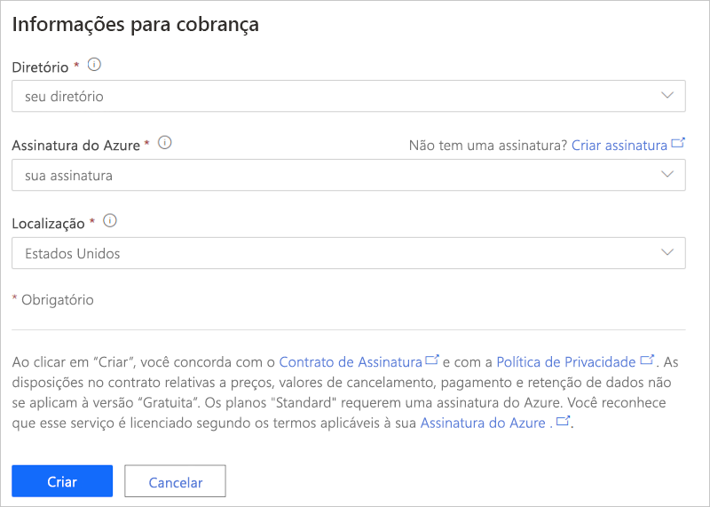

# Tutorial: Implantar e usar um modelo de aplicativo de gerenciamento de estoque inteligente

Este tutorial mostra como iniciar a implantação de um modelo de aplicativo de **gerenciamento de estoque inteligente** do IoT Central. Veja como implantar o modelo, o conteúdo incluído pronto para uso e o que você poderá fazer em seguida.

Neste tutorial, você aprenderá a: 
* Criar um aplicativo de gerenciamento de estoque inteligente 
* Explorar o aplicativo 

## Prerequisites

* Não há pré-requisitos específicos para implantar este aplicativo
* É recomendável ter uma assinatura do Microsoft Azure, mas é possível também experimentá-lo sem ela

## Criar um modelo de aplicativo de gerenciamento de estoque inteligente

Para criar um aplicativo, faça o seguinte:

1. Navegue até o site do Gerenciador de Aplicativos do Azure IoT Central. Selecione o **Build**, na barra de navegação à esquerda, e clique na guia **Varejo**.

    > [!div class="mx-imgBorder"]
    > 

2. Selecione a guia **Varejo** e escolha **Criar aplicativo** sob **Gerenciamento de estoque inteligente**

3. A opção **Criar aplicativo** abrirá o formulário Novo aplicativo e preencherá os detalhes solicitados, conforme mostrado abaixo.
   **Nome do aplicativo**: use o nome sugerido padrão ou crie um nome de aplicativo amigável.
   **URL**: use a URL sugerida padrão ou crie uma URL amigável exclusiva de fácil memorização. Em seguida, recomendamos usar a configuração padrão, caso você já tenha uma assinatura do Azure. Você pode começar com o plano de preço de avaliação gratuita de 7 dias e optar por converter em um plano de preço padrão a qualquer momento antes que a avaliação gratuita expire.
   **Informações de Cobrança**: para provisionar os recursos, é necessário informar os detalhes em Diretório, Assinatura do Azure e Região.
   **Criar**: selecione Criar, no final da página, para implantar o aplicativo.

    > [!div class="mx-imgBorder"]
    > 

    > [!div class="mx-imgBorder"]
    > 

## Explorar o aplicativo 

### Painel 

Depois de implantar com êxito o modelo de aplicativo, o painel padrão será um portal com foco no operador de gerenciamento de estoque inteligente. A Northwind Trader é um provedor de estoque inteligente fictício que gerencia depósitos com BLE (Bluetooth de Baixa Energia) e lojas de varejo com RFID (identificação por radiofrequência). Nesse painel, você verá dois gateways diferentes que fornecem telemetria sobre o estoque, juntamente com as ações, os comandos e os trabalhos associados que você pode realizar. Esse painel é pré-configurado para demonstrar a atividade crítica das operações do dispositivo de gerenciamento de estoque inteligente.
O painel é dividido logicamente entre duas operações diferentes de gerenciamento de dispositivo de gateway: 
   * O depósito é implantado com um gateway fixo e marcas de BLE em paletes para acompanhar e rastrear o estoque em estabelecimentos maiores.
   * A loja de varejo é implantada com um gateway fixo e marcas de RFID em nível de itens individuais para acompanhar e rastrear o estoque em lojas outlet.
   * Exibir a localização, o status e os detalhes relacionados do gateway. 

> [!div class="mx-imgBorder"]
> 

   * Você pode acompanhar facilmente a quantidade de gateways, bem como as marcas ativas ou desconhecidas.
   * Você pode executar operações de gerenciamento de dispositivos, como atualizar firmware, desabilitar e habilitar sensor, atualizar limite de sensor, atualizar intervalos de telemetria e atualizar contratos de serviço de dispositivo.
   * Os dispositivos de gateway podem executar gerenciamento de estoque sob demanda com uma verificação completa ou incremental.

> [!div class="mx-imgBorder"]
> 

## Modelo de dispositivo
Clique na guia Modelos de dispositivo para ver o modelo de funcionalidade do gateway. O modelo de funcionalidade é estruturado em duas interfaces diferentes: **Propriedade e telemetria de gateway** e **Comandos de gateway**.

**Telemetria e propriedade de gateway** – essa interface representa toda a telemetria relacionada a sensores, localização, informações do dispositivo, além da capacidade de propriedade do dispositivo gêmeo, como intervalos de atualização e limites de gateway.

> [!div class="mx-imgBorder"]
> 

**Comandos de gateway** – essa interface organiza todas as funcionalidades de comando do gateway.

> [!div class="mx-imgBorder"]
> 

## Regras
Selecione a guia Regras para ver duas regras diferentes neste modelo de aplicativo. Essas regras são configuradas para enviar notificações por email aos operadores para fins de investigações posteriores.

**Gateway offline**: essa regra será disparada se o gateway não enviar relatórios à nuvem por um período prolongado. O gateway pode ficar sem resposta por causa do modo de bateria fraca, perda de conectividade e integridade do dispositivo.

**Marcas desconhecidas**: é essencial rastrear todas as marcas de BLE e RFID associadas a um ativo. Se o gateway está detectando muitas marcas desconhecidas, é uma indicação de que há problemas de sincronização com os aplicativos que fornecem as marcas.

> [!div class="mx-imgBorder"]
> 

## Trabalhos
Selecione a guia Trabalhos para exibir cinco trabalhos existentes como parte deste modelo de aplicativo: Você pode usar o recurso Trabalhos para executar operações em toda a solução. Nesse caso, os trabalhos de gerenciamento de estoque estão usando a funcionalidade de gêmeos e os comandos do dispositivo para executar tarefas, como:
   * Desabilitar leitores em todo o gateway
   * Modificar o limite intermédio de telemetria 
   * Executar verificações de estoque sob demanda em toda a solução.

> [!div class="mx-imgBorder"]
> 

## Limpar os recursos

Caso não pretenda usar esse aplicativo, acesse **Administração** > **Configurações do Aplicativo** e clique em **Excluir** para excluir o modelo de aplicativo.

> [!div class="mx-imgBorder"]
> 

## Próximas etapas
* Saiba mais sobre o [conceito de gerenciamento de estoque inteligente](./architecture-smart-inventory-management-pnp.md)
* Saiba mais sobre outros [modelos comerciais do IoT Central](./overview-iot-central-retail-pnp.md)
* Para saber mais sobre o IoT Central, confira [Visão geral do IoT Central](../core/overview-iot-central.md)
