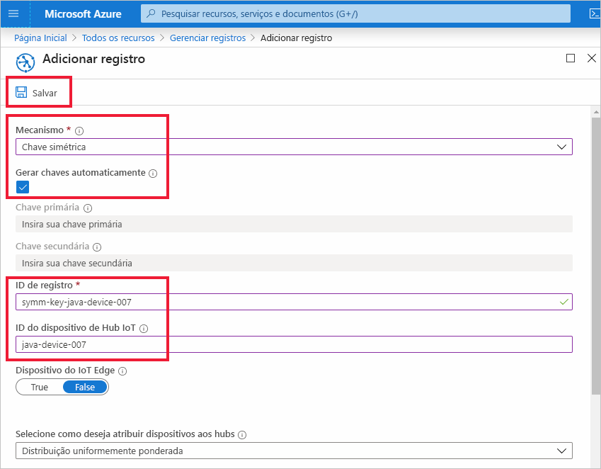
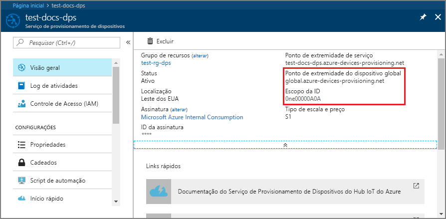

# <a name="quickstart-provision-a-simulated-device-to-iot-hub-with-symmetric-keys"></a>Início Rápido: Provisionar um dispositivo simulado no Hub IoT com chaves simétricas

Neste início rápido, você aprenderá como criar e executar um simulador de dispositivo em um computador de desenvolvimento do Windows. Você configurará esse dispositivo simulado para usar uma chave simétrica para autenticar com uma instância do DPS (Serviço de Provisionamento de Dispositivos) e ser atribuído a um Hub IoT. O código de exemplo do [SDK do IoT do Microsoft Azure para Java](https://github.com/Azure/azure-iot-sdk-java) será usado para simular uma sequência de inicialização para o dispositivo que inicia o provisionamento. O dispositivo será reconhecido com base em um registro individual com uma instância de serviço DPS e atribuído a um Hub IoT.

Embora este artigo demonstre o provisionamento com um registro individual, é possível usar grupos de registros. Há algumas diferenças ao usar grupos de registro. Por exemplo, você precisa usar uma chave de dispositivo derivada com uma ID de registro exclusiva para o dispositivo. Embora os grupos de registros de chave simétrica não sejam limitados apenas a dispositivos herdados, [Como provisionar dispositivos herdados usando atestado de chave simétrica](how-to-legacy-device-symm-key.md) fornece um exemplo de grupo de registros. Para obter mais informações, consulte [Registros de grupo para atestado de chave simétrica](concepts-symmetric-key-attestation.md#group-enrollments).

Se você não estiver familiarizado com o processo de provisionamento automático, analise os [Conceitos de provisionamento automático](concepts-auto-provisioning.md). 

Não se esqueça de concluir as etapas em [Configurar o Serviço de Provisionamento de Dispositivos no Hub IoT com o Portal do Azure](./quick-setup-auto-provision.md) antes de continuar com este início rápido. Este início rápido requer que você já tenha criado a instância de Serviço de Provisionamento de Dispositivos.

Este artigo é orientado para uma estação de trabalho baseada no Windows. No entanto, é possível executar os procedimentos no Linux. Para um exemplo do Linux, confira [Como provisionar para multilocação](how-to-provision-multitenant.md).


[!INCLUDE [quickstarts-free-trial-note](../../includes/quickstarts-free-trial-note.md)]


## <a name="prerequisites"></a>Pré-requisitos

* Tenha o [Java SE Development Kit 8](https://aka.ms/azure-jdks) ou posterior instalado no computador.

* Baixe e instale o [Maven](https://maven.apache.org/install.html).

* Versão mais recente do [Git](https://git-scm.com/download/) instalada.

<a id="setupdevbox"></a>

## <a name="prepare-the-java-sdk-environment"></a>Preparar o ambiente do SDK do Java 

1. Verifique se o Git está instalado em seu computador e se foi adicionado às variáveis de ambiente que podem ser acessadas pela janela de comando. Confira [ferramentas de cliente Git do Software Freedom Conservancy](https://git-scm.com/download/) para obter a versão mais recente das ferramentas `git` a serem instaladas, que inclui o **Git Bash**, o aplicativo de linha de comando que você pode usar para interagir com seu repositório Git local. 

2. Abra um prompt de comando. Clone o repositório do GitHub para obter exemplo de código de simulação do dispositivo:
    
    ```cmd/sh
    git clone https://github.com/Azure/azure-iot-sdk-java.git --recursive
    ```
3. Navegue até o diretório `azure-iot-sdk-java` raiz e crie o projeto para baixar todos os pacotes necessários.
   
   ```cmd/sh
   cd azure-iot-sdk-java
   mvn install -DskipTests=true
   ```

## <a name="create-a-device-enrollment"></a>Criar um registro do dispositivo

1. Entre no [portal do Azure](https://portal.azure.com), selecione o botão **Todos os recursos** no menu esquerdo e abra a instância do DPS (serviço de Provisionamento de Dispositivos).

2. Selecione a guia **Gerenciar registros** e selecione o botão **Adicionar registro individual** na parte superior. 

3. No painel **Adicionar Registro**, insira as informações a seguir e pressione o botão **Salvar**.

   - **Mecanismo**: Selecione **Chave Simétrica** como o *Mecanismo* do atestado de identidade.

   - **Gerar chaves automaticamente**: Marque essa caixa.

   - **ID de registro**: Insira uma ID de registro para identificar o registro. Use apenas caracteres alfanuméricos minúsculos e traço ('-'). Por exemplo, **symm-key-java-device-007**.

   - **ID do Dispositivo de Hub IoT:** Insira um identificador de dispositivo. Por exemplo, **java-device-007**.

     

4. Após salvar o registro, a **Chave Primária** e a **Chave Secundária** serão geradas e adicionadas à entrada de registro. O registro de dispositivo da chave simétrica é exibido como **symm-key-java-device-007** na coluna *ID de Registro* na guia *Registros Individuais*. 

    Abra o registro e copie o valor da **Chave Primária** gerada. Você usará esse valor de chave e a **ID de Registro** posteriormente quando atualizar o código Java do dispositivo.


<a id="firstbootsequence"></a>

## <a name="simulate-device-boot-sequence"></a>Simular sequência de inicialização do dispositivo

Nesta seção, você atualizará o código de exemplo do dispositivo para enviar a sequência de inicialização do dispositivo à sua instância do DPS. Essa sequência de inicialização fará o dispositivo ser reconhecido, autenticado e atribuído a um hub IoT vinculado à instância do DPS.

1. No menu do Serviço de Provisionamento de Dispositivos, selecione **Visão geral** e anote o _Escopo da ID_ e o _Ponto de Extremidade Global do Serviço de Provisionamento_.

    

2. Abra o código de exemplo do dispositivo Java para edição. O caminho completo para o código de exemplo do dispositivo é:

    `azure-iot-sdk-java/provisioning/provisioning-samples/provisioning-symmetrickey-sample/src/main/java/samples/com/microsoft/azure/sdk/iot/ProvisioningSymmetricKeySampleSample.java`

   - Adicione o _Escopo da ID_ e o _Ponto de Extremidade Global do Serviço de Provisionamento_ de sua instância do DPS. Inclua também a chave simétrica primária e a ID de registro escolhida para o registro individual. Salve suas alterações. 

      ```java
        private static final String SCOPE_ID = "[Your scope ID here]";
        private static final String GLOBAL_ENDPOINT = "[Your Provisioning Service Global Endpoint here]";
        private static final String SYMMETRIC_KEY = "[Enter your Symmetric Key here]";
        private static final String REGISTRATION_ID = "[Enter your Registration ID here]";
      ```

3. Abra um prompt de comando para criação. Navegue até o exemplo de pasta de projeto de provisionamento do repositório do SDK do Java.

    ```cmd/sh
    cd azure-iot-sdk-java/provisioning/provisioning-samples/provisioning-symmetrickey-sample
    ```

4. Crie o exemplo e navegue até a pasta `target` para executar o arquivo .jar criado.

    ```cmd/sh
    mvn clean install
    cd target
    java -jar ./provisioning-symmetrickey-sample-{version}-with-deps.jar
    ```

5. A saída esperada deve ser semelhante ao seguinte:

    ```cmd/sh
      Starting...
      Beginning setup.
      Waiting for Provisioning Service to register
      IotHUb Uri : <Your DPS Service Name>.azure-devices.net
      Device ID : java-device-007
      Sending message from device to IoT Hub...
      Press any key to exit...
      Message received! Response status: OK_EMPTY
    ```

6. No Portal do Azure, navegue até o hub IoT vinculado ao seu serviço de provisionamento e abra a folha **Device Explorer**. Após o provisionamento bem-sucedido do dispositivo de chave simétrica simulado para o hub, a ID de dispositivo dele será exibida na folha **Gerenciador de Dispositivos** com o *STATUS* **habilitado**.  Talvez seja necessário pressionar o botão **Atualizar**, na parte superior, se você já tiver aberto a folha antes de executar o aplicativo do dispositivo de exemplo. 

     

> [!NOTE]
> Se você tiver alterado o *estado de dispositivo gêmeo inicial* do valor padrão na entrada de registro para o seu dispositivo, pode receber o estado desejado duas do hub e agir de acordo. Para saber mais, veja [Noções básicas e uso de dispositivos gêmeos no Hub IoT](../iot-hub/iot-hub-devguide-device-twins.md).
>


## <a name="clean-up-resources"></a>Limpar os recursos

Se planejar continuar a trabalhar e explorar o dispositivo cliente de exemplo, não limpe os recursos criados neste início rápido. Caso contrário, use as seguintes etapas para excluir todos os recursos criados por este início rápido.

1. Feche a janela de saída de exemplo de dispositivo cliente em seu computador.
1. No menu à esquerda no portal do Azure, selecione **Todos os recursos** e selecione o serviço de Provisionamento de Dispositivos. Abra **Gerenciar Registros** de seu serviço e selecione a guia **Registros Individuais**. Marque a caixa de seleção ao lado da *ID DE REGISTRO* do dispositivo registrado neste início rápido e pressione o botão **Excluir**, na parte superior do painel. 
1. No menu à esquerda no portal do Azure, selecione **Todos os recursos** e seu Hub IoT. Abra **Dispositivos IoT** do hub, marque a caixa de seleção ao lado da *ID DO DISPOSITIVO* registrado neste início rápido e pressione o botão **Excluir** na parte superior do painel.

## <a name="next-steps"></a>Próximas etapas

Neste início rápido, você criou um dispositivo simulado no computador Windows e o provisionou para o Hub IoT usando a chave Simétrica com o Serviço de Provisionamento de Dispositivos no Hub IoT do Azure no portal. Para saber como registrar o dispositivo programaticamente, continue no início rápido para registro programático de dispositivos X.509. 

> [!div class="nextstepaction"]
> [Início rápido do Azure – Registrar dispositivos X.509 no Serviço de Provisionamento de Dispositivos no Hub IoT do Azure](quick-enroll-device-x509-java.md)
