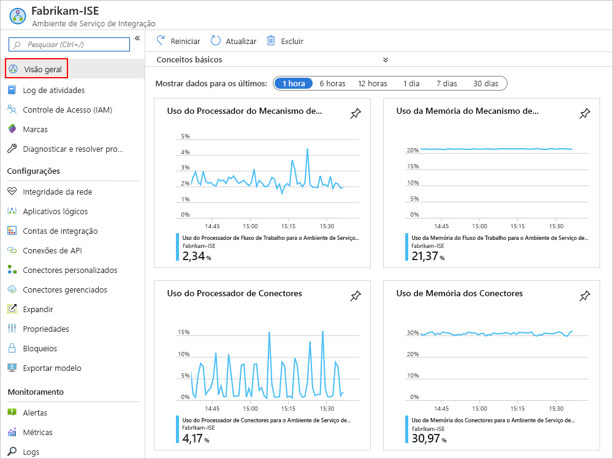
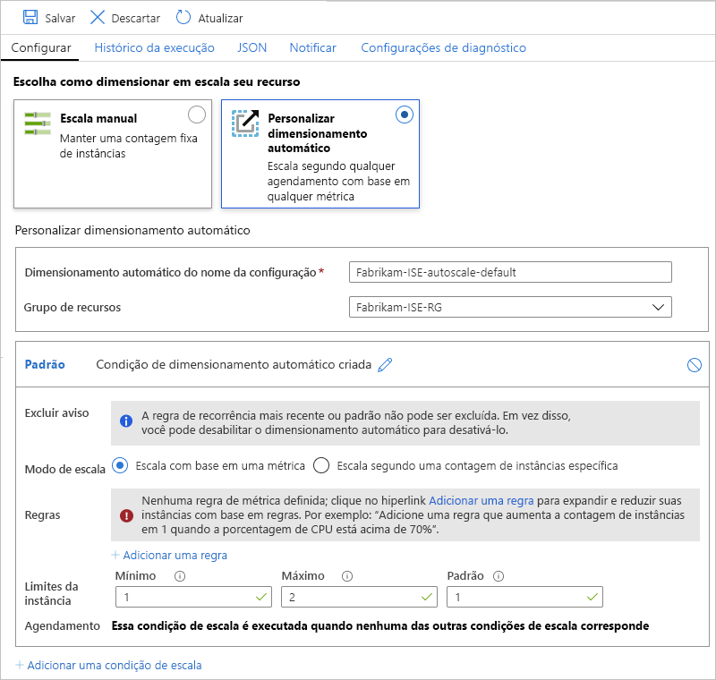

# Gerencie seu ambiente de serviço de integração (ISE) em aplicativos azure logic

Este artigo mostra como executar tarefas de gerenciamento para o seu [ambiente de serviço de integração (ISE),](../logic-apps/connect-virtual-network-vnet-isolated-environment-overview.md)por exemplo:

* Gerencie os recursos como aplicativos lógicos, conexões, contas de integração e conectores em seu ISE.
* Verifique a saúde da rede do seu ISE.
* Adicione capacidade, reinicie seu ISE ou exclua seu ISE, siga as etapas neste tópico. Para adicionar esses artefatos ao seu ISE, consulte [Adicionar artefatos ao seu ambiente de serviço de integração](../logic-apps/add-artifacts-integration-service-environment-ise.md).

## Veja seu ISE

1. Faça login no [portal Azure](https://portal.azure.com).

1. Na caixa de pesquisa do portal, digite "ambientes de serviço de integração" e selecione **Ambientes de Serviço de Integração**.

   

1. Na lista de resultados, selecione seu ambiente de serviço de integração.

   

1. Continue para as próximas seções para encontrar aplicativos lógicos, conexões, conectores ou contas de integração em seu ISE.

## Verifique a saúde da rede

No menu ISE, em **Configurações,** selecione **Saúde da rede**. Este painel mostra o estado de saúde de suas sub-redes e dependências de saída em outros serviços.

## Gerencie seus aplicativos lógicos

Você pode visualizar e gerenciar os aplicativos lógicos que estão em seu ISE.

1. No menu ISE, em **Configurações,** selecione **aplicativos Logic**.

   

1. Para remover aplicativos lógicos que você não precisa mais em seu ISE, selecione esses aplicativos lógicos e selecione **Excluir**. Para confirmar se deseja excluir, selecione **Sim**.

## Gerenciar conexões de API

Você pode visualizar e gerenciar as conexões criadas pelos aplicativos lógicos em execução em seu ISE.

1. No menu ISE, em **Configurações,** selecione **conexões de API**.

   

1. Para remover conexões que você não precisa mais no ise, selecione essas conexões e selecione **Excluir**. Para confirmar se deseja excluir, selecione **Sim**.

## Gerenciar conectores ISE

Você pode visualizar e gerenciar os conectores de API que são implantados no seu ISE.

1. No menu ISE, em **Configurações,** **selecione Conectores gerenciados**.

   

1. Para remover conectores que você não deseja disponíveis em seu ISE, selecione esses conectores e selecione **Excluir**. Para confirmar se deseja excluir, selecione **Sim**.

## Gerenciar conectores personalizados

Você pode visualizar e gerenciar os conectores personalizados que você implantou no seu ISE.

1. No menu ISE, em **Configurações,** **selecione Conectores personalizados**.

   

1. Para remover conectores personalizados que você não precisa mais em seu ISE, selecione esses conectores e, em seguida, **selecione Excluir**. Para confirmar se deseja excluir, selecione **Sim**.

## Gerenciar contas de integração

1. No menu ISE, em **Configurações,** selecione **'Integração' contas**.

   

1. Para remover contas de integração do SEU ISE quando não for mais necessário, selecione essas contas de integração e **selecione Excluir**.

## Adicionar capacidade de ISE

A unidade base PREMIUM ISE tem capacidade fixa, portanto, se você precisar de mais throughput, você pode adicionar mais unidades de escala, durante a criação ou depois. O SKU do desenvolvedor não inclui a capacidade de adicionar unidades de escala.

1. No [portal Azure,](https://portal.azure.com)vá para o seu ISE.

1. Para revisar as métricas de uso e desempenho do seu ISE, no menu ISE, selecione **Visão geral**.

   

1. Em **Configurações,** selecione **Escala .** No **painel Configurar,** selecione entre estas opções:

   * [**Escala manual**](#manual-scale): Dimensione com base no número de unidades de processamento que deseja usar.
   * [**Autoescala personalizada**](#custom-autoscale): Dimensione com base em métricas de desempenho selecionando a partir de vários critérios e especificando as condições de limite para atender a esses critérios.

   

### Dimensionamento manual

1. Depois de selecionar **Escala manual,** para **capacidade adicional,** selecione o número de unidades de dimensionamento que deseja usar.

   

1. Quando terminar, selecione **Salvar**.

### Escala automática personalizada

1. Depois de selecionar **'Escala automática personalizada'** para **nome de configuração em escala automática,** forneça um nome para sua configuração e, opcionalmente, selecione o grupo de recursos Do Zure onde a configuração pertence.

   

1. Para a condição **Padrão,** selecione **Escala com base em uma métrica** ou Escala para uma **contagem de instâncias específicas**.

   * Se você escolher baseado em instância, digite o número das unidades de processamento, que é um valor de 0 a 10.

   * Se você escolher baseado em métricas, siga estas etapas:

     1. Na seção **Regras,** **selecione Adicionar uma regra**.

     1. No painel **de regras Escala,** configure seus critérios e ações a serem tomadas quando a regra for acionada.

     1. Para **os limites de instância,** especifique esses valores:

        * **Mínimo**: O número mínimo de unidades de processamento para usar
        * **Máximo**: O número máximo de unidades de processamento para usar
        * **Padrão**: Se algum problema acontecer durante a leitura das métricas de recursos e a capacidade atual estiver abaixo da capacidade padrão, o dimensionamento automático será dimensionado para o número padrão de unidades de processamento. No entanto, se a capacidade atual exceder a capacidade padrão, o autoscaling não será dimensionado.

1. Para adicionar outra condição, selecione **Adicionar condição de escala**.

1. Quando terminar com as configurações de escala automática, salve suas alterações.

## Reiniciar ise

Se você alterar as configurações do servidor DNS ou DNS, você terá que reiniciar seu ISE para que o ISE possa pegar essas alterações. A reinicialização de um ISE Premium SKU não resulta em tempo de inatividade devido à redundância e componentes que reiniciam um de cada vez durante a reciclagem. No entanto, um desenvolvedor SKU ISE experimenta o tempo de inatividade porque não existe redundância. Para obter mais informações, consulte [ISE SKUs](../logic-apps/connect-virtual-network-vnet-isolated-environment-overview.md#ise-level).

1. No [portal Azure,](https://portal.azure.com)vá para o seu ISE.

1. No menu ISE, selecione **Visão geral**. Na barra de ferramentas Visão geral, **Reinicie**.

   

## Excluir o ISE

Antes de excluir um ISE que você não precisa mais ou um grupo de recursos do Azure que contenha um ISE, verifique se você não tem políticas ou bloqueios no grupo de recursos do Azure que contém esses recursos ou na rede virtual do Azure porque esses itens podem bloquear a exclusão.

Depois de excluir seu ISE, você pode ter que esperar até 9 horas antes de tentar excluir sua rede virtual ou sub-redes do Azure.

## Próximas etapas

* [Adicionar recursos aos ambientes de serviços de integração](../logic-apps/add-artifacts-integration-service-environment-ise.md)