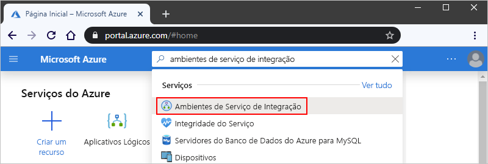
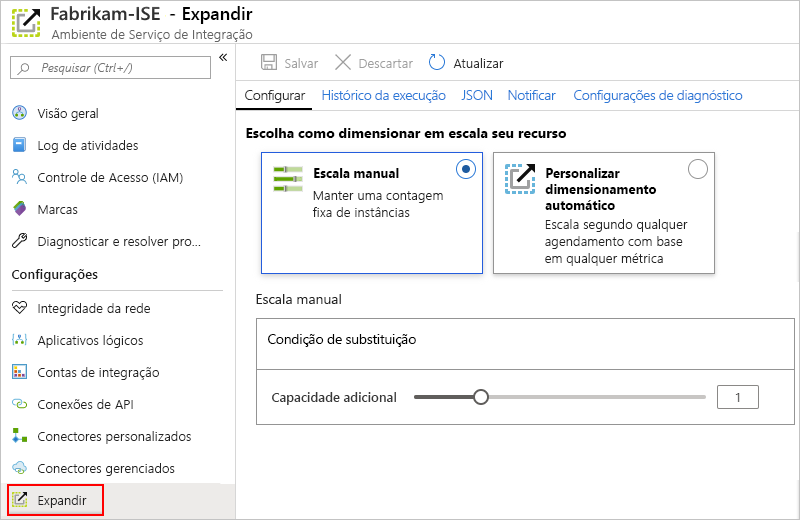
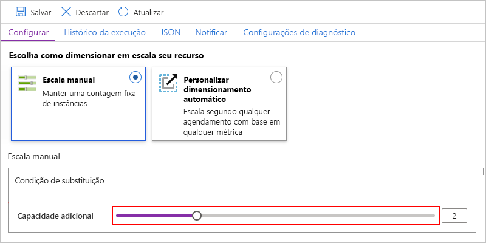

# Gerenciar seu ISE (ambiente do serviço de integração) nos aplicativos lógicos do Azure

Este artigo mostra como executar tarefas de gerenciamento para o [ambiente do serviço de integração (ISE)](../logic-apps/connect-virtual-network-vnet-isolated-environment-overview.md), por exemplo:

* Gerencie os recursos, como aplicativos lógicos, conexões, contas de integração e conectores no ISE.
* Verifique a integridade da rede do ISE.
* Adicione capacidade, reinicie o ISE ou exclua o ISE, siga as etapas neste tópico. Para adicionar esses artefatos ao ISE, consulte [Adicionar artefatos ao seu ambiente do serviço de integração](../logic-apps/add-artifacts-integration-service-environment-ise.md).

## Exibir seu ISE

1. Entre no [portal do Azure](https://portal.azure.com).

1. Na caixa de pesquisa do portal, insira "ambientes do serviço de integração" e, em seguida, selecione **ambientes do serviço de integração**.

   

1. Na lista de resultados, selecione o ambiente do serviço de integração.

   

1. Continue nas próximas seções para localizar aplicativos lógicos, conexões, conectores ou contas de integração no ISE.

## Verificar a integridade da rede

No menu do ISE, em **configurações**, selecione **integridade da rede**. Esse painel mostra o status de integridade para suas sub-redes e dependências de saída em outros serviços.

## Gerenciar seus aplicativos lógicos

Você pode exibir e gerenciar os aplicativos lógicos que estão no ISE.

1. No menu do ISE, em **configurações**, selecione **aplicativos lógicos**.

   

1. Para remover os aplicativos lógicos que você não precisa mais no ISE, selecione esses aplicativos lógicos e, em seguida, selecione **excluir**. Para confirmar que deseja excluir, selecione **Sim**.

## Gerenciar conexões de API

Você pode exibir e gerenciar as conexões que foram criadas pelos aplicativos lógicos em execução no ISE.

1. No menu do ISE, em **configurações**, selecione **conexões de API**.

   

1. Para remover as conexões que você não precisa mais no ISE, selecione essas conexões e, em seguida, selecione **excluir**. Para confirmar que deseja excluir, selecione **Sim**.

## Gerenciar conectores do ISE

Você pode exibir e gerenciar os conectores de API que são implantados no ISE.

1. No menu do ISE, em **configurações**, selecione **conectores gerenciados**.

   

1. Para remover os conectores que você não deseja disponibilizar no ISE, selecione esses conectores e, em seguida, selecione **excluir**. Para confirmar que deseja excluir, selecione **Sim**.

## Gerenciar conectores personalizados

Você pode exibir e gerenciar os conectores personalizados que você implantou no ISE.

1. No menu do ISE, em **configurações**, selecione **conectores personalizados**.

   

1. Para remover conectores personalizados que não são mais necessários no ISE, selecione esses conectores e, em seguida, selecione **excluir**. Para confirmar que deseja excluir, selecione **Sim**.

## Gerenciar contas de integração

1. No menu do ISE, em **configurações**, selecione **contas de integração**.

   

1. Para remover contas de integração do ISE quando não forem mais necessárias, selecione as contas de integração e, em seguida, selecione **excluir**.

## Adicionar capacidade do ISE

A unidade base do ISE Premium tem capacidade fixa, portanto, se você precisar de mais taxa de transferência, poderá adicionar mais unidades de escala, seja durante a criação ou depois. A SKU do desenvolvedor não inclui a capacidade de adicionar unidades de escala.

1. No [portal do Azure](https://portal.azure.com), vá para o ISE.

1. Para examinar o uso e as métricas de desempenho do ISE, no menu do ISE, selecione **visão geral**.

   

1. Em **configurações**, selecione **escalar horizontalmente**. No painel **Configurar** , selecione uma destas opções:

   * [**Escala manual**](#manual-scale): escala com base no número de unidades de processamento que você deseja usar.
   * [**Dimensionamento automático personalizado**](#custom-autoscale): dimensione com base nas métricas de desempenho selecionando vários critérios e especificando as condições de limite para atender aos critérios.

   

### Dimensionamento manual

1. Depois de selecionar a **escala manual**, para **capacidade adicional**, selecione o número de unidades de dimensionamento que você deseja usar.

   

1. Quando terminar, selecione **Salvar**.

### Dimensionamento automático personalizado

1. Depois de selecionar o **dimensionamento automático personalizado**, para o **nome da configuração de dimensionamento automático**, forneça um nome para sua configuração e, opcionalmente, selecione o grupo de recursos do Azure ao qual a configuração pertence.

   

1. Para a condição **padrão** , selecione **escala com base em uma métrica** ou **escala para uma contagem de instâncias específica**.

   * Se você escolher baseado em instância, insira o número para as unidades de processamento, que é um valor de 0 a 10.

   * Se você escolher baseado em métrica, siga estas etapas:

     1. Na seção **regras** , selecione **Adicionar uma regra**.

     1. No painel **regra de dimensionamento** , configure os critérios e a ação a serem tomadas quando a regra for disparada.

     1. Para **limites de instância**, especifique estes valores:

        * **Mínimo**: o número mínimo de unidades de processamento a serem usadas
        * **Máximo**: o número máximo de unidades de processamento a ser usado
        * **Padrão**: se algum problema ocorrer durante a leitura das métricas de recurso e a capacidade atual estiver abaixo da capacidade padrão, o dimensionamento automático escalará para o número padrão de unidades de processamento. No entanto, se a capacidade atual exceder a capacidade padrão, o dimensionamento automático não será dimensionado horizontalmente.

1. Para adicionar outra condição, selecione **Adicionar condição de escala**.

1. Quando tiver concluído as configurações de dimensionamento automático, salve as alterações.

## Reiniciar o ISE

Se você alterar as configurações do servidor DNS ou do servidor DNS, será necessário reiniciar o ISE para que o ISE possa pegar essas alterações. Reiniciar um ISE do SKU Premium não resulta em tempo de inatividade devido à redundância e aos componentes que reiniciam um de cada vez durante a reciclagem. No entanto, um ISE de SKU de desenvolvedor experimenta tempo de inatividade porque não existe nenhuma redundância. Para obter mais informações, consulte [SKUs do ISE](../logic-apps/connect-virtual-network-vnet-isolated-environment-overview.md#ise-level).

1. No [portal do Azure](https://portal.azure.com), vá para o ISE.

1. No menu ISE, selecione **visão geral**. Na barra de ferramentas visão geral, **reinicie**o.

   

## Excluir ISE

Antes de excluir um ISE que não é mais necessário ou um grupo de recursos do Azure que contém um ISE, verifique se você não tem políticas ou bloqueios no grupo de recursos do Azure que contém esses recursos ou em sua rede virtual do Azure porque esses itens podem bloquear a exclusão.

Depois de excluir o ISE, talvez seja necessário aguardar até 9 horas antes de tentar excluir sua rede virtual ou sub-redes do Azure.

## Próximas etapas

* [Adicionar recursos a ambientes de serviço de integração](../logic-apps/add-artifacts-integration-service-environment-ise.md)