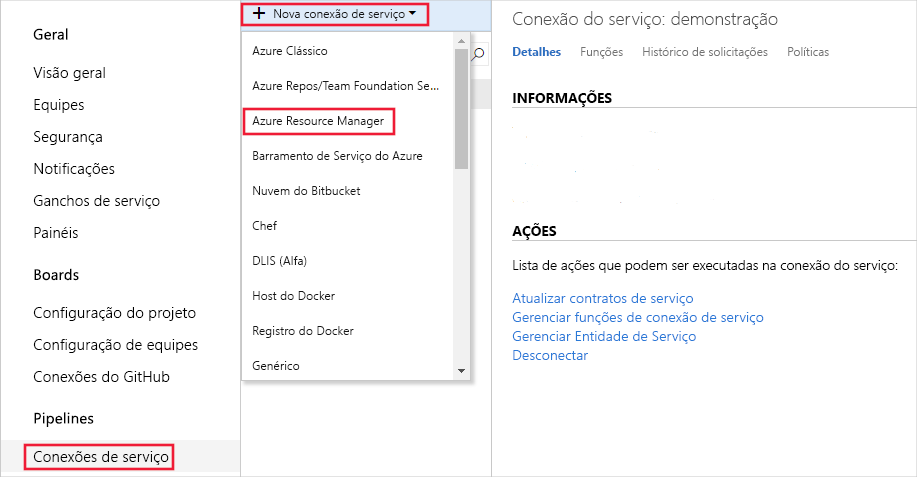
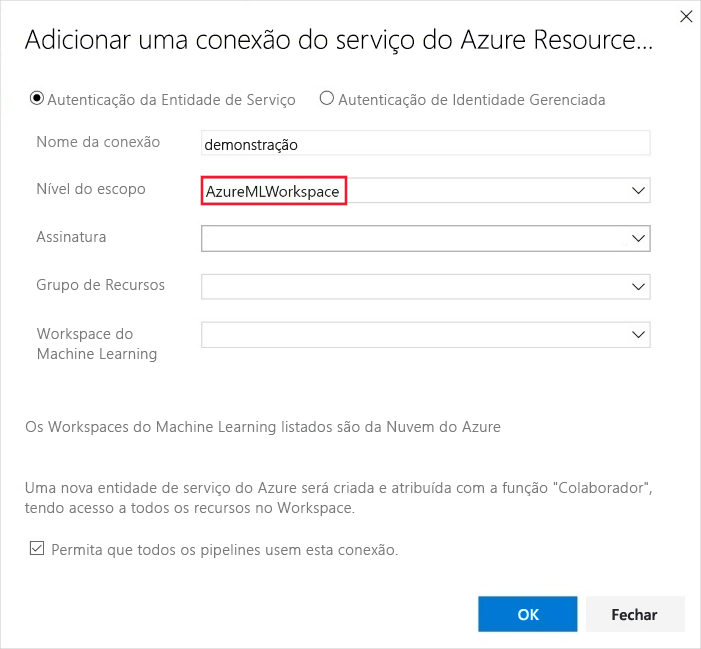
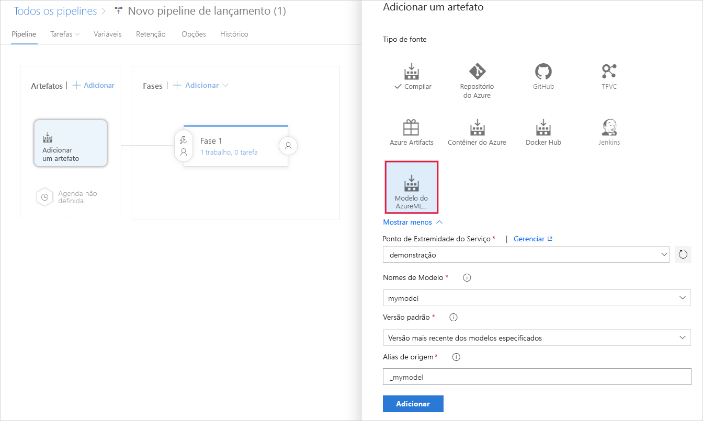

# Implantar modelos continuamente

Este artigo mostra como usar a implantação contínua no Azure DevOps para verificar automaticamente se há novas versões de modelos registrados e enviar por push esses novos modelos para produção.

## Pré-requisitos

Este artigo pressupõe que você já tenha registrado um modelo em seu espaço de trabalho Azure Machine Learning. Consulte [este tutorial](how-to-train-scikit-learn.md) para obter um exemplo de treinamento e registro de um modelo scikit-learn.

## Implantar modelos continuamente

Você pode implantar modelos continuamente usando a extensão Machine Learning para o [Azure DevOps](https://azure.microsoft.com/services/devops/). Você pode usar a extensão Machine Learning do Azure DevOps para disparar um pipeline de implantação quando um novo modelo de aprendizado de máquina for registrado em um espaço de trabalho do Azure Machine Learning.

1. Inscreva-se para [Azure pipelines](https://docs.microsoft.com/azure/devops/pipelines/get-started/pipelines-sign-up?view=azure-devops), que torna a integração contínua e a entrega de seu aplicativo a qualquer plataforma ou nuvem possível. (Observe que Azure Pipelines não é o mesmo que [Machine Learning pipelines](concept-ml-pipelines.md#compare).)

1. [Crie um projeto DevOps do Azure.](https://docs.microsoft.com/azure/devops/organizations/projects/create-project?view=azure-devops)

1. Instale a [extensão de Machine Learning para Azure pipelines](https://marketplace.visualstudio.com/items?itemName=ms-air-aiagility.vss-services-azureml&targetId=6756afbe-7032-4a36-9cb6-2771710cadc2&utm_source=vstsproduct&utm_medium=ExtHubManageList).

1. Use conexões de serviço para configurar uma conexão de entidade de serviço com seu espaço de trabalho Azure Machine Learning para que você possa acessar seus artefatos. Vá para configurações do projeto, selecione **conexões de serviço**e, em seguida, selecione **Azure Resource Manager**:

    

1. Na lista **nível de escopo** , selecione **AzureMLWorkspace**e, em seguida, insira o restante dos valores:

    

1. Para implantar continuamente o modelo de aprendizado de máquina usando Azure Pipelines, em pipelines, selecione **liberar**. Adicione um novo artefato e, em seguida, selecione o artefato do **modelo do AzureML** e a conexão de serviço que você criou anteriormente. Selecione o modelo e a versão para disparar uma implantação:

    

1. Habilite o gatilho de modelo em seu artefato de modelo. Quando você ativa o gatilho, toda vez que a versão especificada (ou seja, a versão mais recente) desse modelo é registrada em seu espaço de trabalho, um pipeline de versão do Azure DevOps é disparado.

    

## Próximas etapas

Confira os projetos abaixo no GitHub para obter mais exemplos de implantação contínua para modelos de ML.

* [Microsoft/MLOps](https://github.com/Microsoft/MLOps)
* [Microsoft/MLOpsPython](https://github.com/microsoft/MLOpsPython)