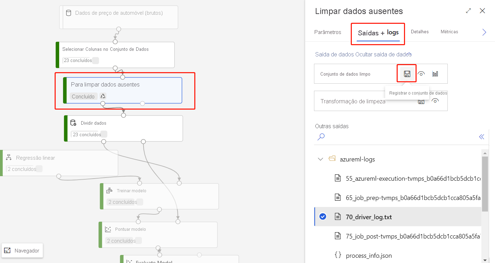

# Importar seus dados para o designer de Azure Machine Learning (versão prévia)

Neste artigo, você aprenderá a importar seus próprios dados no designer para criar soluções personalizadas. Há duas maneiras de importar dados para o designer: 

* **Azure Machine Learning conjuntos** de dados-registrar [conjuntos](concept-data.md#datasets) de dados no Azure Machine Learning para habilitar recursos avançados que o ajudarão a gerenciá-los.
* **Importar módulo de dados** – use o módulo [importar dados](algorithm-module-reference/import-data.md) para acessar diretamente os dados de fontes de dados online.

## Usar conjuntos de Azure Machine Learning

É recomendável que você use [conjuntos](concept-data.md#datasets) de dados para importar o designer. Quando você registra um conjunto de dados, você pode aproveitar ao máximo os recursos de recurso avançados, como [controle de versão e](how-to-version-track-datasets.md) [monitoramento de dados](how-to-monitor-datasets.md).

### Registrar um conjunto de uma

Você pode registrar conjuntos de registros existentes [programaticamente com o SDK](how-to-create-register-datasets.md#use-the-sdk) ou [visualmente no Azure Machine Learning Studio](how-to-create-register-datasets.md#use-the-ui).

Você também pode registrar a saída para qualquer módulo do designer como um conjunto de um.

1. Selecione o módulo que gera os dados que você deseja registrar.

1. No painel Propriedades, selecione **saídas** > **conjunto de registros**.

    

### Usar um conjunto de uma

Seus conjuntos de valores registrados podem ser encontrados na paleta de módulos, em **conjuntos** de > **meus conjuntos de valores**. Para usar um conjunto de um, arraste-o e solte-o na tela do pipeline. Em seguida, conecte a porta de saída do conjunto de resultados a outros módulos na paleta.

> [!NOTE]
> Atualmente, o designer dá suporte apenas ao processamento de [conjuntos de tabelas de tabela](how-to-create-register-datasets.md#dataset-types). Se você quiser usar [conjuntos de arquivos de arquivo](how-to-create-register-datasets.md#dataset-types), use o SDK do Azure Machine Learning disponível para Python e R.

## Importar dados usando o módulo importar dados

Embora seja recomendável usar os conjuntos de dados para importar, você também pode usar o módulo [importar dados](algorithm-module-reference/import-data.md) . O módulo importar dados ignora o registro de seu conjunto em Azure Machine Learning e importa os dados diretamente de um [repositório de armazenamento](concept-data.md#datastores) ou URL http.

Para obter informações detalhadas sobre como usar o módulo importar dados, consulte a [página Importar dados referência](algorithm-module-reference/import-data.md).

[!NOTE]
> Se os dados tiverem muitas colunas, você poderá encontrar "falha na validação devido à limitação de tamanho" no módulo importar dados. Isso ocorre porque as colunas excluem o comprimento do parâmetro do módulo máximo após a codificação. Nesse caso, é recomendável [registrar o conjunto de registros na interface do usuário dos conjuntos de valores](how-to-create-register-datasets.md#use-the-ui), o que pode evitar o erro.  

## Fontes com suporte

Esta seção lista as fontes de dados com suporte pelo designer. Os dados entram no designer de um datastore ou de um [DataSet tabular](how-to-create-register-datasets.md#dataset-types).

### Fontes de repositório de armazenamento
Para obter uma lista de fontes de armazenamento de dados com suporte, confira [acessar os recursos nos serviços de armazenamento do Azure](how-to-access-data.md#supported-data-storage-service-types).

### Fontes de conjunto de tabelas de tabela

O designer dá suporte a conjuntos de tabelas de tabela criados a partir das seguintes fontes:
 * Arquivos delimitados
 * Arquivos JSON
 * Arquivos Parquet
 * Consultas SQL

## Tipos de dados

O designer reconhece internamente os seguintes tipos de dados:

* String
* Integer
* Decimal
* Boolean
* Data

O designer usa um tipo de dados interno para passar dados entre módulos. Você pode converter explicitamente seus dados em formato de tabela de dados usando o módulo [converter para conjunto de](algorithm-module-reference/convert-to-dataset.md) dados. Qualquer módulo que aceite formatos diferentes do formato interno converterá os dados silenciosamente antes de passá-los para o próximo módulo.

## Restrições de dados

Os módulos no designer são limitados pelo tamanho do destino de computação. Para conjuntos de grandes maiores, você deve usar um recurso de computação Azure Machine Learning maior. Para obter mais informações sobre Azure Machine Learning computação, consulte [o que são destinos de computação no Azure Machine Learning?](concept-compute-target.md#azure-machine-learning-compute-managed)

## Próximas etapas

Aprenda as noções básicas do designer com [o tutorial: prever o preço do automóvel com o designer](tutorial-designer-automobile-price-train-score.md).
