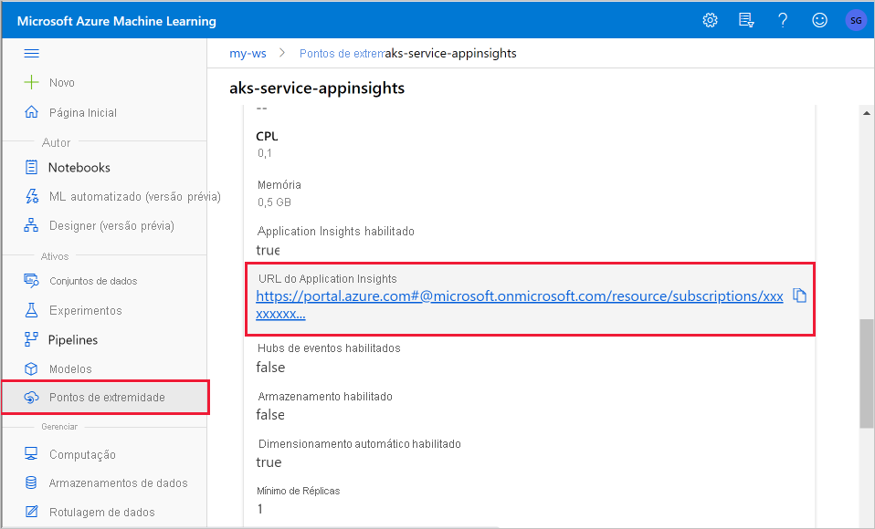
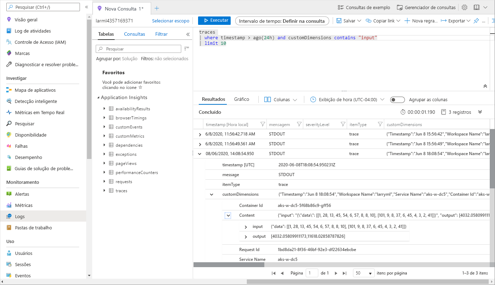

# <a name="monitor-and-collect-data-from-ml-web-service-endpoints"></a>Monitorar e coletar dados de pontos de extremidade de serviço Web do ML
[!INCLUDE [applies-to-skus](../../includes/aml-applies-to-basic-enterprise-sku.md)]

Neste artigo, você aprende a coletar dados e a monitorar modelos implantados em pontos de extremidade de serviço Web no AKS (serviço de kubernetes do Azure) ou ACI (instâncias de contêiner do Azure) consultando logs e habilitando informações de Aplicativo Azure por meio de 
* [SDK do Python do Azure Machine Learning](#python)
* [Azure Machine Learning Studio](#studio) emhttps://ml.azure.com

Além de coletar dados de saída e resposta de um ponto de extremidade, você pode monitorar:

* As taxas, tempos de resposta e taxas de falha de solicitação
* Taxas de dependência, tempos de resposta e taxas de falha
* Exceções

[Saiba mais sobre o aplicativo Azure insights](../azure-monitor/app/app-insights-overview.md). 


## <a name="prerequisites"></a>Pré-requisitos

* Caso não tenha uma assinatura do Azure, crie uma conta gratuita antes de começar. Experimente a [versão gratuita ou paga do Azure Machine Learning](https://aka.ms/AMLFree) hoje

* Um workspace do Azure Machine Learning, um diretório local que contém seus scripts e o SDK de Aprendizado de Máquina do Azure para Python instalado. Para saber como obter esses pré-requisitos, consulte [como configurar um ambiente de desenvolvimento](how-to-configure-environment.md)

* Um modelo de aprendizado de máquina treinado para ser implantado para o serviço de Kubernetes do Azure (AKS) ou Instância de Contêiner do Azure (ACI). Se você não tiver um, consulte o tutorial [treinar modelo de classificação de imagem](tutorial-train-models-with-aml.md)

## <a name="query-logs-for-deployed-models"></a>Logs de consulta para modelos implantados

Para recuperar logs de um serviço Web implantado anteriormente, carregue o serviço e use a função `get_logs()`. Os logs podem conter informações detalhadas sobre quaisquer erros ocorridos durante a implantação.

```python
from azureml.core.webservice import Webservice

# load existing web service
service = Webservice(name="service-name", workspace=ws)
logs = service.get_logs()
```

## <a name="web-service-metadata-and-response-data"></a>Metadados do serviço Web e dados de resposta

> [!IMPORTANT]
> Aplicativo Azure insights registra apenas as cargas de até 64 KB. Se esse limite for atingido, você poderá ver erros como memória insuficiente ou nenhuma informação pode ser registrada.

Para registrar informações de uma solicitação ao serviço Web, adicione `print` instruções ao arquivo score.py. Cada `print` instrução resulta em uma entrada na tabela de rastreamento em Application insights, sob a mensagem `STDOUT` . O conteúdo da `print` instrução estará contido em `customDimensions` e, em seguida, `Contents` na tabela de rastreamento. Se você imprimir uma cadeia de caracteres JSON, ela produzirá uma estrutura de dados hierárquica na saída de rastreamento em `Contents` .

Você pode consultar Aplicativo Azure informações diretamente para acessar esses dados ou configurar uma [exportação contínua](https://docs.microsoft.com/azure/azure-monitor/app/export-telemetry) para uma conta de armazenamento para maior retenção ou processamento adicional. Os dados de modelo podem ser usados no Azure Machine Learning para configurar o rotulamento, o novo treinamento, a explicação, a análise de dados ou outro uso. 


<a name="python"></a>

## <a name="use-python-sdk-to-configure"></a>Usar o SDK do Python para configurar 

### <a name="update-a-deployed-service"></a>Atualizar um serviço implantado

1. Identificar o serviço no seu workspace. O valor de `ws` é o nome do seu espaço de trabalho

    ```python
    from azureml.core.webservice import Webservice
    aks_service= Webservice(ws, "my-service-name")
    ```
2. Atualize seu serviço e habilite insights Aplicativo Azure

    ```python
    aks_service.update(enable_app_insights=True)
    ```

### <a name="log-custom-traces-in-your-service"></a>Rastreamentos de log personalizados em seu serviço

Se você deseja registrar rastreamentos personalizados, siga o processo de implantação padrão para o AKS ou ACI no documento [Como e onde implantar](how-to-deploy-and-where.md). Em seguida, execute as seguintes etapas:

1. Para enviar dados para Application Insights durante a inferência, atualize o arquivo de Pontuação adicionando instruções PRINT. Para registrar informações mais complexas, como os dados de solicitação e a resposta, nós temos uma estrutura JSON. O arquivo score.py de exemplo a seguir registra a hora em que o modelo é inicializado, a entrada e a saída durante a inferência e a hora em que ocorrerem erros:

    > [!IMPORTANT]
    > Aplicativo Azure insights registra apenas as cargas de até 64 KB. Se esse limite for atingido, você poderá ver erros como memória insuficiente ou nenhuma informação pode ser registrada. Se os dados que você deseja registrar em log forem maiores 64 KB, você deverá armazená-los no armazenamento de BLOBs usando as informações em [coletar dados para modelos em produção](how-to-enable-data-collection.md).
    
    ```python
    import pickle
    import json
    import numpy 
    from sklearn.externals import joblib
    from sklearn.linear_model import Ridge
    from azureml.core.model import Model
    import time

    def init():
        global model
        #Print statement for appinsights custom traces:
        print ("model initialized" + time.strftime("%H:%M:%S"))
        
        # note here "sklearn_regression_model.pkl" is the name of the model registered under the workspace
        # this call should return the path to the model.pkl file on the local disk.
        model_path = Model.get_model_path(model_name = 'sklearn_regression_model.pkl')
        
        # deserialize the model file back into a sklearn model
        model = joblib.load(model_path)
    

    # note you can pass in multiple rows for scoring
    def run(raw_data):
        try:
            data = json.loads(raw_data)['data']
            data = numpy.array(data)
            result = model.predict(data)
            # Log the input and output data to appinsights:
            info = {
                "input": raw_data,
                "output": result.tolist()
                }
            print(json.dumps(info))
            # you can return any datatype as long as it is JSON-serializable
            return result.tolist()
        except Exception as e:
            error = str(e)
            print (error + time.strftime("%H:%M:%S"))
            return error
    ```

2. Atualizar a configuração do serviço
    
    ```python
    config = Webservice.deploy_configuration(enable_app_insights=True)
    ```

3. Criar uma imagem e implantá-lo no [AKS ou ACI](how-to-deploy-and-where.md).

Para obter mais informações sobre registro em log e coleta de dados, consulte [habilitar o log em Azure Machine Learning](how-to-enable-logging.md) e [coletar dados de modelos em produção](how-to-enable-data-collection.md).

### <a name="disable-tracking-in-python"></a>Desabilitar o controle em Python

Para desabilitar o Aplicativo Azure insights, use o seguinte código:

```python 
## replace <service_name> with the name of the web service
<service_name>.update(enable_app_insights=False)
```

<a name="studio"></a>

## <a name="use-azure-machine-learning-studio-to-configure"></a>Usar o Azure Machine Learning Studio para configurar

Você também pode habilitar informações de Aplicativo Azure do Azure Machine Learning Studio quando estiver pronto para implantar seu modelo com estas etapas.

1. Entre no seu espaço de trabalho emhttps://ml.azure.com/
1. Vá para **modelos** e selecione qual modelo você deseja implantar
1. Selecionar **+ implantar**
1. Preencher o formulário **implantar modelo**
1. Expandir o menu **avançado**

    
1. Selecione **habilitar diagnóstico de Application insights e coleta de dados**

    

## <a name="view-metrics-and-logs"></a>Exibir métricas e logs

Os dados do serviço são armazenados em sua conta do Aplicativo Azure insights, dentro do mesmo grupo de recursos que Azure Machine Learning.
Para exibi-lo:

1. Vá para o espaço de trabalho Azure Machine Learning no [estúdio](https://ml.azure.com/).
1. Selecione **Pontos de extremidade**.
1. Selecione seu serviço implantado.
1. Role para baixo para localizar a **URL de Application insights** e selecione o link.

    [](././media/how-to-enable-app-insights/appinsightsloc.png#lightbox)

1. No Application Insights, na guia **visão geral** ou na seção __monitoramento__ na lista à esquerda, selecione __logs__.

    [](./media/how-to-enable-app-insights/overview.png#lightbox)

1. Para exibir informações registradas no arquivo score.py, examine a tabela de __rastreamentos__ . A consulta a seguir procura logs em que o valor de __entrada__ foi registrado:

    ```kusto
    traces
    | where customDimensions contains "input"
    | limit 10
    ```

   [](././media/how-to-enable-app-insights/model-data-trace.png#lightbox)

Para saber mais sobre como usar o Aplicativo Azure insights, confira [o que é Application insights?](../azure-monitor/app/app-insights-overview.md).

## <a name="export-data-for-further-processing-and-longer-retention"></a>Exportar dados para processamento adicional e retenção mais longa

>[!Important]
> Aplicativo Azure insights só dá suporte a exportações para o armazenamento de BLOBs. Os limites adicionais desse recurso de exportação estão listados em [Exportar telemetria do App insights](https://docs.microsoft.com/azure/azure-monitor/app/export-telemetry#continuous-export-advanced-storage-configuration).

Você pode usar a [exportação contínua](https://docs.microsoft.com/azure/azure-monitor/app/export-telemetry) do aplicativo Azure insights para enviar mensagens para uma conta de armazenamento com suporte, em que uma retenção mais longa pode ser definida. Os dados são armazenados no formato JSON e podem ser facilmente analisados para extrair dados de modelo. 

Azure Data Factory, pipelines de ML do Azure ou outras ferramentas de processamento de dados podem ser usadas para transformar os dados conforme necessário. Depois de ter transformado os dados, você poderá registrá-los com o espaço de trabalho Azure Machine Learning como um DataSet. Para fazer isso, consulte [como criar e registrar conjuntos de registros](how-to-create-register-datasets.md).

:::image type="content" source="media/how-to-enable-app-insights/continuous-export-setup.png" alt-text="Exportação contínua":::


## <a name="example-notebook"></a>Caderno de exemplo

O bloco de anotações [Enable-app-Revisions-in-Production-Service. ipynb](https://github.com/Azure/MachineLearningNotebooks/blob/master/how-to-use-azureml/deployment/enable-app-insights-in-production-service/enable-app-insights-in-production-service.ipynb) demonstra conceitos neste artigo. 
 
[!INCLUDE [aml-clone-in-azure-notebook](../../includes/aml-clone-for-examples.md)]

## <a name="next-steps"></a>Próximas etapas

* Consulte [como implantar um modelo em um cluster do serviço kubernetes do Azure](https://docs.microsoft.com/azure/machine-learning/how-to-deploy-azure-kubernetes-service) ou [como implantar um modelo em instâncias de contêiner do Azure](https://docs.microsoft.com/azure/machine-learning/how-to-deploy-azure-container-instance) para implantar seus modelos em pontos de extremidade de serviço Web e habilitar aplicativo Azure insights para aproveitar a coleta de dados e o monitoramento de ponto de extremidades
* Consulte [MLOps: gerenciar, implantar e monitorar modelos com Azure Machine Learning](https://docs.microsoft.com/azure/machine-learning/concept-model-management-and-deployment) para saber mais sobre como aproveitar os dados coletados de modelos em produção. Esses dados podem ajudar a melhorar continuamente o processo de aprendizado de máquina
