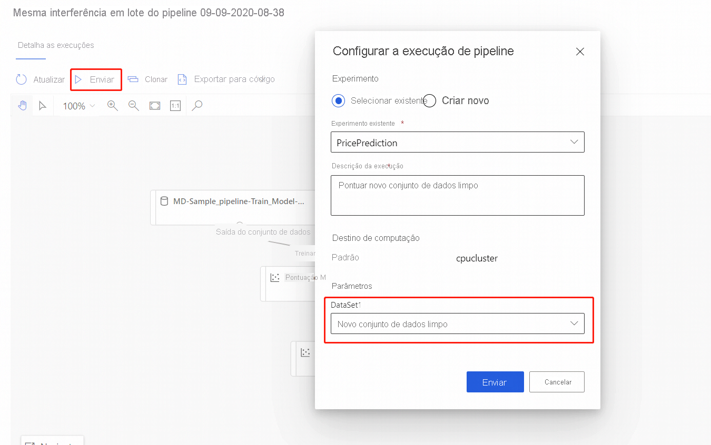

# Executar previsões em lote usando o designer do Azure Machine Learning (versão prévia)
[!INCLUDE [applies-to-skus](../../includes/aml-applies-to-enterprise-sku.md)]

Neste artigo, você aprenderá a usar o designer para criar um pipeline de previsão do lote. A previsão de lote permite pontuar continuamente conjuntos de grandes volumes sob demanda usando um serviço Web que pode ser disparado de qualquer biblioteca HTTP.

Neste "como", você aprenderá a executar as seguintes tarefas:

> [!div class="checklist"]
> * Criar e publicar um pipeline de inferência de lote
> * Consumir um ponto de extremidade de pipeline
> * Gerenciar versões de ponto de extremidade

Para saber como configurar os serviços de Pontuação de lote usando o SDK, consulte a [instruções](how-to-run-batch-predictions.md)que acompanham o.

## {1&gt;{2&gt;Pré-requisitos&lt;2}&lt;1}

Este "como" pressupõe que você já tenha um pipeline de treinamento. Para obter uma introdução guiada ao designer, conclua [a parte um do tutorial do designer](tutorial-designer-automobile-price-train-score.md). 

## Criar um pipeline de inferência em lote

Seu pipeline de treinamento deve ser executado pelo menos uma vez para poder criar um pipeline inferência.

1. Vá para a guia **Designer** em seu espaço de trabalho.

1. Selecione o pipeline de treinamento que treina o modelo que você deseja usar para fazer a previsão.

1. **Execute** o pipeline.

    

Agora que o pipeline de treinamento foi executado, você pode criar um pipeline de inferência de lote.

1. Ao lado de **executar**, selecione o novo **pipeline de inferência de criação**de lista suspensa.

1. Selecione **pipeline de inferência de lote**.

    
    
O resultado é um pipeline de inferência em lote padrão. 

### Adicionar um parâmetro de pipeline

Para criar previsões sobre novos dados, você pode conectar-se manualmente a um DataSet diferente nesta exibição de rascunho do pipeline ou criar um parâmetro para seu conjunto de dados. Os parâmetros permitem alterar o comportamento do processo de inferência do lote em tempo de execução.

Nesta seção, você cria um parâmetro de conjunto de um para especificar um conjunto de diferentes para fazer previsões.

1. Selecione o módulo DataSet.

1. Um painel será exibido à direita da tela. Na parte inferior do painel, selecione **definir como parâmetro de pipeline**.
   
    Insira um nome para o parâmetro ou aceite o valor padrão.

## Publicar o pipeline inferência do lote

Agora você está pronto para implantar o pipeline do inferência. Isso implantará o pipeline e o tornará disponível para outras pessoas usarem.

1. Clique no botão **Publicar**.

1. Na caixa de diálogo exibida, expanda a lista suspensa para **PipelineEndpoint**e selecione **novo PipelineEndpoint**.

1. Forneça um nome de ponto de extremidade e uma descrição opcional.

    Próximo à parte inferior da caixa de diálogo, você pode ver o parâmetro configurado com um valor padrão da ID do conjunto de resultados usado durante o treinamento.

1. Selecione **Publicar**.

## Consumir um ponto de extremidade

Agora, você tem um pipeline publicado com um parâmetro DataSet. O pipeline usará o modelo treinado criado no pipeline de treinamento para pontuar o conjunto de um que você fornece como um parâmetro.

### Enviar uma execução de pipeline 

Nesta seção, você irá configurar uma execução de pipeline manual e alterar o parâmetro de pipeline para pontuar novos dados. 

1. Após a conclusão da implantação, vá para a seção **pontos de extremidade** .

1. Selecione **pontos de extremidade do pipeline**.

1. Selecione o nome do ponto de extremidade que você criou.

1. Selecione **pipelines publicados**.

    Esta tela mostra todos os pipelines publicados publicados nesse ponto de extremidade.

1. Selecione o pipeline que você publicou.

    A página detalhes do pipeline mostra um histórico de execução detalhado e informações de cadeia de conexão para seu pipeline. 
    
1. Selecione **executar** para criar uma execução manual do pipeline.

    
    
1. Altere o parâmetro para usar um conjunto de um diferente.
    
1. Selecione **executar** para executar o pipeline.

### Usar o ponto de extremidade REST

Você pode encontrar informações sobre como consumir pontos de extremidade de pipeline e o pipeline publicado na seção **pontos de extremidade** .

Você pode encontrar o ponto de extremidade REST de um ponto de extremidade de pipeline no painel de visão geral de execução. Ao chamar o ponto de extremidade, você está consumindo seu pipeline publicado padrão.

Você também pode consumir um pipeline publicado na página **pipelines publicados** . Selecione um pipeline publicado e localize o ponto de extremidade REST. 

Para fazer uma chamada REST, você precisará de um cabeçalho de autenticação do tipo portador OAuth 2,0. Confira a [seção do tutorial](tutorial-pipeline-batch-scoring-classification.md#publish-and-run-from-a-rest-endpoint) a seguir para obter mais detalhes sobre como configurar a autenticação para seu workspace e realizar uma chamada REST.

## Pontos de extremidade de controle de versão

O Designer atribui uma versão a cada pipeline subsequente que você publica em um ponto de extremidade. Você pode especificar a versão do pipeline que deseja executar como um parâmetro em sua chamada REST. Se você não especificar um número de versão, o designer usará o pipeline padrão.

Ao publicar um pipeline, você pode optar por torná-lo o novo pipeline padrão para esse ponto de extremidade.

Você também pode definir um novo pipeline padrão na guia **pipelines publicados** do seu ponto de extremidade.

## {1&gt;{2&gt;Próximas etapas&lt;2}&lt;1}

Siga o [tutorial](tutorial-designer-automobile-price-train-score.md) do designer para treinar e implantar um modelo de regressão.
