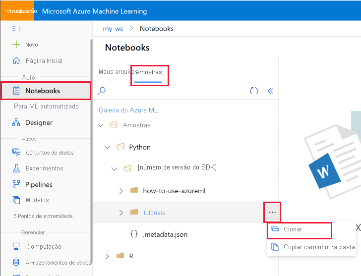
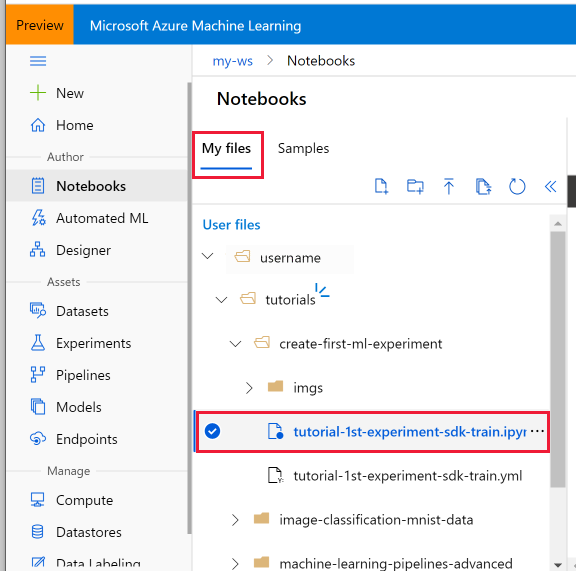

# Tutorial: Introdução à criação de seu primeiro experimento de ML com o SDK de Python
[!INCLUDE [applies-to-skus](../../includes/aml-applies-to-basic-enterprise-sku.md)]

Neste tutorial, você concluirá as etapas de ponta a ponta para começar a usar o SDK de Python do Azure Machine Learning em execução em notebooks Jupyter. Este tutorial é **parte um de uma série de tutoriais de duas partes** e aborda a configuração e instalação do ambiente Python, bem como a criação de um workspace para gerenciar seus experimentos e modelos de machine learning. [**A parte dois**](tutorial-1st-experiment-sdk-train.md) se baseia nisso para treinar vários modelos de machine learning e apresentar o processo de gerenciamento de modelos usando o Azure Machine Learning Studio e o SDK.

Neste tutorial, você:

> [!div class="checklist"]
> * Criar um [Workspace do Azure Machine Learning](concept-workspace.md) para usar no próximo tutorial.
> * Clonar o notebook de tutoriais em sua pasta no workspace.
> * Criar uma instância de computação baseada em nuvem com o SDK do Python do Azure Machine Learning instalado e pré-configurado.

Se você não tiver uma assinatura do Azure, crie uma conta gratuita antes de começar. Experimente hoje mesmo a [versão gratuita ou paga do Azure Machine Learning](https://aka.ms/AMLFree).

## Criar um workspace

Um Workspace do Azure Machine Learning é o recurso fundamental na nuvem que você usa para experimentar, treinar e implantar modelos de machine learning. Ele vincula sua assinatura do Azure e o grupo de recursos a um objeto facilmente consumido no serviço. 

Você cria um workspace pelo portal do Azure, um console baseado na Web para gerenciar seus recursos do Azure. 

[!INCLUDE [aml-create-portal](../../includes/aml-create-in-portal.md)]

>[!IMPORTANT] 
> Anote seu **workspace** e sua **assinatura**. Você precisará dessas informações para criar o experimento no local certo. 

## Executar o notebook em seu workspace

Este tutorial usa o servidor de notebook em nuvem em seu workspace para uma experiência pré-configurada e sem instalação. Use [seu próprio ambiente](how-to-configure-environment.md#local) se preferir ter controle sobre seu ambiente, pacotes e dependências.

Acompanhe o tutorial com este vídeo ou use as etapas detalhadas abaixo para clonar e executar o tutorial em seu workspace. 

> [!VIDEO https://www.microsoft.com/en-us/videoplayer/embed/RE4mTUr]

### Clonar uma pasta do notebook

Conclua a configuração do experimento a seguir e execute as etapas no Azure Machine Learning Studio, uma interface consolidada que inclui ferramentas de aprendizado de máquina para realizar cenários de ciência de dados para praticantes de todos os níveis de habilidade.

1. Entre no [Estúdio do Azure Machine Learning](https://ml.azure.com/).

1. Selecione a assinatura e o workspace criado.

1. Selecione **Notebooks** à esquerda.

1. Abra a pasta **samples**.

1. Abra a pasta **Python**.

1. Abra a pasta com um número de versão.  Esse número representa a versão atual do SDK do Python.

1. Selecione o **"..."** à direita da pasta **tutorials** e, em seguida, selecione **Clonar**.

    

1. Uma lista de pastas exibe cada usuário que acessa o espaço de trabalho.  Selecione sua pasta para clonar a pasta **tutoriais** lá.

### <a name="open">Abra o bloco de anotações clonado

1. Em **Arquivos do Usuário**, abra a pasta e, em seguida, abra a pasta **tutorials** clonada.

    

    > [!IMPORTANT]
    > Você pode exibir notebooks na pasta **samples**, mas não pode executar um notebook partindo dela.  Para executar um notebook, abra a versão clonada do notebook na seção **Arquivos do Usuário**.
    
1. Selecione o arquivo **tutorial-1st-experiment-sdk-train.ipynb** na pasta **tutorials**.

1. Na barra superior, selecione uma instância de computação a ser usada para executar o notebook. Essas VMs são pré-configuradas com [tudo o que você precisa para executar Azure Machine Learning](concept-compute-instance.md#contents). Você pode selecionar uma VM criada por qualquer usuário do seu workspace. 

1. Se nenhuma VM for encontrada, selecione **+ Adicionar** para criar a VM da instância de computação. 

    1. Ao criar uma VM, forneça um nome.  O nome da VM deve ter entre 2 e 16 caracteres. Os caracteres válidos são letras, dígitos e o caractere -, sendo que esse nome deve ser exclusivo na assinatura do Azure.

    1.  Selecione o tamanho da máquina virtual nas opções disponíveis.

    1. Em seguida, selecione **Criar**. A configuração da VM pode levar aproximadamente cinco minutos.

1. Depois que a VM estiver disponível, ela será exibida na barra de ferramentas superior.  Agora você pode executar o notebook usando **Executar tudo** na barra de ferramentas ou usando **Shift + Enter** nas células de código do notebook.

Caso você tenha widgets personalizados ou prefira usar o Jupyter/o JupyterLab, selecione o menu suspenso do **Jupyter** na extrema direita e, em seguida, selecione **Jupyter** ou **JupyterLab**. A nova janela do navegador será aberta.

> [!NOTE]
> Atualmente, as instâncias de computação (versão prévia) só estão disponíveis em workspaces com uma região **Centro-Norte dos EUA**, **Leste dos EUA 2**, **Europa Setentrional** ou **Sul do Reino Unido**, com suporte para outras regiões em breve.
>Se o seu espaço de trabalho estiver em qualquer outra região, você poderá continuar a criar e usar uma [VM do Notebook](concept-compute-instance.md#notebookvm) em vez disso.  Você pode usar uma VM do Notebook ou uma instância de computação para executar o bloco de anotações. Uma VM continuará em execução e gerará custos, a menos que você a interrompa. Você pode interrompê-la manualmente na guia **Computação** no Studio ou conferir a [postagem no blog](https://techcommunity.microsoft.com/t5/educator-developer-blog/azure-virtual-machine-auto-shutdown/ba-p/379342) sobre como habilitar o desligamento automático agendado para VMs do Azure.

## Próximas etapas

Neste tutorial, você concluiu estas tarefas:

* Criou um Workspace do Azure Machine Learning.
* Criou e configurou um servidor de notebook em nuvem no seu workspace.

Na **parte dois** do tutorial, você executa o código em `tutorial-1st-experiment-sdk-train.ipynb` para treinar um modelo de machine learning. 

> [!div class="nextstepaction"]
> [Tutorial: Treinar seu primeiro modelo](tutorial-1st-experiment-sdk-train.md)

> [!IMPORTANT]
> Se não planeja seguir a parte 2 deste tutorial ou nenhum outro tutorial, você deve [interromper a VM do servidor de notebook na nuvem](tutorial-1st-experiment-sdk-train.md#clean-up-resources) quando não a estiver usando para reduzir o custo.

