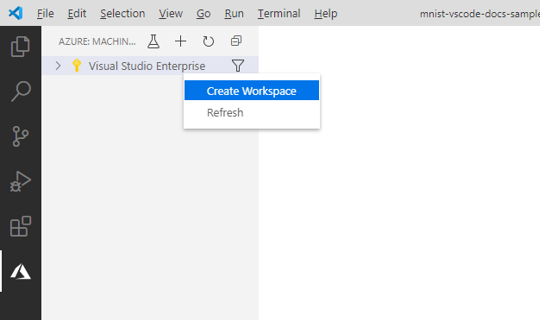
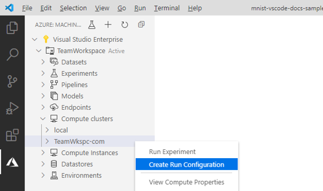
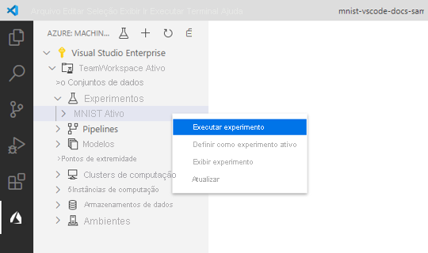

# <a name="train-and-deploy-an-image-classification-tensorflow-model-using-the-azure-machine-learning-visual-studio-code-extension"></a>Treinar e implantar um modelo do TensorFlow de classificação de imagem usando a extensão do Azure Machine Learning para Visual Studio Code

Saiba como treinar e implantar um modelo de classificação de imagem para reconhecer números manuscritos usando o TensorFlow e a extensão do Azure Machine Learning para Visual Studio Code.

Neste tutorial, você aprende as seguintes tarefas:

> [!div class="checklist"]
> * Compreender o código
> * Criar um workspace
> * Criar uma experiência
> * Configurar destinos de computação
> * Executar um arquivo de configuração
> * Treinar um modelo
> * Registrar um modelo
> * Implantar um modelo

## <a name="prerequisites"></a>Pré-requisitos

- Assinatura do Azure. Caso não tenha uma, inscreva-se para experimentar a [versão paga ou gratuita do Azure Machine Learning](https://aka.ms/AMLFree).
- Instale o [Visual Studio Code](https://code.visualstudio.com/docs/setup/setup-overview), um editor de código leve multiplataforma.
- Extensão do Azure Machine Learning Studio para Visual Studio Code. Para obter instruções de instalação, confira o [tutorial Configurar a extensão do Azure Machine Learning para Visual Studio Code](./tutorial-setup-vscode-extension.md)

## <a name="understand-the-code"></a>Compreender o código

O código deste tutorial usa o TensorFlow para treinar um modelo de machine learning de classificação de imagem que categoriza dígitos manuscritos de 0 a 9. Ele faz isso criando uma rede neural que usa os valores de pixel de imagem de 28 px x 28 px como entrada e gera uma lista de 10 probabilidades, uma para cada um dos dígitos que estão sendo classificados. Veja abaixo uma amostra da aparência dos dados.  


Obtenha o código deste tutorial baixando e descompactando o [repositório do VS Code Tools for AI](https://github.com/microsoft/vscode-tools-for-ai/archive/master.zip) em qualquer lugar no computador.

## <a name="create-a-workspace"></a>Criar um workspace

A primeira coisa que você precisa fazer para criar um aplicativo no Azure Machine Learning é criar um workspace. Um workspace contém os recursos para treinar modelos, bem como os próprios modelos treinados. Para obter mais informações, confira [O que é um workspace](./concept-workspace.md). 

1. Na barra de atividade do Visual Studio Code, selecione o ícone do **Azure** para abrir a exibição do Azure Machine Learning.
1. Clique com o botão direito do mouse em sua assinatura do Azure e selecione **Criar Workspace**. 
    
    > [!div class="mx-imgBorder"]
    > 

1. Por padrão, um nome é gerado, contendo a data e a hora de criação. Na caixa de entrada de texto, altere o nome para "TeamWorkspace" e pressione **Enter**.
1. Selecione **Criar um grupo de recursos**. 
1. Dê ao grupo de recursos o nome "TeamWorkspace-rg" e pressione **Enter**. 
1. Escolha uma localização para seu workspace. É recomendável escolher uma localização mais próxima da localização em que você pretende implantar o modelo. Por exemplo, “Oeste dos EUA 2”.
1. Quando precisar selecionar o tipo de workspace, escolha **Básico** para criar um workspace básico. Para obter mais informações sobre as diferentes ofertas de workspace, confira [Visão geral do Azure Machine Learning](./overview-what-is-azure-ml.md#sku).

Neste ponto, é feita uma solicitação ao Azure para criar um workspace em sua conta. Após alguns minutos, o novo workspace será exibido no nó da sua assinatura. 

## <a name="create-an-experiment"></a>Criar uma experiência

Um ou mais experimentos podem ser criados no workspace para acompanhar e analisar execuções de treinamento de modelo individual. As execuções podem ser feitas na nuvem do Azure ou no computador local.

1. Na barra de atividade do Visual Studio Code, selecione o ícone do **Azure**. A exibição do Azure Machine Learning será mostrada.
1. Expanda o nó da assinatura.
1. Expanda o nó **TeamWorkspace**. 
1. Clique com o botão direito do mouse no nó **Experimentos**.
1. Selecione **Criar Experimento** no menu de contexto.

    > [!div class="mx-imgBorder"]
    > 

1. Dê ao experimento o nome "MNIST" e pressione **Enter** para criá-lo. 

Assim como os workspaces, uma solicitação é enviada ao Azure para criar um experimento com as configurações fornecidas. Após alguns minutos, o novo experimento será exibido no nó *Experimentos* do workspace. 

## <a name="configure-compute-targets"></a>Configurar destinos de computação

Um destino de computação é o ambiente ou o recurso de computação em que você executa scripts e implanta modelos treinados. Para obter mais informações, confira a [documentação dos destinos de Computação do Azure Machine Learning](./concept-compute-target.md).

Para criar um destino de computação:

1. Na barra de atividade do Visual Studio Code, selecione o ícone do **Azure**. A exibição do Azure Machine Learning será mostrada. 
1. Expanda o nó da assinatura. 
1. Expanda o nó **TeamWorkspace**. 
1. No nó do workspace, clique com o botão direito do mouse no nó **Computação** e escolha **Criar Computação**. 

    > [!div class="mx-imgBorder"]
    > 

1. Selecione **Computação do Azure Machine Learning (AmlCompute)** . A Computação do Azure Machine Learning é uma infraestrutura de computação gerenciada que permite ao usuário criar com facilidade uma computação de único nó ou vários nós que possa ser usada com outros usuários no workspace.
1. Escolha um tamanho de VM. Selecione **Standard_F2s_v2** na lista de opções. O tamanho da VM tem um impacto no tempo necessário para treinar os modelos. Para obter mais informações sobre os tamanhos de VMs, confira [Tamanhos das Máquinas Virtuais do Linux no Azure](https://docs.microsoft.com/azure/virtual-machines/linux/sizes).
1. Dê à computação o nome "TeamWkspc-com" e pressione **Enter** para criá-la.

Após alguns minutos, o novo destino de computação será exibido no nó *Computação* do workspace.

## <a name="create-a-run-configuration"></a>Criar uma configuração de execução

Ao enviar uma execução de treinamento para um destino de computação, você também envia a configuração necessária para executar o trabalho de treinamento. Por exemplo, o script que contém o código de treinamento e as dependências do Python necessárias para executá-lo.

Para criar uma configuração de execução:

1. Na barra de atividade do Visual Studio Code, selecione o ícone do **Azure**. A exibição do Azure Machine Learning será mostrada. 
1. Expanda o nó da assinatura. 
1. Expanda o nó **TeamWorkspace**. 
1. No nó do workspace, clique com o botão direito do mouse no nó de computação **TeamWkspc-com** e escolha **Criar Configuração de Execução**.

    > [!div class="mx-imgBorder"]
    > 

1. Dê à configuração de execução o nome "MNIST-rc" e pressione **Enter** para criá-la.
1. Em seguida, selecione **Treinamento de Nó Único do TensorFlow** como o tipo de trabalho de treinamento.
1. Pressione **Enter** para procurar o arquivo de script a ser executado na computação. Nesse caso, o script para treinar o modelo é o arquivo `train.py` dentro do diretório `vscode-tools-for-ai/mnist-vscode-docs-sample`.
1. Insira o código a seguir na caixa de entrada para especificar os pacotes necessários.
    
    ```text
    pip: azureml-defaults; conda: python=3.6.2, tensorflow=1.15.0
    ```
    
    Um arquivo chamado `MNIST-rc.runconfig` será exibido no VS Code com um conteúdo semelhante ao mostrado abaixo:

    ```json
    {
        "script": "train.py",
        "framework": "Python",
        "communicator": "None",
        "target": "TeamWkspc-com",
        "environment": {
            "python": {
                "userManagedDependencies": false,
                "condaDependencies": {
                    "dependencies": [
                        "python=3.6.2",
                        "tensorflow=1.15.0",
                        {
                            "pip": [
                                "azureml-defaults"
                            ]
                        }
                    ]
                }
            },
            "docker": {
                "baseImage": "mcr.microsoft.com/azureml/base:0.2.4",
                "enabled": true,
                "baseImageRegistry": {
                    "address": null,
                    "username": null,
                    "password": null
                }
            }
        },
        "nodeCount": 1,
        "history": {
            "outputCollection": true,
            "snapshotProject": false,
            "directoriesToWatch": [
                "logs"
            ]
        }
    }
    ```

1. Quando estiver satisfeito com a configuração, abra a paleta de comandos selecionando **Exibir > Paleta de Comandos**.
1. Insira o comando a seguir na paleta de comandos para salvar o arquivo de configuração de execução.

    ```text
    Azure ML: Save and Continue
    ```

A configuração de execução `MNIST-rc` é adicionado no nó de computação *TeamWkspc-com*.

## <a name="train-the-model"></a>Treinar o modelo

Durante o processo de treinamento, um modelo do TensorFlow é criado pelo processamento dos dados de treinamento e dos padrões de aprendizado inseridos nele para cada um dos respectivos dígitos que estão sendo classificados. 

Para executar um experimento do Azure Machine Learning:

1. Na barra de atividade do Visual Studio Code, selecione o ícone do **Azure**. A exibição do Azure Machine Learning será mostrada. 
1. Expanda o nó da assinatura. 
1. Expanda o nó **TeamWorkspace > Experimentos**. 
1. Clique com o botão direito do mouse no experimento do **MNIST**.
1. Selecione **Executar Experimento**.

    > [!div class="mx-imgBorder"]
    > 

1. Na lista de opções de destino de computação, selecione o destino de computação **TeamWkspc-com**.
1. Em seguida, selecione a configuração de execução **MNIST-rc**.
1. Neste ponto, uma solicitação é enviada ao Azure para executar o experimento no destino de computação selecionado no workspace. Esse processo leva vários minutos. O tempo necessário para executar o trabalho de treinamento é afetado por vários fatores, como o tipo de computação e o tamanho dos dados de treinamento. Para acompanhar o progresso do experimento, clique com o botão direito do mouse no nó de execução atual e selecione **Exibir Execução no portal do Azure**.
1. Quando a caixa de diálogo solicitando a abertura de um site externo for exibida, selecione **Abrir**.

    > [!div class="mx-imgBorder"]
    > 

Quando o treinamento do modelo for concluído, o rótulo de status ao lado do nó de execução será atualizado para "Concluído".

## <a name="register-the-model"></a>Registre o modelo

Agora que você treinou seu modelo, registre-o no workspace. 

Para registrar o modelo:

1. Na barra de atividade do Visual Studio Code, selecione o ícone do **Azure**. A exibição do Azure Machine Learning será mostrada.
1. Expanda o nó da assinatura. 
1. Expanda o nó **TeamWorkspace > Experimentos > MNIST**.
1. Obtenha as saídas do modelo geradas do treinamento do modelo. Clique com o botão direito do mouse no nó de execução **Execução 1** e selecione **Baixar saídas**. 

    > [!div class="mx-imgBorder"]
    > 

1. Escolha o diretório no qual as saídas baixadas serão salvas. Por padrão, as saídas são colocadas no diretório atualmente aberto no Visual Studio Code.
1. Clique com o botão direito do mouse no nó **Modelos** e escolha **Registrar Modelo**.

    > [!div class="mx-imgBorder"]
    > 

1. Dê ao modelo o nome "MNIST-TensorFlow-model" e pressione **Enter**.
1. Um modelo do TensorFlow é composto por vários arquivos. Selecione **Pasta do modelo** como o formato de caminho do modelo na lista de opções. 
1. Selecione o diretório `azureml_outputs/Run_1/outputs/outputs/model`.

    Um arquivo que contém as configurações do modelo será exibido no Visual Studio Code com um conteúdo semelhante ao mostrado abaixo:

    ```json
    {
        "modelName": "MNIST-TensorFlow-model",
        "tags": {
            "": ""
        },
        "modelPath": "c:\\Dev\\vscode-tools-for-ai\\mnist-vscode-docs-sample\\azureml_outputs\\Run_1\\outputs\\outputs\\model",
        "description": ""
    }
    ```

1. Quando estiver satisfeito com a configuração, salve-a abrindo a paleta de comandos e inserindo o seguinte comando:

    ```text
    Azure ML: Save and Continue
    ```

Depois de alguns minutos, o modelo será exibido no nó *Modelos*.

## <a name="deploy-the-model"></a>Implantar o modelo

No Visual Studio Code, você pode implantar seu modelo como um serviço Web no:

+ ACI (Instâncias de Contêiner do Azure).
+ AKS (Serviço de Kubernetes do Azure).

Você não precisa criar um contêiner ACI para um teste com antecedência, pois os contêineres ACI são criados conforme necessário. No entanto, você precisa configurar clusters do AKS com antecedência. Para obter mais informações sobre opções de implantação, confira [Implantar modelos com o Azure Machine Learning](how-to-deploy-and-where.md).

Para implantar um serviço Web como um ACI:

1. Na barra de atividade do Visual Studio Code, selecione o ícone do **Azure**. A exibição do Azure Machine Learning será mostrada.
1. Expanda o nó da assinatura. 
1. Expanda o nó **TeamWorkspace > Modelos**. 
1. Clique com o botão direito do mouse no **MNIST-TensorFlow-model** e selecione **Implantar Serviço com Base no Modelo Registrado**.

    > [!div class="mx-imgBorder"]
    > 

1. Selecione **Instâncias de Contêiner do Azure**.
1. Dê ao serviço o nome "mnist-tensorflow-svc" e pressione **Enter**.
1. Escolha o script a ser executado no contêiner pressionando **Enter** na caixa de entrada e procure o arquivo `score.py` no diretório `mnist-vscode-docs-sample`.
1. Forneça as dependências necessárias para executar o script pressionando **Enter** na caixa de entrada e procure o arquivo `env.yml` no diretório `mnist-vscode-docs-sample`.

    Um arquivo que contém as configurações do modelo será exibido no Visual Studio Code com um conteúdo semelhante ao mostrado abaixo:

    ```json
    {
        "name": "mnist-tensorflow-svc",
        "imageConfig": {
            "runtime": "python",
            "executionScript": "score.py",
            "dockerFile": null,
            "condaFile": "env.yml",
            "dependencies": [],
            "schemaFile": null,
            "enableGpu": false,
            "description": ""
        },
        "deploymentConfig": {
            "cpu_cores": 1,
            "memory_gb": 10,
            "tags": {
                "": ""
            },
            "description": ""
        },
        "deploymentType": "ACI",
        "modelIds": [
            "MNIST-TensorFlow-model:1"
        ]
    }
    ```
1. Quando estiver satisfeito com a configuração, salve-a abrindo a paleta de comandos e inserindo o seguinte comando:

    ```text
    Azure ML: Save and Continue
    ```

Neste ponto, uma solicitação é enviada ao Azure para implantar o serviço Web. Esse processo leva vários minutos. Depois de implantado, o novo serviço será exibido no nó *Pontos de Extremidade*.

## <a name="next-steps"></a>Próximas etapas

* Para obter um passo a passo de como fazer o treinamento com o Azure Machine Learning fora do Visual Studio Code, confira [Tutorial: Treinar modelos com o Azure Machine Learning](tutorial-train-models-with-aml.md).
* Para obter um passo a passo de como editar, executar e depurar o código localmente, confira o [Tutorial hello-world do Python](https://code.visualstudio.com/docs/Python/Python-tutorial).

